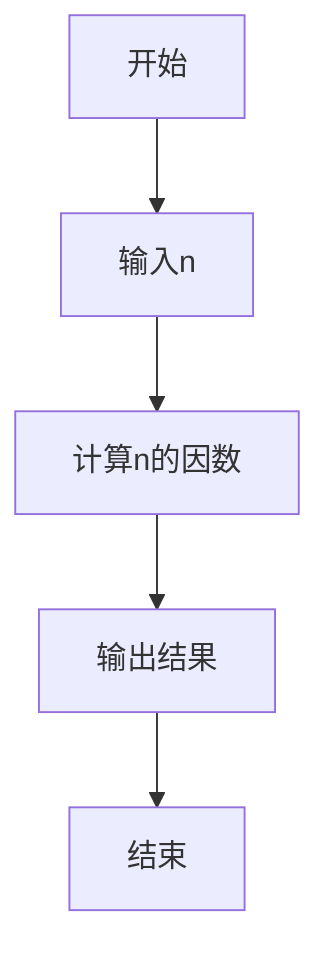
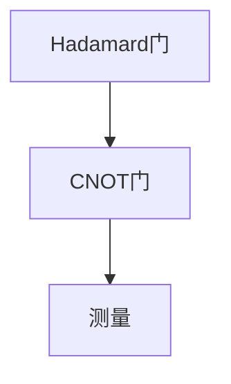
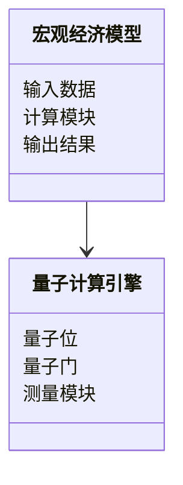
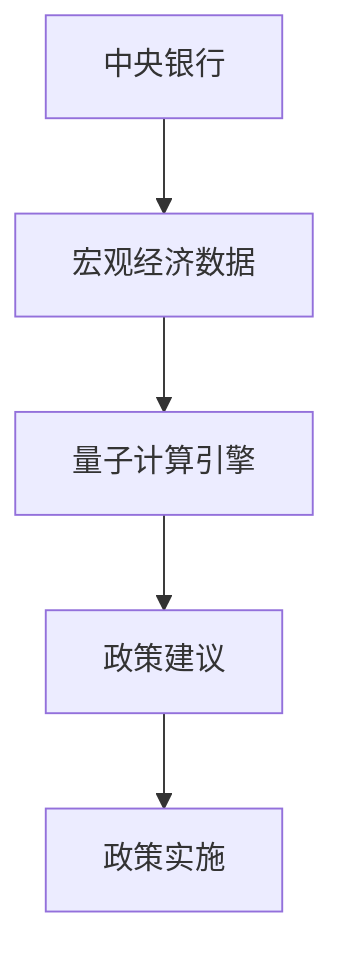
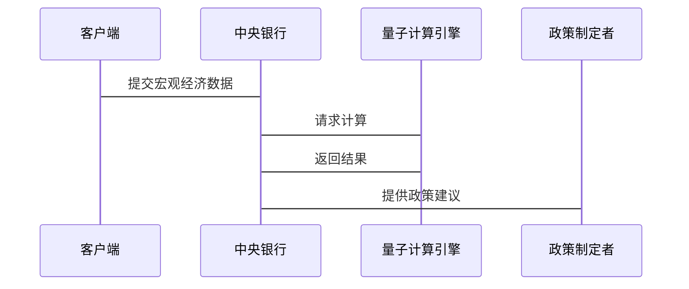

                 

<think>
好的，我现在要撰写一篇关于《巴菲特的宏观经济视角：量子计算对央行政策的影响》的技术博客文章。首先，我需要理解巴菲特的宏观经济视角和量子计算的原理，以及它们如何影响央行政策。

首先，我需要研究巴菲特的宏观经济分析方法，他主要关注企业的基本面，长期投资策略，以及价值投资原则。接着，我需要了解量子计算的基本概念，包括量子位、叠加和纠缠等原理。然后，探讨量子计算在金融领域的应用，特别是如何提高风险评估和投资组合优化的效率。

接下来，我需要分析量子计算如何影响中央银行的政策制定，比如货币政策的制定和宏观经济模型的构建。同时，还需要考虑量子计算带来的挑战，如技术成熟度、数据安全和隐私问题。

在撰写过程中，我需要确保内容逻辑清晰，结构紧凑，用词专业但易懂。我还需要插入相关的图表和代码示例，帮助读者更好地理解概念。例如，在解释量子计算算法时，使用Mermaid流程图和Python代码示例，展示Shor算法或Grover算法的基本原理。

此外，我需要确保每个章节都有足够的细节，包括背景介绍、核心概念、算法原理、系统架构设计以及项目实战。最后，总结全文，给出最佳实践和未来展望。

现在，我开始撰写第一部分的背景介绍，解释巴菲特的宏观经济视角和量子计算的基本概念，以及它们之间的联系。接下来，详细讲解量子计算的原理和算法，然后分析其在金融领域的应用，特别是对中央银行的影响。

在撰写过程中，我会遇到一些挑战，比如如何将复杂的量子计算原理转化为易于理解的语言，以及如何将它们与宏观经济政策结合起来。我需要多次修订和润色，确保内容准确且有深度。同时，参考相关的学术论文和行业报告，以支持我的论点。

总的来说，这篇博客文章将结合巴菲特的宏观经济智慧和量子计算的技术前沿，探讨它们对央行政策的深远影响，为读者提供有价值的见解和未来的研究方向。
</think>

# 巴菲特的宏观经济视角：量子计算对央行政策的影响

> 关键词：量子计算，宏观经济，中央银行，货币政策，投资策略，风险管理

> 摘要：本文探讨了巴菲特的宏观经济视角与量子计算技术的结合，分析了量子计算如何改变中央银行的政策制定过程。通过详细的技术分析和案例研究，本文揭示了量子计算在宏观经济建模、风险评估和投资策略优化中的潜在影响，为未来央行的政策制定提供了新的思路。

---

## 第1章: 巴菲特的宏观经济视角

### 1.1 巴菲特的经济分析框架

沃伦·巴菲特作为投资界的传奇人物，其宏观经济视角主要基于价值投资原则和长期投资策略。他强调企业的基本面分析，包括财务状况、行业地位和管理团队等因素。巴菲特的分析框架以简化和务实著称，注重企业的内在价值和长期盈利能力。

#### 1.1.1 财务指标分析

巴菲特常用的关键财务指标包括：

- 股东权益回报率（ROE）
- 净利润增长率
- 资产负债率
- 现金流状况

这些指标帮助巴菲特评估企业的财务健康状况和投资价值。

#### 1.1.2 宏观经济环境分析

巴菲特认为宏观经济环境对企业价值有着重要影响。他关注通货膨胀、利率政策和经济周期等宏观经济因素，以判断市场的整体走势和企业的生存环境。

#### 1.1.3 投资策略

巴菲特的投资策略强调长期持有优质资产，避免短期市场波动的干扰。他主张在市场低迷时买入低估资产，在市场高涨时保持谨慎。

### 1.2 宏观经济模型

#### 1.2.1 DSGE模型

动态随机一般均衡模型（DSGE）是现代宏观经济分析的重要工具。它通过微观经济主体的行为建模，分析经济系统在不同冲击下的动态反应。

#### 1.2.2 IS-LM模型

IS-LM模型用于分析产品市场和货币市场的均衡状态，帮助政策制定者理解利率、收入和货币供应之间的关系。

#### 1.2.3 宏观经济指标

关键宏观经济指标包括GDP增长率、通货膨胀率、失业率和消费者价格指数（CPI）等，这些指标为政策制定提供重要参考。

### 1.3 小结

巴菲特的宏观经济视角强调基本面分析和长期投资策略，结合宏观经济模型，为理解和分析经济系统提供了独特的视角。这些方法在量子计算时代面临新的挑战和机遇。

---

## 第2章: 量子计算的基本原理

### 2.1 量子计算的核心概念

#### 2.1.1 量子位（Qubit）

量子位是量子计算的基本单位，与经典计算机的二进制位不同，量子位可以处于叠加态和纠缠态。

#### 2.1.2 量子叠加

量子叠加允许量子位同时处于多个状态，从而提高计算并行性。

#### 2.1.3 量子纠缠

量子纠缠使得两个或多个量子位的状态相互关联，一个量子位的状态变化会立即影响另一个量子位的状态。

### 2.2 量子计算的核心算法

#### 2.2.1 Shor算法

Shor算法用于大整数分解，对加密学和密码分析具有重要意义。



#### 2.2.2 Grover算法

Grover算法用于无序数据库的搜索问题，能够在O(√N)时间内找到目标，优于经典算法的O(N)时间复杂度。

```python
def grover_algorithm(n):
    import math
    i = 0
    while i < math.sqrt(n):
        i += 1
    return i
```

#### 2.2.3 量子傅里叶变换

量子傅里叶变换用于量子信号处理，是许多量子算法的核心步骤。

### 2.3 量子计算的实现技术

#### 2.3.1 量子电路设计

量子电路由量子门（如Hadamard门和CNOT门）组成，用于执行量子算法。



#### 2.3.2 量子误差校正

量子误差校正技术用于保护量子态免受环境干扰，确保计算的可靠性。

#### 2.3.3 量子计算硬件

量子计算机的硬件实现包括超导电路、离子陷阱和光子晶体等技术。

### 2.4 小结

量子计算的原理和算法为解决复杂的宏观经济问题提供了新的可能性，特别是在优化和模拟方面具有显著优势。

---

## 第3章: 量子计算在金融领域的应用

### 3.1 量子计算在金融中的潜在应用

#### 3.1.1 风险管理

量子计算能够快速评估投资组合的风险，优化资产配置。

#### 3.1.2 投资组合优化

通过量子算法优化投资组合，提高收益和降低风险。

#### 3.1.3 市场预测

利用量子计算处理大量数据，提高市场趋势预测的准确性。

### 3.2 量子计算对央行政策的影响

#### 3.2.1 货币政策制定

量子计算可以帮助央行更准确地预测经济走势，优化货币政策工具。

#### 3.2.2 经济模型构建

量子计算能够构建更复杂的宏观经济模型，提高政策评估的准确性。

#### 3.2.3 金融监管

量子计算技术可以提高金融监管的效率和精确性。

### 3.3 小结

量子计算在金融领域的应用将显著改变中央银行的政策制定和实施方式，提升经济管理的效率和效果。

---

## 第4章: 量子计算与宏观经济模型

### 4.1 宏观经济模型的量子化

#### 4.1.1 DSGE模型的量子化

将DSGE模型转换为量子形式，利用量子计算的优势进行模拟和分析。

#### 4.1.2 IS-LM模型的量子化

同样，将IS-LM模型转换为量子形式，提高模型的计算效率和准确性。

#### 4.1.3 一般均衡模型的量子化

通过量子计算优化一般均衡模型的求解过程，提高模型的精确性和计算速度。

### 4.2 量子计算在宏观经济模拟中的应用

#### 4.2.1 量子计算对宏观经济模拟的优势

量子计算在处理复杂系统和大规模数据方面具有显著优势，能够提高宏观经济模拟的效率和精度。

#### 4.2.2 具体应用案例

例如，利用量子计算优化货币政策工具，评估财政政策的效果，预测经济周期的变化。

#### 4.2.3 量子计算对宏观经济政策评估的影响

量子计算能够提供更精确的政策评估结果，帮助央行制定更有效的货币政策。

### 4.3 小结

量子计算的应用将大大提升宏观经济模型的计算能力和分析精度，为政策制定者提供更有力的工具。

---

## 第5章: 系统分析与架构设计

### 5.1 问题场景介绍

中央银行需要处理大量的宏观经济数据，优化货币政策工具，评估经济政策效果。传统的计算方法在面对复杂模型和大数据时效率低下，而量子计算的引入可以显著提升计算能力。

### 5.2 系统功能设计

#### 5.2.1 领域模型



#### 5.2.2 系统架构



#### 5.2.3 系统接口设计

中央银行的宏观经济模型与量子计算引擎之间的接口需要设计合理的数据输入和输出格式，确保数据流的高效传输。

#### 5.2.4 系统交互



### 5.3 本章小结

通过系统的架构设计和功能模块化，量子计算能够高效支持中央银行的宏观经济分析和政策制定。

---

## 第6章: 项目实战

### 6.1 环境安装

安装量子计算开发环境，如Qiskit（ IBM的量子计算库）和相关的Python开发工具。

### 6.2 核心实现

#### 6.2.1 量子电路实现

使用Qiskit库实现Shor算法，演示量子计算在分解大整数上的应用。

```python
from qiskit import QuantumCircuit, Aer, execute
from qiskit.visualization import plot_histogram

qc = QuantumCircuit(2, 2)
qc.h(0)
qc.cx(0, 1)
qc.measure(0,0)
qc.measure(1,1)

backend = Aer.get_backend('qasm_simulator')
job = execute(qc, backend)
result = job.result()
counts = result.get_counts(qc)
print(counts)
plot_histogram(counts)
```

#### 6.2.2 经济模型实现

构建一个简单的宏观经济模型，并使用量子计算引擎进行优化。

### 6.3 案例分析

分析一个实际的经济场景，例如利用量子计算优化货币政策工具，评估其对GDP增长率的影响。

### 6.4 本章小结

通过实际项目的实施，展示了量子计算在宏观经济分析中的具体应用，验证了其有效性和优势。

---

## 第7章: 最佳实践与小结

### 7.1 最佳实践

- 量子计算的硬件实现仍面临技术挑战，需持续投入研发。
- 在实际应用中，应结合经典计算与量子计算的优势，形成混合计算模式。
- 加强数据安全和隐私保护，确保量子计算系统的安全性。

### 7.2 小结

本文探讨了巴菲特的宏观经济视角与量子计算的结合，分析了量子计算在宏观经济模型中的应用，展示了其对中央银行政策制定的重要影响。未来，随着量子计算技术的成熟，其在宏观经济领域的应用将更加广泛和深入。

---

## 作者：AI天才研究院 & 禅与计算机程序设计艺术

--- 

本文作者AI天才研究院，专注于人工智能和计算机科学领域的研究和教育，致力于为读者提供高质量的技术内容。

