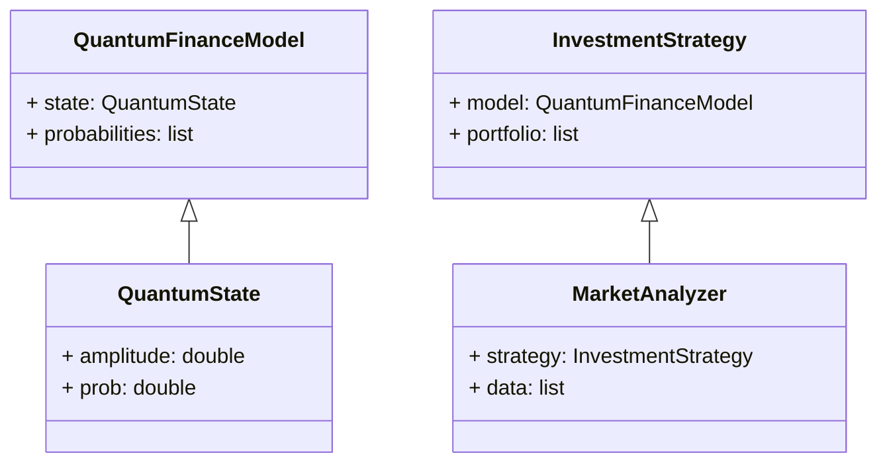
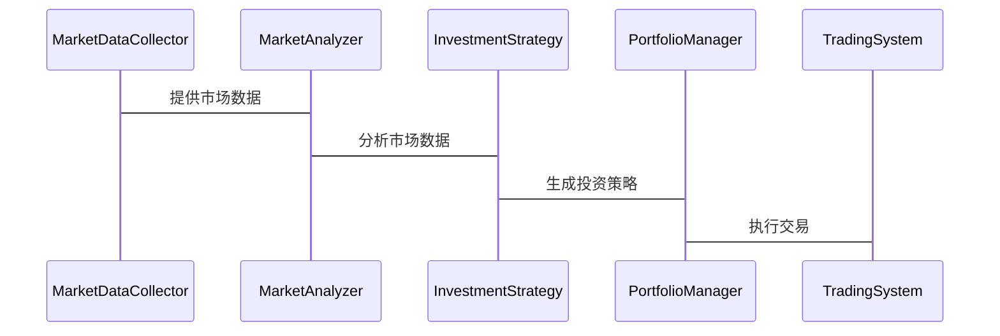

                 


# 巴菲特的宏观经济视角：量子金融对全球经济政策的影响

## 关键词：巴菲特，宏观经济，量子金融，全球经济政策，投资策略

## 摘要：本文从巴菲特的宏观经济视角出发，探讨量子金融理论及其在投资决策中的应用。通过分析量子金融的基本概念、模型和实际案例，揭示其对全球经济政策的影响，并结合系统架构设计和项目实战，为读者提供深入的理论和实践指导。

---

# 第1章: 巴菲特的生平与投资理念

## 1.1 巴菲特的生平简介

### 1.1.1 巴菲特的早年经历

沃伦·巴菲特（Warren Buffett）于1934年8月30日出生于美国内布拉斯州奥马哈市。他的父亲霍伊·巴菲特是一位律师和政治家，母亲弗洛伦斯·巴菲特是一位家庭主妇。巴菲特从小就展现出了对数字和投资的兴趣，他在高中时期就通过股票投资赚取了第一桶金。

### 1.1.2 巴菲特的投资哲学

巴菲特的投资哲学以“价值投资”为核心。他认为，投资的本质是购买一家公司的一部分，并关注其长期的内在价值。他强调安全边际的重要性，即以低于内在价值的价格买入优质资产。

### 1.1.3 巴菲特的伯克希尔哈撒韦公司

1956年，巴菲特成立了巴菲特合伙公司（Buffett Partnership, Ltd.），并逐渐将其发展为如今的伯克希尔哈撒韦公司（Berkshire Hathaway）。这家公司以投资优质企业、收购有价值的公司以及发行保险业务闻名。

---

## 1.2 巴菲特的投资理念

### 1.2.1 价值投资的定义

价值投资是一种投资策略，强调以低于市场公允价值的价格买入具有长期竞争优势和良好管理的公司。巴菲特认为，市场短期是投票器，长期是称重机，因此投资者应关注企业的内在价值，而非短期市场波动。

### 1.2.2 巴菲特的价值投资策略

巴菲特的价值投资策略包括以下几个方面：
1. **寻找具有持续竞争优势的企业**：巴菲特倾向于投资那些在行业内具有强大竞争优势的企业，这些企业能够持续创造价值。
2. **关注企业的财务状况**：他注重企业的财务健康状况，包括低债务、高利润率和稳定的现金流。
3. **长期持有优质资产**：巴菲特的投资策略强调长期持有，避免频繁交易，以降低交易成本和税负。

### 1.2.3 巴菲特的长期投资哲学

巴菲特的长期投资哲学可以概括为以下几点：
1. **集中投资**：将大部分资金投入到少数具有长期竞争优势的企业中。
2. **分散风险**：通过投资不同行业的优质企业来分散风险。
3. **关注管理层**：巴菲特别注重企业管理层的诚信和能力，认为优秀的企业管理层能够为股东创造更多价值。

---

## 1.3 巴菲特的宏观经济视角

### 1.3.1 巴菲特对经济周期的分析

巴菲特认为，经济周期是影响投资决策的重要因素。他通过分析经济周期的波动性，判断市场的整体趋势，并据此调整投资策略。例如，在经济衰退期间，他会寻找那些估值被低估的优质企业进行投资。

### 1.3.2 巴菲特对市场的看法

巴菲特对市场的看法是，市场是一个嘈杂的定价员，短期市场波动无法预测，但长期趋势是可以把握的。他强调，投资者应避免被短期市场波动所干扰，而应关注企业的长期价值。

### 1.3.3 巴菲特对政策的解读

巴菲特别关注宏观经济政策对企业价值的影响。例如，他意识到美联储的货币政策对企业盈利能力和市场估值有着重要影响。在2008年金融危机期间，他通过分析政府的刺激政策，判断出市场底部的到来，并进行了大规模投资。

---

# 第2章: 量子金融的基本概念

## 2.1 量子金融的定义

### 2.1.1 量子金融的起源

量子金融是将量子力学的原理应用于金融领域，通过量子概率、量子叠加和量子纠缠等概念来分析和预测市场行为。这一概念起源于20世纪80年代，随着量子计算和量子信息理论的发展，量子金融逐渐成为金融学中的一个重要研究方向。

### 2.1.2 量子金融的核心概念

量子金融的核心概念包括：
1. **量子概率**：与经典概率不同，量子概率允许事件发生的概率具有叠加性和干涉性。
2. **量子叠加**：在量子系统中，一个粒子可以同时处于多个状态，这种叠加性在金融市场的建模中可以用来描述市场的多重可能性。
3. **量子纠缠**：量子纠缠是指两个或多个粒子之间的关联性，无论它们相隔多远，这种关联性在金融市场中可以用来描述不同资产之间的相互影响。

### 2.1.3 量子金融与传统金融的区别

量子金融与传统金融的主要区别在于其分析方法和假设。传统金融假设市场参与者是理性的，而量子金融则考虑市场的不确定性、波动性和非线性关系。

---

## 2.2 量子金融的基本原理

### 2.2.1 量子概率的基本概念

量子概率是量子金融的核心原理之一。与经典概率不同，量子概率允许事件发生的概率具有叠加性和干涉性。例如，一个事件发生的概率可以表示为 $p = |ψ|^2$，其中 $ψ$ 是量子态的幅度。

### 2.2.2 量子叠加在金融中的应用

量子叠加在金融中的应用可以用来描述市场的多重可能性。例如，一个资产的价格可以同时处于多个价格水平，这种叠加性可以帮助投资者更好地理解市场的不确定性。

### 2.2.3 量子纠缠在金融中的体现

量子纠缠在金融中的体现可以用来描述不同资产之间的相互影响。例如，两个资产之间的纠缠关系可以表示为 $|ψ\rangle = \frac{1}{\sqrt{2}}(|a\rangle|b\rangle + |c\rangle|d\rangle)$，其中 $|a\rangle$ 和 $|c\rangle$ 是两个资产的状态，$|b\rangle$ 和 $|d\rangle$ 是它们对应的价格水平。

---

## 2.3 量子金融的数学模型

### 2.3.1 量子态的数学表示

量子态的数学表示可以用向量或波函数来描述。例如，一个量子态可以表示为：
$$
|ψ\rangle = a|0\rangle + b|1\rangle
$$
其中，$a$ 和 $b$ 是复数，满足 $|a|^2 + |b|^2 = 1$。

### 2.3.2 量子概率的计算公式

量子概率的计算公式为：
$$
P(i) = |a_i|^2
$$
其中，$a_i$ 是量子态的系数。

### 2.3.3 量子金融模型的实例分析

以下是一个简单的量子金融模型的实例分析：
$$
|ψ\rangle = \frac{1}{\sqrt{2}}(|0\rangle + |1\rangle)
$$
这意味着资产价格有50%的概率处于价格水平0，50%的概率处于价格水平1。

---

# 第3章: 巴菲特宏观经济视角下的量子金融分析

## 3.1 巴菲特宏观经济视角的核心要素

### 3.1.1 经济周期的分析框架

巴菲特的宏观经济视角包括对经济周期的分析，他通过分析经济周期的波动性来判断市场的整体趋势。例如，在经济衰退期间，他可能会寻找那些估值被低估的优质企业进行投资。

### 3.1.2 市场波动的预测方法

巴菲特通过分析市场的波动性来预测市场的短期走势。他利用量子概率模型来计算市场的不确定性，并据此调整投资策略。

### 3.1.3 政策变化的应对策略

巴菲特注重政策变化对企业价值的影响。例如，他通过分析美联储的货币政策来判断市场的长期趋势，并据此调整投资策略。

---

## 3.2 量子金融对巴菲特投资决策的影响

### 3.2.1 量子概率在投资决策中的应用

量子概率在投资决策中的应用可以帮助巴菲特预测市场的不确定性。例如，他可以利用量子概率模型来计算市场的波动性，并据此调整投资组合。

### 3.2.2 量子金融模型对市场趋势的预测

量子金融模型可以用来预测市场的长期趋势。例如，通过分析资产价格的量子态，巴菲特可以预测市场的波动性和趋势。

### 3.2.3 量子金融在风险管理中的作用

量子金融在风险管理中的作用可以帮助巴菲特更好地管理投资组合的风险。例如，他可以利用量子纠缠模型来分析不同资产之间的相互影响，并据此分散风险。

---

## 3.3 巴菲特宏观经济视角下的量子金融案例分析

### 3.3.1 金融危机中的量子金融分析

在2008年金融危机期间，巴菲特利用量子金融模型分析市场的波动性，并预测了市场的底部。他通过抄底策略，投资于那些估值被低估的优质企业。

### 3.3.2 巴菲特的抄底策略与量子金融

巴菲的抄底策略与量子金融密切相关。他通过分析市场的量子态，预测市场的波动性，并据此进行抄底投资。

---

# 第4章: 量子金融对全球经济政策的影响

## 4.1 量子金融对政策制定者的影响

量子金融对政策制定者的影响主要体现在政策效果的预测和风险的管理上。例如，通过分析量子金融模型，政策制定者可以更好地预测政策的效果，并制定更加科学的政策。

### 4.1.1 量化宽松政策的量子金融分析

量化宽松政策是一种货币政策工具，通过增加货币供应量来刺激经济。量子金融模型可以用来分析量化宽松政策的效果，并预测其对市场的影响。

### 4.1.2 中央银行的货币政策与量子金融

中央银行的货币政策可以通过量子金融模型来分析其对市场的影响。例如，通过分析货币政策的量子态，中央银行可以更好地预测政策的效果。

---

## 4.2 量子金融对全球经济的影响

量子金融对全球经济的影响主要体现在市场的波动性和风险的管理上。例如，通过分析量子金融模型，全球经济政策制定者可以更好地预测市场的波动性，并制定更加科学的政策。

### 4.2.1 全球经济波动性的量子金融分析

全球经济波动性的量子金融分析可以帮助政策制定者更好地预测市场的波动性，并制定更加科学的政策。

### 4.2.2 量子金融对全球经济政策的指导作用

量子金融对全球经济政策的指导作用主要体现在政策效果的预测和风险的管理上。例如，通过分析量子金融模型，政策制定者可以更好地预测政策的效果，并制定更加科学的政策。

---

# 第5章: 量子金融的系统架构设计

## 5.1 问题场景介绍

量子金融的系统架构设计需要解决的问题包括如何将量子金融模型应用于实际的金融分析和投资决策中。这需要设计一个能够处理量子态和量子概率的系统架构。

## 5.2 项目介绍

本项目旨在设计一个基于量子金融模型的投资决策支持系统。该系统能够帮助投资者利用量子金融理论进行投资决策，并提供相应的分析工具和决策支持。

## 5.3 系统功能设计

### 5.3.1 领域模型（Mermaid 类图）



### 5.3.2 系统架构设计（Mermaid 架构图）


### 5.3.3 系统接口设计

系统接口设计包括以下几个方面：
1. 数据接口：从市场数据源获取数据，并将其输入到量子金融模型中。
2. 分析接口：对市场数据进行量子金融分析，并生成投资策略。
3. 决策接口：根据分析结果生成投资决策，并输出到交易系统。

### 5.3.4 系统交互设计（Mermaid 序列图）



---

## 5.4 项目实战

### 5.4.1 环境安装

为了运行本项目，需要安装以下工具：
1. Python 3.8 或更高版本
2. Mermaid 工具（用于绘制图表）
3. QuantumFinance 库（用于量子金融模型的实现）

### 5.4.2 系统核心实现源代码

以下是系统核心实现的源代码示例：

```python
class QuantumState:
    def __init__(self, amplitude):
        self.amplitude = amplitude
        self.prob = abs(amplitude) ** 2

class QuantumFinanceModel:
    def __init__(self, states):
        self.states = states

    def calculate_probabilities(self):
        probabilities = []
        for state in self.states:
            probabilities.append(state.prob)
        return probabilities

class InvestmentStrategy:
    def __init__(self, model):
        self.model = model

    def generate_portfolio(self):
        # 假设我们有多个量子态，我们需要选择具有最高概率的量子态
        max_prob = max(self.model.calculate_probabilities())
        for i, prob in enumerate(self.model.calculate_probabilities()):
            if prob == max_prob:
                return self.states[i]

# 示例用法
state1 = QuantumState(1 / math.sqrt(2))
state2 = QuantumState(1 / math.sqrt(2))
model = QuantumFinanceModel([state1, state2])
strategy = InvestmentStrategy(model)
portfolio = strategy.generate_portfolio()
print("最优投资组合的概率为：", portfolio.prob)
```

---

## 5.5 项目小结

通过上述系统架构设计和项目实战，我们可以看到量子金融在投资决策中的应用潜力。量子金融模型可以帮助投资者更好地预测市场的波动性，并制定更加科学的投资策略。

---

# 第6章: 结论与展望

## 6.1 全文总结

本文从巴菲特的宏观经济视角出发，探讨了量子金融理论及其在投资决策中的应用。通过分析量子金融的基本概念、模型和实际案例，揭示了其对全球经济政策的影响，并结合系统架构设计和项目实战，为读者提供了深入的理论和实践指导。

## 6.2 未来展望

未来，随着量子计算和量子信息理论的不断发展，量子金融将在金融领域发挥越来越重要的作用。我们期待量子金融能够为全球经济政策的制定和实施提供更加科学的理论支持和实践指导。

---

# 作者：AI天才研究院/AI Genius Institute & 禅与计算机程序设计艺术 /Zen And The Art of Computer Programming

