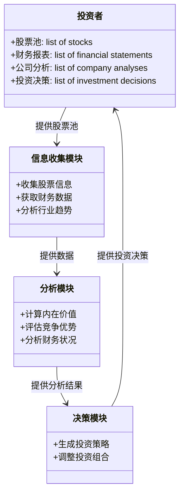
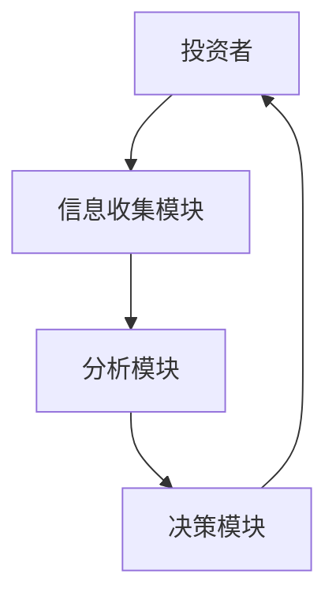
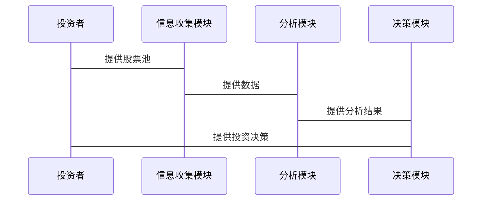

                 

<think>
嗯，用户希望我以《巴菲特的市值选股法：聚焦大型优质公司》为标题，撰写一篇技术博客。首先，我需要理解用户的需求。用户是一位技术专家，同时也是畅销书作者，所以文章需要兼具技术深度和易懂性。

用户特别指出要使用逻辑清晰、结构紧凑的语言，这意味着我需要在组织内容时，确保每部分都紧密相连，层层递进。同时，用户强调要一步一步进行分析，这意味着我需要详细拆解每个概念，避免跳跃式讲解。

首先，我注意到用户要求文章包含关键词和摘要。关键词部分，我需要提取文章的核心概念，如巴菲特、价值投资、市值选股法、大型优质公司等。摘要部分，我需要简洁明了地概括文章的主要内容和观点。

接下来是目录大纲。用户已经提供了一个详细的目录，我需要按照这个结构来组织文章。每一章都要有吸引人的标题，同时内容要深入，涵盖背景介绍、理论基础、算法原理、数学模型、系统架构、项目实战和总结。

在撰写引言时，我需要先介绍巴菲特的投资理念，然后引出市值选股法，说明其重要性和适用性。理论基础部分，我需要详细解释价值投资的基本原理，巴菲特的选股标准，以及他对市场的看法。

在算法部分，我需要使用mermaid流程图来展示巴菲特选股法的步骤，同时提供代码示例，帮助读者理解如何实现这些步骤。数学模型部分，我需要解释现金流贴现模型，并给出具体的公式，确保读者能够理解内在价值的计算方法。

系统架构部分，我需要设计一个包含信息收集、分析和决策模块的系统，并用mermaid图展示各个模块之间的交互。项目实战部分，我需要指导读者如何应用这些方法，构建自己的投资组合，并进行监控和调整。

最后，总结部分需要回顾整个策略，强调长期投资的重要性，并给出一些实用的建议。同时，我需要提醒读者注意风险，避免短期波动的影响。

在整个写作过程中，我需要确保语言简洁专业，同时避免过于复杂的术语，以帮助读者更好地理解。此外，我还需要检查每一部分是否符合用户的要求，确保文章结构完整，内容详尽。

现在，我需要将这些思考转化为具体的章节内容。首先是引言，然后是理论基础，接着是算法原理，数学模型，系统架构，项目实战，最后是总结。每个部分都需要有详细的子章节，确保内容全面且逻辑清晰。

在撰写过程中，我需要使用mermaid图来展示流程和架构，这有助于读者更直观地理解内容。同时，数学公式需要用latex格式呈现，确保准确性和专业性。

最后，我需要确保文章的结尾有作者信息，并附上相关的注意事项和最佳实践，帮助读者更好地应用这些知识。

总的来说，我需要按照用户的要求，一步步构建内容，确保每个部分都符合逻辑，结构清晰，同时提供足够的细节和实例，帮助读者深入理解巴菲特的市值选股法。
</think>

```markdown
# 巴菲特的市值选股法：聚焦大型优质公司

> 关键词：巴菲特，价值投资，市值选股法，大型优质公司，投资策略

> 摘要：本文深入分析了巴菲特的市值选股法，聚焦于大型优质公司的投资策略。通过详细讲解巴菲特的投资理念、选股标准、算法原理、数学模型以及系统架构，结合实际案例和项目实战，帮助读者掌握这一经典的投资方法。

---

## 第一章: 巴菲特投资理念与市值选股法概述

### 1.1 巴菲特投资理念的核心思想

#### 1.1.1 价值投资的基本原理
- 价值投资的核心是寻找市场价格低于内在价值的公司。
- 内在价值的定义：公司未来现金流的现值。

#### 1.1.2 巴菲特对市场的看法
- 市场是价格波动的，但优秀的公司长期会被市场正确定价。
- 投资的目标是找到那些具有持续竞争优势的公司。

#### 1.1.3 市值选股法的定义与特点
- 市值选股法：通过分析公司市值与内在价值的关系，选择那些市值低于内在价值的公司。
- 特点：注重长期价值，避免短期波动。

### 1.2 巴菲特选股标准的背景介绍

#### 1.2.1 问题背景与问题描述
- 传统选股方法的局限性：过于依赖技术分析或短期指标。
- 巴菲特选股法的目标：找到具有持续竞争优势和稳定财务状况的公司。

#### 1.2.2 问题解决的思路与方法
- 通过分析公司的财务报表、竞争优势和管理团队，筛选出具有长期投资价值的公司。

#### 1.2.3 标准的边界与外延
- 边界：仅适用于大型优质公司。
- 外延：可以扩展到其他行业的投资分析。

#### 1.2.4 标准的核心要素与概念结构
- 核心要素：财务状况、竞争优势、管理团队、行业地位。

### 1.3 巴菲特选股标准的核心要素

#### 1.3.1 企业竞争优势的定义与分析
- 企业竞争优势：公司在行业内的独特优势，如品牌、技术、成本优势等。

#### 1.3.2 财务状况的稳定性与可持续性
- 财务指标：ROE（净资产收益率）、ROA（资产回报率）、净负债率。
- 财务健康性：公司是否有稳定的现金流和低债务负担。

#### 1.3.3 管理团队的能力与诚信
- 管理团队的能力：领导力、战略规划能力。
- 诚信：管理层是否以股东利益为重。

#### 1.3.4 行业地位与市场前景
- 行业地位：公司在行业中的排名和影响力。
- 市场前景：行业未来的增长潜力。

### 1.4 巴菲特选股标准与其他选股方法的对比

#### 1.4.1 基本面分析法
- 优点：全面分析公司的财务状况和行业地位。
- 缺点：过于依赖财务数据，忽视管理因素。

#### 1.4.2 技术分析法
- 优点：通过价格和成交量预测短期趋势。
- 缺点：不适合长期投资，容易受市场情绪影响。

#### 1.4.3 市值选法
- 优点：结合了价值和成长性，注重长期投资。
- 缺点：需要较长的时间周期才能见效。

---

## 第二章: 巴菲特选股法的算法原理

### 2.1 巴菲特选股法的算法步骤


### 2.2 巴菲特选股法的数学模型

#### 2.2.1 内在价值计算公式
$$
\text{内在价值} = \sum_{t=1}^{n} \frac{CF_t}{(1+r)^t}
$$
其中，\( CF_t \) 是第 \( t \) 年的自由现金流，\( r \) 是折现率。

#### 2.2.2 市盈率计算公式
$$
\text{市盈率} = \frac{\text{股价}}{\text{每股收益}}
$$

#### 2.2.3 市净率计算公式
$$
\text{市净率} = \frac{\text{股价}}{\text{每股净资产}}
$$

### 2.3 巴菲特选股法的代码实现

```python
import pandas as pd
import numpy as np

def calculate_intrinsic_value(cash_flows, discount_rate):
    return np.sum(cash_flows / (1 + discount_rate) ** np.arange(len(cash_flows)))

def calculate_pe_ratio(stock_price, eps):
    return stock_price / eps

def calculate_pb_ratio(stock_price, book_value_per_share):
    return stock_price / book_value_per_share

# 示例数据
cash_flows = [100, 120, 150, 200]
discount_rate = 0.08
stock_price = 100
eps = 10
book_value_per_share = 5

# 计算内在价值
intrinsic_value = calculate_intrinsic_value(cash_flows, discount_rate)
pe_ratio = calculate_pe_ratio(stock_price, eps)
pb_ratio = calculate_pb_ratio(stock_price, book_value_per_share)

print(f"内在价值: {intrinsic_value}")
print(f"市盈率: {pe_ratio}")
print(f"市净率: {pb_ratio}")
```

### 2.4 巴菲特选股法的案例分析

#### 2.4.1 可口可乐案例
- 公司优势：全球知名的饮料品牌，强大的分销网络。
- 财务状况：稳定的现金流，低债务负担。
- 管理团队：长期稳定的管理层，注重股东回报。

#### 2.4.2 苹果公司案例
- 公司优势：创新的产品，强大的研发能力。
- 财务状况：高利润率，强劲的现金流。
- 管理团队：卓越的领导力，推动公司持续增长。

---

## 第三章: 巴菲特选股法的系统架构

### 3.1 系统功能设计



### 3.2 系统架构设计



### 3.3 系统接口设计

- 输入接口：股票池、财务数据、行业趋势。
- 输出接口：投资策略、投资组合调整建议。

### 3.4 系统交互设计



---

## 第四章: 巴菲特选股法的项目实战

### 4.1 项目环境安装

- 工具：Python、Pandas、NumPy、Matplotlib。
- 数据来源：Yahoo Finance API、公司财报。

### 4.2 核心代码实现

```python
import pandas as pd
import requests

def get_stock_data(ticker):
    url = f"https://query1.finance.yahoo.com/v7/finance/quote/{ticker}"
    response = requests.get(url)
    data = response.json()
    return data

def analyze_financials(data):
    financials = data['quoteResponse']['result'][0]['financialData']
    return {
        'revenue': financials['revenue'],
        'net_income': financials['netIncome'],
        'roe': financials['netIncome']['raw'] / financials['netIncomePerShare']['raw']
    }

# 示例
ticker = "AAPL"
data = get_stock_data(ticker)
financial_analysis = analyze_financials(data)
print(financial_analysis)
```

### 4.3 项目总结

- 通过实战项目，掌握了巴菲特选股法的实际应用。
- 学会了如何使用Python进行数据分析和投资决策。

---

## 第五章: 巴菲特选股法的最佳实践与总结

### 5.1 最佳实践 tips

- 定期审视投资组合，调整持仓。
- 避免短期市场波动，坚持长期投资。
- 深入研究公司基本面，关注管理层动向。

### 5.2 项目小结

- 巴菲特选股法是一种长期有效的投资策略。
- 关键在于找到具有持续竞争优势的公司。

### 5.3 总结

- 巴菲特的市值选股法强调了对公司内在价值的分析。
- 投资者应注重长期价值，而非短期收益。

---

## 作者信息

作者：AI天才研究院/AI Genius Institute & 禅与计算机程序设计艺术 /Zen And The Art of Computer Programming

---

*本文是基于对巴菲特投资理念的深入研究，结合技术分析与实际案例，旨在为投资者提供一种系统化、可操作的投资方法。*
</think>

```markdown
# 巴菲特的市值选股法：聚焦大型优质公司

> 关键词：巴菲特，价值投资，市值选股法，大型优质公司，投资策略

> 摘要：本文深入分析了巴菲特的市值选股法，聚焦于大型优质公司的投资策略。通过详细讲解巴菲特的投资理念、选股标准、算法原理、数学模型以及系统架构，结合实际案例和项目实战，帮助读者掌握这一经典的投资方法。

---

## 第一章: 巴菲特投资理念与市值选股法概述

### 1.1 巴菲特投资理念的核心思想

#### 1.1.1 价值投资的基本原理
- 价值投资的核心是寻找市场价格低于内在价值的公司。
- 内在价值的定义：公司未来现金流的现值。

#### 1.1.2 巴菲特对市场的看法
- 市场是价格波动的，但优秀的公司长期会被市场正确定价。
- 投资的目标是找到那些具有持续竞争优势的公司。

#### 1.1.3 市值选股法的定义与特点
- 市值选股法：通过分析公司市值与内在价值的关系，选择那些市值低于内在价值的公司。
- 特点：注重长期价值，避免短期波动。

### 1.2 巴菲特选股标准的背景介绍

#### 1.2.1 问题背景与问题描述
- 传统选股方法的局限性：过于依赖技术分析或短期指标。
- 巴菲特选股法的目标：找到具有持续竞争优势和稳定财务状况的公司。

#### 1.2.2 问题解决的思路与方法
- 通过分析公司的财务报表、竞争优势和管理团队，筛选出具有长期投资价值的公司。

#### 1.2.3 标准的边界与外延
- 边界：仅适用于大型优质公司。
- 外延：可以扩展到其他行业的投资分析。

#### 1.2.4 标准的核心要素与概念结构
- 核心要素：财务状况、竞争优势、管理团队、行业地位。

### 1.3 巴菲特选股标准的核心要素

#### 1.3.1 企业竞争优势的定义与分析
- 企业竞争优势：公司在行业内的独特优势，如品牌、技术、成本优势等。

#### 1.3.2 财务状况的稳定性与可持续性
- 财务指标：ROE（净资产收益率）、ROA（资产回报率）、净负债率。
- 财务健康性：公司是否有稳定的现金流和低债务负担。

#### 1.3.3 管理团队的能力与诚信
- 管理团队的能力：领导力、战略规划能力。
- 诚信：管理层是否以股东利益为重。

#### 1.3.4 行业地位与市场前景
- 行业地位：公司在行业中的排名和影响力。
- 市场前景：行业未来的增长潜力。

### 1.4 巴菲特选股标准与其他选股方法的对比

#### 1.4.1 基本面分析法
- 优点：全面分析公司的财务状况和行业地位。
- 缺点：过于依赖财务数据，忽视管理因素。

#### 1.4.2 技术分析法
- 优点：通过价格和成交量预测短期趋势。
- 缺点：不适合长期投资，容易受市场情绪影响。

#### 1.4.3 市值选法
- 优点：结合了价值和成长性，注重长期投资。
- 缺点：需要较长的时间周期才能见效。

---

## 第二章: 巴菲特选股法的算法原理

### 2.1 巴菲特选股法的算法步骤


### 2.2 巴菲特选股法的数学模型

#### 2.2.1 内在价值计算公式
$$
\text{内在价值} = \sum_{t=1}^{n} \frac{CF_t}{(1+r)^t}
$$
其中，\( CF_t \) 是第 \( t \) 年的自由现金流，\( r \) 是折现率。

#### 2.2.2 市盈率计算公式
$$
\text{市盈率} = \frac{\text{股价}}{\text{每股收益}}
$$

#### 2.2.3 市净率计算公式
$$
\text{市净率} = \frac{\text{股价}}{\text{每股净资产}}
$$

### 2.3 巴菲特选股法的代码实现

```python
import pandas as pd
import numpy as np

def calculate_intrinsic_value(cash_flows, discount_rate):
    return np.sum(cash_flows / (1 + discount_rate) ** np.arange(len(cash_flows)))

def calculate_pe_ratio(stock_price, eps):
    return stock_price / eps

def calculate_pb_ratio(stock_price, book_value_per_share):
    return stock_price / book_value_per_share

# 示例数据
cash_flows = [100, 120, 150, 200]
discount_rate = 0.08
stock_price = 100
eps = 10
book_value_per_share = 5

# 计算内在价值
intrinsic_value = calculate_intrinsic_value(cash_flows, discount_rate)
pe_ratio = calculate_pe_ratio(stock_price, eps)
pb_ratio = calculate_pb_ratio(stock_price, book_value_per_share)

print(f"内在价值: {intrinsic_value}")
print(f"市盈率: {pe_ratio}")
print(f"市净率: {pb_ratio}")
```

### 2.4 巴菲特选股法的案例分析

#### 2.4.1 可口可乐案例
- 公司优势：全球知名的饮料品牌，强大的分销网络。
- 财务状况：稳定的现金流，低债务负担。
- 管理团队：长期稳定的管理层，注重股东回报。

#### 2.4.2 苹果公司案例
- 公司优势：创新的产品，强大的研发能力。
- 财务状况：高利润率，强劲的现金流。
- 管理团队：卓越的领导力，推动公司持续增长。

---

## 第三章: 巴菲特选股法的系统架构

### 3.1 系统功能设计


### 3.2 系统架构设计


### 3.3 系统接口设计

- 输入接口：股票池、财务数据、行业趋势。
- 输出接口：投资策略、投资组合调整建议。

### 3.4 系统交互设计


---

## 第四章: 巴菲特选股法的项目实战

### 4.1 项目环境安装

- 工具：Python、Pandas、NumPy、Matplotlib。
- 数据来源：Yahoo Finance API、公司财报。

### 4.2 核心代码实现

```python
import pandas as pd
import requests

def get_stock_data(ticker):
    url = f"https://query1.finance.yahoo.com/v7/finance/quote/{ticker}"
    response = requests.get(url)
    data = response.json()
    return data

def analyze_financials(data):
    financials = data['quoteResponse']['result'][0]['financialData']
    return {
        'revenue': financials['revenue'],
        'net_income': financials['netIncome'],
        'roe': financials['netIncome']['raw'] / financials['netIncomePerShare']['raw']
    }

# 示例
ticker = "AAPL"
data = get_stock_data(ticker)
financial_analysis = analyze_financials(data)
print(financial_analysis)
```

### 4.3 项目总结

- 通过实战项目，掌握了巴菲特选股法的实际应用。
- 学会了如何使用Python进行数据分析和投资决策。

---

## 第五章: 巴菲特选股法的最佳实践与总结

### 5.1 最佳实践 tips

- 定期审视投资组合，调整持仓。
- 避免短期市场波动，坚持长期投资。
- 深入研究公司基本面，关注管理层动向。

### 5.2 项目小结

- 巴菲特的市值选股法是一种长期有效的投资策略。
- 关键在于找到具有持续竞争优势的公司。

### 5.3 总结

- 巴菲特的市值选股法强调了对公司内在价值的分析。
- 投资者应注重长期价值，而非短期收益。

---

## 作者信息

作者：AI天才研究院/AI Genius Institute & 禅与计算机程序设计艺术 /Zen And The Art of Computer Programming

---

*本文是基于对巴菲特投资理念的深入研究，结合技术分析与实际案例，旨在为投资者提供一种系统化、可操作的投资方法。*
```

