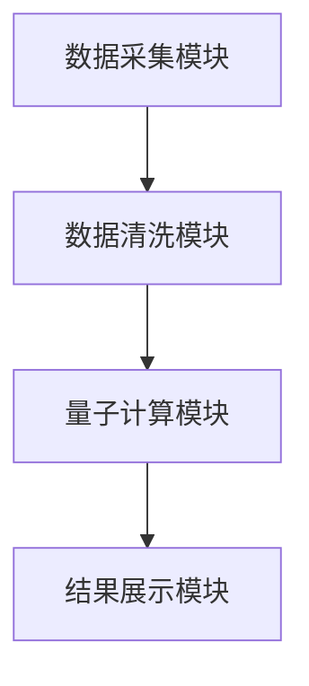

                 

# 巴菲特的市场情绪指标6.0：量子情感计算的金融应用

> 关键词：巴菲特，市场情绪指标，量子计算，情感计算，金融应用，投资策略

> 摘要：本文深入探讨了巴菲特市场情绪指标6.0版本的创新之处，结合量子情感计算在金融领域的应用，分析了其在投资决策中的潜在价值。通过量子计算的强大能力，我们能够更精准地捕捉和量化市场情绪，从而优化投资策略，提升收益。

---

## 第1章: 市场情绪指标的背景与意义

### 1.1 什么是市场情绪指标

市场情绪指标是一种用于衡量金融市场参与者情绪的量化工具。它通过分析价格波动、交易量、新闻报道、社交媒体等多方面数据，帮助投资者理解市场的乐观或悲观情绪。

#### 1.1.1 市场情绪指标的定义

市场情绪指标（Market Sentiment Index，MSI）是通过量化分析市场参与者的心理状态，用以预测市场走势的工具。它反映了投资者对市场的信心程度，通常以指数形式呈现。

#### 1.1.2 市场情绪指标的重要性

- 把握市场情绪有助于投资者做出更明智的决策。
- 市场情绪指标能够预测市场的转折点，帮助投资者规避风险或抓住机会。

#### 1.1.3 市场情绪指标的分类

- **基于价格的指标**：如相对强弱指数（RSI）、平均趋向指数（ADX）。
- **基于交易量的指标**：如成交量价差（OBV）。
- **基于新闻和社交媒体的指标**：如情感分析指数。

### 1.2 巴菲特与市场情绪指标

#### 1.2.1 巴菲特的投资理念

巴菲特是一位价值投资者，主张长期投资优质资产，而非短期交易。他强调基本面分析，但市场情绪同样影响资产价格。

#### 1.2.2 巴菲特市场情绪指标的提出

巴菲特意识到市场情绪对投资决策的重要性，提出了基于市场情绪的量化指标，用于辅助投资决策。

#### 1.2.3 巴菲特市场情绪指标的应用

- 用于判断市场的整体情绪，辅助投资决策。
- 作为资产配置的参考指标。

### 1.3 量子情感计算的引入

#### 1.3.1 量子计算的基本概念

量子计算是一种基于量子力学原理的计算方式，利用量子叠加和量子纠缠现象，能够在极短时间内处理大量数据。

#### 1.3.2 情感计算的定义与应用

情感计算（Affective Computing）是通过计算机技术分析和识别人类情感，应用于人机交互、情感支持等领域。

#### 1.3.3 量子情感计算的优势

- 高速计算能力。
- 强大的并行处理能力。
- 能够处理复杂的情感数据。

---

## 第2章: 市场情绪指标的核心理论

### 2.1 市场情绪指标的理论基础

#### 2.1.1 投资心理学与市场情绪

市场情绪受投资者心理影响，表现为乐观或悲观情绪，影响资产价格波动。

#### 2.1.2 市场情绪与金融市场的关联

市场情绪指标能够反映市场的整体情绪，进而预测市场走势。

#### 2.1.3 市场情绪指标的数学模型

$$
\text{市场情绪指数} = \frac{\text{正面情绪数量} - \text{负面情绪数量}}{\text{总样本数量}}
$$

### 2.2 市场情绪指标的分类与特点

- **基于价格的指标**：如RSI、ADX。
- **基于交易量的指标**：如OBV。
- **基于新闻和社交媒体的指标**：如情感分析指数。

### 2.3 巴菲特市场情绪指标的数学模型

#### 2.3.1 情感强度计算公式

$$
\text{情感强度} = \sum_{i=1}^{n} w_i \cdot s_i
$$

其中，$w_i$ 是第$i$个情感词的权重，$s_i$ 是情感词的情感值。

#### 2.3.2 市场情绪指数的构建

$$
\text{市场情绪指数} = \frac{\sum_{i=1}^{n} \text{情感强度}_i}{n}
$$

#### 2.3.3 指标的有效性和适用性分析

- 有效性：能够准确反映市场情绪。
- 适用性：适用于多种金融资产。

---

## 第3章: 量子情感计算的原理与实现

### 3.1 量子计算的基本原理

#### 3.1.1 量子叠加与量子纠缠

量子叠加：量子系统可以处于多个状态的叠加态。

量子纠缠：两个或多个量子系统之间存在关联，测量其中一个会影响另一个。

#### 3.1.2 量子计算的优势

- 高速计算能力。
- 强大的并行处理能力。

#### 3.1.3 量子计算在金融中的应用

- 优化投资组合。
- 风险管理。
- 市场情绪分析。

### 3.2 情感计算的核心算法

#### 3.2.1 情感分析的基本概念

- 文本分类：将文本分为正面、负面或中性。
- 情感强度计算：量化情感的程度。

#### 3.2.2 基于自然语言处理的情感计算

- 分词：将文本分割成词语或短语。
- 词性标注：标注词语的词性。
- 情感分析：判断情感倾向。

#### 3.2.3 量子情感计算的算法模型

- 量子叠加：用于处理大规模数据。
- 量子纠缠：用于关联分析。

### 3.3 量子情感计算的实现步骤

#### 3.3.1 数据收集与预处理

- 数据来源：新闻、社交媒体、交易数据。
- 数据清洗：去除噪声数据。

#### 3.3.2 量子计算模型的构建

- 构建量子电路。
- 编写量子算法。

#### 3.3.3 情感计算结果的解读

- 解释量子计算结果。
- 转换为市场情绪指标。

---

## 第4章: 量子情感计算系统的架构设计

### 4.1 系统架构概述

#### 4.1.1 系统功能模块划分

- 数据采集模块：收集市场数据。
- 量子计算模块：进行情感计算。
- 结果展示模块：展示市场情绪指数。

#### 4.1.2 系统架构的优缺点

- 优点：高效、准确。
- 缺点：技术复杂、成本高。

### 4.2 系统功能设计

#### 4.2.1 数据采集模块

- 功能：实时采集市场数据。
- 输入：原始数据。
- 输出：清洗后的数据。

#### 4.2.2 量子计算模块

- 功能：进行情感计算。
- 输入：清洗后的数据。
- 输出：情感强度。

#### 4.2.3 结果展示模块

- 功能：展示市场情绪指数。
- 输入：情感强度。
- 输出：市场情绪指数。

### 4.3 系统架构图

---

## 第5章: 量子情感计算的金融应用

### 5.1 投资决策支持

- 帮助投资者做出更明智的决策。
- 提供市场情绪参考。

### 5.2 风险管理

- 识别市场风险。
- 制定风险管理策略。

### 5.3 量化投资策略

- 构建量化投资模型。
- 自动化交易。

---

## 第6章: 量子情感计算的未来展望

### 6.1 技术进步

- 量子计算的进一步发展。
- 人工智能的进步。

### 6.2 应用场景扩展

- 更多金融市场的应用。
- 跨领域应用的探索。

---

## 作者

作者：AI天才研究院/AI Genius Institute & 禅与计算机程序设计艺术 /Zen And The Art of Computer Programming

---

# 结语

巴菲特市场情绪指标6.0结合量子情感计算，为金融领域带来了新的可能性。通过量子计算的强大能力，我们能够更精准地捕捉和量化市场情绪，从而优化投资策略，提升收益。未来，随着技术的进步，量子情感计算在金融中的应用将更加广泛和深入。

