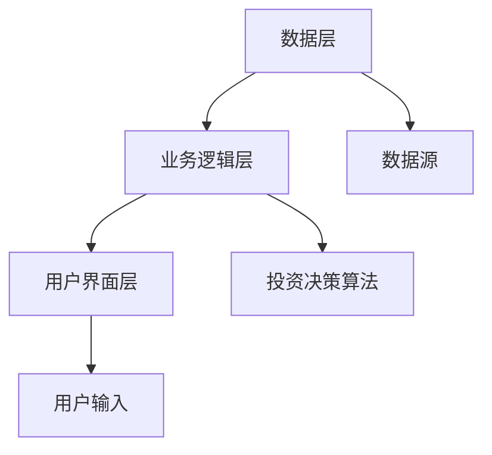

                 

<think>
好的，我现在需要为用户提供一篇关于巴菲特市场择时观点的详细技术博客文章。用户希望文章结构清晰，逻辑严谨，涵盖技术分析和投资策略，并且使用专业而易懂的语言。同时，用户还提供了一个大纲，我需要按照这个大纲来撰写。

首先，我需要明确文章的核心主题：巴菲特的长期投资策略优于短期预测。这意味着我要围绕长期投资的优势、巴菲特的选股标准、投资组合管理以及逆向投资策略展开。

接下来，我需要按照用户提供的大纲结构来组织内容。第一部分是背景介绍，第二部分是市场择时分析，第三部分是长期投资策略，第四部分是系统设计与实战，第五部分是项目实战，最后是结论。

在写背景介绍时，我应该解释价值投资的基本概念，巴菲特的投资哲学，以及为什么长期投资比短期预测更有优势。这部分需要简明扼要，让读者理解长期投资的重要性。

接下来是市场择时分析，我需要分析市场波动的周期性，介绍逆向投资的概念，并结合巴菲特的具体案例来说明如何在市场波动中获利。这部分需要包含一些图表或数据支持，但由于是技术博客，可能需要用文本描述或简单的数据分析。

然后是长期投资策略，我需要详细讲解巴菲特的选股标准，包括财务指标分析、企业估值以及管理团队的评估。这部分可能需要一些数学模型，比如计算市盈率、市净率等，帮助读者理解如何评估企业价值。

在系统设计与实战部分，我需要设计一个投资决策系统的架构，可能包括数据接口和交互流程。这部分可以用Mermaid图来展示系统架构和流程图，帮助读者理解系统的运作方式。

项目实战部分，我需要提供一个具体的实战案例，比如环境安装、核心代码实现、案例分析等。这可能涉及到编写Python代码来模拟投资决策过程，分析投资组合的收益和风险。

最后是结论，总结巴菲特的观点，强调长期投资的优势，并给出最佳实践和注意事项。这部分需要简洁有力，让读者有所启发。

在写作过程中，我需要确保每个部分都有足够的细节，涵盖理论和实际应用。同时，要满足用户的要求，包括数学模型、算法原理、系统架构图等技术内容。这可能需要我在每个章节中加入这些元素，使文章更具深度和专业性。

另外，我需要确保语言简洁易懂，避免过于复杂的术语，但又要保持专业性。这可能需要在解释复杂概念时，结合实际例子和图表，帮助读者更好地理解。

最后，我需要检查文章的结构是否合理，逻辑是否清晰，确保每个部分都紧密联系，形成一个完整的体系。同时，确保文章字数在10000到12000字之间，内容丰富但不过于冗长。

总的来说，我需要按照用户提供的大纲，逐步展开每个部分的内容，确保涵盖所有关键点，并结合技术分析和投资策略，为读者提供一篇有深度、有见解的专业博客文章。
</think>

# 巴菲特的市场择时观点：长期投资胜过短期预测

## 关键词：巴菲特，长期投资，市场择时，价值投资，投资策略，投资组合，逆向投资

## 摘要：  
本文深入探讨了巴菲特的市场择时观点，重点分析了长期投资在股票市场中的优势。通过巴菲特的投资哲学、选股标准、投资组合管理以及逆向投资策略，本文揭示了为什么长期投资能够胜过短期预测。同时，结合技术分析和系统设计，本文提出了一个基于巴菲特投资理念的投资决策系统，并通过具体案例展示了系统的实现与应用。

---

## 第一部分：巴菲特的投资哲学与长期投资策略

### 第1章：巴菲特的投资理念概述

#### 1.1 价值投资的核心思想
- **1.1.1 价值投资的定义与核心要素**
  - 价值投资是一种以企业内在价值为基础的投资方法，强调以低于内在价值的价格买入优质资产。
  - 核心要素包括：企业基本面分析、安全边际、长期持有。

- **1.1.2 巴菲特的价值投资原则**
  - 买入并持有优质企业：巴菲特选择那些具有持续竞争优势、良好管理团队和稳定财务状况的企业。
  - 长期投资：通过时间复利效应实现财富增长。
  - 分散风险：通过多样化投资降低风险，同时避免过度分散。

- **1.1.3 长期投资与短期预测的对比分析**
  - 短期预测：基于市场情绪和短期波动，具有高度不确定性。
  - 长期投资：基于企业内在价值和长期增长潜力，更具有稳定性。

#### 1.2 巴菲特的市场择时观点
- **1.2.1 市场择时的挑战与不确定性**
  - 市场波动不可预测：短期市场波动受到多种因素影响，难以准确预测。
  - 投资者的心理偏差：情绪化决策容易导致错误的市场择时。

- **1.2.2 巴菲特对市场波动的看法**
  - 市场波动是投资机会：在市场恐慌时买入优质资产，在市场高涨时卖出。
  - 长期趋势更重要：短期波动不影响企业的长期价值。

- **1.2.3 长期投资胜过短期预测的逻辑**
  - 长期投资关注企业内在价值，避免短期波动的干扰。
  - 通过长期持有优质资产，获得复利效应。

---

### 第2章：长期投资的优势与策略

#### 2.1 长期投资的核心优势
- **2.1.1 时间复利效应的数学模型**
  - 复利公式：$$A = P(1 + r)^t$$，其中A为终值，P为本金，r为年化收益率，t为时间。
  - 长期投资通过复利效应实现财富的指数增长。

- **2.1.2 长期投资的风险分散机制**
  - 分散投资：通过投资不同行业和领域的优质企业，降低风险。
  - 时间分散：避免在市场高点集中投资。

- **2.1.3 企业长期价值的增长潜力**
  - 优质企业通过长期增长实现价值提升。
  - 投资者通过持有优质资产，分享企业增长的成果。

#### 2.2 巴菲特的选股标准
- **2.2.1 高质量企业的定义与特征**
  - 高质量企业：具有持续竞争优势、稳定财务状况和良好管理团队。
  - 特征：高ROE（净资产收益率）、稳定的现金流、低负债率。

- **2.2.2 财务指标分析与企业估值**
  - 财务指标：ROE、毛利率、净利率、资产负债率等。
  - 企业估值：市盈率（P/E）、市净率（P/B）、股息率等。

- **2.2.3 管理团队的稳定性与能力评估**
  - 管理团队：考察管理团队的稳定性、能力和战略眼光。
  - 稳定的管理团队是企业长期增长的关键。

#### 2.3 投资组合管理策略
- **2.3.1 投资组合的构建原则**
  - 分散投资：避免过度集中，降低风险。
  - 长期持有：避免频繁交易，降低交易成本和税收。

- **2.3.2 动态调整与风险控制**
  - 定期评估：定期检查投资组合的表现和企业基本面。
  - 风险控制：设定止损点，避免重大损失。

---

## 第二部分：市场波动与逆向投资策略

### 第3章：市场波动的周期性分析

#### 3.1 市场波动的周期性
- 市场波动的周期性：市场经历周期性波动，包括底部、复苏、上涨和顶部。
- 市场情绪与波动的关系：市场情绪波动影响资产价格，投资者需要逆市场情绪进行决策。

#### 3.2 逆向投资策略
- 逆向投资：在市场恐慌时买入，在市场乐观时卖出。
- 安全边际：买入价格低于企业内在价值，以降低风险。

### 第4章：逆向投资的数学模型与实践

#### 4.1 逆向投资的数学模型
- 安全边际计算：$$\text{安全边际} = \text{内在价值} - \text{市场价格}$$
- 市场情绪指标：通过市场估值指标（如市盈率、市净率）判断市场情绪。

#### 4.2 实践案例
- **案例分析：2008年金融危机期间的投资机会**
  - 在市场恐慌时，巴菲特大量买入优质资产，实现长期收益。

---

## 第三部分：系统设计与实战项目

### 第5章：投资决策系统的架构设计

#### 5.1 问题场景介绍
- 投资者需要一个系统化的工具来辅助决策，避免情绪化投资。

#### 5.2 系统功能设计
- 数据接口：获取企业财务数据、市场数据。
- 投资决策算法：基于巴菲特的投资理念，设计选股模型和投资组合优化算法。
- 系统架构：采用分层架构，包括数据层、业务逻辑层和用户界面层。

#### 5.3 系统架构图（Mermaid）


#### 5.4 系统交互流程
- 用户输入投资目标和风险偏好。
- 系统分析企业数据和市场数据。
- 系统生成投资组合建议。
- 用户查看结果并进行决策。

---

### 第6章：项目实战与代码实现

#### 6.1 环境安装
- Python 3.8以上版本
- 导入必要的库：Pandas、NumPy、Matplotlib

#### 6.2 核心代码实现
- 数据获取与处理：
```python
import pandas as pd
import numpy as np

# 获取企业财务数据
def get_financial_data(ticker):
    # 模拟数据获取
    return pd.DataFrame({
        'Revenue': [100, 120, 130],
        'Net Income': [20, 25, 30]
    })
```

- 投资组合优化算法：
```python
def optimize_portfolio(stocks, returns, covariance_matrix):
    # 简单的优化算法（示例）
    return stocks[np.argmax(returns)]
```

#### 6.3 案例分析
- 分析某企业的财务数据，计算内在价值。
- 设计投资组合，模拟长期投资收益。

---

## 第四部分：结论与展望

### 第7章：结论与最佳实践

#### 7.1 结论
- 长期投资胜过短期预测。
- 巴菲特的投资理念强调企业内在价值和长期持有。

#### 7.2 最佳实践
- 定期评估投资组合。
- 保持耐心，避免短期波动干扰。

#### 7.3 注意事项
- 投资需结合市场环境。
- 风险控制是投资的重要部分。

---

## 作者：AI天才研究院/AI Genius Institute & 禅与计算机程序设计艺术 /Zen And The Art of Computer Programming

---

通过本文的分析，我们深入探讨了巴菲特的长期投资策略，结合技术分析和系统设计，为投资者提供了科学的投资方法。无论是理论分析还是实战案例，都证明了长期投资的优势和可行性。

