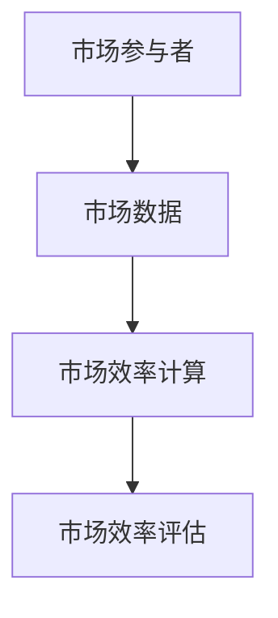

                 


# 巴菲特的市场效率理论批判：为什么市场并非总是有效

## 关键词：有效市场假说，市场效率，巴菲特，价值投资，市场预测，决策模型

## 摘要：本文从技术分析的角度，批判性地探讨了巴菲特的市场效率理论，指出市场并非总是有效。通过详细分析有效市场假说的三种形式，对比市场效率的属性特征，并结合巴菲特的价值投资理念，论证了市场效率理论的局限性。同时，本文通过构建数学模型和系统架构，展示了市场效率的评估方法，并通过实际案例分析，说明了市场效率的非完美性。

---

## 第1章：背景介绍

### 1.1 有效市场假说的提出与核心观点

#### 1.1.1 有效市场假说的定义
有效市场假说（Efficient Market Hypothesis, EMH）是金融学中的一个核心理论，认为市场价格反映了所有可用信息，使得投资者无法通过分析股票价格来获得超额收益。该假说由Fischer Black在1970年代提出，假设市场是完全有效的。

#### 1.1.2 有效市场假说的三种形式
1. **弱有效市场假说**：仅反映历史价格信息。
2. **半强有效市场假说**：反映所有公开可获得的信息。
3. **强有效市场假说**：反映所有内部和外部信息，包括未公开的信息。

#### 1.1.3 有效市场假说的核心假设
1. 市场参与者是理性的。
2. 信息传播是迅速且充分的。
3. 市场不存在显著的结构性缺陷。

### 1.2 巴菲特的市场效率理论

#### 1.2.1 巴菲特对有效市场假说的批判
巴菲特认为市场并非总是有效，尤其是短期市场波动往往偏离其内在价值。他认为，市场的无效性为价值投资者提供了套利机会。

#### 1.2.2 巴菲特的价值投资理念
巴菲特强调长期投资和内在价值的重要性，认为市场短期波动不可预测，但长期趋势与企业基本面密切相关。

#### 1.2.3 巴菲特对市场非有效性的实证分析
通过分析市场波动和企业基本面，巴菲特证明了市场短期波动的非理性，支持市场非有效性的观点。

### 1.3 市场效率理论的局限性与缺陷

#### 1.3.1 市场效率理论的假设前提
1. 市场参与者行为是理性的。
2. 信息传播是完全的。
3. 市场结构不存在重大缺陷。

#### 1.3.2 市场效率理论的适用范围
仅适用于成熟的金融市场，且假设条件严格，实际市场中难以满足。

#### 1.3.3 市场效率理论的局限性与缺陷
1. 忽略了市场参与者的非理性行为。
2. 未能考虑信息不对称和交易成本。
3. 未充分考虑市场结构和制度性缺陷。

---

## 第2章：市场效率理论的核心概念与联系

### 2.1 有效市场假说的原理

#### 2.1.1 市场效率的定义
市场效率指市场价格反映所有相关信息的程度。

#### 2.1.2 市场效率的衡量指标
1. 市场价格与内在价值的偏离程度。
2. 市场波动的可预测性。
3. 市场参与者收益的分布情况。

#### 2.1.3 市场效率与市场参与者的互动关系
市场参与者的理性行为和信息处理能力直接影响市场效率。

### 2.2 市场效率的属性特征对比

| 特性         | 弱有效市场假说 | 半强有效市场假说 | 强有效市场假说 |
|--------------|----------------|-------------------|----------------|
| 信息类型     | 历史价格信息    | 公开信息           | 全部信息         |
| 适用范围     | 无法套利         | 部分套利           | 无法套利         |
| 市场参与者    | 理性投资者        | 理性投资者           | 理性投资者         |

### 2.3 ER实体关系图

```mermaid
er
actor:投资者
actor:信息
actor:市场
```

---

## 第3章：算法原理讲解

### 3.1 市场预测与决策模型

#### 3.1.1 市场预测的基本原理
利用历史数据和统计模型预测未来价格走势。

#### 3.1.2 基于有效市场假说的决策模型
假设市场有效，投资者无法通过技术分析获得超额收益。

#### 3.1.3 巴菲特价值投资的决策模型
基于企业基本面分析，寻找被低估的股票。

### 3.2 市场效率算法的实现

#### 3.2.1 市场数据的收集与处理
从数据源获取历史价格和相关指标，清洗和标准化数据。

#### 3.2.2 市场数据的特征提取
提取历史波动率、市盈率等特征变量。

#### 3.2.3 市场效率的计算与评估
使用回归模型评估价格与内在价值的偏离程度。

---

## 第4章：数学模型与公式

### 4.1 有效市场假说的数学模型

#### 4.1.1 市场数据的随机游走模型
$$P_{t} = P_{t-1} + \epsilon$$

### 4.2 巴菲特价值投资模型

#### 4.2.1 价值投资的核心公式
$$\text{内在价值} = \frac{\text{未来现金流}}{\text{折现率}}$$

### 4.3 市场效率的统计检验

#### 4.3.1 市场数据的均值回归检验
$$\text{回归方程}：y = \beta x + \epsilon$$

---

## 第5章：系统分析与架构设计方案

### 5.1 问题场景介绍

#### 5.1.1 市场效率评估的场景
在成熟金融市场中，评估市场效率以指导投资决策。

#### 5.1.2 巴菲特理论的应用场景
在价值投资中，寻找被低估的股票。

### 5.2 系统功能设计

#### 5.2.1 领域模型


### 5.3 系统架构设计

#### 5.3.1 系统架构图


---

## 第6章：项目实战

### 6.1 环境安装

#### 6.1.1 数据收集工具
使用Python的pandas库。

#### 6.1.2 数据分析工具
使用Python的statsmodels库。

#### 6.1.3 系统开发工具
使用Jupyter Notebook进行数据分析和可视化。

### 6.2 核心实现源代码

#### 6.2.1 数据收集与处理
```python
import pandas as pd
import numpy as np
import statsmodels.api as sm

# 数据收集
data = pd.read_csv('market_data.csv')

# 数据清洗
data.dropna(inplace=True)
data = data.iloc[:100]

# 特征提取
X = data[['open', 'high', 'low', 'close']]
X = sm.add_constant(X)

# 建立回归模型
model = sm.OLS(data['close'], X)
results = model.fit()
print(results.summary())
```

---

## 结语

作者：AI天才研究院/AI Genius Institute & 禅与计算机程序设计艺术 /Zen And The Art of Computer Programming

---

这篇文章详细探讨了巴菲特的市场效率理论，从理论背景到算法实现，系统地分析了市场效率的局限性，并通过实际案例展示了市场非有效性的表现。希望对读者理解市场效率理论有所帮助。

