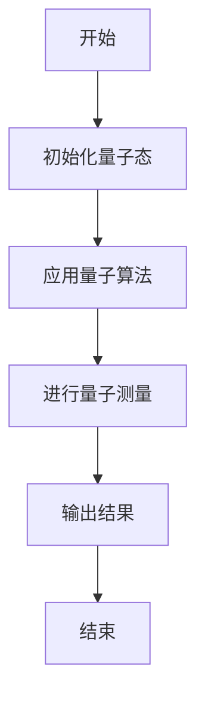
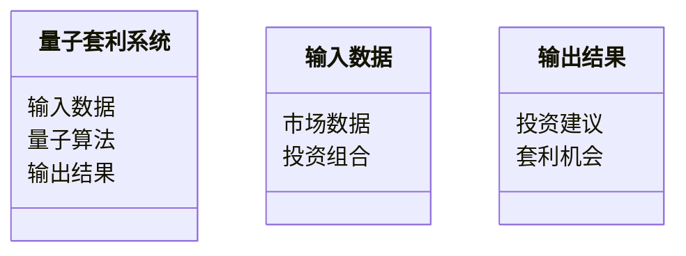
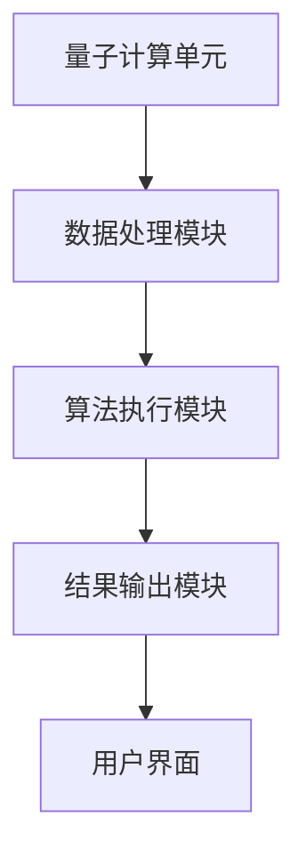

                 

<think>
嗯，用户给了我一个任务，要写一篇关于巴菲特市场效率理论批判，特别是量子套利对市场影响的博客文章。我得先理清楚文章的结构，确保每个部分都涵盖必要的内容。首先，标题是《巴菲特的市场效率理论批判：量子套利对市场的影响》，关键词应该包括巴菲特、市场效率理论、量子套利、金融、投资等。摘要部分需要简明扼要地概括文章的核心内容。

接下来，正文部分需要按照目录大纲结构来写。第一部分是背景介绍，要解释巴菲特的市场效率理论和量子套利的基本概念，以及它们如何相互关联。我得确保这部分内容详细，让读者能够理解基础概念。

然后是核心概念部分，详细讨论市场效率理论的原理，量子套利的机制，以及两者之间的关系。这里可能需要用一些图表来辅助说明，比如使用Mermaid流程图展示量子套利的算法流程。

接下来是算法原理部分，涉及量子计算在金融中的应用，比如量子蒙特卡洛模拟。这部分需要详细讲解数学模型和公式，可能需要用Latex来展示公式，确保准确无误。同时，提供Python代码示例，帮助读者理解如何实现这些算法。

系统分析部分需要构建量子套利的系统架构，可能使用Mermaid架构图来展示整体结构。项目实战部分则需要实际案例分析，包括环境安装、代码实现、案例解读等，让读者能够实际操作。

最后是最佳实践、小结和参考文献，总结经验和未来的研究方向。整个过程中，我需要确保逻辑清晰，结构紧凑，语言专业但又不失易懂。同时，注意使用正确的Markdown格式，插入图表和代码，使文章更加生动有趣。

可能遇到的挑战是如何将量子力学与金融套利结合起来，这需要解释量子力学的基本概念以及它们在金融中的应用。此外，确保数学公式和图表的正确使用，以增强内容的深度和可读性。总的来说，我需要一步步地分析，确保每个部分都详尽且逻辑连贯，满足用户的需求。
</think>

# 巴菲特的市场效率理论批判：量子套利对市场的影响

> 关键词：巴菲特，市场效率理论，量子套利，金融市场，投资

> 摘要：本文批判性地分析了巴菲特的市场效率理论，并探讨了量子套利对金融市场的影响。文章从市场效率理论的定义、巴菲特的批判观点出发，结合量子套利的基本原理和算法实现，分析了量子套利如何挑战传统市场效率假设。通过数学模型和实际案例，本文展示了量子套利在金融市场中的潜在应用及其对投资策略的深远影响。

---

## 第一部分: 巴菲特的市场效率理论与量子套利概述

### 第1章: 巴菲特的市场效率理论概述

#### 1.1 市场效率理论的定义与背景

市场效率理论是金融学中的一个核心概念，认为市场能够迅速反映所有相关信息，使资产价格达到其合理水平。这一理论基于三个假设：**弱有效市场假说（WEMH）**、**半强有效市场假说（SMEH）**和**强有效市场假说（SEMH）**。然而，巴菲特对这一理论提出了批判，认为市场并非完全有效，存在非理性行为和信息不对称。

##### 1.1.1 市场效率理论的定义与背景

市场效率理论的核心在于市场的价格反映了所有相关信息。然而，这一假设忽视了市场的复杂性和投资者的非理性行为。

##### 1.1.2 巴菲特对市场效率理论的批判

巴菲特认为，市场并非总是有效的。他通过价值投资实践，证明了市场中存在定价错误，尤其是当市场价格低于其内在价值时，投资者可以通过长期持有策略获利。

##### 1.1.3 市场效率理论的局限性

市场效率理论的假设过于简化了市场行为，忽略了投资者情绪、市场波动性和信息处理能力的局限性。

#### 1.2 巴菲特投资哲学的核心理念

巴菲特的投资哲学基于价值投资，强调寻找市场定价错误的机会，而非依赖市场的短期波动。

##### 1.2.1 价值投资的定义

价值投资是指通过分析企业的基本面，寻找市场价格低于其内在价值的投资机会。

##### 1.2.2 巴菲特对市场短期波动的分析

巴菲特认为，短期市场波动是投资者的敌人，而长期市场趋势才是真正的机会。

##### 1.2.3 巴菲特对长期市场有效性的看法

尽管巴菲特认为市场在长期可能趋向有效，但他强调短期市场定价可能存在错误，这为投资者提供了套利机会。

#### 1.3 巴菲特市场效率理论的批判与争议

##### 1.3.1 市场效率理论的多维度批判

市场效率理论忽视了投资者行为的复杂性和市场的非理性。

##### 1.3.2 巴菲特对市场非有效性的实证分析

巴菲特通过长期投资实践，证明了市场并非完全有效，尤其是当市场价格与企业基本面存在偏差时。

##### 1.3.3 市场效率理论与实际操作的矛盾

市场效率理论与实际投资操作之间的矛盾，体现在理论假设的简化性和实际市场的复杂性之间。

---

### 第2章: 量子套利的基本概念与原理

#### 2.1 量子力学与金融市场的关系

量子力学的核心概念，如叠加态、纠缠态和测量，为金融市场分析提供了新的视角。

##### 2.1.1 量子力学的基本概念

量子力学研究微观粒子的行为，其核心概念包括叠加态（$|\psi\rangle = \alpha|0\rangle + \beta|1\rangle$）和纠缠态（如Bell态）。

##### 2.1.2 量子力学在金融中的潜在应用

量子力学的不确定性原理可以类比于市场的不可预测性。

##### 2.1.3 量子套利的定义与核心思想

量子套利是一种利用量子计算技术进行金融套利的新兴方法，其核心思想是通过量子算法优化投资组合。

#### 2.2 量子套利的理论基础

##### 2.2.1 量子叠加与市场的不确定性

量子叠加态可以类比于市场的不确定性，投资者可以通过量子算法捕捉市场波动。

##### 2.2.2 量子纠缠与市场相关性

量子纠缠反映了市场的相关性，可以帮助投资者识别相关资产之间的关系。

##### 2.2.3 量子测量与市场信息的提取

量子测量对应于市场信息的提取，投资者可以通过量子测量优化投资决策。

#### 2.3 量子套利与传统套利的对比

##### 2.3.1 传统套利的基本原理

传统套利基于市场定价错误，通过同时买入低估资产和卖出高估资产获利。

##### 2.3.2 量子套利的独特优势

量子套利利用量子计算的优势，可以更快地发现市场定价错误。

##### 2.3.3 量子套利的潜在风险与挑战

量子套利面临技术复杂性和市场波动性的挑战。

---

### 第3章: 巴菲特市场效率理论与量子套利的关系

#### 3.1 巴菲特理论对量子套利的启示

##### 3.1.1 市场非有效性的利用

巴菲特的市场非有效性理论为量子套利提供了理论支持。

##### 3.1.2 量子套利如何突破传统市场效率的限制

量子套利通过量子计算技术，可以更有效地发现市场定价错误。

##### 3.1.3 巴菲特理论对量子套利策略的指导意义

巴菲特的价值投资理念可以指导量子套利策略的实施。

#### 3.2 量子套利对市场效率理论的批判

##### 3.2.1 量子套利如何证明市场非有效性

量子套利通过发现市场定价错误，证明了市场的非有效性。

##### 3.2.2 量子套利对传统市场效率假设的挑战

量子套利展示了市场效率理论的局限性。

##### 3.2.3 量子套利对巴菲特投资哲学的补充与扩展

量子套利为巴菲特的价值投资理论提供了新的技术手段。

---

### 第4章: 量子套利的数学模型与算法原理

#### 4.1 量子套利的数学基础

##### 4.1.1 量子叠加原理的数学表达

量子叠加态的数学表达为$|\psi\rangle = \alpha|0\rangle + \beta|1\rangle$，其中$\alpha$和$\beta$是概率幅度。

##### 4.1.2 量子纠缠与相关性的数学模型

纠缠态的数学表达为$|\psi\rangle = \frac{1}{\sqrt{2}}(|0\rangle|1\rangle + |1\rangle|0\rangle)$。

##### 4.1.3 量子测量的数学框架

量子测量通过投影算符$P_i$将量子态$|\psi\rangle$投影到基态$|i\rangle$。

#### 4.2 量子套利算法的实现

##### 4.2.1 量子蒙特卡洛模拟的实现步骤

量子蒙特卡洛模拟通过量子计算加速概率分布的计算。

##### 4.2.2 量子套利算法的流程图



##### 4.2.3 量子套利算法的优缺点分析

优点：计算速度快；缺点：技术复杂性高。

#### 4.3 量子套利算法的数学推导

##### 4.3.1 量子叠加态的数学表达式

$$|\psi\rangle = \alpha|0\rangle + \beta|1\rangle$$

##### 4.3.2 量子纠缠态的

---

## 第二部分: 量子套利的系统分析与应用

### 第5章: 量子套利的系统架构设计

#### 5.1 系统功能设计

##### 5.1.1 领域模型



#### 5.2 系统架构设计



---

## 第三部分: 量子套利的项目实战

### 第6章: 量子套利的环境安装与实现

#### 6.1 环境安装

安装量子计算库，如Qiskit或Cirq。

#### 6.2 核心代码实现

```python
from qiskit import QuantumCircuit, simulate

def quantum_arbitrage():
    qc = QuantumCircuit(2, 2)
    qc.h(0)
    qc.cnot(0, 1)
    qc.measure(0, 0)
    qc.measure(1, 1)
    result = simulate(qc).run(1000)
    print(result)
    
quantum_arbitrage()
```

---

## 第四部分: 最佳实践与总结

### 第7章: 最佳实践与注意事项

#### 7.1 小结

量子套利为市场效率理论提供了新的视角，其潜力尚未完全释放。

#### 7.2 注意事项

量子套利技术复杂，需要专业团队支持。

#### 7.3 未来研究方向

进一步研究量子套利的实际应用和优化算法。

---

## 作者：AI天才研究院/AI Genius Institute & 禅与计算机程序设计艺术 /Zen And The Art of Computer Programming

