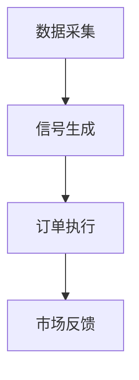

                 


# 巴菲特的市场效率理论批判：高频交易和量化策略的影响

---

## 关键词：市场效率理论, 高频交易, 量化策略, 巴菲特, 算法交易

---

## 摘要：  
本文从巴菲特的市场效率理论出发，批判性地分析高频交易和量化策略对市场效率的影响。通过技术细节的解析，探讨高频交易如何改变市场的信息传递机制，进而对传统市场效率理论构成挑战。结合实际案例和数学模型，本文提出市场效率理论的重构方向，并展望未来市场的发展趋势。

---

# 第1章 巴菲特的市场效率理论概述

## 1.1 巴菲特的市场效率理论  

### 1.1.1 巴菲特市场效率理论的核心观点  

巴菲特的市场效率理论认为，市场是有效的，价格已经反映了所有公开信息。这一理论基于有效市场假说（EMH），认为投资者无法通过基本面分析获得超额收益。  

**数学模型：**  
$$ P = \text{Intrinsic Value} + \text{Market Sentiment} $$  

### 1.1.2 有效市场假说的理论基础  

有效市场假说将市场分为弱式、半强式和强式。巴菲特支持半强式有效市场，认为价格反映了所有公开信息，但未考虑内部信息。  

### 1.1.3 巴菲特理论与有效市场假说的异同  

| 特性 | 巴菲特理论 | 有效市场假说（EMH） |
|------|------------|---------------------|
| 核心观点 | 市场价格反映公开信息 | 市场价格反映所有信息（弱式、半强式、强式） |
| 研究重点 | 投资者行为与市场情绪 | 市场结构与信息传递 |
| 适用范围 | 股票市场 | 所有金融市场 |

---

## 1.2 高频交易和量化策略的兴起  

### 1.2.1 高频交易的定义与特点  

高频交易是通过计算机算法在极短时间内完成大量交易的策略。其特点是速度极快、交易频繁、依赖技术优势。  

### 1.2.2 量化策略的核心机制  

量化策略依赖数学模型和算法，通过大数据分析寻找市场中的短期套利机会。  

### 1.2.3 高频交易与量化策略的市场影响  

高频交易和量化策略的兴起使得市场更加依赖技术，传统基本面分析的重要性降低。  

---

## 1.3 巴菲特理论与高频交易的初步关联  

### 1.3.1 巴菲特理论的适用性分析  

高频交易的出现对巴菲特的市场效率理论提出了挑战。市场是否仍然有效？价格是否还能反映所有信息？  

### 1.3.2 高频交易对市场效率的潜在影响  

高频交易可能导致市场波动加剧，信息传递效率下降，市场效率降低。  

### 1.3.3 理论与实践的矛盾点  

高频交易的算法依赖技术优势，而巴菲特的理论基于市场有效性假设，两者在实践中的冲突日益明显。  

---

## 1.4 本章小结  

本章介绍了巴菲特的市场效率理论及其与高频交易的初步关联，为后续分析奠定了基础。

---

# 第2章 高频交易与量化策略的技术分析  

## 2.1 高频交易的算法机制  

### 2.1.1 算法交易的基本原理  

算法交易通过预设的数学模型自动执行交易决策。其流程包括数据采集、信号生成、订单执行三个阶段。  

**流程图：**  



### 2.1.2 高频交易的数学模型  

高频交易依赖于复杂的时间序列分析模型，例如自回归积分滑动平均模型（ARIMA）。  

**数学公式：**  
$$ \text{ARIMA}(p, d, q) $$  

### 2.1.3 算法交易的实现流程  

1. 数据采集：从交易所获取实时市场数据。  
2. 信号生成：通过算法分析数据，生成买卖信号。  
3. 订单执行：自动下单并完成交易。  

---

## 2.2 量化策略的核心算法  

### 2.2.1 量化策略的分类  

量化策略可分为统计套利、算法交易和高频交易三类。  

### 2.2.2 量化策略的数学模型  

统计套利策略依赖于协方差矩阵和均值回归模型。  

**数学公式：**  
$$ \text{协方差}(X, Y) = \frac{1}{n-1}\sum_{i=1}^{n}(X_i - \bar{X})(Y_i - \bar{Y}) $$  

### 2.2.3 量化策略的实现案例  

以下是一个简单的量化策略实现：  

```python
import pandas as pd
import numpy as np

# 数据处理
data = pd.read_csv('market_data.csv')
returns = data['close'].pct_change().dropna()

# 均值回归策略
mean = returns.mean()
std = returns.std()
z_score = (returns - mean) / std

# 信号生成
signal = np.where(z_score > 2, -1, np.where(z_score < -2, 1, 0))
```

---

## 2.3 高频交易与量化策略的市场影响  

### 2.3.1 高频交易对市场流动性的贡献  

高频交易通过高频买卖增加了市场流动性，但可能导致市场波动加剧。  

### 2.3.2 量化策略对市场波动的影响  

量化策略可能导致市场出现短期剧烈波动，例如“闪电崩盘”。  

### 2.3.3 高频交易与市场不公的争议  

高频交易依赖技术优势，可能加剧市场不公，小投资者处于劣势。  

---

## 2.4 本章小结  

本章详细分析了高频交易和量化策略的技术机制及其对市场的具体影响。

---

# 第3章 巴菲特市场效率理论的批判与重构  

## 3.1 巴菲特理论的局限性  

### 3.1.1 理论假设的简化性  

巴菲特的理论假设市场是有效的，但忽略了高频交易的技术优势和信息不对称。  

### 3.1.2 理论与实践的脱节  

高频交易的出现使得市场效率理论在实践中难以适用。  

### 3.1.3 理论在高频交易时代的失效  

高频交易依赖技术优势，市场效率理论无法解释其对市场的影响。  

---

## 3.2 高频交易对市场效率的影响  

### 3.2.1 高频交易对价格发现的影响  

高频交易通过算法优化价格发现，但可能导致价格波动加剧。  

### 3.2.2 高频交易对市场深度的影响  

高频交易增加了市场深度，但也可能导致市场深度的虚假性。  

### 3.2.3 高频交易对市场公平性的影响  

高频交易依赖技术优势，可能导致市场不公平，小投资者处于劣势。  

---

## 3.3 市场效率理论的重构方向  

### 3.3.1 结合高频交易的市场效率新模型  

新的市场效率理论应考虑技术对市场的影响，例如引入时间因素和算法复杂性。  

### 3.3.2 量化策略对市场效率的影响  

量化策略可能提高市场效率，但也可能降低市场公平性。  

### 3.3.3 市场效率理论的未来方向  

未来的市场效率理论需要综合考虑技术、信息和市场结构的多重因素。  

---

## 3.4 本章小结  

本章批判了巴菲特的市场效率理论，并提出了重构的方向，为未来市场研究提供了新的视角。

---

# 第4章 结论与展望  

## 4.1 结论  

高频交易和量化策略对市场效率提出了新的挑战，传统的市场效率理论需要重构。  

## 4.2 展望  

未来的市场研究应结合技术因素，重新定义市场效率的内涵和外延。  

---

# 作者：AI天才研究院/AI Genius Institute & 禅与计算机程序设计艺术 /Zen And The Art of Computer Programming

