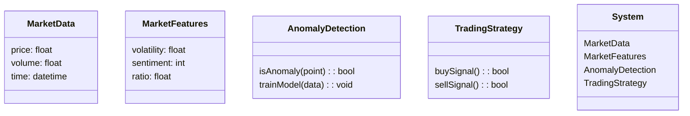
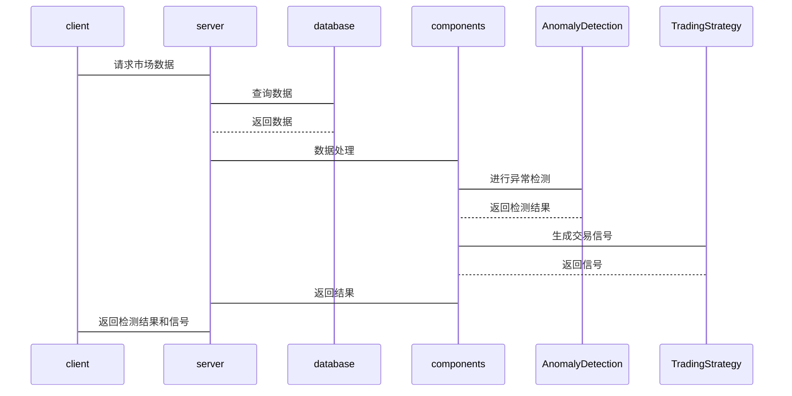

                 


```markdown
# 巴菲特的市场泡沫识别：人工智能驱动的市场异常检测

## 关键词：
- 巴菲特
- 市场泡沫
- 人工智能
- 异常检测
- 金融数据分析

## 摘要：
本文探讨了如何利用人工智能技术辅助巴菲特识别市场泡沫。通过分析市场数据和市场情绪，结合异常检测算法，构建一个智能化的市场异常检测系统，帮助投资者在复杂的金融市场中做出更明智的投资决策。

---

# 第一部分: 巴菲特的市场泡沫识别与人工智能基础

## 第1章: 巴菲特投资理念与市场泡沫概述

### 1.1 巴菲特投资理念的核心思想

#### 1.1.1 价值投资的定义与原则
价值投资是一种以基本面分析为基础的投资策略，强调以低于内在价值的价格购买优质资产。巴菲特的价值投资理念包括以下原则：
- **安全边际**：买入价格低于内在价值，确保足够的安全空间。
- **长期持有**：选择优秀的公司长期持有，避免频繁交易。
- **企业竞争优势**：关注企业的护城河和持续盈利能力。

#### 1.1.2 巴菲特的市场观与泡沫识别
巴菲特认为市场是不理性的，经常会出现非理性波动。他强调在市场恐慌时寻找机会，在市场狂热时保持冷静。市场泡沫的识别是巴菲特投资决策中的重要环节，他通过分析企业的基本面和市场情绪来判断是否存在泡沫。

#### 1.1.3 巴菲特投资理念的现代意义
随着金融市场的复杂化和数据化，巴菲特的传统投资理念需要借助现代技术手段来实现更精准的判断。人工智能技术的崛起为巴菲特的市场泡沫识别提供了新的工具和方法。

### 1.2 人工智能在金融领域的应用前景

#### 1.2.1 人工智能在金融分析中的优势
人工智能技术能够处理海量数据，发现传统方法难以察觉的模式和趋势。其在金融领域的优势包括：
- **数据处理能力**：AI能够快速分析大量市场数据，提取有用信息。
- **预测能力**：基于历史数据，AI可以预测市场走势和潜在风险。
- **实时性**：AI能够实时监控市场动态，及时发现异常情况。

#### 1.2.2 人工智能驱动的市场异常检测
市场异常检测是识别市场泡沫的重要手段。通过AI技术，可以实时监测市场数据，发现异常波动，从而帮助投资者及时做出决策。

#### 1.2.3 巴菲特投资理念与AI技术的结合
将巴菲特的价值投资理念与AI技术相结合，可以实现对市场的深度分析和精准判断。AI技术可以帮助巴菲特更好地识别市场泡沫，优化投资决策。

## 第2章: 市场泡沫的定义与特征

### 2.1 市场泡沫的定义与形成机制

#### 2.1.1 市场泡沫的定义
市场泡沫是指资产价格远高于其内在价值的现象。通常发生在市场参与者对资产未来收益过于乐观，导致价格非理性上涨时。

#### 2.1.2 泡沫形成的经济机制
市场泡沫的形成通常涉及以下几个因素：
- **情绪驱动**：投资者的乐观情绪推动价格上涨。
- **杠杆效应**：高杠杆率加剧了价格波动。
- **羊群效应**：投资者盲目跟风，导致价格进一步偏离价值。

#### 2.1.3 泡沫的生命周期
市场泡沫通常经历以下几个阶段：
1. **孕育阶段**：市场参与者逐渐对某种资产产生热情，价格开始上涨。
2. **膨胀阶段**：价格快速上涨，吸引更多投资者参与。
3. **顶峰阶段**：价格达到最高点，市场参与者开始质疑。
4. **破裂阶段**：价格快速下跌，泡沫破裂。

### 2.2 市场异常检测的核心特征

#### 2.2.1 市场数据的异常特征
市场数据中的异常特征包括：
- **价格波动剧烈**：短时间内价格出现大幅波动。
- **成交量异常**：成交量远高于正常水平。
- **市场情绪异常**：投资者情绪过于乐观或恐慌。

#### 2.2.2 市场情绪的异常表现
市场情绪的异常表现可以通过以下几个方面进行判断：
- **新闻媒体关注**：媒体对某一资产的过度报道。
- **社交媒体情绪**：社交媒体上投资者情绪的极端化。
- **市场参与度**：投资者行为的异常集中。

#### 2.2.3 市场行为的异常模式
市场行为的异常模式包括：
- **交易量集中**：大量交易集中在某些特定资产。
- **价格偏离价值**：资产价格远高于其内在价值。
- **市场参与者行为异常**：投资者行为出现非理性特征。

### 2.3 巴菲特视角下的市场异常识别

#### 2.3.1 巴菲特对市场异常的判断标准
巴菲特通过以下标准判断市场是否存在异常：
- **价格与价值的偏离**：资产价格是否远高于其内在价值。
- **市场参与者行为**：投资者是否出现非理性行为。
- **市场情绪**：市场情绪是否过于乐观或恐慌。

#### 2.3.2 巴菲特投资决策中的市场异常识别
巴菲特通过分析企业的基本面和市场情绪来判断是否存在市场异常。他强调在市场狂热时保持冷静，在市场恐慌时寻找机会。

#### 2.3.3 巴菲特与AI技术的结合点
AI技术可以帮助巴菲特更准确地判断市场异常。通过分析市场数据和市场情绪，AI可以提供实时的市场异常检测，辅助巴菲特的投资决策。

## 第3章: 数据收集与预处理

### 3.1 金融数据的来源与类型

#### 3.1.1 市场数据的来源渠道
市场数据的来源包括：
- **交易所数据**：如股票价格、成交量等。
- **新闻数据**：如财经新闻、社交媒体信息。
- **经济指标**：如GDP增长率、 unemployment rate等。

#### 3.1.2 数据的类型与特征
金融数据的类型包括：
- **时间序列数据**：如股票价格、指数等。
- **文本数据**：如新闻、评论等。
- **结构化数据**：如财务报表、交易数据等。

#### 3.1.3 数据的清洗与预处理
数据清洗与预处理是确保数据质量的重要步骤。主要包括：
- **数据清洗**：去除异常值、填补缺失值。
- **数据标准化**：统一数据格式。
- **数据转换**：将数据转换为适合模型输入的形式。

### 3.2 数据特征提取的关键步骤

#### 3.2.1 数据特征的定义与选择
特征提取是将原始数据转化为能够反映市场异常的关键特征。常见的市场异常特征包括：
- **价格波动率**：价格波动是否异常。
- **成交量变化**：成交量是否异常。
- **市场情绪指标**：如情感分析得分。

#### 3.2.2 数据特征的工程化处理
特征工程化处理包括：
- **特征组合**：将多个特征组合成新的特征。
- **特征降维**：如主成分分析（PCA）。
- **特征标准化**：将特征标准化到同一尺度。

#### 3.2.3 数据特征的可视化分析
通过可视化分析可以更好地理解数据特征。例如：
- **时间序列图**：展示价格波动趋势。
- **散点图**：展示价格与成交量的关系。
- **热力图**：展示不同特征之间的相关性。

### 3.3 数据预处理的实现方法

#### 3.3.1 数据清洗与去噪
数据清洗包括去除噪声数据，如异常值和重复数据。例如，可以通过统计方法检测并去除异常值。

#### 3.3.2 数据标准化与归一化
数据标准化是将数据转换为均值为0，标准差为1的分布。数据归一化是将数据缩放到0-1范围。

#### 3.3.3 数据增强与扩展
数据增强是通过增加数据的多样性来提高模型的泛化能力。例如，可以通过数据 augmentation技术生成更多的训练数据。

## 第4章: 市场异常检测的核心算法

### 4.1 异常检测算法的原理与分类

#### 4.1.1 异常检测的基本概念
异常检测是指识别数据中的异常点，这些点与正常数据点有显著不同。

#### 4.1.2 基于统计的异常检测方法
基于统计的异常检测方法包括：
- **Z-score方法**：通过计算数据点与均值的距离来判断异常。
- **概率密度估计**：基于概率分布模型判断数据点是否异常。

#### 4.1.3 基于机器学习的异常检测方法
基于机器学习的异常检测方法包括：
- **无监督学习**：如聚类算法（K-means）。
- **监督学习**：如分类算法（随机森林）。
- **深度学习**：如自动编码器（Autoencoder）。

### 4.2 基于AI的市场异常检测算法

#### 4.2.1 基于聚类的异常检测
聚类算法可以将数据点分成不同的簇，异常点通常位于远离大多数簇的区域。例如，使用DBSCAN算法进行聚类。

#### 4.2.2 基于深度学习的异常检测
深度学习模型，如自动编码器（Autoencoder），可以学习数据的正常特征，然后通过重建误差来检测异常。

#### 4.2.3 基于时间序列的异常检测
时间序列异常检测算法包括：
- **ARIMA模型**：基于时间序列的自回归模型。
- **LSTM网络**：利用长短期记忆网络进行时间序列预测和异常检测。

### 4.3 算法实现的Python代码示例

#### 4.3.1 使用Isolation Forest算法进行异常检测
```python
from sklearn.ensemble import IsolationForest

# 初始化模型
model = IsolationForest(n_estimators=100, random_state=42)

# 训练模型
model.fit(X_train)

# 预测异常点
y_pred = model.predict(X_test)
```

#### 4.3.2 使用Autoencoder进行异常检测
```python
from keras.layers import Input, Dense
from keras.models import Model

# 构建自动编码器模型
input_dim = X_train.shape[1]
encoding_dim = 32

input_layer = Input(shape=(input_dim,))
encoder_layer = Dense(encoding_dim, activation='relu')(input_layer)
decoder_layer = Dense(input_dim, activation='sigmoid')(encoder_layer)
autoencoder = Model(inputs=input_layer, outputs=decoder_layer)

# 编译模型
autoencoder.compile(optimizer='adam', loss='binary_crossentropy')

# 训练模型
autoencoder.fit(X_train, X_train, epochs=100, batch_size=256)

# 预测异常点
X_reconstructed = autoencoder.predict(X_test)
reconstruction_error = np.mean(np.square(X_test - X_reconstructed), axis=1)
```

## 第5章: AI驱动的市场异常检测系统架构

### 5.1 问题场景介绍
本文构建了一个基于AI的市场异常检测系统，旨在帮助投资者识别市场泡沫。系统基于巴菲特的投资理念，结合人工智能技术，实现对市场数据的实时监控和异常检测。

### 5.2 系统功能设计

#### 5.2.1 领域模型（Mermaid 类图）


#### 5.2.2 系统架构设计（Mermaid 架构图）


#### 5.2.3 系统接口设计
系统接口设计包括：
- **数据接口**：提供市场数据的获取和查询功能。
- **检测接口**：提供异常检测服务，返回检测结果。
- **信号接口**：提供交易信号，指导投资决策。

#### 5.2.4 系统交互流程（Mermaid 序列图）


## 第6章: 项目实战

### 6.1 环境安装与配置
需要安装的环境包括：
- Python 3.6+
- PyTorch或Keras
- Scikit-learn
- Pandas
- Matplotlib
-新闻数据API（如Yahoo Finance）

### 6.2 系统核心实现

#### 6.2.1 数据获取与预处理
```python
import pandas as pd
import numpy as np
import requests

# 获取股票数据
def get_stock_data(ticker, start_date, end_date):
    url = f"https://query1.finance.yahoo.com/v7/finance/d/0翊0{ticker}.HK/chart-data"
    params = {
        'range': f"{start_date}-{end_date}",
        'format': 'json'
    }
    response = requests.get(url, params=params)
    data = response.json()
    df = pd.DataFrame(data['chart']['result'][0]['prices'])
    df['date'] = pd.to_datetime(df[0])
    df = df.set_index('date')
    df = df[['open', 'high', 'low', 'close', 'volume']]
    return df

# 数据清洗与预处理
def preprocess_data(df):
    df.dropna(inplace=True)
    df['log_return'] = np.log(df['close'].pct_change().add(1))
    return df
```

#### 6.2.2 异常检测模型实现
```python
from sklearn.ensemble import IsolationForest

# 初始化模型
model = IsolationForest(n_estimators=100, random_state=42)

# 训练模型
model.fit(X_train)

# 预测异常点
y_pred = model.predict(X_test)
```

#### 6.2.3 交易策略实现
```python
def trading_strategy(position, signal):
    if signal == 'buy':
        return '买入'
    elif signal == 'sell':
        return '卖出'
    else:
        return '持有'

# 示例
current_position = '持有'
signal = 'buy'
action = trading_strategy(current_position, signal)
print(action)
```

### 6.3 实际案例分析

#### 6.3.1 案例背景
假设我们关注某一股票，希望通过AI系统检测是否存在市场异常。

#### 6.3.2 数据分析与特征提取
通过对该股票的历史数据进行分析，提取以下特征：
- 开盘价、收盘价、最高价、最低价
- 成交量
- 收益率波动率
- 市场情绪指标

#### 6.3.3 异常检测与策略执行
通过异常检测模型，发现该股票价格出现异常波动，触发卖出信号。投资者根据信号做出卖出决策，避免了更大的损失。

### 6.4 项目小结
通过本项目实战，我们验证了AI技术在市场异常检测中的有效性。系统能够实时监控市场数据，准确识别异常情况，并提供相应的交易信号，帮助投资者做出更明智的决策。

## 第7章: 系统优化与展望

### 7.1 系统优化方向

#### 7.1.1 提高模型性能
- 使用更复杂的深度学习模型，如Transformer。
- 引入多模态数据，如新闻、社交媒体数据。

#### 7.1.2 优化系统架构
- 提高系统的实时性，采用流数据处理技术。
- 优化系统的可扩展性，支持更大规模的数据处理。

#### 7.1.3 增强系统鲁棒性
- 引入多种异常检测算法，提高系统的鲁棒性。
- 优化系统的容错机制，确保系统的稳定性。

### 7.2 未来展望

#### 7.2.1 AI在金融领域的应用前景
随着AI技术的不断发展，其在金融领域的应用将更加广泛和深入。未来，AI技术将帮助投资者更好地理解和应对市场风险。

#### 7.2.2 巴菲特投资理念与AI技术的结合
巴菲特的投资理念与AI技术的结合将为金融投资带来新的突破。通过AI技术，巴菲特的价值投资理念将更加精准和高效。

## 第8章: 最佳实践与小结

### 8.1 最佳实践 tips
- 数据是关键，确保数据的准确性和完整性。
- 模型选择要根据实际需求，选择合适的算法。
- 系统设计要注重可扩展性和可维护性。

### 8.2 小结
本文通过结合巴菲特的投资理念和人工智能技术，构建了一个智能化的市场异常检测系统。通过系统的实现和实战案例，验证了AI技术在市场异常检测中的有效性。未来，随着技术的不断发展，AI将在金融领域发挥更大的作用。

## 作者：AI天才研究院 & 禅与计算机程序设计艺术
```

