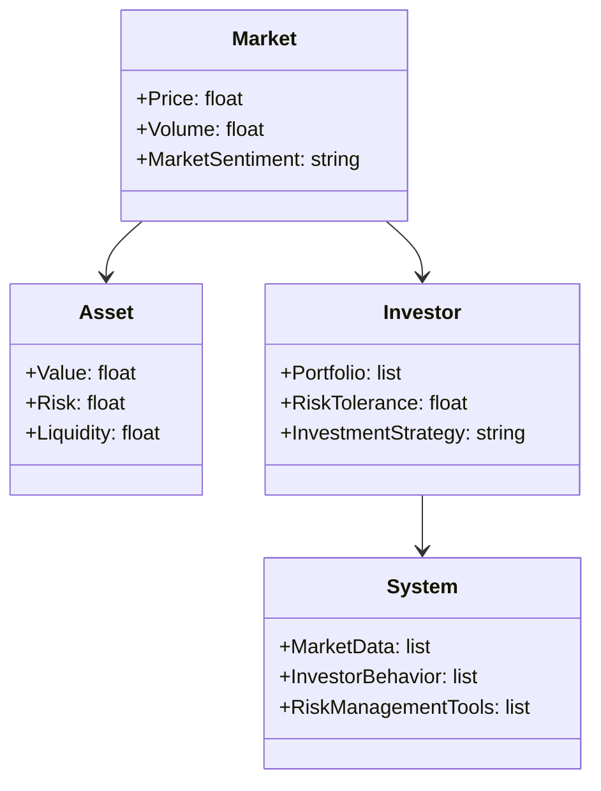

                 


# 巴菲特的市场泡沫识别：加密资产市场的理性分析

## 关键词：巴菲特，市场泡沫，加密资产，价值投资，风险管理

## 摘要：本文深入分析了巴菲特的投资理念，特别是他在识别市场泡沫方面的独特见解，并探讨了这些理论在加密资产市场的应用。通过结合加密资产的特点，本文为投资者提供了理性分析市场泡沫的方法，帮助他们在加密资产领域做出明智的投资决策。

---

# 巴菲特的市场泡沫识别：加密资产市场的理性分析

## # 引言

在金融市场中，识别市场泡沫是投资者面临的重大挑战。巴菲特作为价值投资的代表人物，以其独特的方法闻名。本文将探讨巴菲特的市场泡沫识别方法，并分析其在加密资产市场的应用。

## # 第一部分：巴菲特的投资理念与市场泡沫分析基础

### 第1章：巴菲特的价值投资理论

#### 1.1 巴菲特的投资理念概述

##### 1.1.1 价值投资的核心原则

价值投资强调购买被市场低估的资产，关注企业的内在价值。巴菲特认为，市场先生的情绪波动为理性投资者提供了机会。

##### 1.1.2 市场先生的概念

市场先生代表市场的波动性，投资者应利用市场的非理性来获利。

##### 1.1.3 长期投资与安全边际

长期投资强调时间的力量，而安全边际则通过购买低于内在价值的资产来降低风险。

#### 1.2 巴菲特的投资策略

##### 1.2.1 质量投资：寻找具有持续竞争优势的企业

巴菲� tư寻找具有强大护城河的企业，这些企业在长期竞争中占据优势。

##### 1.2.2 价值投资：寻找被市场低估的企业

通过分析企业的基本面，如市盈率和市净率，识别低估的投资标的。

##### 1.2.3 股息投资：稳定的收益来源

股息收入为投资者提供稳定的现金流，尤其是在市场波动期间。

#### 1.3 巴菲特对市场的看法

##### 1.3.1 市场的有效性与非有效性

巴菲捴认为市场长期有效，但短期内可能出现非理性波动。

##### 1.3.2 投资者情绪与市场波动

情绪驱动的市场波动为理性投资者提供了机会。

##### 1.3.3 长期趋势与周期性波动

识别长期趋势，避免被短期波动干扰。

### 第2章：市场泡沫的基本原理

#### 2.1 市场泡沫的定义与特征

市场泡沫是指资产价格远高于其内在价值的情况，通常由过度投机和市场情绪驱动。

#### 2.2 泡沫的驱动因素

##### 2.2.1 市场情绪的影响

投资者情绪的波动是泡沫形成的关键因素。

##### 2.2.2 资金流动性的作用

充裕的流动性可能推高资产价格，导致泡沫。

##### 2.2.3 媒体与舆论的推动

媒体报道和舆论影响投资者情绪，加剧泡沫的形成。

#### 2.3 泡沫破裂的后果

##### 2.3.1 资产价格的骤降

泡沫破裂导致资产价格急剧下跌，投资者损失惨重。

##### 2.3.2 经济的负面影响

泡沫破裂可能引发经济衰退，影响整体市场。

##### 2.3.3 投资者的教训

投资者需从中吸取教训，避免盲目跟风。

### 第3章：加密资产市场的特点与挑战

#### 3.1 加密资产市场的概述

加密资产市场具有去中心化、技术创新和高波动性的特点。

#### 3.2 加密资产市场的波动性

高波动性为投资者带来高风险和高回报的双重挑战。

#### 3.3 加密资产市场的技术驱动

技术创新推动行业发展，但也带来了不确定性和风险。

#### 3.4 加密资产市场的参与者

市场参与者包括机构投资者、散户和矿工，结构复杂。

#### 3.5 加密资产市场的监管不确定性

监管政策的变化对市场产生重大影响。

## # 第二部分：巴菲特的理论在加密资产市场的应用

### 第4章：巴菲特理论在加密资产中的应用

#### 4.1 加密资产的内在价值评估

##### 4.1.1 传统估值方法的适用性

传统的市盈率和市净率是否适用于加密资产？

##### 4.1.2 加密资产的独特性

加密资产的内在价值难以用传统方法评估，需考虑技术、网络效应和治理等因素。

#### 4.2 市场情绪的影响

##### 4.2.1 投资者情绪的驱动因素

加密资产市场受情绪影响较大，容易出现泡沫。

##### 4.2.2 市场情绪与价格的关系

情绪驱动价格波动，影响市场的理性判断。

#### 4.3 长期投资策略

##### 4.3.1 长期持有与市场周期

巴菲特的长期投资策略在加密资产中的应用。

##### 4.3.2 寻找具有持续竞争优势的项目

识别具备长期竞争优势的加密资产。

#### 4.4 安全边际的重要性

##### 4.4.1 安全边际的定义

购买价格低于内在价值，降低投资风险。

##### 4.4.2 安全边际的应用

在加密资产中，安全边际的计算更具挑战性，需综合考虑多种因素。

### 第5章：加密资产市场的风险管理

#### 5.1 风险管理的重要性

##### 5.1.1 风险管理的核心概念

识别、评估和控制风险，保护投资组合。

##### 5.1.2 风险管理的必要性

在高波动市场中，风险管理至关重要。

#### 5.2 加密市场的独特风险

##### 5.2.1 技术风险

技术漏洞或升级可能影响资产价值。

##### 5.2.2 市场风险

价格波动对投资者造成重大影响。

##### 5.2.3 监管风险

政策变化对市场产生深远影响。

#### 5.3 巴菲特的风险管理策略

##### 5.3.1 分散投资

通过多样化降低风险。

##### 5.3.2 保持流动性

确保在市场下跌时有能力调整投资组合。

##### 5.3.3 定期审查和调整

根据市场变化及时调整风险管理策略。

### 第6章：实际案例分析与策略制定

#### 6.1 加密资产泡沫的案例分析

##### 6.1.1 2017年的比特币泡沫

回顾2017年比特币价格的暴涨和暴跌，分析泡沫的形成和破裂过程。

##### 6.1.2 其他加密资产的泡沫案例

分析以太坊和其他加密资产的市场波动。

#### 6.2 泡沫识别的策略制定

##### 6.2.1 定量分析方法

使用数学模型评估资产的合理估值。

##### 6.2.2 定性分析方法

结合市场情绪、技术发展和监管环境进行综合判断。

### 第7章：风险管理工具与策略

#### 7.1 风险管理工具

##### 7.1.1 期货和期权

用于对冲价格波动风险。

##### 7.1.2 投保基金

通过分散投资降低风险。

##### 7.1.3 监管和合规工具

利用监管信息进行风险管理。

#### 7.2 风险管理策略

##### 7.2.1 仓位管理

合理分配投资比例，避免过度集中。

##### 7.2.2 逆向投资

在市场恐慌时寻找机会。

##### 7.2.3 风险评估与监控

定期评估投资组合的风险，并进行动态调整。

## # 第三部分：系统分析与架构设计方案

### 第8章：系统分析与架构设计方案

#### 8.1 问题场景介绍

##### 8.1.1 项目介绍

研究加密资产市场的泡沫识别方法。

##### 8.1.2 系统功能设计

设计一个框架，帮助投资者识别和管理市场泡沫。

#### 8.2 领域模型（领域模型Mermaid类图）



#### 8.3 系统架构设计（系统架构Mermaid架构图）


#### 8.4 系统接口设计

##### 8.4.1 接口描述

- 数据接口：从市场数据源获取实时数据。
- 用户接口：投资者与系统交互的界面。
- 风险管理接口：用于实施风险控制策略。

#### 8.5 系统交互（系统交互Mermaid序列图）

```mermaid
sequenceDiagram

投资者 -> 系统：提交投资请求
系统 -> 数据库：查询市场数据
数据库 -> 系统：返回市场数据
系统 -> 市场分析：评估风险
市场分析 -> 系统：返回风险评估结果
系统 -> 投资者：显示结果
```

## # 第四部分：项目实战

### 第9章：环境安装与核心实现

#### 9.1 环境安装

##### 9.1.1 安装Python和相关库

安装必要的Python库，如Pandas、Matplotlib、Scikit-learn。

##### 9.1.2 安装区块链分析工具

安装如BlockChain Explorer等工具。

#### 9.2 系统核心实现

##### 9.2.1 数据获取与处理

编写代码获取市场数据并进行清洗。

##### 9.2.2 数据分析与建模

使用机器学习模型预测市场趋势。

##### 9.2.3 风险管理模块

实现风险管理策略，如止损和止盈。

#### 9.3 代码实现

##### 9.3.1 数据处理代码

```python
import pandas as pd
import numpy as np

# 加载数据
data = pd.read_csv('market_data.csv')

# 数据清洗
data.dropna(inplace=True)
data['date'] = pd.to_datetime(data['date'])
data.set_index('date', inplace=True)
```

##### 9.3.2 价格预测模型

```python
from sklearn.linear_model import LinearRegression
from sklearn.metrics import mean_squared_error

# 训练模型
model = LinearRegression()
model.fit(X_train, y_train)

# 预测
y_pred = model.predict(X_test)
```

##### 9.3.3 风险管理策略

```python
def stop_loss(entry_price, current_price, stop_loss_percentage):
    stop_loss_price = entry_price * (1 - stop_loss_percentage/100)
    if current_price < stop_loss_price:
        return True
    return False

# 示例应用
entry_price = 100
current_price = 90
stop_loss_percentage = 5

if stop_loss(entry_price, current_price, stop_loss_percentage):
    print("触发止损")
else:
    print("继续持有")
```

### 第10章：案例分析与项目小结

#### 10.1 案例分析

##### 10.1.1 2017年比特币泡沫案例

分析比特币价格的波动，应用模型进行预测。

##### 10.1.2 以太坊的市场表现

评估以太坊的投资价值和风险。

#### 10.2 项目小结

##### 10.2.1 项目总结

总结项目的实现过程和取得的成果。

##### 10.2.2 经验教训

分享项目中的经验和教训。

##### 10.2.3 未来改进方向

提出未来可能的改进措施。

### 第11章：最佳实践 tips、小结、注意事项、拓展阅读

#### 11.1 最佳实践 tips

##### 11.1.1 风险管理

定期审查和调整投资组合，保持足够的流动性。

##### 11.1.2 逆向思维

在市场恐慌时寻找机会，避免随波逐流。

#### 11.2 小结

总结全文，强调理性分析的重要性。

#### 11.3 注意事项

提醒读者注意市场风险，谨慎投资。

#### 11.4 拓展阅读

推荐进一步阅读的书籍和资源。

## # 结论

通过巴菲特的市场泡沫识别方法，投资者可以在加密资产市场中做出更理性的决策。结合系统的分析和实战案例，本文为投资者提供了实用的策略和工具。

## # 附录

### 附录A：相关术语表

- 价值投资：寻找被低估的资产进行长期投资。
- 市场泡沫：资产价格远高于其内在价值的情况。
- 安全边际：购买价格低于内在价值，降低投资风险。

### 附录B：风险管理工具

- 期货和期权：用于对冲价格波动风险。
- 投保基金：分散投资降低风险。
- 监管和合规工具：利用监管信息进行风险管理。

### 附录C：数学公式

- 市盈率（P/E）= 股价 / 每股收益
- 市净率（P/B）= 股价 / 每股净资产
- 风险调整后收益（RAROC）= 净利润 / 平均风险加权资产

### 附录D：Python代码示例

```python
import pandas as pd
import numpy as np
from sklearn.linear_model import LinearRegression
from sklearn.metrics import mean_squared_error

# 数据加载与处理
data = pd.read_csv('market_data.csv')
data.dropna(inplace=True)
data['date'] = pd.to_datetime(data['date'])
data.set_index('date', inplace=True)

# 模型训练
X = data[['volume', 'market_sentiment']]
y = data['price']
X_train, X_test, y_train, y_test = train_test_split(X, y, test_size=0.2, random_state=42)

model = LinearRegression()
model.fit(X_train, y_train)
y_pred = model.predict(X_test)

# 模型评估
 mse = mean_squared_error(y_test, y_pred)
print(f"均方误差: {mse}")
```

## # 作者：AI天才研究院/AI Genius Institute & 禅与计算机程序设计艺术 /Zen And The Art of Computer Programming

---

# 结语

通过系统的分析和实践，本文为投资者提供了识别加密资产市场泡沫的实用方法。结合巴菲特的价值投资理念和现代技术工具，投资者可以做出更明智的决策。未来，随着市场的不断发展，这些方法将不断完善，为投资者提供更有力的支持。

