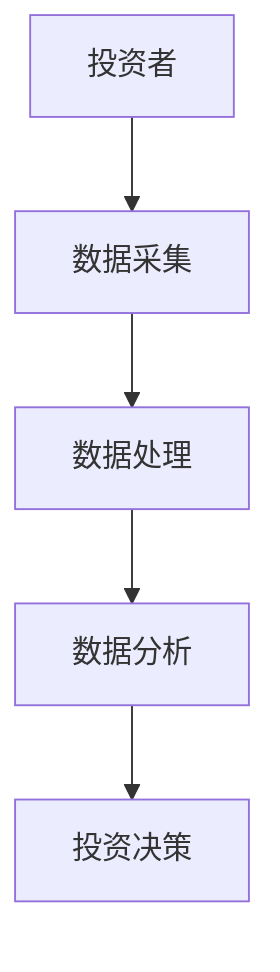
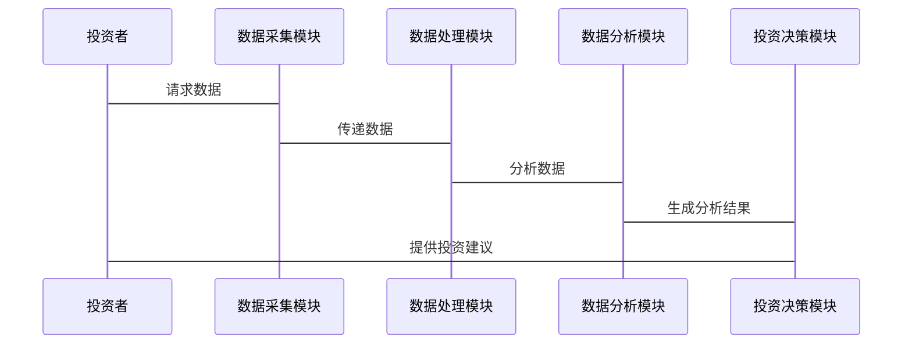

                 


# 巴菲特的年度股东信：投资智慧的精华总结

## 关键词：巴菲特，投资智慧，价值投资，财务报表分析，风险管理，长期投资

## 摘要：本文通过分析巴菲特的年度股东信，总结了他的投资理念、财务分析方法、风险管理策略以及长期投资的智慧。文章详细讲解了价值投资的核心原则、安全边际的概念、企业竞争优势的评估方法，以及如何在市场波动中保持投资纪律。通过实际案例分析和系统化的投资策略，本文为读者提供了如何将巴菲特的投资智慧应用于实际投资的指导。

---

# 第一部分：巴菲特投资智慧的背景与核心理念

## 第1章：巴菲特投资智慧的概述

### 1.1 投资的核心概念与问题背景

#### 1.1.1 投资的基本定义与问题背景
投资是通过将资金投入到能够产生收益的资产中，以实现财富增值的过程。投资的核心问题在于如何在不确定的市场中做出正确的决策，以获得超额收益。传统的投资方法往往依赖于市场预测和短期波动，而巴菲特的价值投资理念则提供了一种不同的视角。

#### 1.1.2 价值投资的起源与发展
价值投资起源于20世纪，由本杰明·格雷厄姆和戴维·多德共同提出，巴菲特是这一理念的继承者和发扬者。价值投资的核心在于寻找市场价格低于其内在价值的股票，通过长期持有优质企业来实现财富增长。

#### 1.1.3 巴菲特投资智慧的独特性
巴菲特的投资智慧的独特性在于他将价值投资的理念与实际操作相结合，通过对企业基本面的深入分析和长期持有优质企业，实现稳定的收益。他的投资理念强调安全边际、长期复利效应和风险管理。

### 1.2 巴菲特投资智慧的核心要素

#### 1.2.1 价值投资的定义与特征
- **定义**：价值投资是一种通过寻找市场价格低于内在价值的股票，长期持有的投资策略。
- **特征**：
  - 以企业基本面分析为基础。
  - 强调安全边际。
  - 长期持有，避免频繁交易。

#### 1.2.2 安全边际的概念与重要性
安全边际是指股票市场价格低于其内在价值的程度。通过购买具有足够安全边际的股票，投资者可以在市场波动中降低风险，确保长期收益。

#### 1.2.3 长期投资与复利效应
巴菲特强调长期投资的重要性，认为复利效应是投资收益的核心驱动力。通过长期持有优质企业，投资者可以最大化复利效应，实现财富的指数级增长。

---

## 第2章：巴菲特的投资理念与原则

### 2.1 价值投资的核心原则

#### 2.1.1 购买便宜的优秀企业而非便宜的股票
巴菲特的价值投资理念强调选择优质企业，而非仅仅寻找价格低廉的股票。优质企业具有强大的竞争优势、稳定的财务状况和良好的管理团队。

#### 2.1.2 长期持有优质企业的逻辑
长期持有的逻辑在于优质企业的内在价值随着时间的推移不断增长。通过长期持有，投资者可以避免短期市场波动的干扰，享受企业成长带来的收益。

#### 2.1.3 分散投资与集中投资的平衡
巴菲特的投资策略强调集中投资于少数优质企业，同时通过分散投资降低风险。他的投资组合通常集中在少数几家企业，但每家企业都具有强大的竞争优势和长期增长潜力。

### 2.2 财务报表分析与企业估值

#### 2.2.1 财务报表的基本构成与分析方法
财务报表是评估企业价值的重要工具。主要的财务报表包括资产负债表、利润表和现金流量表。通过分析这些报表，投资者可以了解企业的财务状况、盈利能力和现金流量。

#### 2.2.2 企业估值的常用指标与公式
- **市盈率（P/E）**：市盈率 = 股价 / 每股净利润。
- **市净率（P/B）**：市净率 = 股价 / 每股净资产。
- **股息率**：股息率 = 每股股息 / 股价。
- **内在价值**：内在价值 = 股东权益 + 长期债务 - 短期债务。

#### 2.2.3 巴菲特的估值模型与应用
巴菲特的估值模型强调对企业内在价值的评估，通过分析企业的盈利能力、竞争优势和财务状况，确定其内在价值。他通常选择那些市场价格低于内在价值的企业进行投资。

---

## 第3章：巴菲特的投资策略与风险管理

### 3.1 投资组合的构建与优化

#### 3.1.1 资产配置的基本原则与方法
- **资产配置**：根据投资者的风险承受能力和收益目标，合理分配资金在不同资产类别中的比例。
- **集中投资**：集中投资于少数优质企业，降低投资成本。
- **分散投资**：通过投资于不同行业的优质企业，降低投资风险。

#### 3.1.2 投资组合的风险与收益平衡
投资组合的风险与收益密切相关。通过合理的资产配置和分散投资，投资者可以在风险可控的前提下，实现收益最大化。

#### 3.1.3 巴菲特的分散投资策略
巴菲特的投资组合通常集中在少数几家企业，但每家企业都具有强大的竞争优势和长期增长潜力。这种集中投资策略可以通过分散投资于不同行业来降低风险。

### 3.2 风险管理与心理控制

#### 3.2.1 投资风险的来源与分类
- **市场风险**：市场波动导致的投资损失。
- **流动性风险**：无法在合理价格下快速变现的风险。
- **信用风险**：企业违约导致的投资损失。

#### 3.2.2 巴菲特的风险管理原则
- **安全边际**：通过购买市场价格低于内在价值的股票，降低投资风险。
- **长期持有**：避免短期市场波动的干扰。
- **分散投资**：通过投资于不同企业降低风险。

#### 3.2.3 投资者心理与决策偏差的控制
投资者的心理偏差是导致投资失败的主要原因之一。通过了解和控制心理偏差，投资者可以做出更理性的投资决策。

---

# 第二部分：巴菲特投资智慧的系统化分析

## 第4章：企业分析与竞争优势评估

### 4.1 企业基本面分析

#### 4.1.1 企业的核心竞争力分析
- **竞争优势**：企业相对于竞争对手的核心优势，包括成本优势、技术优势、品牌优势等。
- **管理层素质**：管理层的诚信、能力和决策能力是企业成功的关键因素。

#### 4.1.2 企业的财务健康状况评估
- **盈利能力**：通过分析利润表，评估企业的盈利能力。
- **财务杠杆**：通过分析资产负债表，评估企业的财务杠杆和偿债能力。
- **现金流**：通过分析现金流量表，评估企业的现金流健康状况。

#### 4.1.3 企业的市场地位与竞争优势
- **市场地位**：企业在市场中的地位，包括市场份额、品牌影响力等。
- **竞争优势**：企业的核心竞争优势，包括成本优势、技术优势、网络效应等。

### 4.2 投资组合的优化与调整

#### 4.2.1 投资组合的优化原则
- **分散投资**：通过投资于不同企业降低风险。
- **长期持有**：避免短期市场波动的干扰。
- **动态调整**：根据市场变化和企业基本面的变化，动态调整投资组合。

#### 4.2.2 投资组合的调整策略
- **定期评估**：定期评估投资组合的表现，确保符合投资目标。
- **动态再平衡**：根据市场变化和企业基本面的变化，动态调整投资组合的权重。

---

## 第5章：系统分析与架构设计

### 5.1 系统功能设计

#### 5.1.1 领域模型设计
- **核心实体**：投资者、企业、财务报表、投资组合。
- **核心关系**：投资者通过分析财务报表评估企业的内在价值，构建投资组合。

#### 5.1.2 系统功能模块
- **数据采集**：采集企业的财务报表和市场数据。
- **数据处理**：对数据进行清洗、转换和计算。
- **数据分析**：通过数据分析工具对企业进行估值和风险评估。
- **投资决策**：根据分析结果制定投资策略。

### 5.2 系统架构设计

#### 5.2.1 系统架构图


#### 5.2.2 系统接口设计
- **数据接口**：与财务数据源（如Yahoo Finance、Google Finance）对接，获取企业的财务报表和市场数据。
- **用户接口**：提供友好的用户界面，方便投资者进行数据查询、分析和投资决策。

#### 5.2.3 系统交互设计


---

## 第6章：项目实战

### 6.1 环境安装与配置

#### 6.1.1 数据源选择
- **Yahoo Finance**：获取企业的财务报表和市场数据。
- **Google Finance**：获取实时市场数据。

#### 6.1.2 工具安装
- **Python**：数据分析和编程工具。
- **Pandas**：数据处理库。
- **Matplotlib**：数据可视化库。

### 6.2 核心实现源代码

#### 6.2.1 数据获取与处理
```python
import pandas as pd
import requests

# 获取企业财务数据
def get_financial_data(ticker):
    url = f"https://query1.finance.yahoo.com/finance/quote/{ticker}/key-statistics"
    response = requests.get(url)
    data = response.json()
    financial_data = {
        ' ticker': ticker,
        'PE Ratio': data['PE Ratio'],
        'PB Ratio': data['PB Ratio'],
        'ROE': data['ROE']
    }
    return financial_data

# 处理数据
def process_data(data):
    df = pd.DataFrame(data)
    return df

# 示例：获取并处理苹果公司的财务数据
apple_data = get_financial_data('AAPL')
processed_data = process_data(apple_data)
print(processed_data)
```

#### 6.2.2 企业估值与风险评估
```python
import pandas as pd
import numpy as np

# 计算内在价值
def calculate_intrinsic_value(eps, growth_rate, required_return):
    return eps * (1 + growth_rate) / (required_return - growth_rate)

# 计算波动率
def calculate_volatility(prices):
    returns = np.log(prices.pct_change().dropna())
    volatility = returns.std() * 100
    return volatility

# 示例：计算苹果公司的内在价值和波动率
# 假设EPS为10，增长率5%，要求回报率为10%
intrinsic_value = calculate_intrinsic_value(10, 0.05, 0.10)
print(f"内在价值：{intrinsic_value}")
```

### 6.3 案例分析与详细解读

#### 6.3.1 案例选择
选择苹果公司（AAPL）和可口可乐公司（KO）作为案例，分析巴菲特的投资策略。

#### 6.3.2 数据分析与投资决策
- **苹果公司**：高成长性、高市盈率，适合长期持有。
- **可口可乐公司**：稳定收益、低市盈率，适合分散投资。

#### 6.3.3 投资组合优化
根据企业的基本面和市场数据，动态调整投资组合的权重，确保投资组合的收益与风险平衡。

---

## 第7章：总结与启示

### 7.1 投资智慧的总结
巴菲特的投资智慧的核心在于价值投资的理念，通过深入分析企业的基本面，选择具有强大竞争优势和长期增长潜力的优质企业，长期持有，实现财富的稳定增长。

### 7.2 对实际投资的启示
- **长期投资**：避免短期市场波动的干扰，长期持有优质企业。
- **价值投资**：选择市场价格低于内在价值的股票。
- **风险管理**：通过分散投资和安全边际控制投资风险。

### 7.3 最佳实践 Tips
- **持续学习**：不断学习和更新投资知识，适应市场变化。
- **独立思考**：避免盲目跟风，坚持独立思考和判断。
- **保持纪律**：严格按照投资计划执行，避免情绪化决策。

---

## 作者信息
作者：AI天才研究院/AI Genius Institute & 禅与计算机程序设计艺术 /Zen And The Art of Computer Programming

