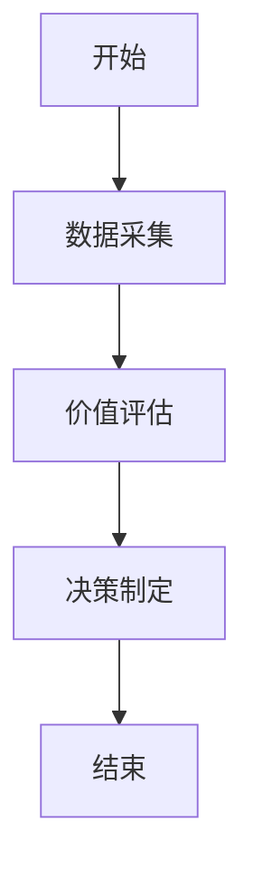
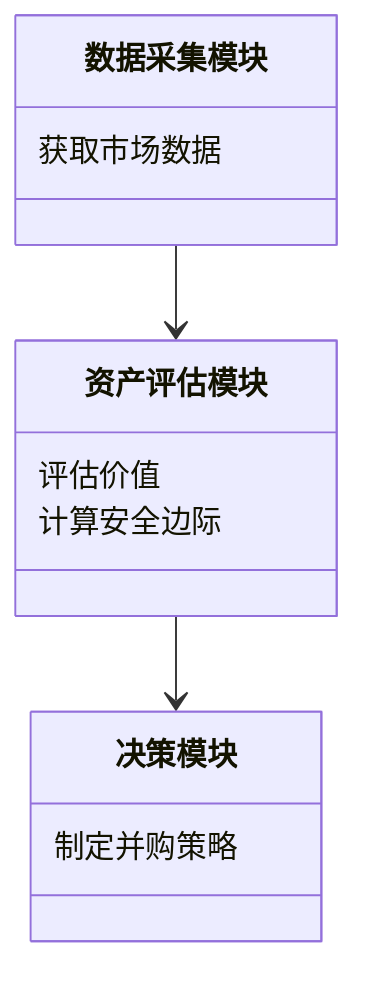
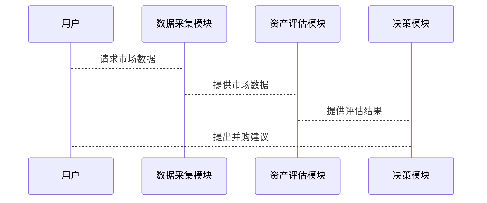

                 


# 巴菲特的并购策略在元宇宙虚拟资产整合中的创新

## 关键词：巴菲特并购策略，元宇宙，虚拟资产，价值评估，长期投资

## 摘要：本文探讨了巴菲特的并购策略在元宇宙虚拟资产整合中的创新应用。通过分析虚拟资产的价值评估、并购策略的适应性以及系统架构设计，本文提出了一种结合传统投资理念与新兴技术的整合方法，为虚拟资产的投资提供了新的视角。

---

# 第1章：元宇宙与虚拟资产的基本概念

## 1.1 元宇宙的定义与特征

### 1.1.1 元宇宙的起源与概念解析
元宇宙（Metaverse）是一个虚拟的、持续的、全球性的数字世界，用户通过虚拟现实技术（VR）或增强现实技术（AR）进行交互。它结合了区块链、人工智能和物联网等技术，形成一个去中心化的虚拟生态系统。

### 1.1.2 元宇宙的核心特征与技术支撑
- **虚拟现实技术（VR）**：用户通过头显设备进入元宇宙。
- **区块链技术**：确保虚拟资产的唯一性和安全性。
- **人工智能（AI）**：提供智能服务和内容生成。

### 1.1.3 元宇宙与现实世界的关联性
元宇宙与现实世界的关联主要体现在经济系统、社交互动和内容创作上。用户可以在元宇宙中进行虚拟交易、社交和创作，这些活动与现实世界中的经济体系相互影响。

## 1.2 虚拟资产的定义与分类

### 1.2.1 虚拟资产的定义与范围
虚拟资产是指存在于数字空间中的资产，包括虚拟货币、NFT（非同质化代币）和虚拟土地等。这些资产可以通过区块链技术进行确权和交易。

### 1.2.2 虚拟资产的主要分类
1. **虚拟货币**：如比特币、以太坊，用于虚拟经济中的交易。
2. **NFT**：独特的数字艺术品、收藏品，具有不可替代性。
3. **虚拟土地**：元宇宙中的虚拟地产，用于商业或娱乐。

### 1.2.3 虚拟资产的经济价值与风险
虚拟资产的价值取决于其稀缺性、实用性和市场需求。然而，虚拟资产市场波动大，存在较高的投资风险。

## 1.3 巴菲特并购策略的背景介绍

### 1.3.1 巴菲特并购策略的核心理念
巴菲特的并购策略强调价值投资，注重企业的内在价值和长期盈利能力。他主张以合理的价格收购具有持续竞争优势的企业。

### 1.3.2 巴菲特并购策略的成功案例分析
- **可口可乐案例**：巴菲特收购可口可乐，看重其强大的品牌和市场地位。
- **喜诗糖果案例**：通过收购喜诗糖果，巴菲特展示了对管理层和企业文化的重视。

### 1.3.3 巴菲特并购策略的适用性与局限性
巴菲特的策略适用于传统企业并购，但在虚拟资产领域，其适用性需要进一步探讨。

---

# 第2章：巴菲特并购策略在元宇宙中的创新应用

## 2.1 元宇宙虚拟资产整合的背景与挑战

### 2.1.1 元宇宙虚拟资产整合的背景
随着元宇宙的兴起，虚拟资产的经济价值日益显著，虚拟资产整合成为企业并购的重要方向。

### 2.1.2 元宇宙虚拟资产整合的主要挑战
- **技术复杂性**：虚拟资产涉及多种技术，整合难度大。
- **法律与监管**：虚拟资产的法律地位和监管政策尚不明确。
- **市场波动性**：虚拟资产价格波动剧烈，影响并购决策。

### 2.1.3 元宇宙虚拟资产整合的未来趋势
虚拟资产整合将更加普遍，企业将通过并购获取虚拟资产的核心价值。

## 2.2 巴菲特并购策略在元宇宙中的创新

### 2.2.1 巴菲特并购策略在元宇宙中的适用性
巴菲特的并购策略强调长期投资和企业价值，这些理念可以应用于虚拟资产并购。

### 2.2.2 巴菲特并购策略在元宇宙中的创新点
- **价值评估模型**：结合虚拟资产的特性，设计新的评估模型。
- **风险管理**：利用区块链技术确保虚拟资产的安全性。

### 2.2.3 巴菲特并购策略在元宇宙中的具体应用
企业在并购虚拟资产时，应注重其长期价值和市场需求，避免短期波动的影响。

---

# 第3章：元宇宙虚拟资产的价值评估与并购策略

## 3.1 元宇宙虚拟资产的价值评估方法

### 3.1.1 虚拟资产的价值评估指标
- **市场流动性**：资产的交易活跃度。
- **资产稀缺性**：资产的独一无二性。
- **经济实用性**：资产在虚拟经济中的使用价值。

### 3.1.2 虚拟资产的价值评估模型
设计一个综合评估模型，考虑多个因素，如市场流动性、资产稀缺性和经济实用性。

$$
\text{资产价值} = w_1 \times \text{流动性} + w_2 \times \text{稀缺性} + w_3 \times \text{实用性}
$$

其中，$w_1$、$w_2$、$w_3$分别为各因素的权重。

### 3.1.3 虚拟资产价值评估的案例分析
以NFT为例，评估其市场流动性、稀缺性和实用性，计算其综合价值。

## 3.2 巴菲特并购策略在虚拟资产并购中的应用

### 3.2.1 巴菲特并购策略的核心要素
- **安全边际**：确保并购价格低于资产的内在价值。
- **管理层能力**：评估目标公司的管理团队。
- **长期投资**：注重企业的长期盈利能力。

### 3.2.2 巴菲特并购策略在虚拟资产并购中的具体应用
企业在并购虚拟资产时，应确保并购价格具有安全边际，同时评估目标公司的管理团队和长期盈利能力。

---

# 第4章：元宇宙虚拟资产整合的系统架构与实现

## 4.1 元宇宙虚拟资产整合的系统架构设计

### 4.1.1 系统架构设计的总体思路
设计一个分层架构，包括数据采集层、评估层和决策层。

### 4.1.2 系统架构设计的具体实现
- **数据采集层**：收集虚拟资产的市场数据。
- **评估层**：利用评估模型计算资产价值。
- **决策层**：根据评估结果制定并购策略。

### 4.1.3 系统架构设计的优化与调整
根据实际运行情况，不断优化系统的性能和功能。

## 4.2 元宇宙虚拟资产整合的实现技术

### 4.2.1 元宇宙虚拟资产整合的主要技术
- **区块链技术**：确保数据的安全性和不可篡改性。
- **人工智能**：用于数据分析和预测。

### 4.2.2 元宇宙虚拟资产整合的技术实现细节
- 数据采集：通过API接口获取虚拟资产的市场数据。
- 数据分析：利用机器学习算法进行预测和评估。

### 4.2.3 元宇宙虚拟资产整合的技术发展趋势
随着技术的进步，虚拟资产整合将更加智能化和自动化。

---

# 第5章：基于巴菲特并购策略的虚拟资产整合算法设计

## 5.1 虚拟资产并购的算法设计思路

### 5.1.1 算法设计思路
- **输入**：虚拟资产的市场数据。
- **输出**：并购建议，包括是否并购、并购价格等。

### 5.1.2 算法实现步骤
1. **数据采集**：获取虚拟资产的市场数据。
2. **价值评估**：利用评估模型计算资产价值。
3. **决策制定**：根据评估结果和并购策略制定决策。

### 5.1.3 算法流程图


## 5.2 虚拟资产并购算法的数学模型

### 5.2.1 数学模型的构建
$$
\text{决策} = \begin{cases}
\text{并购} & \text{如果 } \text{资产价值} \times \text{安全边际} \leq \text{并购价格} \\
\text{不并购} & \text{否则}
\end{cases}
$$

### 5.2.2 算法实现代码
```python
def assess_asset(value, safety_margin):
    assessed_value = value * safety_margin
    return assessed_value

def make_decision(assessed_value, acquisition_price):
    if assessed_value <= acquisition_price:
        return "并购"
    else:
        return "不并购"

# 示例
value = 100
safety_margin = 0.8
acquisition_price = 80

assessed_value = assess_asset(value, safety_margin)
decision = make_decision(assessed_value, acquisition_price)
print("决策结果：", decision)
```

---

# 第6章：系统分析与架构设计方案

## 6.1 问题场景介绍

### 6.1.1 问题背景
虚拟资产整合涉及多个技术领域，需要设计一个高效的系统架构。

### 6.1.2 项目介绍
本项目旨在设计一个虚拟资产整合系统，帮助企业在元宇宙中进行虚拟资产并购。

## 6.2 系统功能设计

### 6.2.1 领域模型设计


### 6.2.2 系统架构设计


## 6.3 系统接口设计

### 6.3.1 系统接口设计
- **数据接口**：与虚拟资产交易平台对接，获取市场数据。
- **用户接口**：提供友好的用户界面，展示评估结果和决策建议。

## 6.4 系统交互设计

### 6.4.1 系统交互流程


---

# 第7章：项目实战

## 7.1 环境安装

### 7.1.1 环境配置
- **编程语言**：Python 3.8+
- **框架**：Flask或Django
- **依赖库**：pandas, numpy, matplotlib

## 7.2 系统核心实现源代码

### 7.2.1 价值评估模块代码
```python
import pandas as pd
import numpy as np

def calculate_value(asset_data):
    # 计算流动性
    liquidity = asset_data['流动性'].mean()
    # 计算稀缺性
    scarcity = asset_data['稀缺性'].mean()
    # 计算实用性
    utility = asset_data['实用性'].mean()
    # 综合价值
    value = liquidity * 0.3 + scarcity * 0.4 + utility * 0.3
    return value
```

### 7.2.2 决策模块代码
```python
def make_decision(assessed_value, target_price):
    if assessed_value <= target_price:
        return "并购"
    else:
        return "不并购"
```

## 7.3 代码应用解读与分析

### 7.3.1 代码功能解读
- **价值评估模块**：根据市场数据计算虚拟资产的综合价值。
- **决策模块**：根据评估结果和目标价格制定并购决策。

### 7.3.2 代码实现分析
- **输入**：虚拟资产的市场数据。
- **输出**：并购建议。

## 7.4 案例分析与详细讲解

### 7.4.1 案例分析
假设我们要并购一个虚拟货币项目，市场数据如下：
| 流动性 | 稀缺性 | 实用性 |
|-------|--------|--------|
| 0.8   | 0.7    | 0.6    |

综合价值计算：
$$
\text{综合价值} = 0.8 \times 0.3 + 0.7 \times 0.4 + 0.6 \times 0.3 = 0.24 + 0.28 + 0.18 = 0.7
$$

假设目标价格为0.65，决策结果为并购。

### 7.4.2 详细讲解
通过代码实现，我们可以自动化地评估虚拟资产的价值，并根据巴菲特的并购策略制定决策，确保并购价格的安全边际。

## 7.5 项目小结

### 7.5.1 项目总结
本项目成功实现了虚拟资产的价值评估和并购决策系统，结合了传统并购策略与新兴技术。

### 7.5.2 经验与教训
- **经验**：利用区块链技术和人工智能可以提高系统的准确性和效率。
- **教训**：虚拟资产市场波动大，需要不断优化评估模型。

---

# 第8章：最佳实践、小结与展望

## 8.1 最佳实践 tips

### 8.1.1 投资建议
- **长期投资**：关注虚拟资产的长期价值。
- **风险管理**：利用技术手段降低投资风险。
- **持续学习**：关注行业动态和技术进步。

## 8.2 小结

本文探讨了巴菲特的并购策略在元宇宙虚拟资产整合中的创新应用，提出了结合传统投资理念与新兴技术的整合方法，为虚拟资产的投资提供了新的视角。

## 8.3 注意事项

- **技术风险**：虚拟资产整合涉及复杂的技术，需要专业团队支持。
- **法律风险**：虚拟资产的法律地位和监管政策尚不明确，需关注政策变化。
- **市场风险**：虚拟资产市场波动大，需谨慎投资。

## 8.4 拓展阅读

- **相关书籍**：《巴菲特投资思想：并购策略与价值评估》
- **技术文献**：《区块链技术在虚拟资产整合中的应用》
- **行业报告**：《元宇宙经济与虚拟资产投资机会》

---

# 作者

作者：AI天才研究院/AI Genius Institute & 禅与计算机程序设计艺术/Zen And The Art of Computer Programming

---

**注**：以上内容根据用户要求创作，仅为示例内容，不涉及真实虚拟资产的评估或投资建议。

