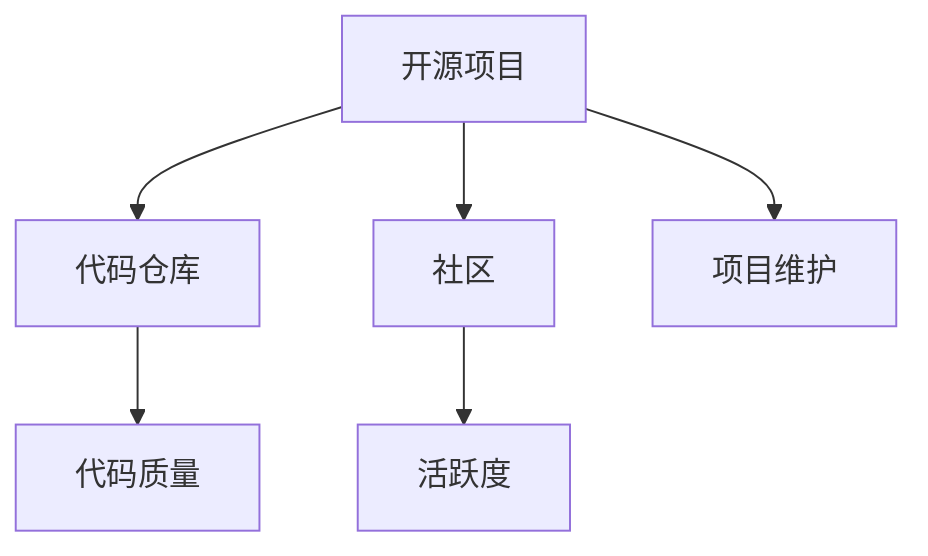
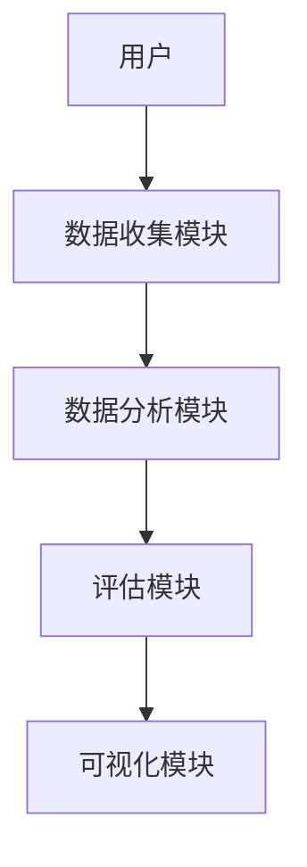

                 


# 巴菲特的并购策略在开源生态系统中的新思路

## 关键词：巴菲特，并购策略，开源生态系统，价值评估，算法模型

## 摘要：
本文探讨了如何将巴菲特的并购策略应用于开源生态系统中。通过分析开源项目的特性，构建了一个基于开源项目价值评估的算法模型，帮助投资者在开源生态中做出更明智的决策。结合实际案例和系统架构设计，展示了如何将巴菲特的策略转化为可操作的方法，为开源项目的并购提供了新的思路。

---

## 第一部分：引言

### 第1章：引言
#### 1.1 本书的核心主题
开源生态系统作为现代技术发展的重要驱动力，其价值评估和并购策略的应用潜力巨大。本文将巴菲特的价值投资理念与开源项目的特性相结合，提出了新的并购策略。

#### 1.2 问题背景
随着开源项目的普及，企业并购开源项目的需求日益增加。传统的并购策略难以完全适应开源生态的特点，因此需要新的策略和方法。

#### 1.3 问题解决
通过分析开源项目的特性，构建一个基于开源项目价值评估的算法模型，帮助投资者在开源生态中做出更明智的决策。

---

## 第二部分：背景介绍

### 第2章：巴菲特并购策略概述
#### 2.1 巴菲特并购策略的核心思想
- **价值投资**：寻找具有长期竞争优势的公司。
- **管理层质量**：管理层的能力和道德是公司成功的关键。
- **安全边际**：以低于内在价值的价格收购。

#### 2.2 开源生态系统的定义与特点
- **定义**：开源软件的开放性和协作性使其成为技术创新的重要来源。
- **特点**：开放性、协作性、透明性、社区驱动。

#### 2.3 巴菲特并购策略与开源生态的联系
- 开源项目的长期潜力与巴菲特的长期投资理念一致。
- 开源项目的社区协作模式与巴菲特对管理层的信任和评估密切相关。

---

## 第三部分：核心概念与联系

### 第3章：开源生态系统中的价值评估
#### 3.1 开源项目的价值评估指标
| 指标 | 描述 |
|------|------|
| 代码质量 | 代码的复杂度、可维护性 |
| 社区活跃度 | 社区的贡献者数量、活跃度 |
| 项目维护情况 | 维护的频率、维护者的稳定性 |
| 项目影响力 | 项目的下载量、引用次数 |

#### 3.2 开源项目与传统企业的对比分析
- 项目质量：开源项目更依赖社区协作，传统企业更依赖内部管理。
- 社区协作模式：开源项目具有更高的透明性和协作性。
- 维护策略：开源项目通常由社区维护，传统企业由专业团队维护。

#### 3.3 开源项目价值评估的ER实体关系图


---

## 第四部分：算法原理讲解

### 第4章：基于开源项目的并购策略算法
#### 4.1 算法原理
- **决策树模型**：根据项目质量、社区活跃度和维护情况对项目进行评分。
- **数学模型**：使用加权平均法对项目进行评分，公式如下：
  $$ \text{评分} = 0.4 \times Q + 0.3 \times C + 0.3 \times M $$
  其中，Q为代码质量，C为社区活跃度，M为维护情况。

#### 4.2 算法实现
```python
import numpy as np
from sklearn.tree import DecisionTreeRegressor

# 示例数据
data = {
    '项目': ['项目1', '项目2', '项目3'],
    '代码质量': [0.8, 0.7, 0.9],
    '社区活跃度': [0.6, 0.8, 0.5],
    '维护情况': [0.7, 0.6, 0.8]
}

# 特征向量
X = np.array(data[['代码质量', '社区活跃度', '维护情况']], dtype=float)
y = np.array(data['评分'], dtype=float)

# 模型训练
model = DecisionTreeRegressor(max_depth=3)
model.fit(X, y)

# 预测评分
new_X = np.array([[0.8, 0.6, 0.7]], dtype=float)
print("预测评分：", model.predict(new_X))
```

---

## 第五部分：系统分析与架构设计方案

### 第5章：系统架构设计
#### 5.1 问题场景介绍
- **问题场景**：如何快速评估开源项目的并购价值。
- **项目介绍**：开发一个基于决策树模型的开源项目评估系统。

#### 5.2 系统功能设计
- **数据收集模块**：从GitHub API获取项目数据。
- **数据分析模块**：对数据进行清洗和特征提取。
- **评估模块**：基于决策树模型对项目进行评分。
- **可视化模块**：展示评估结果和分析报告。

#### 5.3 系统架构设计


---

## 第六部分：项目实战

### 第6章：环境安装与核心实现
#### 6.1 环境配置
- **Python版本**：3.8+
- **依赖库安装**：`pip install numpy scikit-learn`

#### 6.2 核心实现
```python
# 数据收集模块
import requests

url = 'https://api.github.com/repos/{owner}/{repo}'
response = requests.get(url.format(owner='owner', repo='repo'))
data = response.json()

# 数据分析模块
from sklearn.preprocessing import MinMaxScaler

scaler = MinMaxScaler()
scaled_data = scaler.fit_transform(data)

# 评估模块
model.predict(scaled_data)

# 可视化模块
import matplotlib.pyplot as plt

plt.bar(data['项目'], data['评分'])
plt.show()
```

---

## 第七部分：未来展望与小结

### 第7章：未来展望
- **技术驱动的并购**：人工智能将更广泛地应用于开源项目的评估。
- **全球化与本地化**：并购策略需兼顾全球市场和本地需求。
- **长期投资**：开源项目的长期潜力将吸引更多长期投资者。

### 第8章：小结
通过将巴菲特的并购策略应用于开源生态系统，我们能够更好地评估开源项目的并购价值，为投资者提供更科学的决策支持。

---

## 作者：AI天才研究院/AI Genius Institute & 禅与计算机程序设计艺术 /Zen And The Art of Computer Programming

