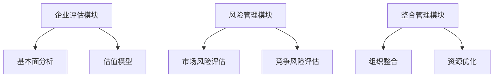
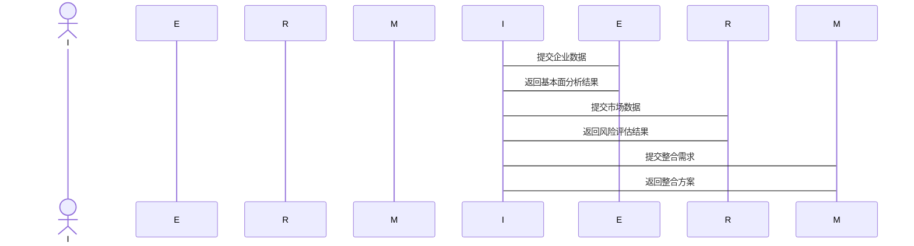

                 

# 巴菲特的并购策略在科技独角兽中的新思路

## 关键词：
- 巴菲特并购策略
- 科技独角兽
- 企业估值
- 风险控制
- 长期投资

## 摘要：
本文探讨了巴菲特的并购策略在科技独角兽企业中的应用，分析了科技独角兽企业的特点及其与传统企业的区别，详细阐述了如何将巴菲特的核心思想应用于科技独角兽的并购过程中，并通过实际案例分析，总结了成功的经验与教训，为读者提供了系统的指导和实践建议。

---

# 第1章: 引言

## 1.1 本书的背景与意义
### 1.1.1 巴菲特并购策略的核心思想
巴菲特的并购策略以基本面分析为核心，注重企业内在价值和长期股东利益的最大化。他倾向于选择具有强大竞争优势、良好管理团队和合理估值的企业，并通过长期持有实现资本增值。

### 1.1.2 科技独角兽企业的特点与挑战
科技独角兽企业通常具有高成长性、创新能力强和市场潜力大等特点。然而，这类企业也面临着高风险、高不确定性和复杂的估值问题。

### 1.1.3 两者的结合：并购策略的新思路
随着科技独角兽企业的崛起，传统的并购策略需要不断创新以适应新的市场环境。本文旨在探讨如何将巴菲特的核心思想与科技独角兽的特点相结合，提出新的并购策略。

## 1.2 本书的结构与内容
### 1.2.1 各章节的主要内容概述
- 第1章：引言，介绍本书的背景、意义和结构。
- 第2章：巴菲特并购策略的背景与核心思想。
- 第3章：科技独角兽企业的特点与挑战。
- 第4章：巴菲特并购策略在科技独角兽中的应用。
- 第5章：系统分析与架构设计方案。
- 第6章：实际案例分析与经验总结。
- 第7章：并购实战指南与成功关键点。
- 第8章：总结与展望。

### 1.2.2 读者对象与预期收获
本书适合投资领域的从业者、科技企业的高管以及对并购策略感兴趣的研究者阅读。读者将从本书中获得对科技独角兽企业和并购策略的深刻理解，掌握如何将两者结合的实战方法。

### 1.2.3 本书的创新点与价值
本文将巴菲特的经典并购策略与科技独角兽企业的特点相结合，提出了新的并购思路，并通过实际案例分析和系统设计，为读者提供了理论与实践的双重指导。

## 1.3 本章小结
本文通过介绍巴菲特并购策略的核心思想和科技独角兽企业的特点，探讨了两者的结合，为后续章节的深入分析奠定了基础。

---

# 第2章: 巴菲特并购策略的背景与核心思想

## 2.1 巴菲特投资理念的形成
### 2.1.1 巴菲特的价值投资理论
巴菲特的价值投资理论强调买入低于内在价值的股票，并长期持有。他认为市场先生是理性的，内在价值是企业未来现金流的现值。

### 2.1.2 巴菲特并购策略的核心要素
- **基本面分析**：关注企业的盈利能力、财务状况和管理团队。
- **长期投资**：注重企业的持续价值创造能力。
- **合理估值**：确保并购价格低于企业内在价值。

### 2.1.3 巴菲特并购策略的成功案例分析
以可口可乐和吉列公司为例，巴菲特通过长期持有实现资本增值，展现了其并购策略的成功。

## 2.2 巴菲特并购策略的关键特点
### 2.2.1 企业基本面分析的重要性
巴菲特认为，企业的内在价值是并购的核心考量。他通过分析企业的财务报表和行业地位来评估其潜力。

### 2.2.2 股东价值最大化的目标
巴菲特的并购策略以股东价值最大化为目标，注重企业的长期盈利能力。

### 2.2.3 长期投资与价值创造的结合
巴菲特倾向于长期投资，通过持有优质资产实现资本增值。

## 2.3 巴菲特并购策略的边界与外延
### 2.3.1 并购策略的适用范围
巴菲特的策略适用于具有稳定现金流和强大竞争优势的企业。

### 2.3.2 并购策略的局限性
- **高估值风险**：市场泡沫可能导致并购价格过高。
- **行业局限性**：策略更适用于传统行业，科技行业具有更高的不确定性和风险。

### 2.3.3 并购策略与其他投资策略的对比
巴菲特的策略强调长期投资和价值创造，与其他短期交易策略形成对比。

## 2.4 本章小结
本章通过分析巴菲特并购策略的核心思想和关键特点，为后续章节的分析奠定了基础。

---

# 第3章: 科技独角兽企业的特点与挑战

## 3.1 科技独角兽企业的定义与特征
### 3.1.1 科技独角兽的定义
科技独角兽指成立时间较短、估值超过10亿美元的科技企业。

### 3.1.2 科技独角兽的核心特征
- **高成长性**：年增长率超过100%。
- **创新能力强**：技术领先，产品迭代快。
- **市场潜力大**：目标市场广阔，具有成为行业领导者的潜力。

### 3.1.3 科技独角兽与传统企业的对比
| 特性                | 科技独角兽             | 传统企业             |
|---------------------|-----------------------|----------------------|
| 成长性              | 高                   | 低                   |
| 创新能力            | 强                   | 弱                   |
| 风险                | 高                   | 低                   |
| 估值方式            | 复杂                 | 简单                 |

## 3.2 科技独角兽企业的优势与劣势
### 3.2.1 优势：高成长性与创新能力强
科技独角兽通常具有快速扩张和技术创新的能力，能够在短时间内实现爆发式增长。

### 3.2.2 劣势：高风险与不确定性
科技独角兽面临技术迭代快、市场竞争激烈和政策变化等多重风险。

### 3.2.3 优势与劣势的平衡点
通过合理的风险管理策略和长期投资，可以平衡科技独角兽的优势与劣势。

## 3.3 科技独角兽企业的评估标准
### 3.3.1 企业估值方法
- **DCF模型**：通过未来现金流的现值计算企业估值。
- **可比公司法**：通过与同类企业的比较进行估值。

### 3.3.2 企业成长性评估
- **收入增长率**：反映企业的市场扩展能力。
- **净利润率**：衡量企业的盈利能力。

### 3.3.3 企业风险控制
- **市场风险**：评估企业所处行业的波动性。
- **竞争风险**：分析企业的竞争优势和市场地位。

## 3.4 本章小结
本章通过分析科技独角兽企业的特点和评估标准，为后续章节的并购策略分析奠定了基础。

---

# 第4章: 巴菲特并购策略在科技独角兽中的应用

## 4.1 巴菲特并购策略与科技独角兽的结合
### 4.1.1 并购策略的核心要素
- **基本面分析**：评估企业的财务状况和管理团队。
- **长期投资**：关注企业的持续增长潜力。
- **合理估值**：确保并购价格低于企业内在价值。

### 4.1.2 科技独角兽的特点
- **高成长性**：企业具有快速扩张的潜力。
- **创新能力强**：技术领先，产品迭代快。
- **高风险**：市场波动大，竞争激烈。

### 4.1.3 并购策略的应用场景
- **早期投资**：通过并购初创企业，获取技术优势。
- **战略整合**：通过并购实现资源互补和市场扩展。

## 4.2 巴菲特并购策略在科技独角兽中的创新点
### 4.2.1 创新点：动态评估与风险管理
科技独角兽的高成长性和高风险要求并购方具备动态评估和风险管理能力。

### 4.2.2 创新点：长期投资与快速迭代
通过长期投资和快速迭代，实现企业的持续增长和价值创造。

### 4.2.3 创新点：技术驱动与市场潜力
科技独角兽的核心竞争力在于技术创新和市场潜力，这为并购方提供了新的价值评估维度。

## 4.3 并购策略的具体实施步骤
### 4.3.1 企业基本面分析
- **财务状况**：分析企业的收入、利润和现金流。
- **管理团队**：评估团队的背景和能力。
- **市场地位**：分析企业的市场份额和竞争对手。

### 4.3.2 企业估值
- **DCF模型**：计算企业的未来现金流现值。
- **可比公司法**：与同类企业进行比较。

### 4.3.3 并购后的整合与管理
- **组织整合**：确保并购后的企业文化和管理风格一致。
- **资源优化**：整合双方的资源，提高运营效率。

## 4.4 本章小结
本章通过分析巴菲特并购策略在科技独角兽中的应用，提出了新的实施思路和方法。

---

# 第5章: 系统分析与架构设计方案

## 5.1 系统分析
### 5.1.1 问题场景介绍
科技独角兽的并购涉及到企业估值、风险管理、整合等多个方面。

### 5.1.2 系统功能设计
- **企业评估模块**：包括基本面分析和估值模型。
- **风险管理模块**：包括市场风险和竞争风险评估。
- **整合管理模块**：包括组织整合和资源优化。

### 5.1.3 系统架构设计
使用mermaid绘制系统架构图：

### 5.1.4 系统接口设计
- **企业评估接口**：与财务系统和市场数据源对接。
- **风险管理接口**：与市场监测系统和竞争对手分析系统对接。
- **整合管理接口**：与企业组织架构和资源管理系统对接。

## 5.2 系统交互设计
使用mermaid绘制序列图：

## 5.3 本章小结
本章通过系统分析和架构设计，为科技独角兽的并购提供了技术支持。

---

# 第6章: 实际案例分析与经验总结

## 6.1 案例分析：科技独角兽并购案
### 6.1.1 案例背景
以某科技独角兽企业为例，分析其并购过程中的关键决策。

### 6.1.2 并购策略的应用
- **基本面分析**：评估企业的财务状况和管理团队。
- **估值模型**：使用DCF模型计算企业价值。
- **风险管理**：分析市场风险和竞争风险。

### 6.1.3 经验总结
- **动态评估**：科技独角兽的高成长性和高风险要求并购方具备动态评估能力。
- **长期投资**：通过长期持有实现资本增值。
- **资源整合**：并购后的整合与管理是成功的关键。

## 6.2 本章小结
本章通过实际案例分析，总结了巴菲特并购策略在科技独角兽中的应用经验。

---

# 第7章: 并购实战指南与成功关键点

## 7.1 并购实战指南
### 7.1.1 制定并购策略
- **目标选择**：选择具有高成长性和竞争优势的科技独角兽。
- **估值模型**：使用DCF模型和可比公司法进行估值。
- **风险管理**：制定风险应对策略。

### 7.1.2 实施并购步骤
- **尽职调查**：全面评估企业的财务状况和管理团队。
- **并购谈判**：与企业股东和管理层进行谈判。
- **并购后整合**：制定整合方案，优化资源配置。

## 7.2 成功关键点
### 7.2.1 长期投资与价值创造
通过长期持有实现资本增值。
### 7.2.2 风险管理与动态评估
建立动态评估机制，及时应对市场变化。
### 7.2.3 资源整合与组织优化
并购后的资源整合和组织优化是成功的关键。

## 7.3 本章小结
本章通过并购实战指南和成功关键点，为读者提供了系统的指导。

---

# 第8章: 总结与展望

## 8.1 总结
本文探讨了巴菲特并购策略在科技独角兽中的应用，提出了新的并购思路和方法，并通过实际案例分析和系统设计，为读者提供了理论与实践的双重指导。

## 8.2 展望
随着科技独角兽企业的崛起，未来的并购策略将更加注重创新和风险管理。建议投资者和企业高管继续关注科技独角兽的发展，灵活调整并购策略，以应对不断变化的市场环境。

---

# 作者：AI天才研究院/AI Genius Institute & 禅与计算机程序设计艺术 /Zen And The Art of Computer Programming

---

**感谢您的阅读！**

