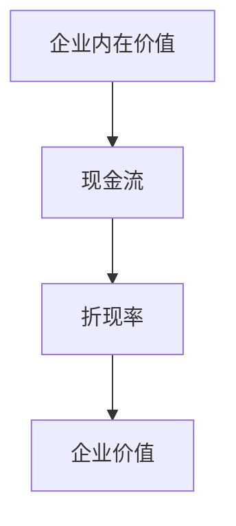
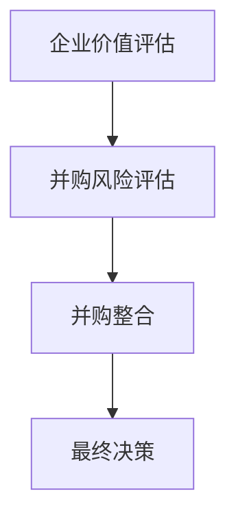
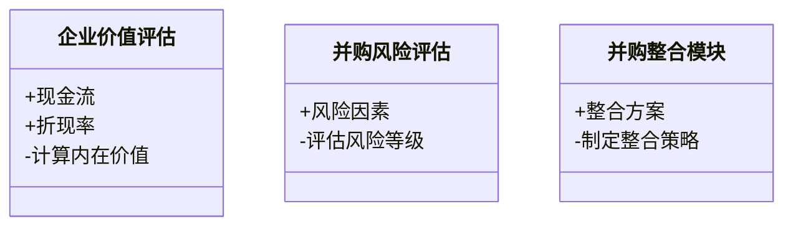

                 


# 巴菲特的并购艺术：在全球化背景下的新策略

## 关键词：巴菲特、并购艺术、全球化、投资策略、风险管理、价值评估、长期投资

## 摘要：本文探讨了巴菲特的并购艺术及其在全球化背景下的演变，分析了他的投资策略、数学模型和系统架构，并通过实际案例展示了如何应用这些方法。

---

# 第1章 巴菲特的并购艺术概述

## 1.1 巴菲特并购艺术的核心理念

### 1.1.1 巴菲特的投资哲学

巴菲特的投资哲学以价值投资为核心，强调寻找具有持续竞争优势和良好治理的企业。他相信市场的短期波动性，但长期来看，企业内在价值将决定股价。这种哲学使他在并购中注重企业的基本面分析。

### 1.1.2 巴菲特并购策略的独特性

巴菲特的并购策略独特之处在于他不仅关注企业的财务表现，还关注企业的管理和文化因素。他倾向于长期投资，避免短期市场波动的影响，寻找那些能够在经济周期中稳定增长的企业。

### 1.1.3 巴菲特并购艺术的演变

随着全球化的深入，巴菲特的并购策略也在不断演变。他开始更多地关注跨国并购，利用全球市场的机会，同时保持其核心的投资原则。

## 1.2 巴菲特并购策略的核心要素

### 1.2.1 企业内在价值的评估

巴菲特认为企业内在价值是其未来现金流的现值。他使用DCF模型来评估企业的价值，考虑折现率、增长率等因素。

### 1.2.2 安全边际的概念

安全边际是指企业实际价值与其市场价值之间的差距。巴菲特强调在价格低于内在价值时进行投资，以降低风险。

### 1.2.3 股东长期利益的保护

巴菲特注重股东的长期利益，避免短期利润的诱惑，选择那些能够为股东创造长期价值的企业。

## 1.3 巴菲特并购案例分析

### 1.3.1 可口可乐的并购案例

巴菲特对可口可乐的投资是一个典型案例，他通过长期持有，分享公司的成长收益。

### 1.3.2 左右手公司的并购策略

巴菲特的左手右手公司策略指的是同时投资于互补的企业，以降低风险，确保长期收益。

### 1.3.3 巴菲特并购决策的关键因素

关键因素包括企业的财务状况、管理团队、市场地位和长期盈利能力。

## 1.4 巴菲特并购艺术的全球化视角

### 1.4.1 全球化背景下并购的趋势

全球化促进了跨国并购，企业通过并购扩展市场，获取技术优势。

### 1.4.2 巴菲特并购策略的全球化应用

巴菲特将全球化视为机会，寻找具有全球竞争优势的企业进行投资。

### 1.4.3 全球化并购中的文化与管理整合

并购后的整合包括企业文化的融合和管理流程的协调，以确保并购后的顺利运作。

## 1.5 本章小结

本章概述了巴菲特的并购艺术，分析了他的投资哲学、策略核心要素和全球化视角下的应用。

---

# 第2章 巴菲特并购策略的数学模型与分析

## 2.1 巴菲特并购策略的核心数学模型

### 2.1.1 企业内在价值的计算公式

企业内在价值可以通过DCF模型计算：

$$
\text{内在价值} = \frac{\text{现金流}}{(1 + r)^n}
$$

其中，r是折现率，n是年数。

### 2.1.2 安全边际的数学表达

安全边际可以通过比较市场价和内在价值来确定：

$$
\text{安全边际} = \text{内在价值} - \text{市场价格}
$$

### 2.1.3 投资回报率的计算方法

投资回报率（ROE）计算：

$$
ROE = \frac{\text{净利润}}{\text{股东权益}}
$$

## 2.2 巴菲特并购策略的财务指标分析

### 2.2.1 市盈率（P/E）的计算与应用

$$
P/E = \frac{\text{股价}}{\text{每股收益}}
$$

低P/E可能意味着低估。

### 2.2.2 市净率（P/B）的计算与应用

$$
P/B = \frac{\text{股价}}{\text{每股净资产}}
$$

低P/B可能意味着低估。

### 2.2.3 股息率的计算与应用

$$
\text{股息率} = \frac{\text{股息}}{\text{股价}} \times 100\%
$$

高股息率可能意味着收益稳定。

## 2.3 巴菲特并购策略的数学模型图示

### 2.3.1 企业内在价值计算流程图（Mermaid）



## 2.4 巴菲特并购策略的数学模型应用

### 2.4.1 案例分析：可口可乐的并购评估

通过DCF模型评估可口可乐的现金流和折现率，确定其内在价值。

### 2.4.2 模型验证：巴菲特并购决策的数学分析

验证模型的有效性，确保其能准确预测企业的内在价值。

## 2.5 本章小结

本章通过数学模型分析了巴菲特的并购策略，展示了如何使用财务指标和模型来评估企业的价值。

---

# 第3章 巴菲特并购策略的系统架构与实现

## 3.1 巴菲特并购策略的系统功能设计

### 3.1.1 企业价值评估模块

评估企业的内在价值，包括现金流和折现率的计算。

### 3.1.2 并购风险评估模块

识别并购中的风险，如财务风险和市场风险。

### 3.1.3 并购整合模块

设计整合方案，包括文化和资产整合。

## 3.2 巴菲特并购策略的系统架构图（Mermaid）



## 3.3 巴菲特并购策略的系统实现

### 3.3.1 环境安装：并购评估系统的搭建

安装必要的工具和软件，配置开发环境。

### 3.3.2 核心代码实现：企业价值评估算法

使用Python编写DCF模型的代码：

```python
def calculate_intrinsic_value(cash_flow, discount_rate, years):
    iv = 0
    for i in range(years):
        iv += cash_flow / (1 + discount_rate) ** i
    return iv
```

### 3.3.3 代码应用解读与分析

解释代码的工作原理，并指导如何应用到实际案例中。

## 3.4 本章小结

本章详细介绍了系统架构的设计与实现，展示了如何利用技术手段辅助并购决策。

---

# 第4章 巴菲特并购策略的项目实战

## 4.1 项目背景介绍

介绍一个具体的并购案例，分析其背景和目标。

## 4.2 系统功能设计

设计系统的功能模块，包括数据输入、模型计算、结果输出等。

### 4.2.1 领域模型Mermaid类图



## 4.3 系统架构设计

设计系统的架构，包括前端和后端的交互。

### 4.3.1 系统架构Mermaid图


## 4.4 系统接口设计

定义系统的接口，如数据输入接口和结果输出接口。

## 4.5 系统交互Mermaid序列图

```mermaid
sequenceDiagram
    actor 用户
    节点 系统
    用户 -> 系统: 输入数据
    系统 -> 用户: 返回结果
```

## 4.6 本章小结

本章通过实际案例展示了如何应用巴菲特的并购策略，从环境安装到代码实现，再到案例分析，提供了详细的指导。

---

# 作者

作者：AI天才研究院/AI Genius Institute & 禅与计算机程序设计艺术 /Zen And The Art of Computer Programming

