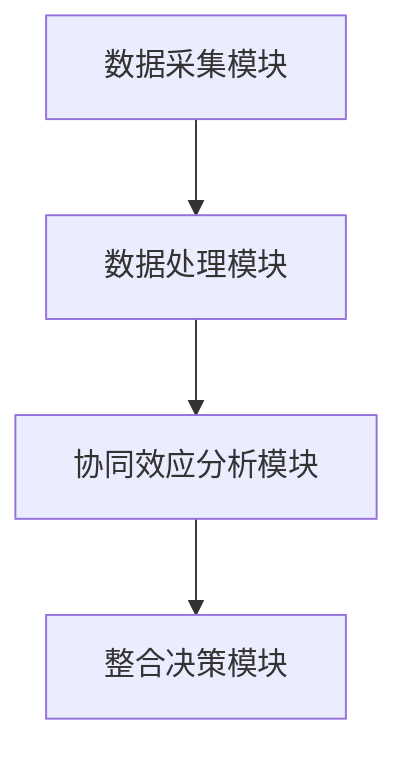
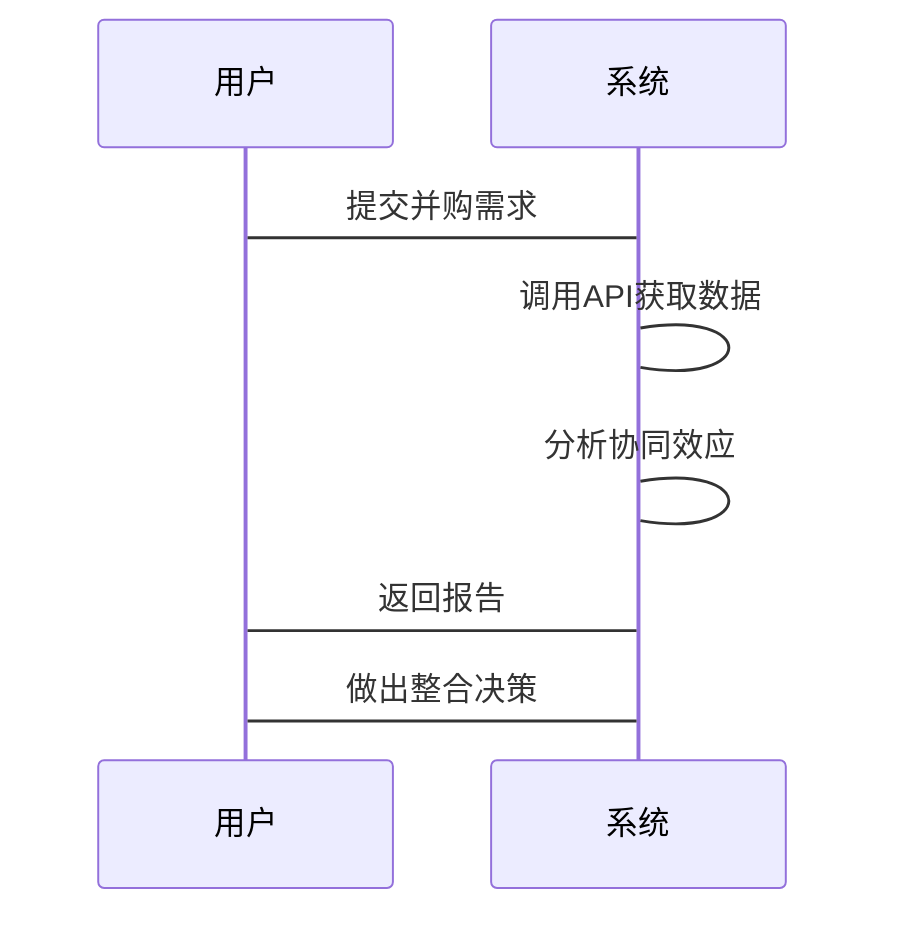

                 


# 巴菲特的并购艺术：数字生态系统整合的新策略

> **关键词**：巴菲特并购、数字生态系统、价值投资、安全边际、协同效应、系统架构、整合策略  
> 
> **摘要**：本文探讨了巴菲特并购艺术在数字生态系统整合中的新策略。通过分析巴菲特并购的核心理念，结合数字生态系统的特点，提出了数字时代下的并购整合策略。文章详细阐述了数字生态系统整合的背景、核心概念、算法原理、系统架构以及实际案例，并提供了最佳实践的指导。

---

## 第1章: 巴菲特并购艺术与数字生态系统整合概述

### 1.1 巴菲特并购艺术的起源与发展

#### 1.1.1 巴菲特并购理念的历史演变

沃伦·巴菲特（Warren Buffett）作为全球投资界的传奇人物，其并购理念经历了从早期的“烟屁股”投资到后来的价值投资的演变。他的并购策略以“安全边际”为核心，强调通过深入分析企业的基本面，寻找具有持续竞争优势的企业进行长期投资。

---

#### 1.1.2 巴菲特并购策略的核心思想

巴菲特的并购策略可以总结为以下几点：

1. **价值投资**：寻找被市场低估的企业，通过长期持有实现价值增长。
2. **安全边际**：在并购中留出足够的安全空间，以应对潜在的不确定性。
3. **协同效应**：通过并购实现资源优化和成本节约。

---

#### 1.1.3 巴菲特并购成功案例分析

以巴菲特收购喜诗糖果（See's Candies）为例，这次并购通过溢价收购实现了品牌价值的提升，并通过协同效应降低了成本，最终实现了超额收益。

---

### 1.2 数字生态系统整合的背景与趋势

#### 1.2.1 数字化转型对企业并购的影响

数字化转型使得企业并购的目标从传统的资产整合转向数字资产的整合。数字生态系统整合强调通过数据、技术和平台的协同，实现更高效的价值创造。

---

#### 1.2.2 数字生态系统整合的定义与特点

数字生态系统整合是指通过数字技术将多个企业或业务单元整合到一个统一的数字平台中，实现数据共享、流程优化和价值共创。

---

#### 1.2.3 数字生态系统整合的未来趋势

随着人工智能和大数据技术的发展，数字生态系统整合将更加注重数据驱动的决策和智能化的协同效应。

---

### 1.3 巴菲特并购艺术与数字生态系统整合的结合

#### 1.3.1 巴菲特并购理念在数字时代的延续

巴菲特的并购理念在数字时代仍然适用，但需要结合数字技术的特点进行创新。例如，通过数据分析实现更精准的企业价值评估。

---

#### 1.3.2 数字生态系统整合对并购策略的影响

数字生态系统整合改变了传统并购的模式，使得并购更加注重数据驱动和平台化。

---

#### 1.3.3 巴菲特并购艺术在数字时代的创新

结合数字技术，巴菲特的并购策略可以更加灵活，例如通过数据驱动的协同效应分析优化并购决策。

---

### 1.4 本章小结

本章通过分析巴菲特并购艺术的历史演变，结合数字生态系统整合的背景与特点，提出了数字时代下并购整合的新策略。

---

## 第2章: 巴菲特并购艺术的核心策略

### 2.1 巴菲特并购策略的关键要素

#### 2.1.1 企业价值评估的核心指标

巴菲特的企业价值评估主要关注市盈率、市净率等指标，但在数字时代，还需要考虑数据资产的价值。

---

#### 2.1.2 并购中的协同效应分析

协同效应是并购成功的关键，包括成本协同和收入协同。在数字生态系统中，协同效应可以通过数据共享和平台整合实现。

---

#### 2.1.3 并购风险的识别与管理

并购风险包括整合风险和市场风险。通过数字技术，可以更高效地识别和管理这些风险。

---

### 2.2 巴菲特并购中的安全边际原则

#### 2.2.1 安全边际的定义与作用

安全边际是巴菲特并购策略的核心，通过预留安全空间降低并购风险。

---

#### 2.2.2 安全边际在并购中的应用

在数字时代，安全边际可以通过数据驱动的决策和风险管理技术来实现。

---

#### 2.2.3 安全边际与数字生态系统整合的关系

数字生态系统整合为安全边际的实现提供了新的技术手段，例如通过数据监控和实时反馈优化并购决策。

---

### 2.3 巴菲特并购中的长期投资理念

#### 2.3.1 长期投资与企业价值的关系

长期投资强调企业的持续价值创造，与数字生态系统整合的目标一致。

---

#### 2.3.2 数字生态系统整合中的长期投资策略

在数字生态系统中，长期投资可以通过数据积累和平台优化实现持续的价值增长。

---

#### 2.3.3 长期投资理念对并购策略的启示

长期投资理念提醒我们在并购中要注重企业的长期价值，而不仅仅是短期收益。

---

### 2.4 本章小结

本章详细分析了巴菲特并购策略的核心要素，包括价值评估、协同效应和风险管理，并探讨了这些策略在数字生态系统整合中的应用。

---

## 第3章: 数字生态系统整合的核心概念与联系

### 3.1 数字生态系统整合的定义与特点

#### 3.1.1 数字生态系统整合的定义

数字生态系统整合是指通过数字技术将多个企业或业务单元整合到一个统一的数字平台中，实现数据共享、流程优化和价值共创。

---

#### 3.1.2 数字生态系统整合的核心特点

1. **数据驱动**：通过数据共享实现资源优化。
2. **平台化**：构建统一的数字平台支持整合。
3. **智能化**：利用人工智能技术实现自动化协同。

---

### 3.2 数字生态系统整合的关键要素

#### 3.2.1 数字技术在整合中的作用

数字技术（如大数据和人工智能）在整合中的作用包括数据处理、预测分析和决策支持。

---

#### 3.2.2 数据驱动的整合策略

数据驱动的整合策略强调通过数据分析优化整合过程，例如通过协同效应分析选择最优整合方案。

---

#### 3.2.3 数字平台在整合中的应用

数字平台是数字生态系统整合的核心，通过平台实现数据共享和业务协同。

---

### 3.3 巴菲特并购艺术与数字生态系统整合的联系

#### 3.3.1 巴菲特并购理念对数字整合的启示

巴菲特的并购理念强调长期价值和安全边际，这些理念在数字整合中同样适用。

---

#### 3.3.2 数字整合对巴菲特并购策略的创新

数字整合通过数据驱动和技术支持，优化了传统的并购策略，例如通过实时数据分析实现动态协同。

---

#### 3.3.3 数字整合与巴菲特并购艺术的协同发展

数字整合为巴菲特的并购艺术提供了新的技术手段，而巴菲特的并购理念则为数字整合提供了理论指导。

---

### 3.4 本章小结

本章通过分析数字生态系统整合的核心概念和关键要素，探讨了巴菲特并购艺术与数字整合的联系，提出了数字时代下并购整合的新策略。

---

## 第4章: 数字生态系统整合的算法原理与数学模型

### 4.1 数字生态系统整合的算法原理

#### 4.1.1 数字生态系统整合的算法流程

1. 数据采集与处理：通过API获取企业数据。
2. 数据分析：利用机器学习算法预测整合后的协同效应。
3. 优化决策：通过优化算法选择最优整合方案。

---

#### 4.1.2 数据驱动的整合算法

数据驱动的整合算法包括协同效应预测和整合风险评估。例如，协同效应可以通过回归分析预测。

---

#### 4.1.3 算法的优化与改进

通过引入强化学习算法，可以进一步优化整合策略，例如动态调整整合计划以应对市场变化。

---

### 4.2 数字生态系统整合的数学模型

#### 4.2.1 数学模型的定义与作用

数学模型用于量化整合后的协同效应和风险，例如通过净现值（NPV）模型评估整合的价值。

---

#### 4.2.2 数学模型的构建与应用

协同效应可以通过以下公式计算：
$$ \text{协同效应} = \text{整合后的价值} - \text{整合前的价值} $$

---

#### 4.2.3 数学模型的优化与验证

通过实际案例验证数学模型的准确性，并根据反馈不断优化模型。

---

### 4.3 巴菲特并购艺术与数字整合算法的结合

#### 4.3.1 巴菲特并购策略对算法的启示

巴菲特的并购策略强调安全边际，这可以通过数学模型中的风险评估指标实现。

---

#### 4.3.2 数学模型对巴菲特并购策略的创新

通过数学模型，可以更精准地评估整合后的协同效应和风险，优化并购决策。

---

### 4.4 本章小结

本章通过分析数字生态系统整合的算法原理和数学模型，探讨了这些技术如何支持巴菲特的并购策略。

---

## 第5章: 数字生态系统整合的系统架构设计

### 5.1 数字生态系统整合的系统架构

#### 5.1.1 系统功能设计

数字生态系统整合系统包括数据采集模块、协同效应分析模块和整合决策模块。

---

#### 5.1.2 系统架构图



---

#### 5.1.3 系统接口设计

系统接口包括数据接口（API）和用户接口（UI），支持数据共享和用户交互。

---

### 5.2 数字生态系统整合的交互设计

#### 5.2.1 交互流程

1. 用户输入并购需求。
2. 系统通过API获取企业数据。
3. 系统分析协同效应并生成报告。
4. 用户根据报告做出整合决策。

---

#### 5.2.2 交互序列图



---

### 5.3 本章小结

本章通过分析数字生态系统整合的系统架构和交互设计，提出了支持巴菲特并购策略的技术实现方案。

---

## 第6章: 数字生态系统整合的项目实战

### 6.1 项目背景与目标

#### 6.1.1 项目背景

某企业希望通过数字生态系统整合优化并购策略。

---

#### 6.1.2 项目目标

1. 实现企业数据的共享与分析。
2. 优化并购决策流程。

---

### 6.2 项目实施步骤

#### 6.2.1 环境安装

安装Python、数据处理工具和可视化工具。

---

#### 6.2.2 核心代码实现

以下是一个协同效应分析的Python代码示例：

```python
import pandas as pd
import numpy as np

# 数据加载
data = pd.read_csv('merger_data.csv')

# 协同效应预测
def synergy_prediction(data):
    # 计算整合前的价值
    pre_value = data['value_before'].sum()
    # 计算整合后的价值
    post_value = data['value_after'].sum()
    # 协同效应
    synergy = post_value - pre_value
    return synergy

# 执行预测
synergy = synergy_prediction(data)
print(f"协同效应：{synergy}")
```

---

#### 6.2.3 代码解读与分析

上述代码通过数据分析工具（如Pandas）加载数据，计算整合前后的价值差，得到协同效应。

---

### 6.3 实际案例分析

#### 6.3.1 案例背景

某企业通过数字生态系统整合优化了并购流程，实现了协同效应的提升。

---

#### 6.3.2 案例分析

通过协同效应分析，企业选择了一个最优的整合方案，实现了成本节约和收入增长。

---

### 6.4 项目小结

本章通过实际案例分析，展示了数字生态系统整合在巴菲特并购策略中的应用。

---

## 第7章: 数字生态系统整合的最佳实践

### 7.1 小结

数字生态系统整合为巴菲特的并购艺术提供了新的技术手段，通过数据驱动和智能化的协同效应优化并购决策。

---

### 7.2 注意事项

1. 数据安全是整合中的重要问题。
2. 需要注重整合后的文化融合。

---

### 7.3 拓展阅读

建议阅读相关书籍和论文，深入学习数字生态系统整合的理论与实践。

---

## 作者：AI天才研究院/AI Genius Institute & 禅与计算机程序设计艺术 /Zen And The Art of Computer Programming

