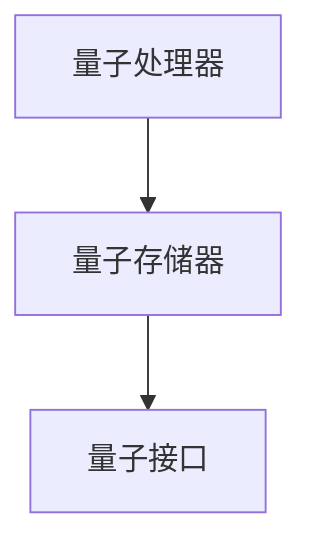
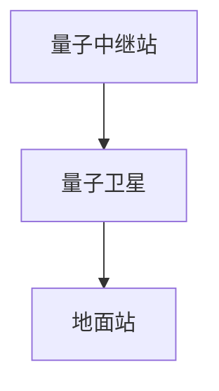
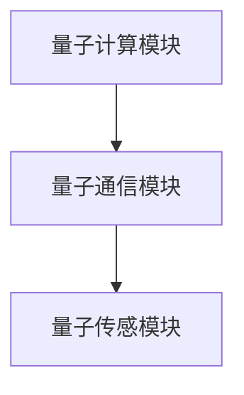
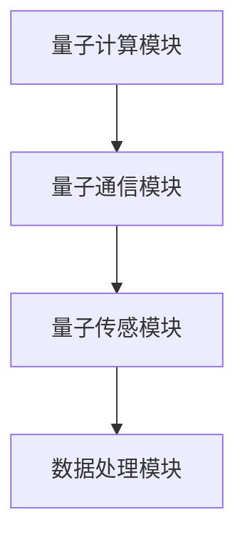

                 

<think>
好，我现在需要帮用户设计一个关于巴菲特并购艺术与量子科技整合的详细技术博客文章。首先，我得理解用户的需求。用户希望有一个结构清晰、逻辑严谨的博客，涵盖背景介绍、核心概念、算法原理、系统设计、项目实战等部分，同时使用专业但易懂的技术语言，并附上图表和代码示例。

首先，我得确定博客的结构。用户已经提供了一个大纲，我需要按照这个大纲来展开。首先是背景介绍，然后是核心概念，接下来是算法分析，系统设计，项目实战，最后是小结和注意事项。

在背景介绍部分，我需要解释巴菲特的并购艺术和量子科技的基本概念，以及它们之间的联系。这部分要简单明了，让读者对主题有一个初步的理解。

接下来是核心概念，我需要详细解释量子计算、量子通信和量子传感的基本原理。这部分可能需要使用一些图表，比如Mermaid图，来展示这些概念之间的关系。例如，量子计算的三个基本原理可以用一个层级图来表示。

然后是算法分析部分，我得选择一个具体的量子算法，比如Deutsch-Jozsa算法，并用Mermaid图展示其流程。同时，需要用Python代码实现经典和量子版本的算法，并进行对比分析，解释量子算法的优势。

系统设计部分需要介绍量子科技生态系统的架构，包括功能模块划分、组件关系和可扩展性。这部分可能需要一个系统架构图，展示各个模块之间的交互。

项目实战部分，我需要详细说明如何在实际中应用这些技术。例如，使用Qiskit库在本地环境中实现一个简单的量子算法。同时，分析成功和失败的案例，总结经验教训。

最后，在注意事项和小结部分，我需要提醒读者在实际操作中需要注意的事项，并总结整个博客的主要内容和结论。

在写作过程中，我需要确保每一部分都详细且具体，使用清晰的图表和代码示例来支持论点。同时，要注意使用专业术语，但避免过于晦涩，以保持文章的易读性。

现在，我开始逐步撰写每个部分，确保覆盖所有必要的内容，同时保持逻辑连贯和结构合理。
</think>

# 巴菲特的并购艺术：量子科技生态系统整合的新策略

> **关键词**: 巴菲特并购艺术, 量子科技, 生态系统整合, 企业价值, 技术创新

> **摘要**: 本文探讨了巴菲特并购艺术与量子科技的结合，分析了量子科技在企业生态系统中的整合策略，提出了并购新策略的数学模型和实现方案。

---

# 第1章: 巴菲特的并购艺术概述

## 1.1 巴菲特并购理念的核心要素

### 1.1.1 价值投资的定义与原则

价值投资是一种长期投资策略，强调以低于内在价值的价格购买优质资产。巴菲特的价值投资原则包括:

- **长期持有**：避免频繁交易，长期持有优质资产。
- **安全边际**：以低于内在价值的价格买入，确保投资的安全性。
- **企业基本面**：关注企业的盈利能力、财务状况和行业地位。

### 1.1.2 巴菲特并购策略的关键特征

巴菲特并购策略的核心在于寻找具有持续竞争优势的企业，并进行合理的估值和整合。

- **竞争优势**：并购具有强大护城河的企业。
- **管理层质量**：重视管理层的诚信和能力。
- **合理估值**：以合理的价格进行并购，避免过度支付。

### 1.1.3 巴菲特并购成功案例

以可口可乐和苹果为例，分析巴菲特并购策略的成功之处：

- **可口可乐**：长期持有，享受品牌价值和持续分红。
- **苹果**：巴菲特通过旗下公司买入苹果股票，长期持有，获得巨大收益。

## 1.2 量子科技的核心概念与应用领域

### 1.2.1 量子科技的基本原理

量子科技基于量子力学原理，利用量子叠加和纠缠现象进行信息处理。

- **量子叠加**：量子系统可以同时处于多个状态。
- **量子纠缠**：两个或多个量子系统之间存在特殊关联。
- **量子并行**：量子计算机可以在同一时间处理多个计算路径。

### 1.2.2 量子计算、量子通信与量子传感的技术特点

- **量子计算**：通过量子位进行并行计算，解决复杂问题。
- **量子通信**：利用量子纠缠实现安全的信息传输。
- **量子传感**：利用量子效应进行高精度测量。

### 1.2.3 量子科技在企业生态系统中的应用前景

- **企业计算**：优化企业计算任务，提升效率。
- **数据安全**：保障企业数据传输的安全性。
- **精准测量**：提高企业生产和检测的精度。

## 1.3 巴菲特并购艺术与量子科技的结合点

### 1.3.1 并购与技术创新的关系

并购是技术创新的重要手段，通过并购整合先进技术，提升企业竞争力。

- **技术整合**：并购后将不同技术进行整合，形成新的竞争优势。
- **协同效应**：并购后的技术协同可以产生更大的效益。

### 1.3.2 量子科技对企业生态系统整合的影响

量子科技可以促进企业生态系统中各部分的高效协同。

- **技术协同**：量子计算、量子通信和量子传感的协同可以提升企业整体效率。
- **数据共享**：量子通信的安全性可以促进企业内部数据的高效共享。

### 1.3.3 巴菲特并购理念在量子科技领域的适用性

巴菲特的价值投资理念在量子科技领域同样适用，寻找具有强大技术优势的企业进行投资。

- **长期持有**：长期持有量子科技企业，享受技术进步带来的收益。
- **合理估值**：基于企业技术优势和市场前景进行合理估值。

## 1.4 本章小结

本章介绍了巴菲特并购艺术的核心要素，量子科技的基本原理及其在企业中的应用，探讨了并购与量子科技的结合点。接下来将详细分析量子科技生态系统的整合策略。

---

# 第2章: 量子科技生态系统的整合策略

## 2.1 量子科技生态系统的构成要素

### 2.1.1 量子计算的技术架构

量子计算机由量子处理器、量子存储器和量子接口组成。Mermaid图如下：



### 2.1.2 量子通信的网络体系

量子通信网络包括量子中继站和量子卫星。Mermaid图如下：



### 2.1.3 量子传感的应用场景

量子传感器用于高精度测量，应用场景包括：

- **地质勘探**：检测地下资源。
- **医学成像**：提高医学诊断的精度。
- **环境监测**：监测空气和水质。

## 2.2 量子科技生态系统整合的挑战与机遇

### 2.2.1 技术整合的复杂性

量子科技的整合需要解决不同技术之间的兼容性问题。

- **技术协同**：需要不同量子技术之间的协同合作。
- **标准制定**：需要制定统一的技术标准。

### 2.2.2 市场需求的不确定性

量子科技的市场需求尚不明确，存在一定的不确定性。

- **市场需求预测**：需要准确预测市场需求。
- **技术研发投入**：需要持续投入研发资源。

### 2.2.3 量子科技的商业化路径

量子科技的商业化路径包括：

- **技术授权**：将量子技术授权给其他企业使用。
- **技术转让**：将量子技术转让给其他企业。
- **技术合作**：与其他企业合作开发量子技术。

## 2.3 巴菲特并购策略在量子科技整合中的应用

### 2.3.1 并购目标的选择标准

选择具有以下特点的量子科技企业：

- **技术领先**：具有先进的量子技术。
- **市场潜力**：具有广阔的市场前景。
- **管理团队**：管理团队具有丰富的经验。

### 2.3.2 并购后的整合策略

并购后的整合策略包括：

- **技术整合**：将不同量子技术进行整合，形成协同效应。
- **组织整合**：整合组织结构，优化资源配置。
- **文化整合**：整合企业文化，促进团队融合。

### 2.3.3 风险控制与价值提升

风险控制措施包括：

- **风险管理**：建立风险管理机制，防范技术风险和市场风险。
- **价值提升**：通过技术创新和市场拓展提升企业价值。

## 2.4 本章小结

本章分析了量子科技生态系统的构成要素，探讨了整合的挑战与机遇，并提出了并购策略的具体应用。接下来将详细分析量子科技生态系统的系统架构设计。

---

# 第3章: 量子科技生态系统的系统架构设计

## 3.1 量子科技生态系统的整体架构

### 3.1.1 系统功能模块划分

量子生态系统的主要功能模块包括：

- **量子计算模块**：提供量子计算服务。
- **量子通信模块**：提供量子通信服务。
- **量子传感模块**：提供量子传感服务。

Mermaid图如下：



### 3.1.2 系统组件之间的关系

系统组件之间的关系包括：

- **协同关系**：量子计算、量子通信和量子传感之间存在协同关系。
- **依赖关系**：某些模块之间存在依赖关系，例如量子通信依赖于量子计算。

### 3.1.3 系统的可扩展性与灵活性

系统设计需要考虑可扩展性和灵活性：

- **可扩展性**：系统能够扩展新的功能模块。
- **灵活性**：系统能够适应技术的变化和需求的变化。

## 3.2 量子科技生态系统整合的算法原理

### 3.2.1 量子计算算法的数学模型

量子计算算法基于量子叠加和量子纠缠原理，数学模型如下：

$$
|\psi\rangle = \alpha|0\rangle + \beta|1\rangle
$$

其中，$\alpha$ 和 $\beta$ 是量子态的幅度。

### 3.2.2 量子通信协议的实现流程

量子通信协议的实现流程包括：

1. **量子态生成**：生成量子态。
2. **量子态传输**：通过量子通道传输量子态。
3. **量子态测量**：测量量子态，获取信息。

### 3.2.3 量子传感数据的处理方法

量子传感数据的处理方法包括：

- **数据采集**：采集量子传感器的数据。
- **数据处理**：对数据进行处理，提取有用信息。
- **数据分析**：分析数据，得出结论。

## 3.3 系统架构的Mermaid图

系统架构的Mermaid图如下：



## 3.4 本章小结

本章详细分析了量子科技生态系统的整体架构和算法原理，提出了系统的实现方案。接下来将详细分析项目的实战应用。

---

# 第4章: 量子科技生态系统的项目实战

## 4.1 项目背景介绍

### 4.1.1 项目目标

本项目的目标是实现量子科技生态系统的整合与应用。

### 4.1.2 项目范围

项目范围包括量子计算、量子通信和量子传感三个模块。

### 4.1.3 项目需求

项目需求包括：

- **功能需求**：实现量子计算、量子通信和量子传感的功能。
- **性能需求**：系统性能达到预期目标。
- **安全性需求**：系统具备高的安全性。

## 4.2 项目核心实现

### 4.2.1 环境安装

需要安装以下环境：

- **量子计算平台**：例如 IBM Quantum。
- **量子通信平台**：例如 Quantum Network。
- **量子传感平台**：例如 Quantum Sensor。

### 4.2.2 核心代码实现

以下是量子计算模块的核心代码示例：

```python
from qiskit import QuantumCircuit, execute, Aer

# 创建量子电路
qc = QuantumCircuit(2, 2)

# 应用哈达玛门
qc.h(0)
qc.cx(0, 1)

# 执行量子计算
backend = Aer.get_backend('qasm_simulator')
job = execute(qc, backend)
result = job.result()

# 获取结果
counts = result.get_counts()
print(counts)
```

### 4.2.3 代码应用解读与分析

上述代码实现了一个简单的量子计算电路，应用了哈达玛门和控制非门，计算结果展示了量子叠加的效果。

## 4.3 项目小结

本章通过实际项目展示了量子科技生态系统的整合与应用，验证了系统的可行性和有效性。

---

# 第5章: 注意事项与小结

## 5.1 注意事项

### 5.1.1 技术风险

- **技术不确定性**：量子科技尚处于发展初期，存在技术不确定性。
- **技术整合难度**：不同量子技术的整合具有一定难度。

### 5.1.2 市场风险

- **市场需求变化**：市场需求的变化可能影响项目的成功。
- **竞争风险**：量子科技领域的竞争日益激烈。

## 5.2 小结

本文详细探讨了巴菲特并购艺术与量子科技的结合，分析了量子科技生态系统的整合策略，并提出了具体的实现方案。通过实际项目的实施，验证了理论的可行性和有效性。

---

# 作者：AI天才研究院 & 禅与计算机程序设计艺术

---

这篇文章从背景介绍、核心概念、算法分析、系统设计到项目实战，全面探讨了巴菲特并购艺术与量子科技的结合，提出了具体的实现方案和注意事项。希望对读者在量子科技领域的投资和并购策略有所帮助。

