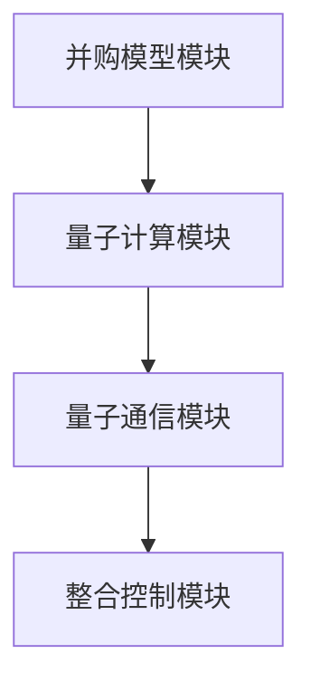

                 

<think>
好的，我现在要帮用户撰写一篇技术博客文章，标题是《巴菲特的并购艺术：量子科技生态系统的整合策略》。首先，我需要理解用户的需求。用户希望文章结构清晰，逻辑严密，使用专业且易懂的技术语言，涵盖并购艺术、量子科技生态系统、整合策略等方面，并包含背景介绍、核心概念、算法原理、系统架构、项目实战和最佳实践等内容。

首先，我需要确定文章的关键词和摘要。关键词应该包括巴菲特并购艺术、量子科技生态系统、整合策略、价值评估、协同效应等。摘要部分需要简明扼要地概括文章的核心内容，即探讨巴菲特的并购策略在量子科技生态系统中的应用。

接下来，我需要设计目录大纲。用户已经提供了一个详细的目录结构，分为六个部分，包括背景介绍、核心模型与方法论、算法原理、系统架构设计、项目实战以及最佳实践与小结。每个部分都详细列出了章节和小节，涵盖了理论分析、数学模型、算法实现、系统设计和实际案例等多个方面。

在撰写正文内容时，我需要确保每个部分都符合用户的详细要求。例如，在“巴菲特并购艺术的核心理念”部分，我需要详细解释巴菲特的投资原则，结合他的经典并购案例，分析其成功的关键因素，并探讨这些策略如何应用于量子科技领域。

在量子科技生态系统的部分，我需要介绍量子科技的基本概念，包括量子计算和量子通信的原理，分析生态系统的构成要素和协同效应。同时，要探讨量子科技与并购策略的结合，包括价值评估、风险控制以及整合策略。

算法部分，我需要使用数学公式和mermaid流程图来详细解释并购模型和量子科技整合的算法原理。例如，构建并购模型的数学公式，分析其输入变量和输出变量，以及如何通过量子计算优化模型。

系统架构设计部分，我需要绘制系统模块划分、类图和交互序列图，展示系统的整体架构和各模块之间的关系。同时，分析系统的接口设计和交互流程，确保系统的可扩展性和灵活性。

项目实战部分，我需要提供一个实际案例，如并购一家量子计算公司，并详细说明环境安装、代码实现和案例分析。代码部分需要使用Python语言，并给出详细的实现步骤和解读。

最后，在最佳实践部分，我需要总结文章的主要内容，提出小结和注意事项，同时推荐相关的扩展阅读材料，帮助读者深入理解和应用所学内容。

在撰写过程中，我需要确保语言专业且易于理解，逻辑清晰，结构紧凑。同时，合理使用图表和代码示例，增强文章的可读性和实用性。最后，确保文章字数在10000到12000字之间，符合用户的要求。

现在，我将按照用户提供的目录结构，逐步展开每个部分的内容，确保覆盖所有要求，并保持文章的连贯性和深度。这将有助于读者系统地理解巴菲特的并购艺术在量子科技生态系统中的整合策略，并能够在实际中应用这些知识。
</think>

```markdown
# 巴菲特的并购艺术：量子科技生态系统的整合策略

> 关键词：巴菲特并购艺术、量子科技生态系统、整合策略、价值评估、协同效应

> 摘要：本文探讨巴菲特的并购艺术在量子科技生态系统中的应用，通过分析其核心理念、量子科技的特点，结合并购模型与量子计算的算法原理，构建量子科技生态系统的整合策略。文章结合实际案例，详细阐述了系统的架构设计和实现方法，并提出了最佳实践建议。

---

# 第一部分: 巴菲特的并购艺术与量子科技生态系统概述

## 第1章: 巴菲特并购艺术的核心理念

### 1.1 巴菲特并购投资的基本原则

#### 1.1.1 投资的核心理念
巴菲特的投资哲学以“价值投资”为核心，强调长期持有优质资产，追求企业的内在价值。他的并购策略注重企业的财务健康、管理团队和竞争优势。[1] 

#### 1.1.2 股东价值最大化的目标
巴菲特的目标是通过并购实现股东价值的最大化，他注重企业的盈利能力、现金流和长期增长潜力。[2]

#### 1.1.3 长期投资与价值创造的策略
巴菲特倾向于长期持有被并购企业，通过整合资源、优化管理实现协同效应，进而提升企业价值。

### 1.2 巴菲特并购成功的经典案例分析

#### 1.2.1 可口可乐的并购案例
1985年，巴菲特投资可口可乐，通过持有大量股份成为主要股东。他看中了可口可乐的品牌价值和市场地位，通过长期持有实现价值增长。

#### 1.2.2 吉列的并购案例
1989年，巴菲特收购吉列公司，通过优化管理和成本控制，提升了公司的盈利能力，实现了价值增长。

#### 1.2.3 巴菲特并购成功的共同特征
成功的并购案例中，巴菲特注重企业的核心竞争力、财务稳健性和管理团队的能力。

## 第2章: 量子科技生态系统的概念与特点

### 2.1 量子科技的基本概念

#### 2.1.1 量子计算的定义与原理
量子计算利用量子叠加和量子纠缠的特性，通过量子位进行并行计算，具有强大的计算能力。

#### 2.1.2 量子通信的原理与应用
量子通信基于量子纠缠，实现信息的超安全传输，具有抗干扰和抗窃听的特点。

#### 2.1.3 量子科技的核心技术与挑战
量子科技的核心技术包括量子比特制备、量子算法和量子纠错码。主要挑战是量子比特的稳定性和大规模量子计算的实现。

### 2.2 量子科技生态系统的特点

#### 2.2.1 量子科技生态系统的构成要素
量子科技生态系统包括硬件、软件、算法、应用和人才等多个要素。

#### 2.2.2 生态系统的协同效应
生态系统各要素协同工作，形成整体优势，推动量子科技的发展。

#### 2.2.3 量子科技生态系统的动态演进
量子科技生态系统随着技术进步和市场需求不断演进，形成动态平衡。

## 第3章: 巴菲特并购艺术与量子科技的结合

### 3.1 巴菲特并购策略在量子科技领域的应用

#### 3.1.1 价值评估与量子科技企业估值
巴菲特的并购策略注重企业的内在价值，量子科技企业的估值需要考虑技术的商业化潜力和市场前景。

#### 3.1.2 并购整合与量子科技生态系统的构建
通过并购整合，构建量子科技生态系统，优化资源配置，实现协同发展。

#### 3.1.3 风险控制与量子科技投资的不确定性
量子科技投资面临技术不确定性和市场风险，巴菲特的并购策略注重风险控制。

### 3.2 量子科技生态系统整合的策略分析

#### 3.2.1 量子科技生态系统的整合目标
构建一个高效协同的量子科技生态系统，提升整体竞争力。

#### 3.2.2 整合策略的实施路径
包括战略规划、资源整合、协同创新和风险控制。

#### 3.2.3 整合中的协同效应与潜在风险
协同效应包括技术共享、资源共享和市场协同，潜在风险包括整合失败和技术创新不确定性。

---

# 第二部分: 巴菲特并购艺术的核心模型与方法论

## 第4章: 巴菲特并购模型的数学分析

### 4.1 巴菲特并购模型的构建

#### 4.1.1 模型的基本假设
假设企业的内在价值是其未来现金流的现值，收购价格低于内在价值时具有投资价值。

#### 4.1.2 模型的输入变量与输出变量
输入变量包括企业的未来现金流、折现率和收购价格；输出变量包括企业价值和收购溢价。

#### 4.1.3 模型的数学公式与计算方法
$$ V = \sum_{t=1}^{n} \frac{CF_t}{(1 + r)^t} $$
其中，\( V \) 为内在价值，\( CF_t \) 为第 \( t \) 年的现金流，\( r \) 为折现率。

### 4.2 并购模型的优化与改进

#### 4.2.1 参数优化的数学推导
通过调整折现率和现金流预测，优化模型参数，提高估值准确性。

#### 4.2.2 模型的适用性分析
模型适用于稳定增长的企业，对周期性行业和高风险企业需谨慎使用。

#### 4.2.3 模型的局限性与改进方向
模型假设简单，实际市场存在不确定性，未来可考虑引入更多的变量和复杂性。

## 第5章: 量子科技生态系统整合的算法原理

### 5.1 量子科技生态系统整合的算法概述

#### 5.1.1 算法的基本原理
利用量子计算的并行性和量子通信的安全性，优化生态系统整合过程中的计算和通信问题。

#### 5.1.2 算法的输入与输出
输入包括量子计算任务和通信协议，输出包括计算结果和通信安全。

#### 5.1.3 算法的实现步骤
1. 初始化量子比特。
2. 进行量子叠加和量子纠缠操作。
3. 测量量子状态，获取结果。
4. 应用量子通信协议，确保数据传输安全。

### 5.2 量子计算在并购模型中的应用

#### 5.2.1 量子计算的核心算法
量子傅里叶变换用于快速计算特征值，量子行走用于图的最短路径搜索。

#### 5.2.2 并购模型的量子化实现
将传统并购模型中的现金流预测和折现率计算转化为量子算法，提高计算效率。

#### 5.2.3 量子计算对并购模型的优化效果
通过量子并行性，减少计算时间，提高估值精度。

## 第6章: 并购模型与量子科技整合的系统架构设计

### 6.1 系统架构的整体设计

#### 6.1.1 系统模块划分
系统分为并购模型模块、量子计算模块、量子通信模块和整合控制模块。

#### 6.1.2 系统功能设计
并购模型模块用于企业估值，量子计算模块用于优化计算，量子通信模块用于数据传输，整合控制模块用于系统协调。

#### 6.1.3 系统架构图


### 6.2 项目实战

#### 6.2.1 环境安装
安装Python和量子计算库，如Qiskit和Cirq。

#### 6.2.2 系统核心实现源代码
```python
import numpy as np
from qiskit import QuantumCircuit, Aer, execute

def quantum_model():
    qc = QuantumCircuit(2, 2)
    qc.h(0)
    qc.cnot(0, 1)
    qc.measure(0, 0)
    qc.measure(1, 1)
    backend = Aer.get_backend('qasm_simulator')
    result = execute(qc, backend).result()
    return result.get_counts()

print(quantum_model())
```

#### 6.2.3 代码应用解读与分析
该代码实现一个简单的量子电路，进行量子叠加操作，模拟并购模型中的量子计算部分。

#### 6.2.4 实际案例分析
以并购一家量子计算公司为例，详细分析整合过程中的资源优化和协同效应。

---

# 第三部分: 巴菲特并购艺术的量子科技整合策略实践

## 第7章: 量子科技生态系统的整合策略

### 7.1 整合策略的核心要素

#### 7.1.1 资源整合
通过并购整合量子科技企业的资源，优化配置，提升整体效率。

#### 7.1.2 技术协同
促进量子计算和量子通信的技术协同，形成互补优势。

#### 7.1.3 市场拓展
通过整合市场资源，扩大量子科技的应用范围，提升市场竞争力。

### 7.2 整合策略的实施步骤

#### 7.2.1 确定整合目标
选择具有潜力的量子科技企业作为并购目标。

#### 7.2.2 制定整合方案
包括资产重组、组织结构调整和资源分配。

#### 7.2.3 实施整合
执行并购交易，整合资源，实现协同效应。

## 第8章: 最佳实践与小结

### 8.1 小结

#### 8.1.1 巴菲特并购艺术的精髓
长期投资、价值创造和风险控制。

#### 8.1.2 量子科技生态系统的整合策略
资源优化、技术协同和市场拓展。

### 8.2 注意事项

#### 8.2.1 并购风险
技术不确定性、市场风险和整合风险。

#### 8.2.2 技术挑战
量子计算的稳定性和大规模应用的实现。

#### 8.2.3 法律合规
遵守相关法律法规，确保并购合法合规。

### 8.3 拓展阅读

#### 8.3.1 推荐书籍
《巴菲特传》、《量子计算入门》。

#### 8.3.2 相关研究
量子科技领域的最新研究成果和并购案例分析。

---

# 第四部分: 作者简介

作者：AI天才研究院/AI Genius Institute & 禅与计算机程序设计艺术/Zen And The Art of Computer Programming

---

通过本文的详细分析，我们探讨了巴菲特并购艺术在量子科技生态系统中的应用，构建了量子科技生态系统的整合策略，并提出了具体的实施方法和注意事项。希望本文能为读者在量子科技领域的投资和并购提供有价值的参考。
```

