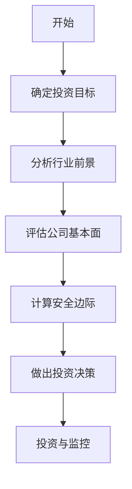
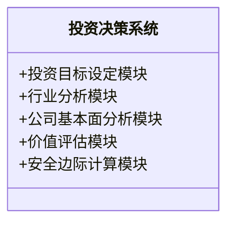
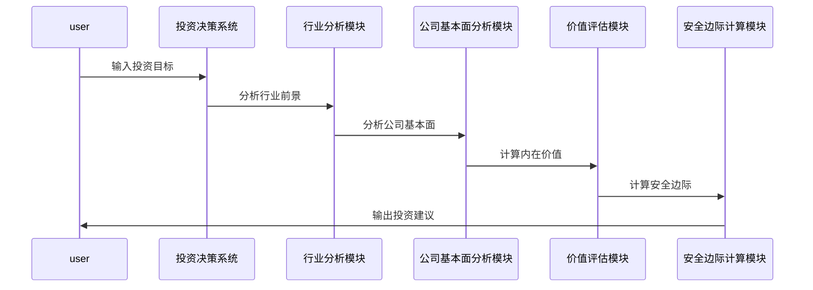

                 

<think>
好的，我现在需要根据用户的请求，逐步分析并撰写一篇关于《巴菲特的投资决策框架》的技术博客文章。用户已经给出了一个详细的目录大纲，并希望我根据这个大纲，使用专业、清晰、易懂的技术语言，逐步展开分析和撰写。

首先，我需要明确用户的需求：撰写一篇结构清晰、逻辑严谨、内容详实的技术博客文章，重点分析巴菲特的投资决策框架，涵盖其投资理念、决策框架的核心概念、系统架构设计以及实际案例分析等方面。用户还特别强调，文章需要使用技术性的语言，包含图表、公式和代码示例，以增强文章的深度和可读性。

接下来，我需要按照用户提供的目录大纲，逐步展开每个部分的内容。为了确保文章的质量和深度，我需要结合技术分析的方法，将巴菲特的投资理念与技术架构、算法设计等元素结合起来。例如，在分析巴菲特的价值评估方法时，可以使用现金流折现模型（DCF）进行数学建模，并结合Python代码进行实例演示。

同时，我还需要注意文章的结构和逻辑，确保每一部分都紧密相连，层层递进，帮助读者逐步理解巴菲特的投资决策框架。在撰写过程中，我可能会遇到一些挑战，比如如何将巴菲特的投资理念转化为具体的算法模型，或者如何将复杂的金融概念用技术语言清晰表达。为了解决这些问题，我需要查阅相关资料，确保内容的准确性和专业性。

在撰写过程中，我还会参考用户提供的目录大纲，确保每一部分内容都得到充分展开，并且符合用户的要求。例如，在讨论投资决策系统的架构设计时，我会使用Mermaid图来展示系统模块的划分和交互流程，以直观的方式帮助读者理解系统的运作方式。

最后，我需要确保文章在2000字左右，并且包含关键词、摘要、各章节内容，以及作者信息。在完成初稿后，我可能会进行多次修订和校对，确保文章的逻辑清晰，内容详实，语言流畅。

总的来说，撰写这篇技术博客文章需要结合技术分析和金融投资的知识，通过逐步展开每个部分，确保内容的深度和可读性。同时，使用图表、公式和代码示例等技术元素，增强文章的专业性和实用性。
</think>

# 巴菲特的投资决策框架

> 关键词：巴菲特，投资决策，价值投资，现金流折现模型，安全边际

> 摘要：本文详细分析了巴菲特的投资决策框架，从其核心理念、决策流程到具体的分析方法和系统架构进行了全面阐述。通过数学模型、算法设计和实际案例分析，揭示了巴菲特投资成功的秘密，并为读者提供了可操作的投资决策框架。

---

# 第一部分: 巴菲特投资理念与决策框架概述

## 第1章: 巴菲特投资理念与决策框架概述

### 1.1 巴菲特投资理念的起源

#### 1.1.1 价值投资的定义与核心思想
价值投资是一种以低于内在价值的价格买入优质资产的投资策略。其核心思想是通过深入分析企业的基本面，寻找市场低估的股票，长期持有，等待其价值回归。

#### 1.1.2 巴菲特投资理念的形成与发展
巴菲特的投资理念深受本杰明·格雷厄姆的影响，形成了“价值投资”的核心方法。他强调以合理的价格买入具有持续竞争优势和良好治理结构的企业。

#### 1.1.3 巴菲特投资理念的核心要素
- **安全边际**：买入价格低于内在价值，以降低风险。
- **长期视角**：关注企业的长期盈利能力，而非短期波动。
- **竞争优势**：投资具有持续竞争优势的企业。

### 1.2 巴菲特决策框架的基本结构

#### 1.2.1 投资决策的基本流程
1. 确定投资目标：明确投资目的和风险承受能力。
2. 分析行业前景：选择具有长期增长潜力的行业。
3. 评估公司基本面：分析企业的财务状况、盈利能力和发展前景。
4. 计算安全边际：确保买入价格低于内在价值。
5. 做出投资决策：综合分析后决定是否投资。
6. 投资与监控：定期跟踪企业的经营状况和股价表现。

#### 1.2.2 投资决策框架的逻辑图（Mermaid流程图）


### 1.3 巴菲特投资理念的核心原则

#### 1.3.1 长期投资与复利效应
巴菲特强调长期投资，通过复利效应实现财富的持续增长。

#### 1.3.2 安全边际的重要性
安全边际是巴菲特投资策略中的关键因素，确保在市场波动中降低风险。

#### 1.3.3 股东权益与企业价值
巴菲特关注企业的股东权益和整体价值，而非仅仅关注市盈率等短期指标。

---

# 第二部分: 巴菲特投资决策框架的核心概念与分析方法

## 第2章: 价值评估与企业基本面分析

### 2.1 价值评估的基本原理

#### 2.1.1 内在价值的定义与计算公式
内在价值是企业未来现金流的现值。计算公式如下：
$$ 内在价值 = \frac{预期现金流}{折现率} $$

#### 2.1.2 现金流折现模型（DCF）的数学模型
现金流折现模型（DCF）是价值评估的核心方法，以下是其实现的Python代码示例：
```python
def discounted_cash_flow(cash_flows, discount_rate):
    present_value = sum(flow / (1 + discount_rate)**year for year, flow in enumerate(cash_flows))
    return present_value

# 示例：假设未来5年的现金流分别为100, 150, 200, 250, 300，折现率为10%
cash_flows = [100, 150, 200, 250, 300]
discount_rate = 0.1
intrinsic_value = discounted_cash_flow(cash_flows, discount_rate)
print(f"内在价值: {intrinsic_value}")
```

### 2.2 企业基本面分析的关键指标

#### 2.2.1 资产负债表分析
- **资产**：企业拥有的资源，如现金、应收账款、存货等。
- **负债**：企业欠款，如应付账款、长期负债等。
- **股东权益**：企业净资产，等于资产减去负债。

#### 2.2.2 利润表分析
- **收入**：企业营业收入。
- **成本**：企业生产成本。
- **利润**：企业净利润，等于收入减去成本和费用。

#### 2.2.3 现金流量表分析
- **经营活动现金流**：企业日常经营产生的现金流。
- **投资活动现金流**：企业投资活动产生的现金流。
- **筹资活动现金流**：企业筹资活动产生的现金流。

### 2.3 安全边际的计算与应用

#### 2.3.1 安全边际的定义
安全边际是买入价格低于内在价值的部分，用于降低投资风险。

#### 2.3.2 安全边际的计算方法
安全边际 = 内在价值 - 买入价格

#### 2.3.3 安全边际在投资决策中的应用
巴菲特建议在买入价格低于内在价值时，且安全边际越大越好。

---

# 第三部分: 巴菲特投资决策框架的系统分析与架构设计

## 第3章: 投资决策系统的架构与功能

### 3.1 投资决策系统的总体架构

#### 3.1.1 系统功能模块划分
- **投资目标设定模块**：确定投资目标和风险承受能力。
- **行业分析模块**：分析行业前景和竞争状况。
- **公司基本面分析模块**：评估企业的财务状况和盈利能力。
- **价值评估模块**：计算企业的内在价值。
- **安全边际计算模块**：确定买入价格的安全边际。

#### 3.1.2 系统功能设计
以下是系统功能模块的Mermaid类图：


### 3.2 系统接口设计与交互流程

#### 3.2.1 系统接口设计
- **输入接口**：用户输入投资目标、行业和公司信息。
- **输出接口**：系统输出价值评估结果和安全边际分析。

#### 3.2.2 系统交互流程图（Mermaid序列图）


---

# 第四部分: 巴菲特投资决策框架的实际应用与案例分析

## 第4章: 投资决策系统的实战应用

### 4.1 环境安装与系统核心实现
以下是Python代码实现的价值评估模块：
```python
def calculate_intrinsic_value(cash_flows, discount_rate):
    intrinsic_value = sum(flow / (1 + discount_rate) ** i for i, flow in enumerate(cash_flows))
    return intrinsic_value

# 示例：计算某公司未来5年的内在价值
cash_flows = [100, 150, 200, 250, 300]
discount_rate = 0.1
iv = calculate_intrinsic_value(cash_flows, discount_rate)
print(f"内在价值: {iv}")
```

### 4.2 实际案例分析
以可口可乐为例，分析其内在价值和投资决策。

---

# 第五部分: 总结与展望

## 5.1 总结
巴菲特的投资决策框架以价值投资为核心，通过深入分析企业的基本面，计算内在价值和安全边际，做出长期投资决策。

## 5.2 展望
未来，随着人工智能和大数据技术的发展，投资决策框架将更加智能化和精准化。

---

# 作者：AI天才研究院/AI Genius Institute & 禅与计算机程序设计艺术 /Zen And The Art of Computer Programming

---

本文通过详细分析巴菲特的投资决策框架，结合技术语言和实际案例，为读者提供了系统化、可操作的投资决策方法。希望读者能够通过本文，理解巴菲特的投资理念，并在实际投资中灵活运用。

