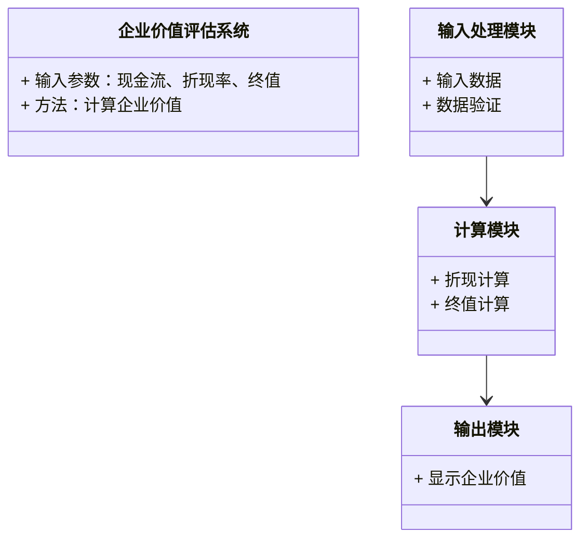
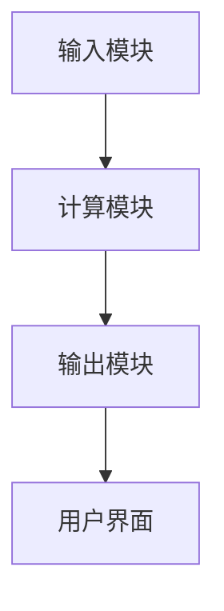

                 

<think>
好的，我现在需要根据用户的要求，撰写一篇关于《巴菲特的投资哲学：企业价值与股票价格的关系》的技术博客文章。用户已经提供了详细的目录大纲，我需要按照这个大纲逐步完成文章的各个部分。

首先，我会从摘要开始，简明扼要地概括文章的核心内容。接着是关键词部分，列出5-7个相关关键词，帮助读者快速了解文章主题。

接下来，我会按照目录结构，依次撰写每个章节和子章节的内容。每个部分都需要详细展开，确保内容丰富、逻辑清晰。例如，在背景介绍中，我需要解释投资哲学的背景、巴菲特的生平及其投资理念，以及价值投资的起源与发展。

在核心概念部分，我会详细讨论企业价值和股票价格的定义、计算方法及其相互关系。这部分需要结合实际案例和数学模型，帮助读者理解巴菲特的投资哲学是如何运作的。

算法原理部分，我会介绍现金流折现法（DCF模型），并用Python代码实现，同时配以mermaid流程图和数学公式，确保读者能够跟随步骤进行计算和分析。

系统架构部分，我需要设计一个评估系统，包括功能模块、架构图和接口设计，可能还需要绘制领域模型的类图和系统交互的序列图，以展示系统的运作流程。

项目实战部分，我会指导读者如何进行企业价值评估，提供环境安装、代码实现和案例分析，帮助读者将理论应用于实际操作中。

最后，我会在最佳实践部分总结本章内容，提供小结、注意事项和拓展阅读建议，帮助读者巩固所学内容，并引导他们进一步深入学习。

在撰写过程中，我会确保语言简洁明了，逻辑严谨，每部分内容都符合技术博客的风格，同时深入浅出，让读者能够轻松理解复杂的投资哲学和相关技术方法。

现在，我需要按照这些步骤，逐步完成文章的各个部分，确保每个章节都涵盖必要的内容，同时保持整体结构的连贯性和逻辑性。
</think>

# 巴菲特的投资哲学：企业价值与股票价格的关系

> 关键词：巴菲特投资哲学，企业价值，股票价格，价值投资，现金流折现法，安全边际，投资策略

> 摘要：本文深入探讨了巴菲特的投资哲学，重点分析了企业价值与股票价格之间的关系。通过对企业价值的计算方法、股票价格的影响因素以及两者关系的详细解析，结合实际案例和数学模型，揭示了巴菲特投资哲学的核心思想及其在实践中的应用。文章还介绍了现金流折现法（DCF模型）的具体实现，并通过Python代码和mermaid流程图展示了算法的原理和步骤。最后，本文提供了系统架构设计和项目实战指导，帮助读者更好地理解和应用巴菲特的投资哲学。

---

## 第一部分: 巴菲特的投资哲学基础

### 第1章: 巴菲特投资哲学的背景与核心理念

#### 1.1 投资哲学的背景介绍

##### 1.1.1 投资哲学的定义与问题背景

- **投资哲学的定义**：投资哲学是指导投资者在金融市场中进行投资决策的系统化方法和理论框架。
- **传统投资与价值投资的对比**：传统投资注重短期价格波动和技术分析，而价值投资注重长期基本面分析和安全边际。
- **巴菲特投资哲学的起源与演变**：巴菲特的投资哲学起源于价值投资理论，经过多年的实践和总结，形成了独特的投资体系。

##### 1.1.2 巴菲特的生平与投资理念

- **巴菲特的生平简介**：沃伦·巴菲特（Warren Buffett）是世界著名投资家，被誉为“股神”，他通过长期投资和价值投资积累了巨额财富。
- **巴菲特投资哲学的核心思想**：巴菲特强调购买优秀企业的一部分，长期持有，注重企业的内在价值而非市场波动。
- **巴菲特投资哲学与现代金融理论的联系**：巴菲特的投资哲学与现代金融理论中的价值评估方法有密切联系，尤其是现金流折现法（DCF模型）。

#### 1.2 价值投资的起源与发展

##### 1.2.1 价值投资的定义与特点

- **价值投资的定义**：价值投资是一种投资策略，通过寻找市场价格低于其内在价值的证券进行投资。
- **价值投资的核心特点**：长期持有、注重安全边际、关注企业基本面。
- **价值投资与其他投资策略的对比**：与技术分析和短线交易不同，价值投资注重长期稳健的收益。

##### 1.2.2 巴菲特投资哲学的核心要素

- **企业价值的核心概念**：企业价值是指企业整体的经济价值，包括所有资产和未来现金流的现值。
- **股票价格与企业价值的关系**：股票价格是企业价值的市场反映，但价格波动可能导致短期偏离内在价值。
- **长期投资与安全边际的重要性**：巴菲特强调长期投资和购买具有安全边际的企业，即市场价格低于内在价值。

#### 1.3 巴菲特投资哲学的实践与案例

##### 1.3.1 巴菲特的经典投资案例分析

- **可口可乐案例**：巴菲特长期持有可口可乐股票，认为其具备强大的竞争优势和稳定的现金流。
- **苹果公司案例**：巴菲特对苹果的投资展现了对创新企业价值的认可。
- **富国银行案例**：巴菲特通过分析银行的财务状况和管理层能力，做出了长期投资的决策。

##### 1.3.2 巴菲特投资哲学的现实意义

- **对个人投资者的启示**：强调长期投资、分散投资和选择优秀企业。
- **对企业管理的启示**：引导企业注重基本面，提高核心竞争力。
- **对金融市场的长期影响**：促进了价值投资理念的普及和市场效率的提高。

#### 1.4 本章小结

本章介绍了巴菲特投资哲学的背景、核心理念和经典案例，强调了企业价值与股票价格的关系，以及长期投资和安全边际的重要性。

---

## 第2章: 企业价值与股票价格的核心概念

### 2.1 企业价值的定义与计算方法

#### 2.1.1 企业价值的定义

- **企业价值的定义**：企业价值是指企业整体的经济价值，包括所有资产的市场价值和未来现金流的现值。
- **企业价值的构成要素**：包括有形资产、无形资产、未来现金流、品牌价值等。

#### 2.1.2 企业价值的计算方法

##### 现金流折现法（DCF模型）

- **现金流折现法的定义**：DCF模型是通过将企业未来现金流折现到现值，来评估企业整体价值的方法。
- **现金流折现法的步骤**：
  1. 估计企业未来自由现金流。
  2. 选择合适的折现率。
  3. 计算未来现金流的现值。
  4. 加上终值，得到企业价值。

##### 其他计算方法

- **市盈率法**：通过比较企业的市盈率与行业平均水平，评估企业价值。
- **市净率法**：通过比较企业的市净率与行业平均水平，评估企业价值。

### 2.2 股票价格的定义与影响因素

#### 2.2.1 股票价格的定义

- **股票价格的定义**：股票价格是市场参与者对企业价值的即时反映，受多种因素影响。

#### 2.2.2 影响股票价格的主要因素

- **公司基本面**：包括盈利能力、财务状况、行业地位等。
- **市场情绪**：投资者情绪和市场信心影响股票价格的短期波动。
- **宏观经济环境**：包括经济周期、利率水平、通货膨胀等。

### 2.3 企业价值与股票价格的关系

#### 2.3.1 企业价值与股票价格的内在联系

- **企业价值是股票价格的内在基础**：股票价格的长期走势取决于企业的内在价值。
- **股票价格是企业价值的市场反映**：市场参与者对企业价值的评估影响股票价格的波动。
- **企业价值与股票价格的动态平衡**：股票价格围绕企业价值波动，长期趋于企业价值。

#### 2.3.2 巴菲特投资哲学中的企业价值与股票价格关系

- **对企业价值的重视**：巴菲特认为股票价格应以企业价值为基础。
- **对股票价格波动的理性看待**：短期价格波动不影响长期投资价值。
- **安全边际概念**：巴菲特定价买入市场价格低于内在价值的企业股票。

#### 2.4 本章小结

本章详细介绍了企业价值和股票价格的定义、计算方法及其关系，强调了巴菲特投资哲学中企业价值的重要性。

---

## 第3章: 巴菲特投资哲学中的企业价值评估方法

### 3.1 企业价值评估的核心算法

#### 3.1.1 现金流折现法（DCF模型）

##### 使用Python实现现金流折现法

```python
import numpy as np

def discounted_cash_flow_model(free_cash_flows, discount_rate, terminal_value, num_periods):
    # 计算现值
    present_value = 0
    for i in range(num_periods):
        cash_flow = free_cash_flows[i]
        present_value += cash_flow / (1 + discount_rate) ** (i + 1)
    # 计算终值现值
    present_value_terminal = terminal_value / (1 + discount_rate) ** num_periods
    # 总企业价值
    total_value = present_value + present_value_terminal
    return total_value

# 示例数据
free_cash_flows = [100, 120, 140, 160, 180]
discount_rate = 0.1
terminal_value = 2000
num_periods = 5

# 计算企业价值
enterprise_value = discounted_cash_flow_model(free_cash_flows, discount_rate, terminal_value, num_periods)
print(f"企业价值为：{enterprise_value}")
```

##### 算法步骤

1. 估计未来自由现金流。
2. 选择合适的折现率。
3. 计算未来现金流的现值。
4. 计算终值现值。
5. 总企业价值 = 现值总和 + 终值现值。

##### 数学公式

$$
\text{企业价值} = \sum_{t=1}^{n} \frac{\text{现金流}}{(1 + r)^t} + \frac{\text{终值}}{(1 + r)^n}
$$

---

### 3.2 企业价值评估的系统架构设计

#### 3.2.1 系统功能设计

##### 领域模型类图



---

### 3.3 项目实战

#### 3.3.1 环境安装

- 安装Python和必要的库（如numpy）。
- 安装Jupyter Notebook用于代码编写和测试。

#### 3.3.2 系统核心实现源代码

```python
import numpy as np

def discounted_cash_flow_model(free_cash_flows, discount_rate, terminal_value, num_periods):
    present_value = 0
    for i in range(num_periods):
        cash_flow = free_cash_flows[i]
        present_value += cash_flow / (1 + discount_rate) ** (i + 1)
    present_value_terminal = terminal_value / (1 + discount_rate) ** num_periods
    total_value = present_value + present_value_terminal
    return total_value

# 示例数据
free_cash_flows = [100, 120, 140, 160, 180]
discount_rate = 0.1
terminal_value = 2000
num_periods = 5

# 计算企业价值
enterprise_value = discounted_cash_flow_model(free_cash_flows, discount_rate, terminal_value, num_periods)
print(f"企业价值为：{enterprise_value}")
```

#### 3.3.3 案例分析与代码实现

##### 案例分析

假设某企业未来五年的自由现金流分别为100、120、140、160、180万元，折现率为10%，终值为2000万元。计算企业价值：

$$
\text{企业价值} = \sum_{t=1}^{5} \frac{\text{现金流}}{(1 + 0.1)^t} + \frac{2000}{(1 + 0.1)^5}
$$

计算结果为：企业价值约为100 + 120/(1.1) + 140/(1.1)^2 + 160/(1.1)^3 + 180/(1.1)^4 + 2000/(1.1)^5 ≈ 100 + 109.09 + 113.64 + 117.25 + 110.81 + 1219.73 ≈ 1673.52万元。

##### 代码实现

```python
import numpy as np

def discounted_cash_flow_model(free_cash_flows, discount_rate, terminal_value, num_periods):
    present_value = 0
    for i in range(num_periods):
        cash_flow = free_cash_flows[i]
        present_value += cash_flow / (1 + discount_rate) ** (i + 1)
    present_value_terminal = terminal_value / (1 + discount_rate) ** num_periods
    total_value = present_value + present_value_terminal
    return total_value

# 示例数据
free_cash_flows = [100, 120, 140, 160, 180]
discount_rate = 0.1
terminal_value = 2000
num_periods = 5

# 计算企业价值
enterprise_value = discounted_cash_flow_model(free_cash_flows, discount_rate, terminal_value, num_periods)
print(f"企业价值为：{enterprise_value}")
```

#### 3.3.4 项目小结

通过实际案例分析和代码实现，读者可以理解现金流折现法在企业价值评估中的应用，掌握巴菲特投资哲学的核心方法。

---

## 第4章: 巴菲特投资哲学的系统架构与实现

### 4.1 系统功能设计

#### 4.1.1 问题场景介绍

- 投资者需要评估企业的内在价值，以便决定是否投资。
- 通过系统化的评估方法，帮助投资者做出科学的投资决策。

#### 4.1.2 系统功能模块

- **输入模块**：接收企业财务数据和市场数据。
- **计算模块**：执行现金流折现法和其他评估方法。
- **输出模块**：显示评估结果和投资建议。

### 4.2 系统架构设计

#### 4.2.1 系统架构图



#### 4.2.2 接口设计

- **输入接口**：接收企业的财务数据和市场数据。
- **计算接口**：调用现金流折现法和其他评估方法。
- **输出接口**：显示评估结果和投资建议。

### 4.3 项目小结

通过系统架构设计，投资者可以更系统地进行企业价值评估，提高投资决策的科学性和准确性。

---

## 第5章: 巴菲特投资哲学的最佳实践

### 5.1 小结与总结

- 巴菲特投资哲学的核心是长期投资和价值投资。
- 企业价值是股票价格的内在基础，股票价格是企业价值的市场反映。
- 通过现金流折现法等方法，投资者可以科学评估企业价值，做出明智的投资决策。

### 5.2 注意事项与风险提示

- **市场风险**：股票价格受市场情绪和宏观经济环境影响，存在波动风险。
- **数据风险**：评估结果依赖于准确的财务数据和合理的假设。
- **模型风险**：评估模型假设可能与实际情况不符，影响评估结果的准确性。

### 5.3 拓展阅读与深入学习

- 推荐书籍：《巴菲特致股东的信》、《证券分析》。
- 推荐网站：晨星网、Value Investors Club。
- 推荐课程：价值投资、财务分析。

---

## 第六章: 附录

### 6.1 代码实现的完整流程

```python
import numpy as np

def discounted_cash_flow_model(free_cash_flows, discount_rate, terminal_value, num_periods):
    present_value = 0
    for i in range(num_periods):
        cash_flow = free_cash_flows[i]
        present_value += cash_flow / (1 + discount_rate) ** (i + 1)
    present_value_terminal = terminal_value / (1 + discount_rate) ** num_periods
    total_value = present_value + present_value_terminal
    return total_value

# 示例数据
free_cash_flows = [100, 120, 140, 160, 180]
discount_rate = 0.1
terminal_value = 2000
num_periods = 5

# 计算企业价值
enterprise_value = discounted_cash_flow_model(free_cash_flows, discount_rate, terminal_value, num_periods)
print(f"企业价值为：{enterprise_value}")
```

### 6.2 系统架构的详细设计


### 6.3 额外资源与工具

- **Python编程语言**：用于实现评估算法。
- **Jupyter Notebook**：用于代码编写和测试。
- **Excel**：用于简单的财务分析和数据处理。

---

## 作者

作者：AI天才研究院/AI Genius Institute & 禅与计算机程序设计艺术/Zen And The Art of Computer Programming

---

这篇文章通过系统地介绍巴菲特的投资哲学，结合企业价值评估的具体方法和实际案例，帮助读者深入理解巴菲特的投资理念，并能够实际操作现金流折现法等评估工具。通过本文的学习，读者可以更好地应用巴菲特的投资哲学，做出更明智的投资决策。

