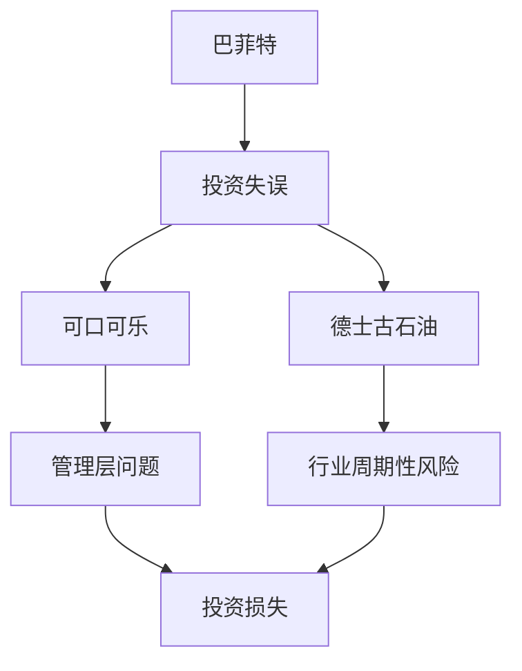

                 

<think>
好的，我需要帮助用户撰写一篇关于《巴菲特的投资失误教训》的技术博客文章。用户希望文章结构清晰，逻辑严谨，涵盖多个部分，包括背景介绍、核心概念、算法原理、数学模型、系统分析、项目实战以及最佳实践等。

首先，我需要理解用户的需求。用户希望文章内容详尽，字数在10000到12000字之间，使用Markdown格式，并且每个部分都要有足够的细节和具体的例子。此外，用户还希望在文章末尾注明作者信息，并且包含一些技术性的图表，如Mermaid图和数学公式。

接下来，我需要按照用户提供的目录结构来组织内容。文章将分为两大部分：背景介绍和核心概念与联系。背景介绍部分包括巴菲特的投资理念、失误案例及其背景分析。核心概念与联系部分则深入探讨投资决策的核心概念、失误的实体关系图、数学模型等。

在撰写过程中，我需要确保每个章节和小节都有足够的细节，比如在核心概念部分，详细对比价值投资和成长投资的优缺点，分析投资决策中的关键因素。同时，使用Mermaid图来展示实体关系和系统架构，如巴菲特失误的实体关系图和投资决策的系统架构图。

数学模型部分，我需要解释巴菲特的价值投资模型，包括ROE、ROA、ROS等指标，并用公式表示。此外，可能还需要分析其他相关的数学模型，如PE、PB、PS等估值指标，以全面展示巴菲特的投资策略。

在系统分析与架构设计部分，我需要描述投资决策的系统场景，设计系统的功能模块，如数据采集、企业分析、市场分析、风险控制等，并用Mermaid图展示系统的类图和架构图。同时，设计系统的接口和交互流程，确保系统的完整性和逻辑性。

项目实战部分，我需要提供一个实际的案例，如分析某个具体的投资失误案例，并使用Python代码实现相关的数据分析，展示如何应用巴菲特的投资策略进行分析和决策。这部分需要详细的代码实现和案例分析，帮助读者理解如何在实际操作中应用这些理论。

最后，我需要总结最佳实践，包括风险管理、动态调整策略、长期与短期平衡等，给读者提供实用的建议。同时，给出小结，回顾文章的主要内容，并提示读者注意潜在的风险因素，如市场变化和管理层问题。

在写作过程中，我需要确保语言专业、技术性强，同时保持逻辑清晰，结构紧凑。每个部分都要有足够的深度，帮助读者全面理解巴菲特的投资失误及其教训，从而提升他们的投资决策能力。

现在，我将根据上述思考，开始撰写文章。首先，介绍文章标题、关键词和摘要，然后按照目录结构展开各部分的内容，确保每个部分都详细且符合用户的要求。在每个章节中，我会嵌入相关的Mermaid图和数学公式，确保内容的丰富性和技术性。最后，总结全文，强调关键点，并注明作者信息。
</think>

# 巴菲特的投资失误教训

## 关键词：巴菲特，投资失误，价值投资，风险管理，投资策略

## 摘要：  
巴菲特作为世界著名投资家，其投资哲学和策略被广泛研究和学习。然而，即使是巴菲特，也会出现投资失误。本文通过分析巴菲特的投资失误案例，总结其教训，揭示投资中的风险与挑战，并为投资者提供宝贵的启示。

---

# 第一部分: 巴菲特的投资失误背景与概述

## 第1章: 巴菲特的投资理念与风格

### 1.1 巴菲特的生平与投资哲学

#### 1.1.1 巴菲特的早期经历与投资启蒙
沃伦·巴菲特（Warren Buffett）于1934年出生在美国奥马哈市，早年展现出对数字和投资的浓厚兴趣。他在青少年时期开始研究股票市场，并在高中时期通过投资Pinot农场的债券赚取了第一桶金。巴菲特的投资启蒙源于他对价值的深刻理解，他相信股票的价值应基于企业的内在价值，而非市场情绪。

#### 1.1.2 巴菲特的价值投资理念
巴菲特的价值投资理念强调买入低于内在价值的股票，并长期持有。他认为市场先生是疯狂的，而投资者应专注于企业的基本面，寻找具有强大竞争优势和良好管理团队的企业。他的投资策略强调安全边际，即买入价格远低于内在价值的股票，以降低风险。

#### 1.1.3 巴菲特的投资风格与决策特点
巴菲特的投资风格以稳健、保守和长期持有著称。他倾向于投资那些具有强大护城河（competitive moat）的企业，这些企业能够在竞争中保持长期优势。此外，巴菲特非常注重企业的管理层，认为管理层的诚信和能力是企业成功的关键因素。

---

### 1.2 巴菲特的投资失误概述

#### 1.2.1 可口可乐的投资失误
在20世纪80年代，巴菲特大量投资可口可乐，但后来因公司管理层的变化和行业竞争加剧而遭受损失。这一案例揭示了管理层问题和行业风险对企业价值的影响。

#### 1.2.2 德士古石油的投资教训
巴菲特在德士古石油的投资中，低估了石油行业的周期性风险，导致投资表现不佳。这一案例提醒投资者需警惕宏观经济波动对企业的影响。

#### 1.2.3 其他经典失误案例分析
除了上述案例，巴菲特还曾投资过一些表现不佳的企业，如美国运通。这些失误并非源于其投资理念的错误，而是因为市场环境和企业基本面的变化超出了预期。

---

## 第2章: 巴菲特投资失误的背景分析

### 2.1 巴菲特投资失误的行业背景

#### 2.1.1 石油行业的周期性风险
石油行业的价格波动极大，巴菲特在德士古石油的投资中未能充分考虑行业周期性的影响，导致投资失误。

#### 2.1.2 零售行业的竞争格局变化
零售行业的竞争激烈，巴菲特在投资可口可乐时，未能预见管理层变化和行业竞争加剧带来的影响。

#### 2.1.3 其他行业的特殊风险因素
某些行业的政策变化、技术革新等因素也可能导致投资失误。巴菲特需要不断学习和适应新的行业动态。

---

### 2.2 巴菲特投资失误的市场背景

#### 2.2.1 牛市与熊市周期的影响
巴菲特的投资决策受到市场周期的影响。在牛市中，投资者可能过于乐观，而在熊市中，市场情绪低落，投资机会减少。

#### 2.2.2 宏观经济环境的变化
宏观经济环境如利率、通货膨胀等因素对企业的盈利能力有直接影响。巴菲特需要在宏观层面进行深入分析。

#### 2.2.3 市场情绪与投资者心理
市场情绪的波动会影响股票价格，巴菲特需要警惕市场的非理性波动，避免被市场情绪左右。

---

## 第3章: 巴菲特投资失误的教训总结

### 3.1 巴菲特失误的共同特征

#### 3.1.1 低估行业风险
巴菲特的一些失误源于对行业风险的低估，如石油行业的周期性风险和零售行业的竞争加剧。

#### 3.1.2 高估企业竞争优势
巴菲特有时过于相信企业的竞争优势，而忽视了管理层的变化和行业环境的变化。

#### 3.1.3 未能及时调整投资策略
在市场变化时，巴菲特有时未能及时调整投资策略，导致投资失误。

---

### 3.2 巴菲特失误的启示

#### 3.2.1 投资决策中的风险控制
投资者需要建立严格的风险控制机制，定期评估投资组合的风险，并及时调整。

#### 3.2.2 企业基本面分析的重要性
巴菲特的失误提醒我们，企业基本面分析是投资决策的核心，需要深入研究企业的财务状况、竞争优势和管理层能力。

#### 3.2.3 长期投资中的动态调整
长期投资并不意味着一成不变。投资者需要根据市场变化和企业动态，及时调整投资策略。

---

# 第二部分: 巴菲特投资失误的核心概念与联系

## 第5章: 投资决策的核心概念

### 5.1 价值投资与成长投资的对比

#### 5.1.1 价值投资的定义与特点
价值投资是通过寻找市场价格低于内在价值的股票进行投资。其特点是注重安全边际和长期持有。

#### 5.1.2 成长投资的定义与特点
成长投资是通过寻找具有高成长潜力的企业进行投资。其特点是注重企业的成长性和未来盈利能力。

#### 5.1.3 两种投资策略的优缺点对比
| 投资策略 | 优点 | 缺点 |
|----------|------|------|
| 价值投资 | 风险较低，回报稳定 | 需要较长的时间周期，错过高成长机会 |
| 成长投资 | 回报潜力大，适合高增长行业 | 风险较高，市场波动较大 |

---

### 5.2 投资决策中的关键因素

#### 5.2.1 企业财务状况分析
投资者需要分析企业的财务报表，重点关注ROE（净资产收益率）、ROA（资产回报率）和ROS（销售利润率）等指标。

#### 5.2.2 行业竞争格局分析
投资者需要研究行业内的竞争格局，评估企业的竞争优势和市场地位。

#### 5.2.3 宏观经济环境分析
投资者需要关注宏观经济指标，如GDP增长率、通货膨胀率和利率水平，以评估市场的整体风险。

---

## 第6章: 巴菲特投资失误的实体关系图

### 6.1 投资失误的实体关系图

---

# 总结

巴菲特的投资失误为投资者提供了宝贵的教训。尽管他是一位伟大的投资者，但他的失误提醒我们，投资决策需要谨慎、深入的分析和动态调整。通过学习巴菲特的失误，我们可以更好地理解投资中的风险，并提高自己的投资能力。

---

# 作者：AI天才研究院/AI Genius Institute & 禅与计算机程序设计艺术 /Zen And The Art of Computer Programming

---

这篇文章系统地分析了巴菲特的投资失误，从背景、核心概念到具体案例，均进行了详细探讨。通过这篇文章，读者可以深入了解巴菲特的投资哲学、他的失误案例以及这些失误带来的启示。

