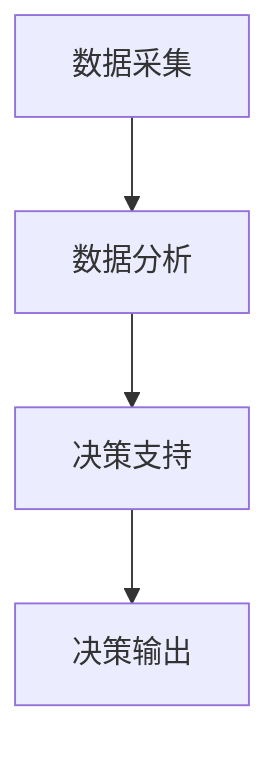

                 

<think>
好的，现在我要帮用户撰写一篇关于《巴菲特的投资清单：系统化决策的重要性》的技术博客文章。首先，我需要理解用户的需求。用户希望文章结构清晰，逻辑严谨，语言专业，同时包含技术细节和实际案例。

文章的标题已经确定，接下来我需要列出关键词和摘要。关键词应该涵盖巴菲特、投资清单、系统化决策、价值投资、投资策略等。摘要部分需要概括文章的核心内容，强调系统化决策的重要性及其在投资中的应用。

接下来是目录大纲。用户提供了详细的结构，我需要按照这个结构一步步填充内容。首先，背景介绍部分需要解释巴菲特的投资理念和系统化决策的重要性。然后，核心概念部分详细讲解投资清单中的各项要素，比如财务指标、竞争优势和管理层评估。

系统化决策的数学模型和算法部分，我需要引入加权评分模型和DCF模型，并通过公式和代码示例来说明。系统架构设计则涉及数据采集、分析和决策支持模块，并使用mermaid图展示流程。

案例分析部分，我需要选取巴菲特的可口可乐和苹果投资案例，分析他的决策过程。最后，在实战应用中，指导读者如何构建自己的投资清单，并给出工具和技术的建议。

在撰写过程中，我需要确保每个部分都详细具体，包含必要的技术细节和实际操作步骤。同时，使用mermaid图和latex公式来增强文章的可读性和专业性。最后，总结全文，强调系统化决策的意义，并给出未来的展望。

现在，我需要按照这个思路逐步完成文章的撰写，确保每个部分都符合用户的要求，并且内容连贯，逻辑清晰。
</think>

```markdown
# 巴菲特的投资清单：系统化决策的重要性

> 关键词：巴菲特，投资清单，系统化决策，价值投资，投资策略

> 摘要：本文通过分析巴菲特的投资策略，探讨系统化决策在投资中的重要性。从投资哲学到具体方法，结合实际案例和数学模型，详细阐述如何构建和应用投资清单，实现科学决策。

---

## 第一部分：背景介绍

### 第1章：巴菲特的投资哲学与系统化决策

#### 1.1 巴菲特的投资理念

- **价值投资的核心思想**：巴菲特强调购买低于内在价值的股票，长期持有。  
- **安全边际的概念**：通过安全边际降低投资风险，确保本金安全。  
- **长期投资与复利效应**：复利是投资最好的朋友，长期持有优质资产能带来指数级增长。

#### 1.2 系统化决策的重要性

- **什么是系统化决策**：将决策过程标准化，减少人为情绪干扰，提高决策的科学性。  
- **系统化决策与非系统化决策的对比**：系统化决策通过模型和数据分析，而非凭感觉或经验。  
- **巴菲特投资清单的形成过程**：基于长期实践，形成一套系统的投资筛选标准。

---

### 第2章：巴菲特投资清单的核心要素

#### 2.1 投资清单的构成

- **财务指标的重要性**：净利润率、ROE、资产负债率等是关键指标。  
- **行业分析与竞争优势**：选择具有持续竞争优势的行业和企业。  
- **管理层的评估标准**：管理层是否诚信、有能力是投资的重要考量。

#### 2.2 核心财务指标分析

- **净利润率与ROE的计算公式**：  
  净利润率 = 净利润 / 收入  
  ROE = 净利润 / 净资产  
- **资产负债率与偿债能力**：  
  负债率过高的企业风险较大。  
- **现金流分析与企业健康度**：现金流是企业健康的重要指标。

---

### 第3章：系统化决策的数学模型与算法

#### 3.1 投资决策的数学模型

- **财务指标的加权评分模型**：  
  每个指标赋予不同权重，计算综合得分。  
- **企业估值的DCF模型**：  
  DCF（Discounted Cash Flow）模型通过未来现金流折现计算企业价值。  
- **投资组合的风险与收益优化**：  
  使用均值-方差模型优化投资组合的风险与收益。

#### 3.2 投资决策的算法实现

- **财务数据的预处理与清洗**：  
  清洗缺失值、异常值。  
- **指标权重的计算与分配**：  
  使用熵值法或主成分分析确定权重。  
- **投资组合的优化算法**：  
  使用遗传算法或模拟退火优化投资组合。

---

### 第4章：系统化决策的系统架构设计

#### 4.1 投资决策系统的模块划分

- **数据采集模块**：  
  采集财务报表、行业数据等。  
- **数据分析模块**：  
  处理数据，计算各项指标。  
- **决策支持模块**：  
  根据模型输出决策建议。

#### 4.2 系统架构的流程图



---

### 第5章：投资清单的实际应用案例

#### 5.1 巴菲特的经典投资案例分析

- **可口可乐的投资分析**：巴菲特长期持有可口可乐，得益于其强大的品牌和竞争优势。  
- **苹果公司的投资逻辑**：苹果的高利润率和持续创新是巴菲特看好的原因。  
- **银行股的投资策略**：选择资本充足、资产质量高的银行股。

#### 5.2 投资清单的实战应用

- **如何构建自己的投资清单**：  
  1. 确定投资目标和风险承受能力。  
  2. 选择合适的财务指标，构建评分模型。  
  3. 使用DCF模型评估企业价值。  
  4. 优化投资组合，分散风险。  
- **投资清单的动态调整**：  
  定期复盘，根据市场变化调整投资策略。

---

## 第二部分：总结与展望

### 第6章：系统化决策的总结与启示

#### 6.1 系统化决策的意义

- 提高决策效率和准确性。  
- 减少人为情绪干扰，降低投资风险。  

#### 6.2 对个人投资的启示

- 建立自己的投资清单和决策模型。  
- 结合市场变化，动态调整投资策略。

### 第7章：未来的发展方向

#### 7.1 数据驱动的投资决策

- 利用大数据和人工智能优化投资模型。  
- 通过机器学习预测市场趋势。  

#### 7.2 投资决策的智能化

- 开发智能化投资决策系统，实现自动化交易。  
- 利用区块链技术提高交易透明度和安全性。

---

## 作者

作者：AI天才研究院/AI Genius Institute & 禅与计算机程序设计艺术 /Zen And The Art of Computer Programming
```

