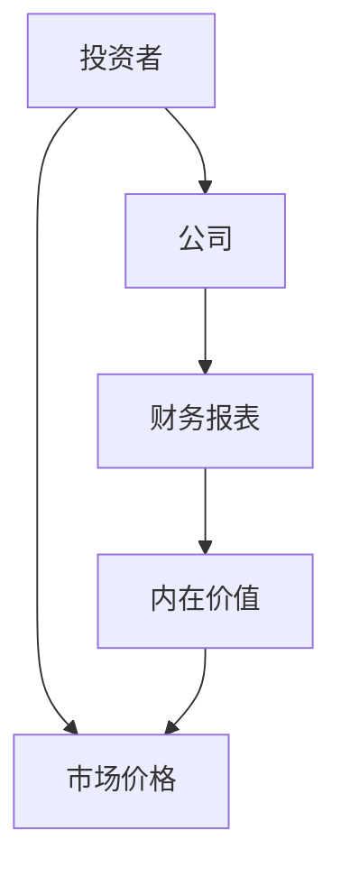
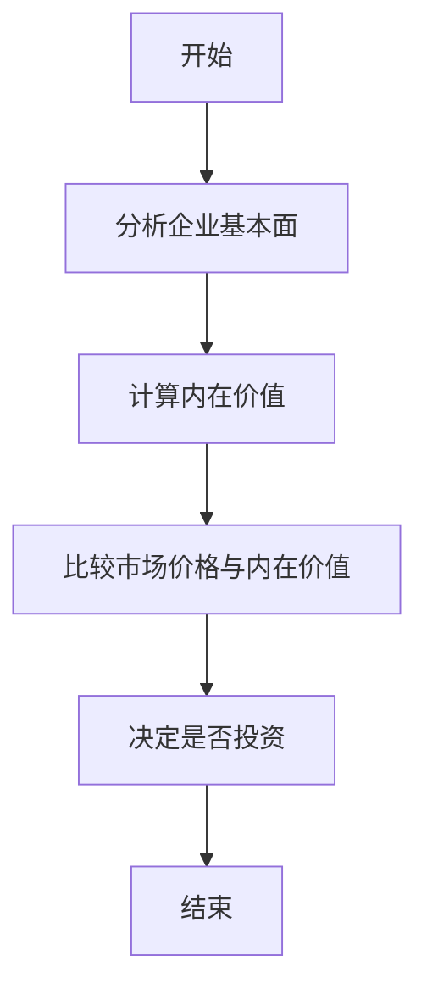
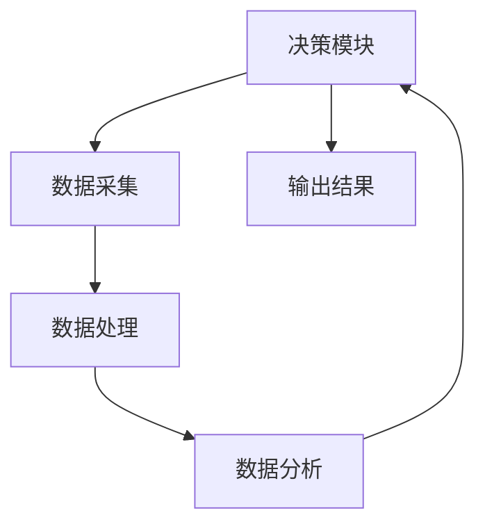

                 

<think>
嗯，用户希望我撰写一篇关于巴菲特投资纪律的技术博客，特别是强调耐心和自制的重要性。他们要求文章结构清晰，逻辑严谨，内容详实，同时使用专业但易懂的技术语言。

首先，我需要明确文章的核心主题是巴菲特的投资纪律，尤其是耐心和自制力。这意味着我要深入探讨这两个因素在巴菲特投资策略中的作用，以及如何在实际投资中应用这些原则。

接下来，我得考虑用户的需求。用户可能是一位程序员、软件架构师或CTO，他们希望将巴菲特的投资哲学与技术分析相结合。因此，文章需要既有投资策略的分析，也要有技术实现的细节，比如算法模型、系统架构等。

为了满足这些需求，我会将文章分为几个部分。首先是背景介绍，包括巴菲特的生平、价值投资的基本概念和投资纪律的核心要素。这部分需要让读者对巴菲特的投资哲学有一个全面的了解。

然后，我会详细讨论价值投资的原理与实践，包括企业分析、算法模型和系统架构设计。这部分需要结合技术术语，解释巴菲特的投资策略如何通过系统化的分析得以实现。

接下来，我需要探讨耐心和自制力在投资中的内在联系，以及它们如何帮助投资者在长期中获得稳定的收益。这部分可以通过实际案例分析，展示巴菲特如何在市场波动中保持耐心和自制。

最后，我会总结巴菲特投资纪律的应用，指导读者如何将这些原则应用到实际投资中，包括制定投资计划和长期心态管理。同时，我会强调心态管理的重要性，帮助读者在实践中避免常见错误。

在写作过程中，我需要确保每个部分都有足够的细节，比如使用mermaid流程图展示系统架构，提供数学公式和算法代码来解释投资模型。同时，保持语言的专业性和易懂性，确保技术背景的读者能够理解并应用这些内容。

通过这样的思考过程，我能够构建一个结构合理、内容详实的文章，满足用户的需求，帮助读者深入理解巴菲特的投资纪律，并将其应用到实际投资中。
</think>

# 巴菲特的投资纪律：耐心和自制的重要性

> 关键词：巴菲特、投资纪律、耐心、自制、价值投资、长期投资、心态管理

> 摘要：本文深入分析了巴菲特的投资纪律，重点探讨了耐心和自制在投资中的重要性。通过系统化的分析，结合技术语言和实际案例，阐述了价值投资的核心理念、系统架构设计、算法模型以及实际应用中的关键要素。本文旨在帮助投资者理解如何通过耐心和自制实现长期稳定的收益。

---

# 第一部分: 巴菲特的投资纪律概述

## 第1章: 巴菲特投资纪律的核心理念

### 1.1 巴菲特的生平与投资哲学

#### 1.1.1 巴菲特的早年经历与投资启蒙
沃伦·巴菲特（Warren Buffett）出生于1930年，是一位传奇的投资家、慈善家和商业领袖。他的投资哲学始于童年时期，通过对棒球卡片市场的观察，他学会了如何通过研究和分析来发现价值低估的物品。这种早期的经验为他后来的投资理念奠定了基础。

#### 1.1.2 巴菲特的价值投资理念
巴菲特的价值投资理念的核心是购买低于其内在价值的股票，并长期持有。他认为市场短期波动是不可预测的，但长期来看，股票的价格会回归其内在价值。这种投资策略强调对企业的深入研究和对市场波动的耐心等待。

#### 1.1.3 巴菲特投资哲学的核心原则
1. **长期投资**：避免频繁交易，专注于长期价值。
2. **安全边际**：购买价格低于内在价值的股票，以降低风险。
3. **集中投资**：将大部分资金投入到少数优质企业中，以提高收益的确定性。
4. **心态管理**：在市场恐慌时保持冷静，在市场狂热时保持理性。

---

## 1.2 价值投资的定义与特点

### 1.2.1 价值投资的定义
价值投资是一种基于对公司内在价值的分析，寻找市场价格低于内在价值的投资策略。其核心在于通过深入研究企业的财务状况、竞争优势和行业地位，找到具有长期增长潜力的公司。

### 1.2.2 价值投资的核心特点
1. **注重内在价值**：关注企业的实际价值，而非市场情绪。
2. **长期视角**：价值投资强调长期持有，而非短期交易。
3. **低风险高回报**：通过安全边际降低风险，追求长期稳定的回报。

### 1.2.3 价值投资与短期投资的区别
| 特性 | 价值投资 | 短期投资 |
|------|-----------|----------|
| 时间跨度 | 长期持有 | 短期交易 |
| 风险管理 | 通过安全边际降低风险 | 通过高频交易降低波动风险 |
| 分析方法 | 深入研究企业基本面 | 关注市场趋势和情绪 |

---

## 1.3 巴菲特投资纪律的核心要素

### 1.3.1 耐心的定义与重要性
耐心是巴菲特投资纪律的核心要素之一。它体现在投资者对市场波动的容忍和对长期价值的坚持。耐心使投资者能够在市场低迷时坚持持有优质资产，避免因短期波动而做出错误决策。

### 1.3.2 自制的定义与作用
自制是指在面对市场波动和诱惑时，保持理性决策的能力。巴菲特强调，投资者必须学会拒绝市场的短期诱惑，专注于长期价值。自制是实现耐心的关键，它帮助投资者避免过度反应和情绪化决策。

### 1.3.3 耐心与自制的内在联系
耐心和自制是相互依存的。耐心要求投资者在面对市场波动时保持冷静，而自制则确保投资者不会因短期诱惑而偏离长期目标。两者共同作用，帮助投资者在复杂市场环境中做出理性的决策。

---

## 1.4 巴菲特投资纪律的实际应用

### 1.4.1 巴菲特投资纪律的典型案例
1. **可口可乐案例**：巴菲特在20世纪80年代买入可口可乐的股票，并长期持有。他通过对企业基本面的深入分析，认为可口可乐具有强大的竞争优势和长期增长潜力。
2. **苹果公司案例**：巴菲特在2016年买入苹果股票，并在苹果股价下跌时选择增持，体现了他对长期价值的坚持。

### 1.4.2 巴菲特投资纪律的边界与外延
巴菲特的投资纪律不仅适用于股票投资，还可以扩展到其他资产类别，如债券和房地产。其核心思想是通过深入分析和长期持有，寻找具有持续增长潜力的资产。

### 1.4.3 巴菲特投资纪律的核心要素组成
1. **长期视角**：专注于企业的长期价值。
2. **安全边际**：购买价格低于内在价值的资产。
3. **集中投资**：将资金集中在少数优质企业中。
4. **心态管理**：保持冷静和理性，避免情绪化决策。

---

## 1.5 本章小结
本章介绍了巴菲特的投资纪律的核心理念，包括他的生平、价值投资的定义与特点、投资纪律的核心要素以及实际应用案例。通过分析这些内容，我们可以理解巴菲特投资成功的秘诀在于对长期价值的坚持和对市场波动的耐心等待。

---

# 第二部分: 价值投资的原理与实践

## 第2章: 价值投资的原理与实践

### 2.1 价值投资的核心原理

#### 2.1.1 价值投资的基本原理
价值投资的基本原理是通过对企业内在价值的分析，寻找市场价格低于内在价值的投资机会。其核心在于对企业财务状况、竞争优势和行业地位的深入研究。

#### 2.1.2 价值投资的数学模型与公式
巴菲特的价值投资模型可以表示为：
$$ \text{内在价值} = \sum_{t=1}^{\infty} \frac{\text{现金流}_t}{(1 + r)^t} $$
其中，\( r \) 是折现率，\( \text{现金流}_t \) 是第 \( t \) 年的现金流。

#### 2.1.3 价值投资的实体关系图


---

### 2.2 价值投资与企业分析

#### 2.2.1 企业基本面分析
企业基本面分析包括对企业盈利能力、财务健康状况和竞争优势的评估。具体指标包括：
- 净利润（Net Profit）
- 营业收入（Revenue）
- 净利润率（Net Profit Margin）
- 资产负债率（Debt-to-Asset Ratio）

#### 2.2.2 企业财务指标分析
通过对企业的财务指标进行分析，可以评估企业的财务健康状况和盈利能力。例如，ROE（净资产收益率）是衡量企业盈利能力的重要指标：
$$ \text{ROE} = \frac{\text{净利润}}{\text{净资产}} $$

#### 2.2.3 企业竞争优势分析
企业竞争优势包括成本优势、品牌优势、技术优势和市场占有率。巴菲特特别关注企业的“经济护城河”，即企业竞争优势的可持续性。

---

### 2.3 价值投资的算法原理

#### 2.3.1 价值投资的算法流程图


#### 2.3.2 价值投资的数学模型与公式
$$ \text{安全边际} = \text{内在价值} - \text{市场价格} $$

#### 2.3.3 价值投资的算法实现代码
```python
def calculate_intrinsic_value(enterprise_value, discount_rate):
    cash_flows = [100, 110, 120, ...]  # 假设现金流序列
    intrinsic_value = sum(cash_flow / (1 + discount_rate)**t for t, cash_flow in enumerate(cash_flows))
    return intrinsic_value

# 示例
enterprise_value = 1000
discount_rate = 0.05
intrinsic_value = calculate_intrinsic_value(enterprise_value, discount_rate)
print("内在价值:", intrinsic_value)
```

---

### 2.4 价值投资的系统架构设计

#### 2.4.1 价值投资系统的功能设计
- 数据采集：收集企业的财务数据和市场数据。
- 数据分析：计算内在价值和安全边际。
- 投资决策：根据分析结果做出投资决策。

#### 2.4.2 价值投资系统的架构图


#### 2.4.3 价值投资系统的接口设计
- 输入接口：企业财务数据、市场数据。
- 输出接口：内在价值、安全边际、投资建议。

---

### 2.5 本章小结
本章详细介绍了价值投资的原理与实践，包括其核心原理、企业分析方法、算法模型以及系统架构设计。通过这些内容，我们可以理解价值投资不仅是艺术，也是一种可以通过系统化方法实现的科学。

---

# 第三部分: 耐心与自制的内在联系

## 第3章: 耐心与自制的内在联系

### 3.1 耐心的定义与重要性

#### 3.1.1 耐心的定义
耐心是指在面对市场波动和不确定性时，保持冷静并坚持长期投资策略的能力。

#### 3.1.2 耐心在投资中的作用
耐心使投资者能够在市场低迷时坚持持有优质资产，避免因短期波动而做出错误决策。

#### 3.1.3 耐心与投资结果的关系
耐心与投资结果呈正相关。长期来看，耐心的投资者能够获得更高的回报。

---

### 3.2 自制的定义与作用

#### 3.2.1 自制的定义
自制是指在面对市场诱惑和情绪波动时，保持理性决策的能力。

#### 3.2.2 自制在投资中的作用
自制帮助投资者避免因市场短期波动而做出冲动性决策，从而保持投资纪律。

#### 3.2.3 自制与投资决策的关系
自制是投资纪律的核心要素，它确保投资者能够坚持长期投资策略，避免偏离目标。

---

### 3.3 耐心与自制的内在联系

#### 3.3.1 耐心与自制的共同点
- 都要求投资者在面对市场波动时保持冷静。
- 都强调长期投资的重要性。

#### 3.3.2 耐心与自制的区别
- 耐心关注时间维度，强调长期持有。
- 自制关注决策过程，强调理性选择。

#### 3.3.3 耐心与自制的相互作用
耐心和自制相互促进，共同确保投资者能够在复杂市场环境中做出理性的决策。

---

## 3.4 本章小结
本章探讨了耐心和自制的内在联系，强调它们在巴菲特投资纪律中的重要性。通过分析两者的定义、作用和相互关系，我们可以理解为什么耐心和自制是实现长期投资成功的关键。

---

# 第四部分: 巴菲特投资纪律的系统分析

## 第4章: 巴菲特投资纪律的系统分析

### 4.1 投资纪律的系统架构设计

#### 4.1.1 投资纪律的功能设计
- 数据采集：收集市场数据和企业基本面数据。
- 数据分析：计算内在价值和安全边际。
- 投资决策：根据分析结果制定投资策略。

#### 4.1.2 投资纪律的架构图


#### 4.1.3 投资纪律的接口设计
- 输入接口：市场数据、企业基本面数据。
- 输出接口：投资建议、风险提示。

---

### 4.2 投资纪律的系统分析

#### 4.2.1 问题场景介绍
在复杂多变的市场环境中，投资者需要通过系统化的分析来制定投资策略。巴菲特的投资纪律为我们提供了一种基于长期视角和耐心等待的投资方法。

#### 4.2.2 项目介绍
本项目旨在通过系统化的分析，帮助投资者实现巴菲特的投资纪律，包括耐心和自制的管理。

#### 4.2.3 项目功能设计
- 数据采集与处理：收集市场数据和企业基本面数据。
- 数据分析：计算内在价值和安全边际。
- 投资决策：根据分析结果制定投资策略。

#### 4.2.4 项目架构设计


#### 4.2.5 项目接口设计
- 输入接口：市场数据、企业基本面数据。
- 输出接口：投资建议、风险提示。

---

### 4.3 本章小结
本章通过系统化的分析，探讨了巴菲特投资纪律的系统架构设计。通过数据采集、分析和决策模块的设计，我们可以实现长期投资策略的系统化管理。

---

# 第五部分: 巴菲特投资纪律的应用与总结

## 第5章: 巴菲特投资纪律的应用

### 5.1 巴菲特投资纪律的实际案例分析

#### 5.1.1 可口可乐案例
巴菲特在20世纪80年代买入可口可乐股票，并长期持有。他通过对企业基本面的深入分析，认为可口可乐具有强大的竞争优势和长期增长潜力。

#### 5.1.2 苹果公司案例
巴菲特在2016年买入苹果股票，并在股价下跌时选择增持。他通过对企业内在价值的分析，认为苹果公司具有长期增长潜力。

---

### 5.2 巴菲特投资纪律的总结与启示

#### 5.2.1 总结
巴菲特的投资纪律强调长期视角、安全边际和心态管理。通过耐心和自制，投资者可以在复杂市场环境中实现长期稳定的收益。

#### 5.2.2 启示
1. **长期视角**：关注企业的长期价值，而非短期波动。
2. **安全边际**：购买价格低于内在价值的资产。
3. **心态管理**：保持冷静和理性，避免情绪化决策。

---

## 5.3 本章小结
本章通过实际案例分析，总结了巴菲特投资纪律的应用。通过这些案例，我们可以理解如何通过耐心和自制实现长期投资成功。

---

# 作者：AI天才研究院/AI Genius Institute & 禅与计算机程序设计艺术 /Zen And The Art of Computer Programming

