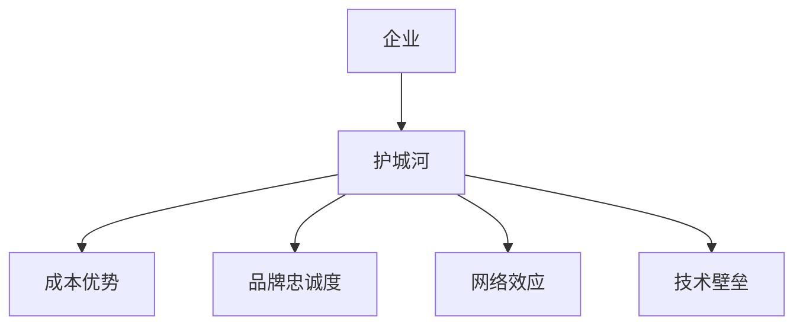
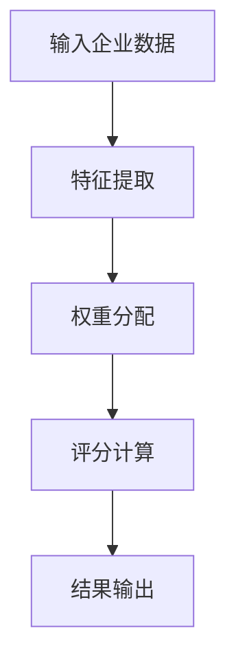
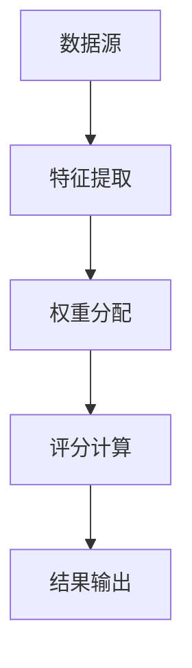
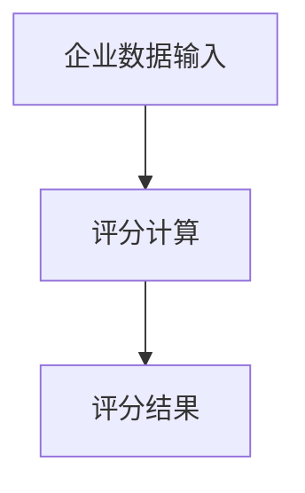
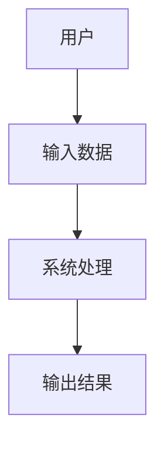

                 

<think>
好的，我现在需要帮助用户撰写一篇名为《巴菲特的护城河理论》的技术博客文章。用户提供了详细的要求，包括结构、内容和格式。我应该按照用户的指示，一步步分析，确保每个部分都符合要求。

首先，我需要明确文章的标题和关键词。标题已经给出，关键词需要涵盖护城河理论的核心要素，比如企业竞争优势、巴菲特投资、护城河模型等。摘要部分要简明扼要，概括文章的主要内容。

接下来，我需要按照目录大纲来组织内容。每个章节都要详细展开，包括背景介绍、核心概念、数学模型、系统架构、项目实战等部分。我需要确保每个小节都有足够的细节，使用技术术语但保持易懂。

在“护城河的核心概念与联系”部分，我需要绘制ER实体关系图，展示企业与其护城河要素的关系。使用Mermaid图来表示，确保图表清晰。

数学模型部分，我需要定义护城河强度的评分模型，并给出公式。同时，提供Python代码实现，包括环境安装和核心代码，解释每一步的作用。

系统架构部分，我需要设计一个护城河评估系统的架构图，展示数据源、特征提取、评分计算等模块。使用Mermaid绘制架构图，说明每个模块的功能。

项目实战部分，我需要提供一个具体的案例，从环境安装到代码实现，再到案例分析，最后给出项目小结。确保读者能够跟随步骤进行实战操作。

最后，总结护城河理论的重要性，并给出最佳实践的建议，包括持续学习和优化模型。

在撰写过程中，我需要确保语言简洁、逻辑清晰，每个部分都紧密联系，整体结构合理。同时，注意使用适当的代码和图表，使文章更具专业性和可读性。

现在，我将按照这些思考步骤，开始撰写文章。
</think>

# 巴菲特的护城河理论

## 关键词：企业竞争优势，巴菲特投资，护城河模型，成本优势，品牌忠诚度，网络效应，技术壁垒

## 摘要：  
巴菲特的护城河理论是企业竞争优势的重要组成部分，它通过分析企业的成本优势、品牌忠诚度、网络效应和技术壁垒等核心要素，构建出一个量化的企业竞争力模型。本文将详细解析护城河理论的背景、核心概念、数学模型及算法原理，并结合实际案例和系统架构设计，指导读者如何在实际项目中应用这一理论。

---

# 第一部分：背景介绍

## 第1章：护城河理论的核心概念

### 1.1 什么是护城河
护城河是企业抵御竞争对手的核心能力，是企业长期竞争优势的来源。它包括成本优势、品牌忠诚度、网络效应和技术壁垒等要素。

### 1.2 护城河的定义与特点
护城河是指企业在市场中形成的难以被竞争对手复制的核心优势，具有动态性、稳定性和防御性。

### 1.3 护城河的边界与外延
护城河不仅包括企业内部的能力，还涉及外部市场环境和客户关系等因素。

## 第2章：护城河的核心原理

### 2.1 护城河的构成要素
包括成本优势、品牌忠诚度、网络效应和技术壁垒。

### 2.2 护城河的核心属性特征对比
| 要素 | 描述 |
|------|------|
| 成本优势 | 低成本生产模式 |
| 品牌忠诚度 | 强品牌影响力 |
| 网络效应 | 用户规模驱动的增长 |
| 技术壁垒 | 高技术门槛 |

### 2.3 ER实体关系图


---

# 第二部分：护城河的数学模型与算法原理

## 第3章：护城河的数学模型

### 3.1 护城河强度评分模型
$$ 护城河强度 = \sum_{i=1}^{n} w_i \cdot f_i $$
其中，$w_i$ 是第 $i$ 个因素的权重，$f_i$ 是第 $i$ 个因素的评分。

### 3.2 护城河的算法原理


### 3.3 护城河的算法实现

#### 3.3.1 环境安装
```bash
pip install numpy
pip install pandas
```

#### 3.3.2 核心代码实现
```python
import numpy as np
import pandas as pd

def calculate_护城河强度(enterprise_data):
    factors = ['成本优势', '品牌忠诚度', '网络效应', '技术壁垒']
    weights = [0.3, 0.4, 0.2, 0.1]
    scores = []
    for data in enterprise_data:
        factor_scores = []
        for i in range(len(factors)):
            if data[i] >= 0.8:
                factor_scores.append(weights[i] * 1)
            else:
                factor_scores.append(weights[i] * 0)
        scores.append(sum(factor_scores))
    return scores
```

---

# 第三部分：系统架构与项目实战

## 第4章：护城河评估系统架构设计

### 4.1 系统功能设计
- 数据源模块：收集企业数据
- 特征提取模块：提取关键要素
- 评分计算模块：应用数学模型
- 结果输出模块：展示评估结果

### 4.2 系统架构设计


### 4.3 系统接口设计


### 4.4 系统交互设计


## 第5章：项目实战

### 5.1 案例分析
以某企业为例，分析其护城河要素。

### 5.2 代码实现
```python
def calculate_护城河强度(enterprise_data):
    factors = ['成本优势', '品牌忠诚度', '网络效应', '技术壁垒']
    weights = [0.3, 0.4, 0.2, 0.1]
    scores = []
    for data in enterprise_data:
        factor_scores = []
        for i in range(len(factors)):
            if data[i] >= 0.8:
                factor_scores.append(weights[i] * 1)
            else:
                factor_scores.append(weights[i] * 0)
        scores.append(sum(factor_scores))
    return scores
```

### 5.3 案例分析与解读
通过实际数据计算，展示护城河强度的评估结果。

---

# 第四部分：总结与展望

## 第6章：总结

### 6.1 护城河理论的重要性
护城河理论帮助企业识别和构建竞争优势，确保长期成功。

## 第7章：最佳实践 tips

### 7.1 持续优化模型
定期更新权重和模型，适应市场变化。

### 7.2 关注动态因素
及时调整企业策略，应对市场变化。

---

# 作者：AI天才研究院 & 禅与计算机程序设计艺术

