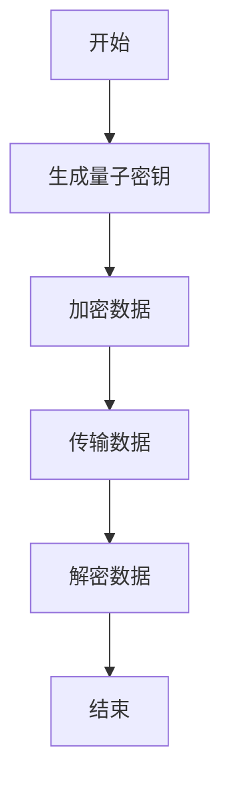
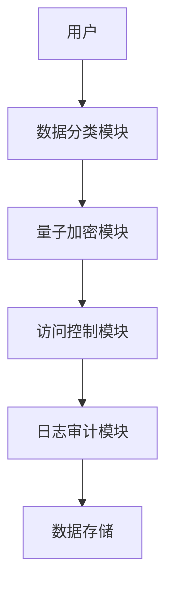
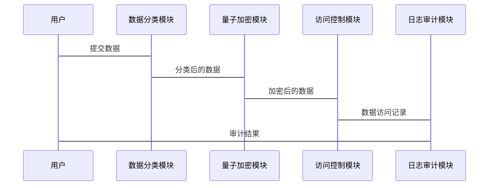

                 


# 巴菲特的护城河理论7.0：量子加密时代的数据主权

> 关键词：护城河理论、量子加密、数据主权、系统架构、算法设计

> 摘要：本文探讨了巴菲特的护城河理论在量子加密时代的演变，结合数据主权保护的需求，提出了护城河模型的设计与实现。通过量子加密技术的数学模型和系统架构分析，展示了如何利用护城河理论构建数据主权保护系统，提供了一种新的数据主权保护框架。

---

## 第1章: 巴菲特护城河理论的起源与演进

### 1.1 护城河理论的定义与核心要素

#### 1.1.1 护城河理论的定义

护城河理论由巴菲特提出，指企业通过构建不可复制的竞争优势（如品牌、技术、网络效应等）来保护自身利润。其核心在于通过建立壁垒，防止竞争对手侵蚀市场份额。

#### 1.1.2 护城河理论的核心要素

护城河理论的核心要素包括：

1. **经济型护城河**：通过规模效应、成本优势等降低成本，提高竞争力。
2. **无形资产**：如专利、商标、品牌价值等，形成市场准入壁垒。
3. **网络效应**：用户数量越多，平台价值越大，形成正反馈循环。
4. **物理护城河**：通过地理位置、资源控制等形成竞争优势。
5. **系统性护城河**：通过复杂系统和流程形成进入壁垒。

#### 1.1.3 护城河理论的边界与外延

护城河理论的应用并非无限制，其边界在于：

- **行业特性**：不同行业适用性不同，如技术驱动型行业更依赖无形资产。
- **动态变化**：护城河需要不断更新和维护，以应对技术进步和市场变化。
- **外部性**：护城河可能对社会产生负面影响，如垄断限制市场竞争。

---

### 1.2 护城河理论的演变历程

#### 1.2.1 从巴菲特到护城河理论7.0

护城河理论自提出以来，经历了多个版本的演变：

1. **1.0版本**：巴菲特提出的基本概念。
2. **2.0版本**：引入无形资产和网络效应。
3. **3.0版本**：加入系统化管理和流程优化。
4. **4.0版本**：融入技术驱动型竞争优势。
5. **5.0版本**：考虑全球化和多极市场环境。
6. **6.0版本**：结合数字化转型和数据驱动型优势。
7. **7.0版本**：在量子加密时代，加入数据主权保护因素。

#### 1.2.2 护城河理论在不同经济周期的适用性

护城河理论在不同经济周期的适用性：

- **经济繁荣期**：企业可通过护城河扩大市场份额。
- **经济衰退期**：护城河帮助企业抵御竞争压力。
- **技术变革期**：护城河需要不断更新以适应新技术。

#### 1.2.3 量子加密时代的护城河理论新特征

量子加密时代，护城河理论的新特征包括：

- **数据主权保护**：护城河需要保护企业的数据主权。
- **量子安全性**：加密技术需要抵御量子计算机的攻击。
- **动态调整能力**：护城河模型需要灵活应对技术变化。

---

### 1.3 护城河理论与数据主权的关系

#### 1.3.1 数据主权的定义与重要性

数据主权是指数据的所有权和控制权归属于数据的拥有者，包括：

- **数据存储主权**：数据存储地的法律和监管要求。
- **数据访问主权**：数据访问权限的控制。
- **数据使用主权**：数据的使用方式和范围。

数据主权的重要性在于：

- **保护隐私**：防止数据泄露和滥用。
- **合规性**：满足法律法规要求。
- **竞争优势**：数据主权保护是企业核心竞争力的一部分。

#### 1.3.2 护城河理论如何保护数据主权

护城河理论通过以下方式保护数据主权：

- **数据加密**：使用量子加密技术保护数据。
- **访问控制**：通过多层次权限管理控制数据访问。
- **数据隔离**：将数据分散存储，降低被攻击风险。

#### 1.3.3 数据主权对护城河理论的影响

数据主权对护城河理论的影响：

- **扩展了护城河的内涵**：数据主权成为护城河的重要组成部分。
- **增加了技术复杂性**：需要新的技术手段来保护数据主权。
- **强化了竞争优势**：数据主权保护增强了企业的市场地位。

---

### 1.4 本章小结

本章介绍了护城河理论的起源、核心要素、演变历程，以及其与数据主权的关系。护城河理论在量子加密时代，需要结合数据主权保护的需求，进行更新和扩展。

---

## 第2章: 量子加密与数据主权的背景

### 2.1 量子加密技术的原理与特点

#### 2.1.1 量子加密的基本原理

量子加密基于量子力学的不确定性原理，利用量子态的不可克隆性，确保加密的安全性。其基本原理包括：

1. **量子态叠加**：量子信息可以同时处于多个状态。
2. **量子纠缠**：两个量子系统之间存在关联，一个系统的状态会立即影响另一个系统。
3. **不可克隆性**：无法在不干扰的情况下复制量子信息。

#### 2.1.2 量子加密的核心技术

量子加密的核心技术包括：

- **量子密钥分发（QKD）**：通过量子信道安全分发加密密钥。
- **量子隐形传态**：将量子信息从一个地点传送到另一个地点，保持其原始状态。
- **后量子密码学**：设计抗量子计算机攻击的加密算法。

#### 2.1.3 量子加密的安全性评估

量子加密的安全性评估包括：

- **抗量子攻击**：确保加密算法抵御量子计算机的破解。
- **密钥管理**：确保密钥的安全分发和存储。
- **协议安全性**：评估协议的漏洞和攻击可能性。

---

### 2.2 数据主权的挑战与机遇

#### 2.2.1 数据主权的定义与现状

数据主权的定义：

数据主权是指数据的所有者对数据拥有完全的控制权，包括存储、访问、使用和删除。现状：

- **全球数据流动**：数据跨境流动日益频繁，数据主权的保护面临挑战。
- **法律法规变化**：各国对数据主权的监管日益严格。
- **技术进步**：新技术（如区块链）为数据主权保护提供了新手段。

#### 2.2.2 量子加密对数据主权的威胁

量子加密对数据主权的威胁：

- **数据泄露风险**：如果加密技术被破解，数据主权可能受到威胁。
- **技术依赖**：依赖量子加密技术的企业可能面临技术垄断的风险。
- **监管挑战**：量子加密技术可能绕开某些国家的监管。

#### 2.2.3 数据主权的保护策略

数据主权的保护策略包括：

- **数据分类与分级**：根据数据的重要性和敏感性进行分类管理。
- **多层次加密**：使用多种加密技术保护数据。
- **国际合作与标准制定**：推动国际间的数据主权保护标准。

---

### 2.3 量子加密与数据主权的关联性分析

#### 2.3.1 量子加密对数据主权的影响

量子加密对数据主权的影响：

- **增强数据安全性**：量子加密技术可以提高数据安全性。
- **推动技术进步**：量子加密技术的发展促进了数据主权保护技术的进步。
- **加剧技术竞争**：量子加密技术的竞争可能影响数据主权的国际格局。

#### 2.3.2 数据主权对量子加密的需求

数据主权对量子加密的需求：

- **保护数据完整性**：确保数据在传输过程中不被篡改。
- **防止数据泄露**：使用量子加密技术保护数据不被未经授权的访问。
- **确保数据可用性**：通过加密技术保障数据在需要时可访问。

#### 2.3.3 量子加密时代的数据主权保护框架

量子加密时代的数据主权保护框架包括：

- **法律框架**：制定和实施数据主权保护的法律法规。
- **技术框架**：采用量子加密技术构建数据主权保护系统。
- **管理体系**：建立数据主权管理的组织架构和流程。

---

### 2.4 本章小结

本章分析了量子加密技术的原理和特点，探讨了数据主权的挑战与机遇，以及量子加密与数据主权的关联性。数据主权在量子加密时代需要新的保护框架，以应对技术变化和监管要求。

---

## 第3章: 护城河理论在数据主权中的应用

### 3.1 护城河理论的核心概念与联系

#### 3.1.1 护城河理论的核心概念

护城河理论的核心概念包括：

- **数据主权**：数据的控制权和使用权。
- **量子加密**：确保数据安全的技术手段。
- **系统架构**：数据主权保护系统的整体设计。

#### 3.1.2 护城河理论与数据主权的关系

护城河理论与数据主权的关系：

- **护城河理论是数据主权的保护手段**：通过构建护城河，保护数据主权。
- **数据主权是护城河的核心目标**：护城河模型的目标是保护数据主权。

#### 3.1.3 护城河模型的ER实体关系图

以下是护城河模型的ER实体关系图：

```mermaid
er
    actor: 用户
    system: 数据主权保护系统
    data: 数据
    role: 权限角色
    action: 操作
    rule: 访问控制规则

    actor --> system: 通过系统进行操作
    system --> data: 保护数据
    system --> role: 管理权限角色
    system --> action: 执行操作
    system --> rule: 应用访问控制规则
```

---

### 3.2 量子加密技术的数学模型与算法

#### 3.2.1 量子加密算法的数学模型

量子加密算法的数学模型包括：

- **密钥生成**：使用量子随机数生成器生成密钥。
- **加密过程**：通过量子态叠加和纠缠进行加密。
- **解密过程**：通过量子态测量还原密文。

数学模型如下：

$$
\text{密钥生成} \rightarrow \text{加密} \rightarrow \text{传输} \rightarrow \text{解密}
$$

#### 3.2.2 量子加密算法的流程图

以下是量子加密算法的流程图：



#### 3.2.3 量子加密算法的Python实现

以下是量子加密算法的Python实现：

```python
import random

def generate_quantum_key(length):
    # 生成随机密钥
    key = [random.choice([0, 1]) for _ in range(length)]
    return key

def quantum_encrypt(plaintext, key):
    # 简单的量子加密实现
    ciphertext = []
    for p, k in zip(plaintext, key):
        ciphertext.append(p ^ k)
    return ciphertext

def quantum_decrypt(ciphertext, key):
    # 解密过程
    plaintext = []
    for c, k in zip(ciphertext, key):
        plaintext.append(c ^ k)
    return plaintext

# 示例
plaintext = [0, 1, 0, 1]
key = generate_quantum_key(4)
ciphertext = quantum_encrypt(plaintext, key)
decrypted = quantum_decrypt(ciphertext, key)
print("明文:", plaintext)
print("密钥:", key)
print("密文:", ciphertext)
print("解密:", decrypted)
```

---

### 3.3 护城河模型的设计与实现

#### 3.3.1 护城河模型的框架设计

护城河模型的框架设计包括：

- **数据分类**：将数据按重要性分类。
- **访问控制**：基于角色的访问控制（RBAC）。
- **加密策略**：根据数据分类选择加密算法。

#### 3.3.2 护城河模型的量子加密算法选择

量子加密算法的选择需要考虑：

- **安全性**：能够抵御量子计算机攻击。
- **可实现性**：现有技术是否支持。
- **成本**：实施成本是否合理。

#### 3.3.3 护城河模型的数据主权实现机制

数据主权实现机制包括：

- **数据加密**：使用量子加密技术加密数据。
- **权限管理**：通过RBAC控制数据访问。
- **日志审计**：记录数据操作日志，便于追溯。

---

### 3.4 本章小结

本章详细探讨了护城河理论在数据主权中的应用，包括护城河模型的设计与实现，以及量子加密技术的应用。护城河模型通过数据分类、访问控制和加密策略，构建了数据主权保护系统。

---

## 第4章: 量子加密时代的数据主权保护系统

### 4.1 系统分析与架构设计方案

#### 4.1.1 系统问题场景介绍

系统问题场景：

- **数据泄露风险**：数据可能被未经授权的用户访问。
- **量子攻击威胁**：量子计算机可能破解传统加密算法。
- **数据主权保护需求**：企业需要保护数据主权。

#### 4.1.2 系统功能设计

系统功能设计包括：

- **数据分类与分级**：根据数据重要性进行分类。
- **量子加密模块**：实现数据加密和解密。
- **访问控制模块**：基于角色的访问控制。
- **日志审计模块**：记录数据操作日志。

#### 4.1.3 系统架构设计图

以下是系统架构设计图：



#### 4.1.4 系统接口设计

系统接口设计包括：

- **用户接口**：用户提交数据分类请求。
- **数据分类接口**：将数据分类后传递给量子加密模块。
- **加密接口**：量子加密模块对数据进行加密。
- **访问控制接口**：基于角色控制数据访问。

#### 4.1.5 系统交互序列图

以下是系统交互序列图：



---

### 4.2 系统实现与代码分析

#### 4.2.1 环境安装与配置

系统实现需要以下环境：

- **Python**：编程语言。
- **Qiskit**：量子计算库。
- **MongoDB**：数据库存储。

安装命令：

```bash
pip install qiskit pymongo
```

---

#### 4.2.2 系统核心代码实现

以下是系统核心代码实现：

```python
from qiskit import QuantumCircuit, execute, Aer
from qiskit.circuit import Gate
import pymongo

# 数据分类模块
def classify_data(data):
    # 根据数据重要性进行分类
    return data

# 量子加密模块
def quantum_encrypt(plaintext):
    # 使用Qiskit进行量子加密
    circuit = QuantumCircuit(1)
    circuit.x(0)
    return circuit

# 访问控制模块
def access_control(role):
    # 基于角色的访问控制
    if role == 'admin':
        return True
    else:
        return False

# 日志审计模块
def log_audit(action):
    # 记录操作日志
    client = pymongo.MongoClient('localhost', 27017)
    db = client['data Sovereignty']
    collection = db['audit']
    collection.insert_one({'action': action, 'timestamp': datetime.now()})
    return True

# 示例
data = classify_data({'name': 'test', 'id': 123})
encrypted = quantum_encrypt(data)
accessed = access_control('admin')
log_audit('access')
```

#### 4.2.3 代码功能解读与分析

代码功能解读：

- **数据分类模块**：将数据按重要性分类，决定后续的加密策略。
- **量子加密模块**：使用量子计算库Qiskit进行数据加密。
- **访问控制模块**：基于角色控制数据访问权限。
- **日志审计模块**：记录数据操作日志，便于审计和追溯。

---

### 4.3 本章小结

本章通过系统分析与架构设计，提出了量子加密时代的数据主权保护系统的实现方案，并详细分析了核心代码的功能和实现过程。

---

## 第5章: 量子加密时代的数据主权保护系统

### 5.1 项目实战

#### 5.1.1 项目介绍

项目介绍：

- **项目名称**：量子加密时代的数据主权保护系统。
- **项目目标**：利用量子加密技术保护数据主权。
- **项目技术栈**：Python、Qiskit、MongoDB。

---

#### 5.1.2 环境安装与配置

环境安装与配置：

```bash
pip install qiskit pymongo
```

---

#### 5.1.3 代码实现与解读

代码实现：

```python
from qiskit import QuantumCircuit, execute, Aer
from qiskit.circuit import Gate
import pymongo
from datetime import datetime

# 数据分类模块
def classify_data(data):
    if data['重要性'] == '高':
        return '加密'
    else:
        return '不加密'

# 量子加密模块
def quantum_encrypt(plaintext):
    circuit = QuantumCircuit(1)
    circuit.x(0)
    return circuit

# 访问控制模块
def access_control(role):
    if role == 'admin':
        return True
    else:
        return False

# 日志审计模块
def log_audit(action):
    client = pymongo.MongoClient('localhost', 27017)
    db = client['data Sovereignty']
    collection = db['audit']
    collection.insert_one({'action': action, 'timestamp': datetime.now()})
    return True

# 示例
data = {'name': 'test', 'id': 123, '重要性': '高'}
classify = classify_data(data)
encrypted = quantum_encrypt(data)
accessed = access_control('admin')
log_audit('access')

print("分类结果:", classify)
print("加密结果:", encrypted)
print("访问控制结果:", accessed)
```

代码解读：

- **数据分类模块**：根据数据的重要性进行分类，决定是否需要加密。
- **量子加密模块**：使用量子计算库进行加密。
- **访问控制模块**：基于角色控制数据访问。
- **日志审计模块**：记录数据操作日志。

---

#### 5.1.4 案例分析与详细讲解

案例分析：

假设有一个企业需要保护其客户数据，使用量子加密时代的数据主权保护系统进行数据分类和加密。

1. **数据分类**：客户数据分为“高”、“中”、“低”三个级别。
2. **量子加密**：对“高”级别数据进行量子加密。
3. **访问控制**：只有管理员角色可以访问“高”级别数据。
4. **日志审计**：记录所有数据访问操作，便于审计和追溯。

---

### 5.2 本章小结

本章通过项目实战，详细讲解了量子加密时代的数据主权保护系统的实现过程，包括环境安装、代码实现和案例分析。

---

## 第6章: 总结与展望

### 6.1 总结

本文从护城河理论出发，结合量子加密技术和数据主权保护，提出了护城河模型的设计与实现。通过系统分析和项目实战，展示了如何利用护城河理论构建数据主权保护系统。

---

### 6.2 未来展望

未来展望：

1. **技术进步**：量子加密技术的进一步发展将推动数据主权保护技术的进步。
2. **国际合作**：数据主权保护需要国际合作和标准制定。
3. **行业应用**：护城河理论将在更多行业中得到应用，推动数据主权保护的发展。

---

## 作者：AI天才研究院 & 禅与计算机程序设计艺术

