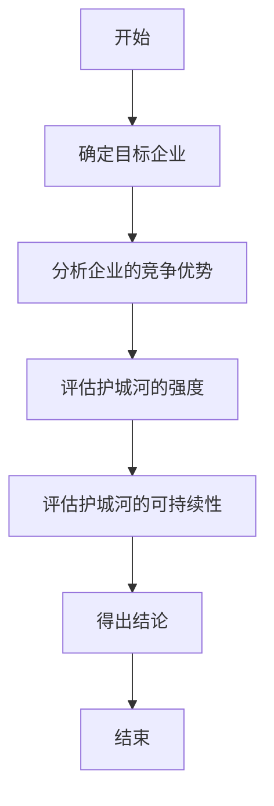
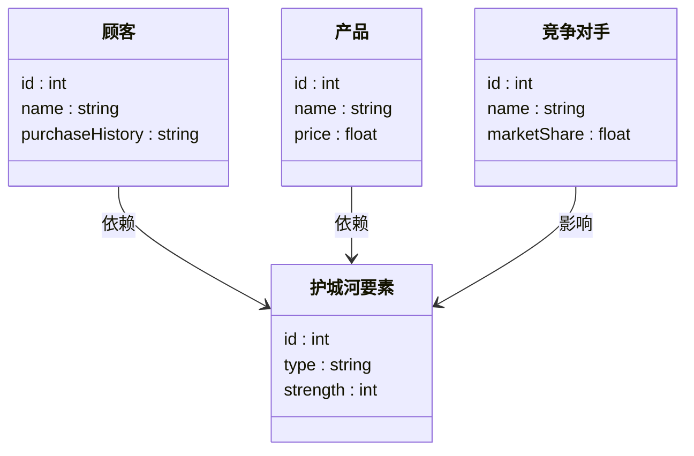

                 


# 巴菲特的护城河理论及其应用

> 关键词：巴菲特，护城河理论，竞争优势，企业价值，投资策略

> 摘要：本文系统地介绍了巴菲特的护城河理论，从理论基础到实际应用，详细分析了护城河的核心要素、分类、算法原理、数学模型以及系统架构设计。通过实际案例和项目实战，展示了如何识别和评估护城河，并通过Python代码实现数据分析，帮助读者理解护城河理论在计算机技术领域中的应用。

---

## 第一部分: 护城河理论的背景与核心概念

### 第1章: 护城河理论的背景与发展

#### 1.1 价值投资的鼻祖——巴菲特的投资理念
- 1.1.1 价值投资的定义与核心思想
- 1.1.2 巴菲特的“买股票就是买公司”理念
- 1.1.3 护城河理论在巴菲特投资策略中的地位

#### 1.2 护城河理论的提出与演变
- 1.2.1 护城河理论的提出背景
- 1.2.2 护城河理论的演变过程
- 1.2.3 护城河理论在现代商业中的应用价值

### 第2章: 护城河的核心要素与特征

#### 2.1 护城河的定义与核心要素
- 2.1.1 护城河的定义
- 2.1.2 护城河的核心要素：成本优势、品牌优势、网络效应、技术壁垒、政策壁垒
- 2.1.3 护城河的边界与外延

#### 2.2 护城河的分类与特征对比
- 2.2.1 成本优势：规模效应与边际成本递减
- 2.2.2 品牌优势：品牌忠诚度与市场影响力
- 2.2.3 网络效应：用户越多，价值越高
- 2.2.4 技术壁垒：专利、know-how与技术领先性
- 2.2.5 政策壁垒：政府许可、法规限制与行业准入门槛

#### 2.3 护城河的ER实体关系图
```mermaid
erDiagram
    customer[顾客] {
        id : int
        name : string
        purchaseHistory : string
    }
    product[产品] {
        id : int
        name : string
        price : float
    }
    competitor[竞争对手] {
        id : int
        name : string
        marketShare : float
    }
    barrier[护城河要素] {
        id : int
        type : string
        strength : int
    }
    customer<--barrier: "依赖"
    product<--barrier: "依赖"
    competitor<--barrier: "影响"
```

---

## 第二部分: 护城河理论的核心概念与联系

### 第3章: 护城河的核心原理

#### 3.1 护城河的形成机制
- 3.1.1 市场定位与竞争环境
- 3.1.2 企业资源与能力的匹配
- 3.1.3 护城河的动态演化

#### 3.2 护城河的可持续性与竞争优势
- 3.2.1 护城河的强弱比较
- 3.2.2 护城河的可替代性与替代成本
- 3.2.3 护城河的防御性与进攻性

#### 3.3 护城河与企业价值的关系
- 3.3.1 企业价值的评估维度
- 3.3.2 护城河对股东价值的影响
- 3.3.3 护城河的长期盈利能力

---

## 第三部分: 护城河的算法原理与数学模型

### 第4章: 护城河的算法原理

#### 4.1 护城河的战略分析流程
- 4.1.1 确定目标企业
- 4.1.2 分析企业的竞争优势
- 4.1.3 评估护城河的强度与可持续性

#### 4.2 护城河的识别与评估流程图


### 第5章: 护城河的数学模型与公式

#### 5.1 护城河价值的量化模型
- 5.1.1 企业价值公式：$$企业价值 = 护城河强度 \times 股东价值$$
- 5.1.2 护城河强度的计算：$$护城河强度 = \frac{竞争优势的可持续性}{市场竞争的激烈程度}$$

#### 5.2 护城河的财务指标分析
- 5.2.1 净利润率公式：$$净利润率 = \frac{净利润}{营业收入}$$
- 5.2.2 投资回报率公式：$$投资回报率 = \frac{净利润}{平均净资产}$$

---

## 第四部分: 护城河的系统分析与架构设计

### 第6章: 护城河的系统分析

#### 6.1 护城河的领域模型


#### 6.2 护城河的系统架构设计


---

## 第五部分: 项目实战

### 第7章: 护城河的识别与评估

#### 7.1 项目背景
- 7.1.1 项目目标：识别目标企业的护城河要素
- 7.1.2 数据来源：公开财务报表、市场报告、行业分析

#### 7.2 项目实现
- 7.2.1 环境安装：Python、Pandas、NumPy
- 7.2.2 核心代码实现：数据清洗、数据分析、护城河强度计算

```python
import pandas as pd
import numpy as np

# 数据加载
data = pd.read_csv('company_data.csv')

# 数据清洗
data.dropna(inplace=True)
data = data[~data['revenue'].isin([0])]

# 计算护城河强度
def calculate_barrier_strength(row):
    if row['market_share'] > 0.5:
        return 'strong'
    elif row['net_profit_margin'] > 10:
        return 'medium'
    else:
        return 'weak'

data['barrier_strength'] = data.apply(calculate_barrier_strength, axis=1)

# 可视化
import matplotlib.pyplot as plt

plt.figure(figsize=(10, 6))
data['barrier_strength'].value_counts().plot(kind='bar')
plt.title('护城河强度分布')
plt.xlabel('强度等级')
plt.ylabel('数量')
plt.show()
```

#### 7.3 实际案例分析
- 7.3.1 案例选择：以苹果公司为例
- 7.3.2 分析过程：品牌优势、技术壁垒、网络效应
- 7.3.3 结果解读：苹果的护城河强度如何影响其股价

---

## 第六部分: 总结与展望

### 第8章: 总结与注意事项

#### 8.1 护城河理论的核心要点回顾
- 8.1.1 理解护城河的五种类型
- 8.1.2 评估护城河的可持续性与强度
- 8.1.3 结合财务指标进行综合判断

#### 8.2 投资中的注意事项
- 8.2.1 避免过度依赖单一护城河要素
- 8.2.2 关注行业变化与政策风险
- 8.2.3 定期 reassess 护城河的强度

### 第9章: 未来展望

#### 9.1 技术进步对护城河的影响
- 9.1.1 人工智能与自动化对护城河的影响
- 9.1.2 数字化转型与护城河重构

#### 9.2 护城河理论的拓展与创新
- 9.2.1 结合大数据与AI的护城河评估方法
- 9.2.2 全球化视角下的护城河构建

---

## 作者：AI天才研究院/AI Genius Institute & 禅与计算机程序设计艺术/Zen And The Art of Computer Programming

---

**摘要**：本文通过系统分析巴菲特的护城河理论，结合技术语言与实际案例，详细阐述了护城河的核心要素、分类、算法原理、数学模型以及系统架构设计。通过Python代码实现数据分析，帮助读者理解护城河理论在计算机技术领域中的应用。

