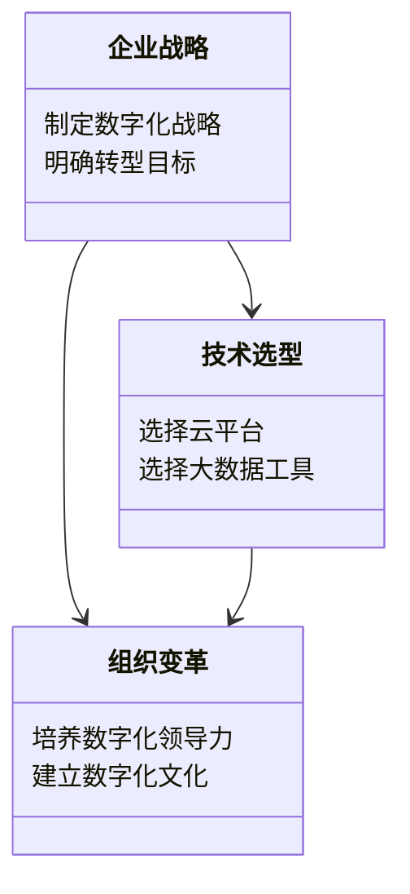
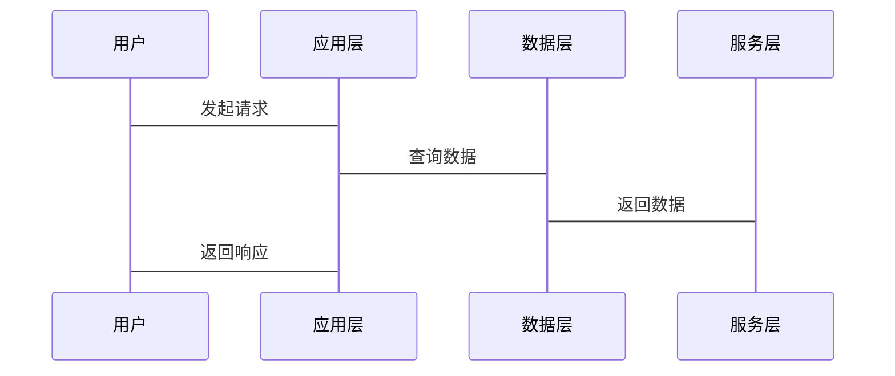

                 


# 巴菲特的数字化转型投资：传统企业在新时代的机遇

> 关键词：巴菲特，数字化转型，传统企业，投资策略，技术创新，企业价值

> 摘要：本文探讨了巴菲特在数字化转型中的投资策略，分析了传统企业在新时代的机遇，通过实际案例展示了数字化转型对企业价值的提升，并提出了传统企业的数字化转型策略与实施路径。

---

## 第1章：数字化转型的背景与核心概念

### 1.1 数字化转型的定义与背景

#### 1.1.1 数字化转型的定义
数字化转型（Digital Transformation）是指利用数字技术（如大数据、人工智能、云计算等）改变业务模式、流程、文化或体验，以创造新的价值或提升效率的过程。它不仅仅是技术的升级，更是企业战略、组织结构和商业模式的根本性变革。

#### 1.1.2 数字化转型的背景与驱动因素
- **技术驱动**：大数据、人工智能、物联网等技术的快速发展为企业提供了新的转型工具。
- **市场需求**：消费者对个性化、高效服务的需求增加，推动企业进行数字化变革。
- **竞争压力**：数字化转型成为企业保持竞争力的关键因素。

#### 1.1.3 传统企业的现状与挑战
- **现状**：传统企业通常依赖于稳定的业务模式，对新技术的接受度较低。
- **挑战**：包括技术落后、组织结构僵化、缺乏数字化人才等问题。

### 1.2 数字化转型的核心概念

#### 1.2.1 数字化转型的核心要素
- **技术驱动**：大数据、人工智能、区块链等技术的应用。
- **管理模式**：数字化领导力与组织文化的变革。
- **商业模式**：从传统模式向数字化生态转变。

#### 1.2.2 数字化转型与企业创新的关系
数字化转型不仅是技术的应用，更是企业创新的重要驱动力。通过数字化转型，企业可以更高效地创新，更快地响应市场变化。

#### 1.2.3 数字化转型的边界与外延
- **边界**：数字化转型的范围通常包括企业的核心业务流程和技术基础设施。
- **外延**：数字化转型可以延伸到供应链管理、客户关系管理等更广泛的领域。

---

## 第2章：巴菲特的投资理念与数字化转型

### 2.1 巴菲特的价值投资策略

#### 2.1.1 巴菲特投资理念的核心思想
巴菲特的价值投资策略强调长期投资、安全边际和企业基本面分析。他认为，投资的核心是找到具有持续竞争优势和良好管理团队的企业。

#### 2.1.2 巴菲特对企业的长期价值关注
巴菲特倾向于投资那些能够长期创造价值的企业，而数字化转型正是提升企业长期价值的重要途径。

#### 2.1.3 巴菲特对管理团队的信任与评估
巴菲特非常重视企业的管理团队，认为优秀的管理团队是企业成功的关键因素之一。在数字化转型中，管理团队的数字化能力尤为重要。

### 2.2 数字化转型与巴菲特投资策略的结合

#### 2.2.1 数字化转型对企业价值的影响
- 数字化转型可以提升企业的效率、降低成本、增强客户体验，从而提升企业的市场价值。
- 例如，苹果通过数字化转型（如iOS系统、App Store等）成功转型为一家高科技公司，显著提升了其市场价值。

#### 2.2.2 巴菲特如何评估企业的数字化潜力
- 巴菲特会关注企业的数字化战略、技术应用能力以及管理团队的数字化意识。
- 例如，他投资亚马逊，正是因为亚马逊在数字化转型中的领先地位。

#### 2.2.3 数字化转型对企业竞争优势的影响
数字化转型可以帮助企业构建新的竞争优势，如更快的市场响应能力、更高的运营效率等。

---

## 第3章：数字化转型的关键要素与传统企业的转型路径

### 3.1 数字化转型的关键要素

#### 3.1.1 技术驱动：大数据、人工智能、云计算等
- **大数据**：通过数据分析优化决策。
- **人工智能**：自动化流程，提高效率。
- **云计算**：提供弹性的计算资源，支持业务扩展。

#### 3.1.2 管理模式：数字化领导力与组织文化
- 数字化领导力：领导者需要具备数字化思维，能够引导组织变革。
- 数字化文化：建立开放、创新的企业文化，鼓励员工拥抱变化。

#### 3.1.3 商业模式：从传统模式到数字化生态
- 传统企业需要从单一的产品或服务模式，转向构建数字化生态，例如通过平台化运营、数据变现等。

### 3.2 传统企业的数字化转型路径

#### 3.2.1 企业战略层面的转型规划
- 制定明确的数字化战略，确定转型目标和路径。
- 例如，传统制造业可以通过引入工业互联网，实现智能化生产。

#### 3.2.2 业务流程层面的数字化改造
- 对传统业务流程进行数字化改造，例如自动化订单处理、供应链管理等。

#### 3.2.3 组织结构与文化变革
- 建立跨部门协作机制，打破传统的部门壁垒。
- 培养员工的数字化技能，提升团队的整体能力。

---

## 第4章：巴菲特成功案例分析：数字化转型的实际应用

### 4.1 巴菲特投资的数字化转型成功案例

#### 4.1.1 苹果公司的数字化转型
- 苹果通过iOS系统、App Store等，成功从一家硬件公司转型为一家高科技服务公司。
-巴菲特的投资策略在苹果的成功转型中得到了验证。

#### 4.1.2 亚马逊的数字化创新
- 亚马逊通过AWS（亚马逊云服务）实现了云技术的领先地位。
- 巴菲特投资亚马逊，看中其在数字化转型中的巨大潜力。

#### 4.1.3 微软的云转型之路
- 微软通过Azure云平台，成功从软件公司转型为云服务提供商。
- 巴菲特对微软的投资也体现了他对数字化转型的长期看好。

### 4.2 数字化转型对企业价值的提升

#### 4.2.1 数字化转型对企业盈利能力的影响
- 数字化转型可以通过提高效率、降低成本来提升企业的盈利能力。

#### 4.2.2 数字化转型对企业市场竞争力的提升
- 通过数字化转型，企业可以更快地响应市场变化，提升客户体验，从而增强市场竞争力。

#### 4.2.3 数字化转型对企业长期价值的贡献
- 数字化转型可以帮助企业构建可持续的竞争优势，从而提升企业的长期价值。

---

## 第5章：传统企业的数字化转型策略与实施

### 5.1 数字化转型的战略制定

#### 5.1.1 数字化转型的战略目标设定
- 确定数字化转型的具体目标，例如提升效率、优化客户体验等。

#### 5.1.2 数字化转型的战略实施路径
- 制定详细的实施计划，包括技术选型、团队建设等。

#### 5.1.3 数字化转型的战略风险管理
- 识别潜在风险，制定应对策略，确保转型过程中的风险可控。

### 5.2 数字化转型的技术与管理实施

#### 5.2.1 技术选型与实施策略
- 根据企业需求选择合适的技术和工具，例如选择适合的云平台、大数据分析工具等。

#### 5.2.2 数字化领导力与组织文化变革
- 培养具备数字化思维的领导者，推动组织文化的变革，鼓励员工积极参与数字化转型。

---

## 第6章：系统分析与架构设计方案

### 6.1 问题场景介绍
- 传统企业在数字化转型中面临技术落后、组织结构僵化等问题。

### 6.2 系统功能设计（领域模型Mermaid类图）



### 6.3 系统架构设计（Mermaid架构图）


### 6.4 系统接口设计与交互（Mermaid序列图）



---

## 第7章：项目实战

### 7.1 环境安装
- 安装必要的软件和工具，例如Python、Jupyter Notebook、数据库等。

### 7.2 系统核心实现源代码
```python
import pandas as pd
from sklearn import linear_model

# 数据加载
data = pd.read_csv('data.csv')

# 模型训练
model = linear_model.LinearRegression()
model.fit(data[['feature1', 'feature2']], data['target'])

# 模型预测
prediction = model.predict([[new_feature1, new_feature2]])
print(prediction)
```

### 7.3 代码应用解读与分析
- 该代码使用线性回归模型进行预测，展示了如何利用大数据技术进行数字化转型中的数据分析。

### 7.4 实际案例分析和详细讲解剖析
- 通过具体案例分析数字化转型的实际应用，例如零售业通过数据分析优化库存管理。

### 7.5 项目小结
- 总结项目实施的经验和教训，提出改进建议。

---

## 第8章：总结与展望

### 8.1 总结
- 数字化转型是传统企业在新时代中的重要机遇，通过技术应用和组织变革，企业可以实现价值提升和竞争力增强。

### 8.2 展望
- 未来，随着技术的进一步发展，数字化转型将更加深入，企业需要持续关注技术创新和管理变革。

---

## 作者

作者：AI天才研究院 & 禅与计算机程序设计艺术

---

通过以上内容，我们可以看到，数字化转型不仅是技术的变革，更是企业战略和管理的深刻变革。传统企业需要积极拥抱数字化转型，抓住新时代的机遇，实现可持续发展。

