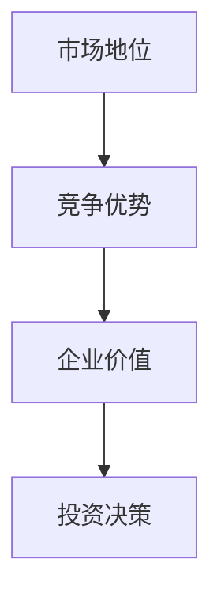
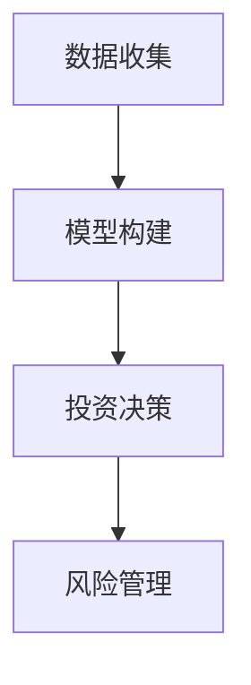

                 


# 巴菲特的焦点投资策略

---

## 关键词  
- 巴菲特投资策略  
- 价值投资  
- 长期投资  
- 股票估值  
- 企业竞争优势  

---

## 摘要  
本文深入分析了巴菲特的焦点投资策略，探讨了其核心思想、价值投资的基本原理、选股标准、投资组合管理以及策略的系统化应用。通过详细讲解巴菲特的投资哲学、企业估值方法、竞争优势分析和风险管理策略，结合实际案例，为投资者提供一套科学、系统的投资框架。文章还总结了巴菲特策略的实践意义，并提出了在现代投资环境中的应用建议。

---

## 第1章: 巴菲特投资理念的背景与核心思想  

### 1.1 巴菲特的生平与投资哲学  

#### 1.1.1 巴菲特的早年经历与投资启蒙  
沃伦·巴菲特（Warren Buffett）于1934年出生于美国内布拉斯州的奥马哈市，早年便展现出对数字和投资的浓厚兴趣。15岁时，他开始研究股票市场，阅读大量投资书籍，并尝试通过卖报纸和做股票研究来赚取零用钱。这些早期的经历为他后来的投资哲学奠定了基础。  

#### 1.1.2 巴菲特的价值投资理念形成  
巴菲特的投资哲学深受 Benjamin Graham 和 David Dodd 的影响，尤其是Graham的“价值投资”理念。Graham强调，投资的本质是寻找被市场低估的企业，而不是盲目追随市场的波动。巴菲特将这一理念发扬光大，形成了自己的“安全边际”理论。  

#### 1.1.3 巴菲特投资哲学的核心原则  
巴菲特的投资哲学可以用三个核心原则来概括：  
1. **安全边际**：买入价格低于企业内在价值的股票，以确保投资的安全性。  
2. **长期视角**：关注企业的长期盈利能力，而非短期市场波动。  
3. **企业基本面**：深入分析企业的财务状况、管理层素质和行业地位。  

---

### 1.2 巴菲特投资策略的背景分析  

#### 1.2.1 20世纪70年代美国股市的背景  
20世纪70年代，美国股市经历了多次波动，包括1973-1974年的熊市和1980年代的科技股泡沫。在这样的市场环境下，巴菲特的价值投资策略显得尤为重要，尤其是在市场低迷时，他能够以较低的价格买入优质股票。  

#### 1.2.2 巴菲特策略的演变与成熟  
巴菲特的投资策略并非一成不变，而是随着市场环境和企业情况的变化而不断调整。例如，他在2008年金融危机期间大量买入银行股，利用市场恐慌带来的低估机会。  

#### 1.2.3 巴菲特策略的现代意义  
尽管巴菲特的投资策略形成于20世纪，但其核心思想在今天依然适用。尤其是在当前市场波动加剧、科技企业崛起的背景下，巴菲特的长期价值投资理念为投资者提供了重要的指导。  

---

### 1.3 巴菲特策略的核心要素  

#### 1.3.1 长期投资与价值发现  
巴菲特强调长期投资，他认为市场的短期波动是不可预测的，而企业的长期价值才是投资的核心。  

#### 1.3.2 股东权益与企业价值评估  
巴菲特认为，企业的价值取决于其未来现金流的现值。他通过分析企业的财务报表，尤其是现金流和利润表，来评估企业的内在价值。  

#### 1.3.3 安全边际与风险控制  
巴菲特的安全边际理念要求投资者以低于企业内在价值的价格买入股票，从而降低投资风险。  

---

## 第2章: 价值投资的基本原理  

### 2.1 价值投资的定义与特征  

#### 2.1.1 价值投资的定义  
价值投资是一种以低于企业内在价值的价格买入股票的投资策略。其核心在于寻找市场低估的企业，而不是追随市场的短期情绪。  

#### 2.1.2 价值投资的核心特征对比表  
| 特征            | 价值投资          | 其他投资策略       |
|-----------------|-------------------|-------------------|
| 投资期限        | 长期              | 短期              |
| 投资目标        | 企业内在价值      | 市场价格波动       |
| 风险管理        | 强调安全边际      | 风险分散          |
| 分析方法        | 深入基本面分析    | 技术分析或量化分析 |

#### 2.1.3 价值投资与其它投资策略的ER实体关系图  
```mermaid
erDiagram
  稀释股权投资者 o-<> 投资者类型
  投资者类型 o-<> 价值投资策略
  价值投资策略 o-<> 企业价值评估
  企业价值评估 o-<> 财务报表分析
```

---

### 2.2 企业价值评估的数学模型  

#### 2.2.1 股票内在价值的计算公式  
股票的内在价值可以通过以下公式计算：  
$$ V = \frac{CF}{r - g} $$  
其中，\( CF \) 是企业未来现金流，\( r \) 是折现率，\( g \) 是现金流增长率。  

#### 2.2.2 现金流折现模型的详细解释  
现金流折现模型（DCF）是价值投资的核心工具之一。通过对企业未来现金流的折现，可以评估企业的内在价值。  

#### 2.2.3 股东权益与企业价值的关系分析  
股东权益与企业价值密切相关。企业的价值不仅取决于其当前的资产，还取决于未来现金流的现值。  

---

### 2.3 财务报表分析与企业估值  

#### 2.3.1 资产负债表分析的关键指标  
| 指标             | 定义                   | 重要性         |
|------------------|-----------------------|----------------|
| 净资产            | 资产 - 负债           | 评估企业价值的核心指标 |
| 负债比例          | 负债 / 资产           | 评估企业财务健康状况 |
| 存货周转率        | 存货 / 营业成本       | 评估企业运营效率 |

#### 2.3.2 利润表分析与企业盈利能力  
利润表分析包括对企业收入、成本和利润的分析。其中，净利润率是衡量企业盈利能力的重要指标。  

#### 2.3.3 现金流量表分析与企业流动性  
现金流量表分析包括对企业经营活动、投资活动和筹资活动的现金流分析。健康的现金流是企业持续经营的基础。  

---

## 第3章: 巴菲特的选股标准与竞争优势分析  

### 3.1 巴菲特选股的核心标准  

#### 3.1.1 企业的竞争优势分析  
竞争优势是巴菲特选股的核心标准之一。他倾向于投资那些具有强大竞争优势的企业，例如可口可乐的全球品牌影响力和成本优势。  

#### 3.1.2 管理层的质量与诚信  
巴菲特认为，优秀的管理层是企业成功的关键。他特别重视管理层的诚信和责任感。  

#### 3.1.3 行业地位与市场前景  
巴菲特倾向于投资那些在行业内具有领先地位的企业，并且行业前景具有可持续性。  

---

### 3.2 企业竞争优势的数学模型  

#### 3.2.1 竞争优势的量化指标  
| 指标             | 定义                   | 计算公式           |
|------------------|-----------------------|--------------------|
| 市场占有率         | 企业的销售额 / 行业销售额 | \( Market\ Share = \frac{Sales}{Industry\ Sales} \) |
| 净利润率           | 净利润 / 营业收入       | \( Net\ Margin = \frac{Net\ Profit}{Revenue} \) |
| 研发投入强度       | 研发费用 / 营业收入     | \( R&D\ Intensity = \frac{R&D\ Expenses}{Revenue} \) |

#### 3.2.2 市场地位与竞争优势的关系分析  
市场地位与竞争优势密切相关。企业的市场地位越强，竞争优势越显著。  

#### 3.2.3 企业竞争优势的动态评估模型  


---

### 3.3 竞争优势的案例分析  

#### 3.3.1 可口可乐的长期竞争优势  
可口可乐的全球品牌影响力和渠道优势使其成为巴菲特长期投资的对象。  

#### 3.3.2 巴菲特对苹果公司的投资逻辑  
尽管苹果公司是科技企业，但其强大的品牌影响力和创新能力使其符合巴菲特的投资标准。  

#### 3.3.3 伯克希尔 Hathaway的业务模式分析  
伯克希尔 Hathaway通过控股多家优秀企业，构建了一个多元化的企业帝国。  

---

## 第4章: 投资组合的构建与管理  

### 4.1 投资组合的构建原则  

#### 4.1.1 资产配置的基本原则  
资产配置是投资组合管理的核心。巴菲特建议投资者将大部分资金投资于股票和债券，其余用于现金储备。  

#### 4.1.2 个股权重的分配策略  
个股权重的分配应根据企业的内在价值和市场机会进行调整。  

#### 4.1.3 投资组合的动态调整  
投资组合需要根据市场变化和企业状况进行动态调整。  

---

### 4.2 投资组合的风险管理  

#### 4.2.1 风险分散与投资组合的稳定性  
通过分散投资可以降低风险，但巴菲特更强调通过选择优质企业来降低风险。  

#### 4.2.2 风险调整后的收益评估  
风险调整后的收益可以通过夏普比率等指标来衡量。  

#### 4.2.3 风险管理的数学模型与工具  
$$ Sharpe\ Ratio = \frac{E[R_p] - R_f}{\sigma_p} $$  
其中，\( E[R_p] \) 是投资组合的预期收益，\( R_f \) 是无风险利率，\( \sigma_p \) 是投资组合的波动率。  

---

### 4.3 投资组合的长期表现分析  

#### 4.3.1 长期投资的复利效应  
复利效应是长期投资的核心优势。通过持续的资本增值，投资收益可以呈指数级增长。  

#### 4.3.2 投资组合的历史表现分析  
巴菲特的投资组合历史表现优异，尤其是在熊市中的抗跌能力。  

#### 4.3.3 未来表现的潜在风险与机会  
尽管巴菲特策略在长期表现优异，但在当前市场环境下，科技企业和新兴行业的崛起带来了新的挑战和机会。  

---

## 第5章: 巴菲特策略的系统化应用  

### 5.1 系统化投资策略的定义与框架  

#### 5.1.1 系统化投资策略的定义  
系统化投资策略是指通过数学模型和算法，系统化地选择和管理投资组合。  

#### 5.1.2 系统化策略的核心框架  
1. **数据收集**：收集企业的财务数据和市场数据。  
2. **模型构建**：建立企业估值模型和投资决策模型。  
3. **策略执行**：根据模型结果执行投资决策。  
4. **风险管理**：实时监控和调整投资组合。  

---

### 5.2 系统化策略的数学模型与工具  

#### 5.2.1 企业估值的数学模型  
$$ V = \frac{CF}{r - g} $$  
其中，\( CF \) 是未来现金流，\( r \) 是折现率，\( g \) 是现金流增长率。  

#### 5.2.2 投资决策的算法流程  


---

## 第6章: 巴菲特策略的现代挑战与未来发展  

### 6.1 现代投资环境的变化  

#### 6.1.1 科技企业的崛起  
科技企业的崛起对巴菲特策略提出了新的挑战。传统的企业分析方法可能无法准确评估科技企业的价值。  

#### 6.1.2 全球化与多元化投资  
全球化背景下，投资者需要更加多元化地配置资产，包括国际市场和新兴行业。  

---

### 6.2 巴菲特策略的未来发展  

#### 6.2.1 技术进步对投资策略的影响  
人工智能和大数据技术的应用将为巴菲特策略提供新的工具和方法。  

#### 6.2.2 投资者行为的演变  
随着投资者行为的演变，巴菲特策略需要不断适应新的市场环境和投资者需求。  

---

## 小结  

巴菲特的焦点投资策略是一种长期、价值导向的投资方法，强调安全边际和企业基本面分析。尽管其核心思想形成于20世纪，但在当前市场环境下依然具有重要的现实意义。通过系统的分析和实践，投资者可以更好地理解和应用巴菲特策略，实现长期稳健的投资收益。  

---

## 最佳实践 Tips  

1. **长期视角**：投资需要耐心，关注企业的长期价值。  
2. **深入分析**：对企业进行全面的财务和行业分析。  
3. **风险管理**：通过安全边际和分散投资降低风险。  
4. **持续学习**：关注市场变化和企业动态，不断优化投资策略。  

---

## 注意事项  

1. **避免短期波动**：不要被市场的短期波动所干扰。  
2. **警惕市场泡沫**：在科技企业和新兴行业投资时，需谨慎评估其长期价值。  
3. **保持纪律性**：严格按照投资策略执行，避免情绪化决策。  

---

## 拓展阅读  

1. **《巴菲特致股东的信》**：巴菲特历年致股东的信是理解其投资哲学的重要来源。  
2. **《价值投资实战策略》**：详细讲解价值投资的具体操作方法。  
3. **《投资最重要的事情》**：巴菲特的重要合作伙伴本·格雷厄姆的经典著作。  

---

## 作者  

作者：AI天才研究院/AI Genius Institute & 禅与计算机程序设计艺术/Zen And The Art of Computer Programming  

联系方式：[email protected]  

---

以上是《巴菲特的焦点投资策略》的完整目录和文章内容，如果您有需要进一步的修改或补充，请随时告知！

