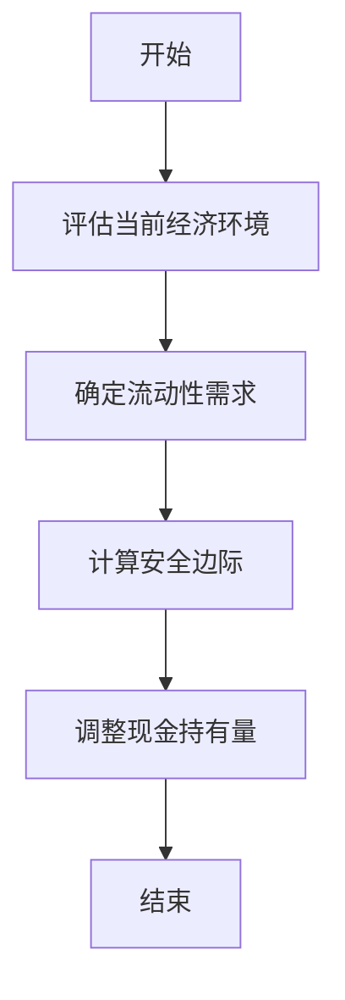
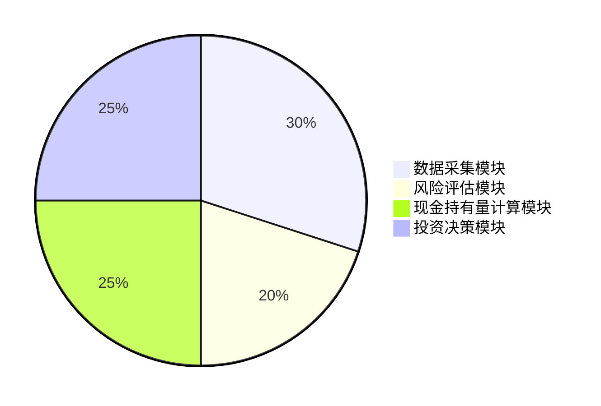
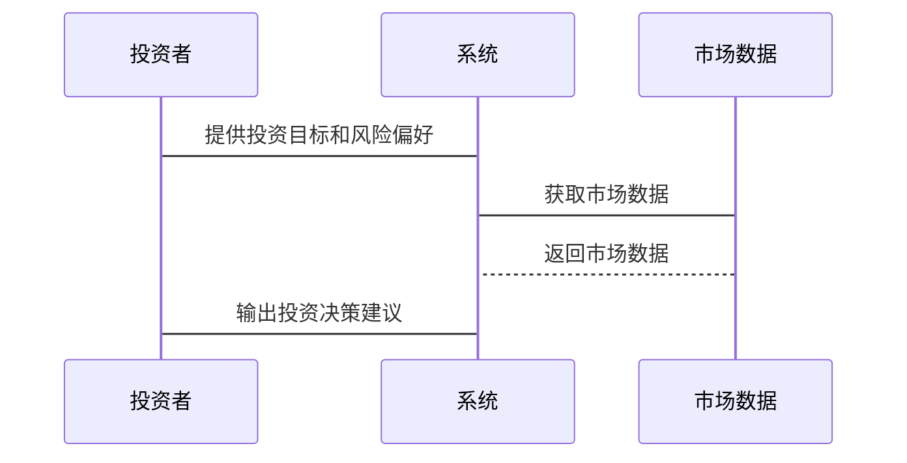

                 

<think>
好的，我现在需要帮用户撰写一篇关于巴菲特现金储备策略的博客文章。首先，我需要理解用户的需求，他们希望文章结构清晰，内容专业且有深度。文章标题是《巴菲特的现金储备策略：应对全球经济不确定性》，关键词包括巴菲特、现金储备策略、投资、风险管理、价值投资。

我应该先写摘要，概括文章的核心内容。摘要部分要简明扼要，说明巴菲特的现金储备策略如何帮助应对全球经济不确定性，以及文章将如何分析这个策略。

接下来是目录，用户已经提供了一个详细的目录结构。我需要按照这个结构来组织文章内容。每个章节和小节都需要详细展开，确保内容丰富且具体。

在写第一部分“巴菲特的现金储备策略概述”时，我需要介绍巴菲特的背景和他的投资理念，特别是现金储备策略的定义和特点。这部分要包括巴菲特的生平、价值投资理论，以及现金储备策略与其他策略的对比。

第二部分“现金储备策略的数学模型与算法原理”需要详细讲解相关的数学公式和算法流程。例如，现金持有量的计算公式和算法流程图，使用mermaid来展示。这部分要确保公式正确，流程清晰。

第三部分“现金储备策略的系统架构与实现”需要构建系统的功能设计和架构设计，使用mermaid类图和架构图来展示。这部分要详细说明系统的各个模块及其交互，确保读者能够理解系统的运作方式。

第四部分“现金储备策略的项目实战”需要通过实际案例来分析策略的应用，比如巴菲特在2008年金融危机中的操作。这部分要详细解读案例，展示策略在实际中的效果。

最后，第五部分“总结与展望”要总结现金储备策略的要点，并展望未来的发展。同时，加上注意事项和相关书籍推荐，帮助读者进一步学习。

在写作过程中，我需要确保使用专业且易懂的技术语言，逻辑清晰，结构紧凑。每个部分都要详细展开，避免过于简略。同时，要注意使用适当的数学公式和图表，帮助读者更好地理解内容。

现在，我开始撰写摘要部分，确保它涵盖文章的核心内容。然后按照目录结构，逐一展开每个章节的内容，确保每个小节都有详细的解释和例子。最后，总结全文，并添加作者信息和推荐书籍。

在撰写过程中，我会反复检查内容的逻辑性和连贯性，确保每个部分都紧密相连，形成一个完整的体系。同时，注意语言的专业性和可读性，使读者能够轻松理解巴菲特的现金储备策略及其在应对全球经济不确定性中的作用。
</think>

# 巴菲特的现金储备策略：应对全球经济不确定性

## 关键词
巴菲特, 现金储备策略, 投资, 风险管理, 价值投资

## 摘要
本文深入探讨了巴菲特的现金储备策略，分析了其在应对全球经济不确定性中的重要作用。文章从巴菲特的投资理念出发，详细阐述了现金储备策略的核心概念、数学模型、系统架构以及实际应用案例。通过案例分析和数学公式，展示了巴菲特如何通过科学的现金管理来应对经济波动，为投资者提供了实用的策略和启示。

---

# 第一部分: 巴菲特的现金储备策略概述

## 第1章: 巴菲特的现金储备策略背景

### 1.1 巴菲特的生平与投资理念
#### 1.1.1 巴菲特的早期经历与投资哲学
沃伦·巴菲特（Warren Buffett）是世界上最著名的投资者之一，被誉为“股神”。他出生于1934年，早年通过投资股票和合伙企业积累了丰富的投资经验。巴菲特的投资哲学以价值投资为核心，强调寻找那些具有持续竞争优势、良好管理和稳定现金流的公司。

#### 1.1.2 巴菲特的价值投资理论
巴菲特的价值投资理论强调长期持有优质资产，避免短期市场的波动。他认为，市场先生（Mr. Market）是投资者的朋友，而不是敌人。在市场恐慌时买入，在市场狂热时卖出。

#### 1.1.3 巴菲特对全球经济的洞察
巴菲特对全球经济有着深刻的理解，他意识到全球经济的不确定性对企业估值和投资决策的影响。他强调，在经济不稳定的时期，现金储备是投资者的重要护身符。

### 1.2 现金储备策略的定义与特点
#### 1.2.1 现金储备策略的定义
现金储备策略是指投资者在投资组合中保留一定比例的现金或流动性极高的资产，以应对市场波动、突发事件或投资机会。巴菲特认为，现金储备是投资组合中不可或缺的一部分，特别是在市场不确定性增加时。

#### 1.2.2 现金储备策略的核心特点
1. **流动性**：现金储备的流动性极高，可以在短时间内变现。
2. **安全性**：现金储备几乎不存在信用风险，是投资者最安全的资产。
3. **灵活性**：现金储备可以随时用于投资优质资产，抓住市场机会。

#### 1.2.3 现金储备策略与其他投资策略的对比
| 策略类型       | 核心目标                     | 风险特征                     | 适用场景                     |
|----------------|------------------------------|------------------------------|------------------------------|
| 现金储备策略    | 保障本金安全，抓住投资机会   | 极低风险                     | 经济不确定性增加时             |
| 股票投资策略    | 追求资本增值                 | 高风险                      | 市场稳定时                   |
| 债券投资策略    | 稳定收益                     | 中等风险                    | 利率稳定时                   |

### 1.3 现金储备策略的背景与必要性
#### 1.3.1 全球经济不确定性概述
全球经济的不确定性主要来源于以下几个方面：
1. **经济周期波动**：经济衰退、萧条等周期性波动。
2. **地缘政治风险**：战争、贸易摩擦等。
3. **市场泡沫与崩盘**：如2008年金融危机。

#### 1.3.2 现金储备在投资组合中的作用
现金储备是投资组合的“缓冲器”，在市场下跌时可以避免被迫卖出优质资产，同时在市场底部时可以抓住投资机会。

#### 1.3.3 现金储备策略的边界与外延
现金储备策略的边界在于市场波动的剧烈程度和投资者的风险承受能力。外延则包括短期债券、货币市场基金等流动性较高的资产。

---

# 第二部分: 现金储备策略的数学模型与算法原理

## 第2章: 现金储备策略的数学模型

### 2.1 现金持有量的计算公式
巴菲特的现金储备策略强调在市场不确定性增加时增加现金持有量。现金持有量的计算公式如下：

$$ \text{现金持有量} = \text{流动性需求} + \text{安全边际} $$

其中，流动性需求是指投资者在未来一段时间内的支出需求，安全边际是指为了应对市场波动而预留的额外现金。

### 2.2 现金储备与投资组合的关系
现金储备在投资组合中的比例通常在5%到20%之间。具体比例取决于市场环境和投资者的风险偏好。

$$ \text{现金比例} = \frac{\text{现金储备}}{\text{总资产}} $$

### 2.3 现金储备策略的算法流程
以下是一个简化的现金储备策略算法流程：

---

# 第三部分: 现金储备策略的系统架构与实现

## 第3章: 现金储备策略的系统架构

### 3.1 系统功能设计
现金储备策略的系统架构包括以下几个模块：
1. **数据采集模块**：收集市场数据、宏观经济指标等。
2. **风险评估模块**：评估市场风险和经济不确定性。
3. **现金持有量计算模块**：根据流动性需求和安全边际计算现金持有量。
4. **投资决策模块**：根据现金持有量调整投资组合。

### 3.2 系统架构设计
以下是系统的架构图：

### 3.3 系统接口设计
系统接口包括：
1. 数据输入接口：接收市场数据和宏观经济指标。
2. 计算接口：计算现金持有量。
3. 输出接口：输出投资决策建议。

### 3.4 系统交互流程
以下是系统的交互流程图：

---

# 第四部分: 现金储备策略的项目实战

## 第4章: 现金储备策略的实际案例分析

### 4.1 巴菲特在2008年金融危机中的现金储备策略
在2008年金融危机期间，巴菲特通过增加现金储备，成功避免了市场崩盘带来的损失，并在市场底部投资于优质资产。

### 4.2 现金储备策略的优化与调整
根据市场变化和投资者需求，定期评估和调整现金储备比例。

---

# 第五部分: 总结与展望

## 第5章: 总结与展望

### 5.1 总结
巴菲特的现金储备策略是一种科学的投资方法，能够帮助投资者在经济不确定性中保护本金并抓住投资机会。

### 5.2 展望
随着全球经济的不断变化，现金储备策略需要不断优化和调整，以适应新的市场环境。

### 5.3 注意事项
1. 现金储备策略需要结合市场环境和投资者的具体情况。
2. 现金储备比例应根据风险偏好和流动性需求调整。
3. 现金储备策略不能孤立使用，需要与其他投资策略结合。

### 5.4 相关书籍推荐
1. 《巴菲特传：萃取智慧的菁华》
2. 《价值投资实战入门》
3. 《投资学原理》

---

# 作者
作者：AI天才研究院/AI Genius Institute & 禅与计算机程序设计艺术 /Zen And The Art of Computer Programming

