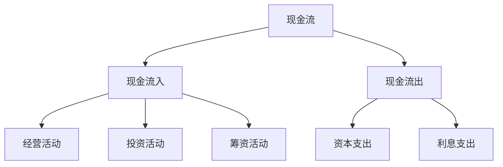
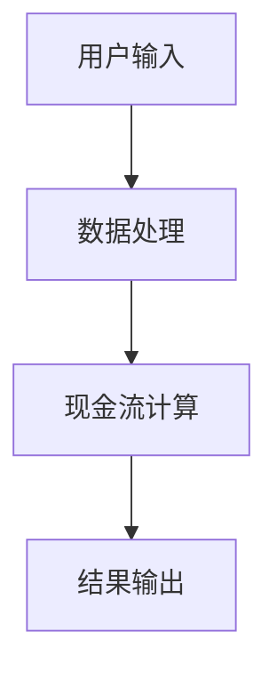
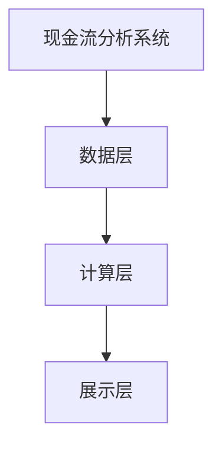

                 


# 巴菲特的现金流分析方法

## 关键词：
现金流分析、巴菲特、投资策略、自由现金流、价值评估、技术分析

## 摘要：
本文深入探讨了巴菲特的现金流分析方法，从基本概念到实际应用，结合数学模型和系统架构，全面解析其在投资决策中的作用。通过案例分析和项目实战，帮助读者掌握如何利用现金流分析评估企业价值，做出明智的投资决策。

---

## 第一部分：现金流分析的基本概念与重要性

### 第1章：现金流的基本概念与重要性

#### 1.1 现金流的定义与分类

##### 1.1.1 现金流的定义
现金流是指企业在一定时期内现金的流入和流出，反映了企业的财务健康状况和盈利能力。现金流可以分为经营活动现金流、投资活动现金流和筹资活动现金流。

##### 1.1.2 现金流的分类
- **经营活动现金流**：企业日常运营中产生的现金流，包括销售商品、提供服务等。
- **投资活动现金流**：企业投资于长期资产或出售资产所产生的现金流。
- **筹资活动现金流**：企业通过融资活动获得或支付的现金流，如借款、发行股票等。

##### 1.1.3 现金流在企业中的作用
现金流是企业生存和发展的基石，直接影响企业的偿债能力、投资能力和分红能力。健康的现金流能够确保企业在市场波动中保持稳健。

#### 1.2 巴菲特的现金流分析方法概述

##### 1.2.1 巴菲特的投资理念
巴菲特认为，企业的内在价值是其未来现金流的现值。他强调长期投资和价值投资，关注企业的基本面和财务状况。

##### 1.2.2 现金流分析的核心地位
现金流分析是巴菲特评估企业价值的关键工具，他认为企业必须能够产生稳定的自由现金流，才能为股东创造价值。

##### 1.2.3 现金流分析的适用范围
现金流分析不仅适用于企业估值，还可用于投资决策、风险管理等领域。巴菲特的方法尤其适用于评估具有持续现金流能力的企业。

---

### 第2章：巴菲特现金流分析的核心概念

#### 2.1 自由现金流的定义与计算

##### 2.1.1 自由现金流的定义
自由现金流是指企业在扣除资本支出和其他必要投资后，剩余可以自由分配的现金流。它是衡量企业财务健康的重要指标。

##### 2.1.2 自由现金流的计算公式
$$\text{Free Cash Flow} = \text{EBIT} \times (1 - \text{税率}) - \text{资本支出}$$

其中：
- EBIT：息税前利润
- 税率：企业所得税率
- 资本支出：企业为维持或扩展业务而进行的资本投资

##### 2.1.3 自由现金流的重要性
自由现金流反映了企业产生现金的能力，是评估企业内在价值的核心指标。高自由现金流意味着企业能够持续创造价值。

#### 2.2 现金流与企业价值的关系

##### 2.2.1 现金流在企业价值评估中的作用
现金流是企业价值的核心，通过贴现现金流模型（DCF模型），可以估算企业的内在价值。

##### 2.2.2 现金流与股东价值创造的联系
企业通过产生稳定的自由现金流，能够为股东创造价值，同时降低财务风险。

#### 2.3 现金流分析的边界与外延

##### 2.3.1 现金流分析的边界
现金流分析仅关注企业的财务状况，不考虑非财务因素，如市场趋势和管理能力。

##### 2.3.2 现金流分析的外延
现金流分析可以结合其他指标，如ROE、ROA，进行更全面的企业评估。

---

### 第3章：现金流分析的核心要素

#### 3.1 现金流分析的数学模型

##### 3.1.1 现金流分析的公式推导
通过现金流分析公式，可以计算企业的自由现金流和内在价值。

##### 3.1.2 现金流分析的数学表达式
$$\text{内在价值} = \sum_{t=1}^{n} \frac{\text{自由现金流}}{(1 + r)^t}$$

其中：
- r：折现率
- t：时间周期

#### 3.2 现金流分析的属性特征对比

##### 3.2.1 现金流的属性对比
| 属性       | 现金流               |
|------------|---------------------|
| 来源       | 经营、投资、筹资     |
| 流向       | 支付债务、股息、再投资 |
| 重要性     | 企业财务健康的核心指标 |

##### 3.2.2 现金流特征的对比分析
现金流与利润的区别：现金流反映企业的实际财务状况，而利润可能受到会计政策的影响。

#### 3.3 现金流分析的ER实体关系图



---

### 第4章：现金流分析的系统架构

#### 4.1 现金流分析的系统功能设计

##### 4.1.1 系统功能模块划分
- 数据输入模块：接收企业的财务数据
- 数据处理模块：计算现金流相关指标
- 结果输出模块：展示分析结果

##### 4.1.2 系统功能流程图



#### 4.2 现金流分析的系统架构设计

##### 4.2.1 系统架构图



---

## 第五部分：项目实战与总结

### 5.1 现金流分析的项目实战

#### 5.1.1 环境安装
需要安装Python和相关库，如Pandas和NumPy。

#### 5.1.2 系统核心实现源代码

```python
import pandas as pd
import numpy as np

def calculate_free_cash_flow(ebit, tax_rate, capital_expenditure):
    return ebit * (1 - tax_rate) - capital_expenditure

# 示例数据
ebit = 10000000
tax_rate = 0.3
capital_expenditure = 5000000

free_cash_flow = calculate_free_cash_flow(ebit, tax_rate, capital_expenditure)
print(f"自由现金流为：${free_cash_flow}")
```

#### 5.1.3 代码应用解读与分析
代码实现自由现金流的计算，输入EBIT、税率和资本支出，输出自由现金流。通过实际案例分析，帮助读者理解如何应用这些方法。

---

## 结语

巴菲特的现金流分析方法是投资决策中的重要工具，通过深入理解其原理和应用，投资者可以更准确地评估企业价值，做出明智的投资决策。本文通过理论与实践的结合，全面解析了巴菲特的现金流分析方法，为读者提供了实用的指导。

---

## 作者：AI天才研究院 & 禅与计算机程序设计艺术

---

这篇文章全面介绍了巴菲特的现金流分析方法，从基本概念到系统架构，再到项目实战，帮助读者掌握这一重要的投资工具。通过详细的数学模型和实际案例分析，文章不仅适合专业投资者，也适合对金融投资感兴趣的技术人员阅读。

