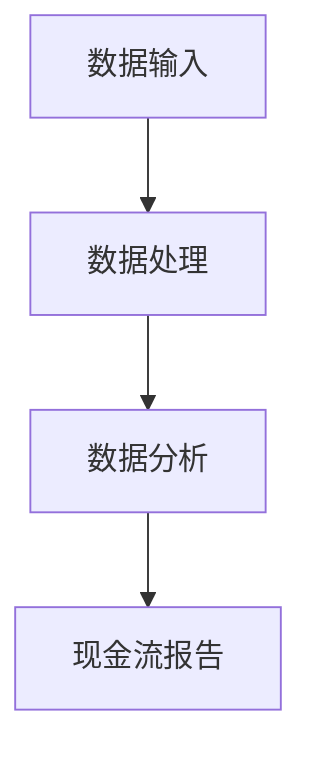

                 


# 巴菲特的现金流分析：公司健康状况的晴雨表

## 关键词：
- 巴菲特
- 现金流分析
- 公司健康
- 投资决策
- 财务分析

## 摘要：
现金流分析是评估公司健康状况的重要工具，尤其是对于巴菲特来说，现金流被视为衡量企业价值的关键指标。本文将详细探讨现金流分析的核心概念、方法、指标以及在投资决策中的应用，通过实际案例分析和系统设计，帮助读者理解如何利用现金流分析来评估公司健康状况，并做出明智的投资决策。

---

# 目录

1. 现金流分析的概述
   1.1 现金流的定义与分类
      - 经营活动现金流
      - 投资活动现金流
      - 筹资活动现金流

   1.2 现金流分析的核心概念
      - 现金流的来源与用途
      - 现金流与企业价值的关系

2. 巴菲特的现金流分析方法
   2.1 自由现金流的计算与重要性
      - 自由现金流公式
      - 自由现金流与企业价值的关系

   2.2 现金流质量的评估
      - 高质量现金流的特征
      - 低质量现金流的表现

3. 现金流分析在企业估值中的应用
   3.1 现金流贴现模型（DCF）
      - DCF模型的基本原理
      - 现金流预测与贴现率的计算

   3.2 投资决策中的现金流分析
      - 现金流分析与投资价值评估
      - 现金流分析与风险控制

4. 现金流分析的系统架构与实现
   4.1 现金流分析系统的设计
      - 数据输入模块
      - 数据处理模块
      - 数据分析模块

   4.2 现金流分析的代码实现
      - 现金流计算的Python代码示例
      - 自由现金流的计算与可视化

5. 实战案例分析
   5.1 案例选择与数据准备
      - 某公司现金流数据的收集与整理

   5.2 现金流分析的实战步骤
      - 数据分析与可视化
      - 投资价值评估与决策

6. 小结与注意事项
   6.1 现金流分析的核心要点总结
   6.2 实践中的注意事项
   6.3 拓展阅读与进一步学习

---

# 第一部分：现金流分析的概述

## 1.1 现金流的定义与分类

现金流是指企业在一定时期内通过经营活动、投资活动和筹资活动所产生现金的流入与流出。现金流是衡量公司健康状况的重要指标，因为它直接反映了公司的盈利能力和资金流动性。

### 现金流的分类

1. **经营活动现金流**：公司日常运营中产生的现金流，包括销售商品、提供服务、支付工资等。
   - 例如：某公司经营活动现金流为正，说明公司日常运营能够产生足够的现金流。

2. **投资活动现金流**：公司投资于长期资产（如购买设备、投资于其他公司）或出售长期资产所形成的现金流。
   - 例如：某公司投资活动现金流为负，说明公司在进行大规模投资。

3. **筹资活动现金流**：公司通过发行股票、债券或其他债务融资所形成的现金流。
   - 例如：某公司筹资活动现金流为正，说明公司正在增加债务或股权融资。

---

## 1.2 现金流分析的核心概念

### 现金流的来源与用途

现金流的来源包括：
- 销售商品或服务获得的现金流入
- 投资收益
- 融资活动获得的现金流入

现金流的用途包括：
- 支付供应商货款
- 支付员工工资
- 购买固定资产

### 现金流与企业价值的关系

现金流是企业价值的核心驱动因素之一。通过现金流分析，投资者可以评估公司的盈利能力和未来现金流的可持续性。

---

# 第二部分：巴菲特的现金流分析方法

## 2.1 自由现金流的计算与重要性

### 自由现金流公式

自由现金流（FCF）= 息税折旧摊销前利润（EBITDA） - 折旧与摊销 - 资本支出

$$ \text{FCF} = \text{EBITDA} - \text{折旧与摊销} - \text{资本支出} $$

自由现金流是衡量公司财务健康状况的重要指标，因为它反映了公司在扣除所有成本后的剩余现金流，能够用于偿还债务或投资于增长项目。

### 自由现金流与企业价值的关系

自由现金流与企业价值（EV）密切相关。巴菲特通常使用自由现金流贴现模型（DCF）来评估公司的内在价值。

$$ \text{EV} = \sum_{t=1}^{n} \frac{\text{FCF}_t}{(1 + r)^t} $$

其中，$r$ 是贴现率，$n$ 是预测的年数。

---

## 2.2 现金流质量的评估

### 高质量现金流的特征

- 现金流来源于主营业务，而非依赖于外部融资。
- 现金流稳定且可持续，能够支持公司未来的增长。
- 现金流与收入增长同步，表明公司能够有效管理资金流。

### 低质量现金流的表现

- 现金流主要来源于外部融资，而非主营业务。
- 现金流波动较大，难以预测。
- 现金流与收入增长不匹配，表明公司可能存在管理问题。

---

# 第三部分：现金流分析在企业估值中的应用

## 3.1 现金流贴现模型（DCF）

### DCF模型的基本原理

现金流贴现模型（DCF）是巴菲特常用的估值方法之一。其基本原理是将公司未来现金流贴现到现值，以评估公司的内在价值。

### 现金流预测与贴现率的计算

1. **现金流预测**：预测公司未来几年的自由现金流。
2. **贴现率**：通常使用加权平均资本成本（WACC）作为贴现率。

$$ \text{WACC} = \left( \frac{D}{D + E} \times r_d \right) + \left( \frac{E}{D + E} \times r_e \right) $$

其中，$D$ 是债务，$E$ 是股权，$r_d$ 是债务的利率，$r_e$ 是股权的预期回报率。

---

## 3.2 投资决策中的现金流分析

### 现金流分析与投资价值评估

通过现金流分析，投资者可以评估公司的内在价值，从而决定是否投资。

### 现金流分析与风险控制

现金流分析还可以帮助投资者识别公司的财务风险，例如是否存在过度杠杆或现金流不足的问题。

---

# 第四部分：现金流分析的系统架构与实现

## 4.1 现金流分析系统的设计

### 系统模块

1. **数据输入模块**：收集公司财务报表数据。
2. **数据处理模块**：计算经营活动、投资活动和筹资活动的现金流。
3. **数据分析模块**：评估现金流质量，计算自由现金流和企业价值。

### 系统架构图



## 4.2 现金流分析的代码实现

### 现金流计算的Python代码示例

```python
import pandas as pd

# 假设我们有一个包含财务数据的DataFrame df
df = pd.read_csv('financial_data.csv')

# 计算经营活动现金流
operating_cash_flow = df['净利润'] + df['折旧与摊销'] - df['非现金项目'] - df['其他调整']

# 计算自由现金流
free_cash_flow = operating_cash_flow - df['资本支出']
```

---

# 第五部分：实战案例分析

## 5.1 案例选择与数据准备

### 案例分析：某公司现金流数据的收集与整理

假设我们选择一家制造公司，收集其最近5年的财务报表数据，包括收入、成本、折旧、资本支出等。

## 5.2 现金流分析的实战步骤

### 数据分析与可视化

1. 计算经营活动现金流、投资活动现金流和筹资活动现金流。
2. 绘制现金流趋势图，分析现金流的变化趋势。

```python
import matplotlib.pyplot as plt

# 绘制经营活动现金流趋势图
plt.plot(years, operating_cash_flow, label='Operating Cash Flow')
plt.xlabel('年份')
plt.ylabel('现金流（亿元）')
plt.title('经营活动现金流趋势图')
plt.legend()
plt.show()
```

### 投资价值评估与决策

通过DCF模型计算公司内在价值，与当前股价进行比较，决定是否投资。

---

# 第六部分：小结与注意事项

## 6.1 现金流分析的核心要点总结

- 现金流是衡量公司健康状况的重要指标。
- 自由现金流是评估企业价值的核心指标。
- 现金流分析可以帮助投资者做出明智的投资决策。

## 6.2 实践中的注意事项

- 确保数据的准确性和完整性。
- 合理选择贴现率，避免高估或低估公司价值。
- 定期更新现金流数据，及时发现潜在风险。

## 6.3 拓展阅读与进一步学习

- 巴菲特的《投资之道》
- 肖恩·O’科朗的《财务报表分析与股票估值》
- 罗伯特·希勒的《金融与经济繁荣》

---

# 作者：AI天才研究院/AI Genius Institute & 禅与计算机程序设计艺术 /Zen And The Art of Computer Programming

