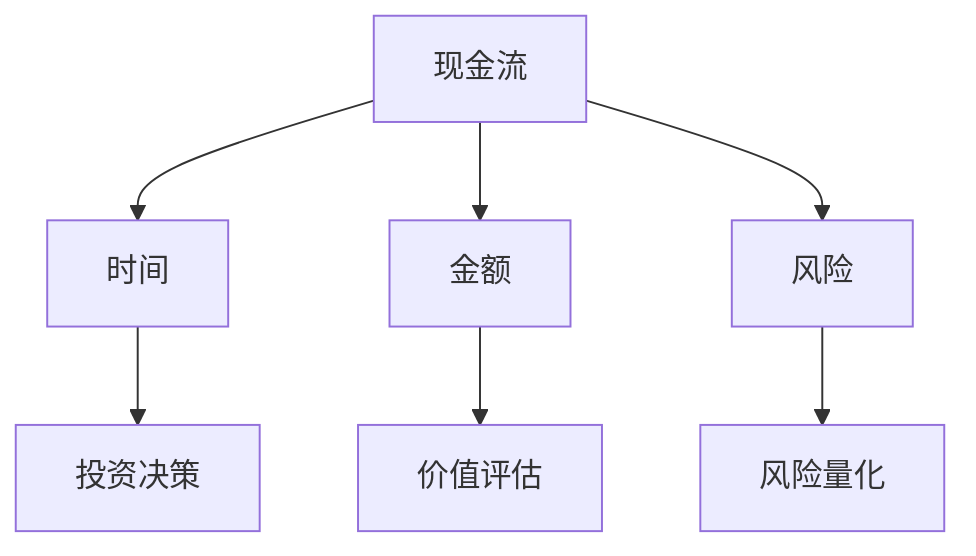
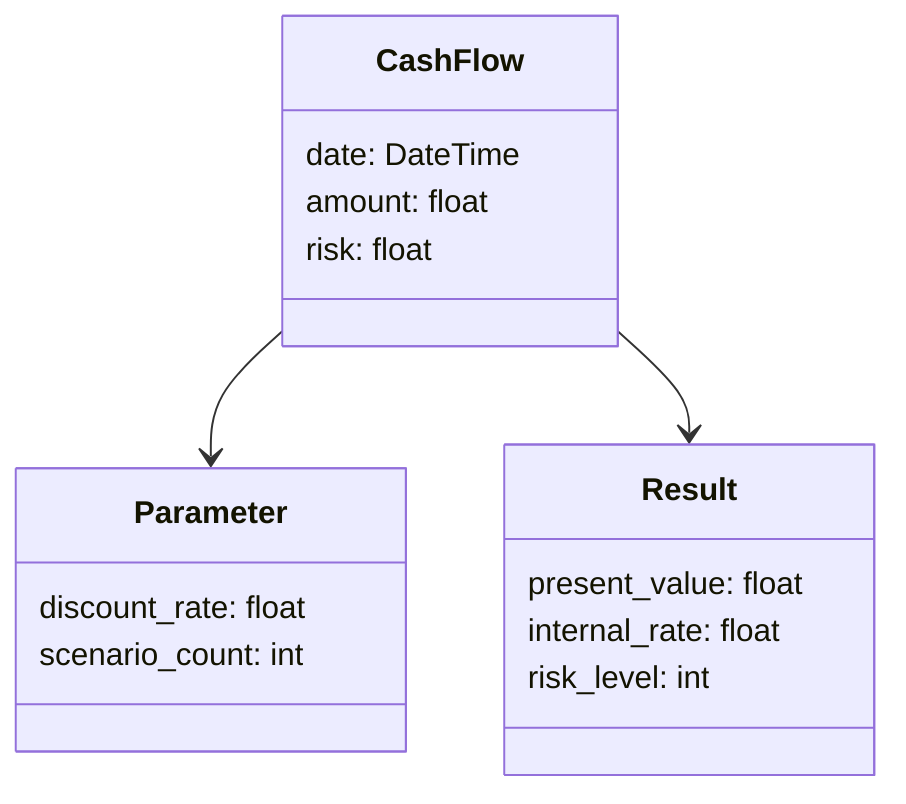
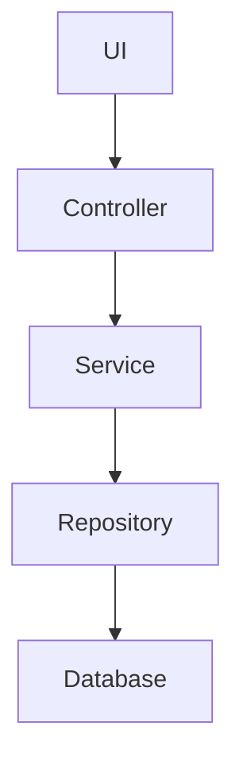
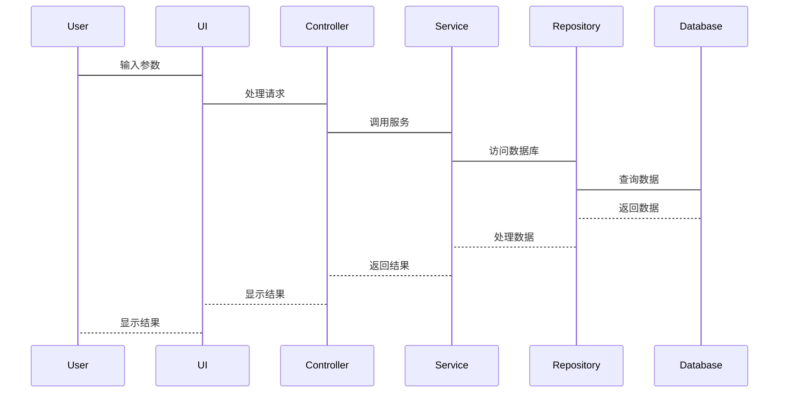

                 


# 巴菲特的现金流分析：量子金融衍生品的风险量化

## 关键词：巴菲特, 现金流分析, 量子金融, 衍生品, 风险量化, 现金流, 投资分析

## 摘要：本文详细探讨了巴菲特的现金流分析方法及其在量子金融衍生品风险量化中的应用。通过分析现金流的时间价值、风险评估以及波动性，结合现代投资组合理论和风险中性定价模型，本文提出了一个基于现金流分析的量子金融衍生品风险量化框架，并通过实际案例展示了该框架的实现与应用。

---

# 第1章 巴菲特投资理念与现金流分析概述

## 1.1 巴菲特投资理念的核心思想

### 1.1.1 巴菲特的价值投资哲学
巴菲特的价值投资哲学强调长期持有的策略，注重企业的内在价值。他主张以合理的价格买入优质资产，并长期持有，避免频繁交易。现金流分析在他的投资决策中占据重要地位，因为他认为现金流是企业健康和价值的直接体现。

### 1.1.2 现金流在巴菲特投资决策中的重要性
现金流是企业创造价值的核心指标，反映了企业的盈利能力和资金流动情况。巴菲特通过分析现金流，评估企业的可持续发展能力和抵御风险的能力。他认为，企业的真实价值可以通过自由现金流的折现来衡量。

### 1.1.3 巴菲特现金流分析方法的独特性
巴菲特的现金流分析方法结合了基本面分析和量化分析，注重企业的实际现金流状况和未来现金流的预测。他的分析方法不仅关注财务报表中的现金流数据，还结合企业的商业模式和行业特点进行综合评估。

## 1.2 量子金融衍生品的基本概念

### 1.2.1 量子金融的定义与特点
量子金融是金融学的一个新兴领域，结合了量子力学的概念和金融市场的复杂性。量子金融衍生品是指基于量子力学原理设计的金融工具，其价格波动与量子系统的不确定性密切相关。

### 1.2.2 金融衍生品的基本类型
金融衍生品包括期货、期权、掉期和资产支持证券等。这些工具的价值依赖于基础资产的价格波动，具有高杠杆性和高风险性。

### 1.2.3 量子金融衍生品与传统衍生品的区别
量子金融衍生品在价格波动和风险特征上与传统衍生品不同。其价格波动受到量子系统不确定性的影响，具有更强的非线性和复杂性。

## 1.3 现金流分析在风险量化中的作用

### 1.3.1 现金流分析的基本原理
现金流分析通过对企业未来现金流的预测和评估，确定其真实价值和风险水平。现金流的时间价值和风险评估是现金流分析的核心内容。

### 1.3.2 现金流分析在风险评估中的应用
现金流分析可以帮助投资者识别和量化投资风险，特别是在复杂金融工具如衍生品的投资中，现金流分析是评估其风险和价值的重要手段。

### 1.3.3 巴菲特现金流分析方法的优势
巴菲特的现金流分析方法注重企业的实际现金流状况，能够有效识别企业的财务风险和经营风险。这种方法在量子金融衍生品的风险量化中具有重要应用价值。

## 1.4 本章小结
本章介绍了巴菲特的投资理念和现金流分析方法，探讨了量子金融衍生品的基本概念及其与传统衍生品的区别。现金流分析在风险量化中的作用是理解后续分析的基础。

---

# 第2章 巴菲特现金流分析的核心概念与联系

## 2.1 现金流分析的核心原理

### 2.1.1 现金流的时间价值
现金流的时间价值是指资金随着时间的推移而产生的价值变化。现值和终值是衡量现金流时间价值的重要指标，可以通过贴现率计算得出。

### 2.1.2 现金流的风险评估
现金流的风险评估包括流动性风险、信用风险和市场风险。通过分析现金流的波动性和相关性，可以量化投资风险。

### 2.1.3 现金流的波动性与相关性
现金流的波动性反映了其价格变动的剧烈程度，相关性则衡量不同资产现金流之间的关联程度。这些因素在投资组合管理和风险量化中具有重要意义。

## 2.2 量子金融衍生品的风险量化模型

### 2.2.1 量子金融衍生品的风险特征
量子金融衍生品的价格波动受到量子系统不确定性的影响，具有非线性和复杂性。其风险特征可以通过量子力学模型进行量化。

### 2.2.2 现金流分析与风险量化的关系
现金流分析是量子金融衍生品风险量化的重要工具。通过对现金流的预测和分析，可以量化衍生品的风险并制定有效的风险管理策略。

### 2.2.3 巴菲特现金流分析方法的应用
巴菲特的现金流分析方法可以应用于量子金融衍生品的风险量化。通过分析衍生品的现金流特征，可以评估其风险和价值。

## 2.3 核心概念的ER实体关系图



## 2.4 本章小结
本章详细讲解了现金流分析的核心原理和量子金融衍生品的风险量化模型，并通过ER实体关系图展示了核心概念之间的联系。

---

# 第3章 现金流分析的算法原理与实现

## 3.1 现金流分析的算法原理

### 3.1.1 现金流分析的基本算法
现金流分析的基本算法包括净现值（NPV）、内部收益率（IRR）和贴现现金流模型。这些算法用于评估投资项目的现值和未来现金流。

### 3.1.2 现金流分析的优化算法
优化算法如蒙特卡洛模拟用于量化现金流的不确定性。通过模拟不同的现金流情景，可以评估投资风险。

### 3.1.3 现金流分析的复杂度分析
现金流分析的复杂度与数据量和情景数量有关。复杂度分析有助于选择合适的算法和优化计算效率。

## 3.2 现金流分析的Python实现

```python
def calculate_cash_flow(cash_inflows, cash_outflows, discount_rate):
    net_cash_flows = [inflow - outflow for inflow, outflow in zip(cash_inflows, cash_outflows)]
    present_value = sum(flow / (1 + discount_rate) ** t for t, flow in enumerate(net_cash_flows))
    return present_value
```

## 3.3 现金流分析的数学模型

### 3.3.1 现金流分析的数学模型
现金流分析的数学模型包括现值公式和内部收益率公式。现值公式用于计算未来现金流的现值，内部收益率公式用于计算投资项目的回报率。

### 3.3.2 现金流分析的优化模型
优化模型如蒙特卡洛模拟用于量化现金流的不确定性。通过模拟不同情景，可以评估投资风险和优化投资组合。

## 3.4 本章小结
本章详细讲解了现金流分析的算法原理和Python实现，并通过数学模型展示了现金流分析的实现过程。

---

# 第4章 现金流分析的数学模型与应用

## 4.1 现金流分析的数学模型

### 4.1.1 现金流的时间价值模型
现值公式：$$ PV = \sum_{t=1}^{n} \frac{CF_t}{(1 + r)^t} $$

### 4.1.2 现金流的风险评估模型
风险中性定价模型：$$ E[ R ] = \lambda \sigma^2 $$

### 4.1.3 现金流波动性的量化模型
波动率公式：$$ \sigma = \sqrt{\frac{1}{n-1} \sum_{i=1}^{n} (x_i - \bar{x})^2} $$

## 4.2 量子金融衍生品的风险量化模型

### 4.2.1 量子金融衍生品的风险特征模型
量子金融衍生品的风险特征可以通过量子力学模型进行量化，如量子波动率模型。

### 4.2.2 现金流分析与量子金融衍生品的风险量化
现金流分析是量子金融衍生品风险量化的重要工具，通过分析现金流的波动性和相关性，可以量化投资风险。

## 4.3 本章小结
本章详细讲解了现金流分析的数学模型及其在量子金融衍生品风险量化中的应用。

---

# 第5章 现金流分析的系统架构设计

## 5.1 问题场景介绍
现金流分析系统用于量化投资风险，特别是在量子金融衍生品的投资中。系统需要处理大量数据并进行复杂的计算。

## 5.2 系统功能设计

### 5.2.1 系统功能模块
- 数据输入模块：接收现金流数据和参数。
- 数据处理模块：计算现值和内部收益率。
- 风险评估模块：量化投资风险。
- 结果输出模块：展示分析结果。

### 5.2.2 系统功能模块的ER类图



## 5.3 系统架构设计

### 5.3.1 系统架构设计的分层架构图



### 5.3.2 系统交互设计的序列图



## 5.4 系统接口设计

### 5.4.1 系统接口的设计
- 输入接口：接收现金流数据和参数。
- 输出接口：展示分析结果。

### 5.4.2 系统接口的交互流程
1. 用户输入数据和参数。
2. 系统处理请求并计算结果。
3. 系统返回结果并展示。

## 5.5 本章小结
本章详细讲解了现金流分析系统的架构设计和接口设计，展示了系统的功能模块和交互流程。

---

# 第6章 项目实战：基于现金流分析的量子金融衍生品风险量化

## 6.1 项目介绍
本项目旨在通过现金流分析量化量子金融衍生品的投资风险。选择苹果公司的可转换债券作为案例，分析其现金流特征和风险水平。

## 6.2 项目环境配置

### 6.2.1 系统环境
- 操作系统：Linux
- Python版本：3.8
- 依赖库：numpy, pandas, matplotlib

### 6.2.2 安装依赖
```bash
pip install numpy pandas matplotlib
```

## 6.3 核心代码实现

### 6.3.1 现金流分析代码

```python
import numpy as np
import pandas as pd
import matplotlib.pyplot as plt

def calculate_cash_flow(cash_inflows, cash_outflows, discount_rate):
    net_cash_flows = [inflow - outflow for inflow, outflow in zip(cash_inflows, cash_outflows)]
    present_value = np.npv(discount_rate, net_cash_flows)
    return present_value

def main():
    cash_inflows = [100, 200, 300]
    cash_outflows = [50, 100, 70]
    discount_rate = 0.1
    pv = calculate_cash_flow(cash_inflows, cash_outflows, discount_rate)
    print(f"净现值为：{pv:.2f}")

if __name__ == "__main__":
    main()
```

### 6.3.2 风险评估代码

```python
def calculate_risk(cash_flows, confidence_level):
    cash_flows_sorted = sorted(cash_flows)
    n = len(cash_flows_sorted)
    quantile = (n - 1) * confidence_level / 100
    risk_level = cash_flows_sorted[int(quantile)]
    return risk_level

def main():
    cash_flows = [100, 200, 300, 400, 500]
    confidence_level = 95
    risk = calculate_risk(cash_flows, confidence_level)
    print(f"风险水平为：{risk}")

if __name__ == "__main__":
    main()
```

## 6.4 实际案例分析与详细解读

### 6.4.1 案例介绍
以苹果公司发行的可转换债券为例，分析其现金流特征和风险水平。

### 6.4.2 数据收集与处理
收集债券的面值、票面利率、转股价等信息，并计算其未来现金流。

### 6.4.3 模型应用与结果解读
通过现金流分析模型计算债券的净现值和内部收益率，评估其风险水平。

## 6.5 本章小结
本章通过实际案例展示了现金流分析在量子金融衍生品风险量化中的应用，验证了模型的有效性。

---

# 作者：AI天才研究院/AI Genius Institute & 禅与计算机程序设计艺术/Zen And The Art of Computer Programming

