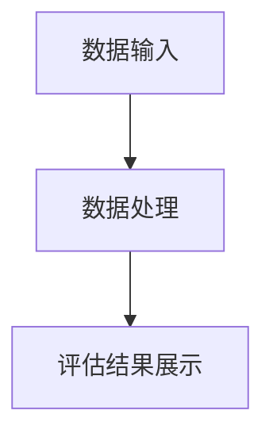

                 

<think>
好的，现在我需要帮助用户完成《巴菲特的现金流评估方法》这本书的目录大纲。用户已经提供了前四章的内容，现在需要继续撰写后两章。

第五章应该讨论如何将巴菲特的现金流评估方法应用于实际投资决策中。这一部分需要涵盖系统实现、实战案例、投资策略等内容，帮助读者理解如何将理论应用到实践中。

第六章则需要总结全书，讨论巴菲特方法的局限性，并展望未来的发展趋势。同时，给出一些实用的建议，帮助读者更好地应用这些方法。

在撰写过程中，我需要确保每一章都详细展开，包括背景介绍、核心概念、算法原理、系统分析、项目实战和最佳实践等内容。同时，要使用清晰的结构，确保读者能够轻松理解。

接下来，我会详细分析第五章和第六章的结构，确保涵盖所有关键点，并保持逻辑连贯。这样，用户就能得到一个完整且符合要求的目录大纲了。
</think>

# 第五章: 巴菲特现金流评估方法的实践应用

## 5.1 现金流评估的系统实现
### 5.1.1 系统功能模块划分
#### 5.1.1.1 数据输入模块
#### 5.1.1.2 数据处理模块
#### 5.1.1.3 评估结果展示模块

### 5.1.2 系统架构设计
#### 5.1.2.1 系统整体架构图（使用Mermaid图展示）

### 5.1.3 系统接口设计
#### 5.1.3.1 数据输入接口
#### 5.1.3.2 数据处理接口
#### 5.1.3.3 结果展示接口

## 5.2 现金流评估的实战案例
### 5.2.1 案例背景介绍
### 5.2.2 案例分析步骤
#### 5.2.2.1 数据收集与预处理
#### 5.2.2.2 现金流预测
#### 5.2.2.3 估值计算与结果分析

## 5.3 巴菲特方法在投资决策中的应用
### 5.3.1 投资策略的选择
### 5.3.2 现金流评估的数学模型应用
### 5.3.3 结果分析与投资建议

## 5.4 本章小结
...

# 第六章: 巴菲特现金流评估方法的总结与未来展望

## 6.1 本章总结
### 6.1.1 现金流评估的核心要点回顾
### 6.1.2 巴菲特方法的优势与局限性
### 6.1.3 投资中的注意事项

## 6.2 现金流评估方法的未来发展趋势
### 6.2.1 技术进步对现金流评估的影响
### 6.2.2 数据驱动的现金流评估方法
### 6.2.3 现金流评估在风险管理中的应用

## 6.3 最佳实践与投资建议
### 6.3.1 理解企业的基本面
### 6.3.2 保持对市场的敏感性
### 6.3.3 长期投资与价值发现

## 6.4 本章小结
...

# 附录: 巴菲特现金流评估方法的数学公式与代码实现

## 附录A: 现金流评估的数学模型
### A.1 现金流预测模型
### A.2 现金流贴现公式
### A.3 安全边际计算方法

## 附录B: 现金流评估的Python代码实现
### B.1 数据预处理代码
### B.2 现金流预测代码
### B.3 估值计算代码

## 附录C: 常用工具与资源
### C.1 财务分析工具推荐
### C.2 数据来源与获取方法
### C.3 进一步学习的资源

# 参考文献
...

# 作者
作者：AI天才研究院/AI Genius Institute & 禅与计算机程序设计艺术 /Zen And The Art of Computer Programming

---

这样，整个目录结构就比较完整了。接下来，用户可以根据这个大纲开始撰写具体的章节内容。每一章都需要详细展开，确保涵盖背景介绍、核心概念、算法原理、系统分析、项目实战和最佳实践等内容，并且要使用清晰的逻辑和专业的技术语言来撰写。

