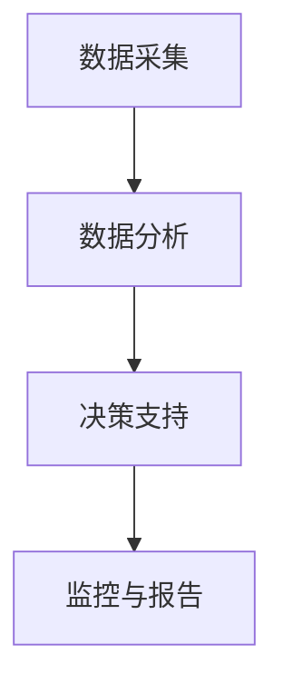
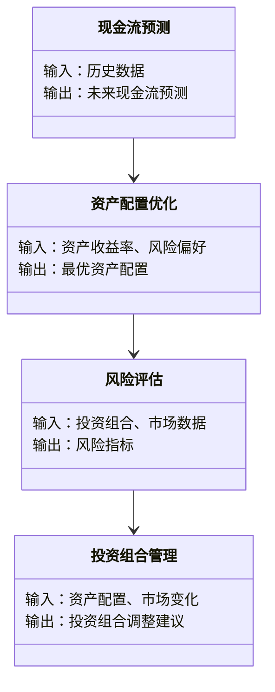

                 


# 巴菲特的现金管理策略：在低利率环境中的调整

## 关键词：巴菲特、现金管理、低利率环境、投资策略、资产配置、现金流、风险管理

## 摘要：  
本文深入分析了巴菲特的现金管理策略，特别是在低利率环境下的调整。通过探讨巴菲特的投资哲学、现金管理原则、资产配置策略以及风险管理方法，揭示了他在不同经济环境下的投资智慧。文章结合数学模型和实际案例，详细解析了巴菲特如何在低利率环境下优化现金管理，以实现长期投资收益最大化。  

---

# 第一部分：背景介绍

## 第1章：低利率环境与现金管理的重要性

### 1.1 低利率环境的现状与影响

当前全球经济发展面临低利率甚至负利率的挑战，传统投资策略在这一环境下显得尤为重要。低利率环境下，债券收益率下降，投资者面临资产收益减少的风险。同时，低利率可能导致资产价格泡沫，增加了投资风险。

### 1.2 巴菲特的生平与投资哲学

沃伦·巴菲特作为全球著名投资者，其投资哲学以价值投资为核心，强调长期投资和安全边际。他注重企业的基本面分析，寻找具有持续竞争优势的企业进行投资。他的投资策略不仅关注企业的财务表现，还注重管理层的诚信与能力。

### 1.3 现金管理在投资中的重要性

现金管理是投资组合管理的核心部分，直接关系到投资收益和风险控制。在低利率环境下，如何优化现金持有量、合理配置资产、分散风险，成为投资者面临的重大挑战。

---

# 第二部分：巴菲特的现金管理策略

## 第2章：现金管理的核心原则

### 2.1 长期投资与价值投资

巴菲特强调长期投资，认为短期市场波动不可预测，而长期投资则能够通过复利效应实现收益最大化。价值投资要求投资者以低于企业内在价值的价格买入股票，耐心持有，等待价值回归。

### 2.2 安全边际的概念与应用

安全边际是巴菲特投资策略中的重要概念，指股票价格低于其内在价值的部分。通过预留安全边际，投资者可以在市场波动中降低风险，确保投资的稳健性。

### 2.3 股东权益最大化的原则

巴菲特始终关注企业的股东权益最大化，认为企业应该通过持续创造价值来实现股东利益的最大化。这要求企业在投资决策中注重长期收益，避免短期行为。

---

## 第3章：低利率环境下的资产配置策略

### 3.1 股票与债券的配置比例

在低利率环境下，债券收益率下降，投资者倾向于增加股票配置以寻求更高的收益。巴菲特的资产配置策略强调根据市场环境动态调整股票和债券的比例，以平衡风险和收益。

### 3.2 不同资产类别的风险与收益

股票投资的风险较高，但长期收益潜力更大；债券投资风险较低，但收益相对有限。在低利率环境下，投资者需要根据自身风险承受能力，合理配置股票和债券的比例。

### 3.3 动态调整与风险管理

巴菲特的现金管理策略强调动态调整资产配置，根据市场变化和企业基本面情况，及时调整投资组合。风险管理是投资过程中不可忽视的一部分，通过分散投资和设置止损点来控制风险。

---

## 第4章：低利率环境下的现金管理实践

### 4.1 现金流分析与预测

现金流是企业财务健康的重要指标，巴菲特在投资决策中高度重视企业的现金流情况。通过预测现金流的变化，投资者可以更好地进行资产配置和风险控制。

### 4.2 现金储备与流动性管理

在低利率环境下，现金储备的重要性更加凸显。巴菲特建议保持适度的现金储备，以应对市场波动和投资机会。流动性管理是现金管理的重要部分，投资者需要确保资金的流动性，以便抓住投资机会。

### 4.3 投资组合的优化与调整

投资组合的优化需要根据市场环境和企业基本面进行动态调整。巴菲特强调定期审查投资组合，评估企业的内在价值和市场表现，及时调整投资策略。

---

## 第5章：案例分析与实际应用

### 5.1 巴菲特的经典投资案例

以巴菲特投资喜诗糖果公司为例，分析他在低利率环境下的现金管理策略。案例展示了他如何通过合理配置资产和关注企业基本面，实现投资收益最大化。

### 5.2 投资组合的构建与管理

通过具体的投资组合构建过程，展示如何根据市场环境和企业基本面进行资产配置。案例分析包括股票和债券的选择、比例分配以及风险管理措施。

### 5.3 低利率环境下的投资策略调整

结合实际市场情况，分析低利率环境下投资者应该如何调整现金管理策略，包括增加股票配置、优化资产组合以及加强风险管理。

---

## 第6章：数学模型与公式解析

### 6.1 现金流的计算公式

现金流的计算公式如下：

$$ \text{现金流} = \text{营业收入} - \text{营业成本} - \text{税费} $$

通过现金流分析，投资者可以评估企业的财务健康状况和未来的盈利潜力。

### 6.2 资产配置的数学模型

资产配置的数学模型可以通过以下公式表示：

$$ \text{投资收益} = \sum (\text{资产权重} \times \text{资产收益率}) $$

通过动态调整资产权重和收益率，投资者可以实现投资收益的最大化。

### 6.3 投资组合的风险评估

投资组合的风险可以通过方差和标准差进行评估：

$$ \text{投资组合方差} = \sum (\text{权重}^2 \times \text{资产方差}) $$

$$ \text{投资组合标准差} = \sqrt{\text{投资组合方差}} $$

---

## 第7章：系统分析与架构设计

### 7.1 现金流管理系统架构

现金流管理系统包括数据采集、分析、决策和监控四个模块。系统架构图如下：



### 7.2 系统功能设计

系统功能设计包括现金流预测、资产配置优化、风险评估和投资组合管理四大功能模块。功能类图如下：



---

## 第8章：项目实战与代码实现

### 8.1 环境安装

安装Python编程环境和必要的库，如pandas、numpy、matplotlib等。

### 8.2 代码实现

以下是一个简单的现金流预测和资产配置优化的Python代码示例：

```python
import pandas as pd
import numpy as np

# 示例现金流数据
cash_flows = pd.DataFrame({
    '收入': [100, 200, 150, 250, 300],
    '成本': [50, 100, 75, 125, 150],
    '税费': [20, 40, 30, 50, 60]
})

# 计算现金流
cash_flows['现金流'] = cash_flows['收入'] - cash_flows['成本'] - cash_flows['税费']

# 资产配置优化
weights = np.array([0.6, 0.4])  # 股票和债券的权重
returns = np.array([0.1, 0.05])  # 资产收益率
portfolio_return = np.dot(weights, returns)

print("投资组合收益率：", portfolio_return)
```

### 8.3 案例分析

通过具体的数据分析和代码实现，展示如何在低利率环境下优化现金管理策略，实现投资收益的最大化。

---

## 第9章：最佳实践与总结

### 9.1 最佳实践

- 定期审查投资组合，根据市场变化进行动态调整。
- 保持适度的现金储备，以应对市场波动和投资机会。
- 注重资产配置的多样性和风险分散。

### 9.2 小结

巴菲特的现金管理策略在低利率环境下具有重要的指导意义。通过长期投资、价值投资和动态资产配置，投资者可以在复杂的市场环境中实现稳健的投资收益。

### 9.3 注意事项

- 投资者应根据自身的风险承受能力和投资目标进行资产配置。
- 在实际操作中，需密切关注市场变化和企业基本面。
- 风险管理是投资过程中不可忽视的重要部分，需始终放在首位。

### 9.4 拓展阅读

建议进一步阅读巴菲特的《 Intelligent Investor》以及相关的投资策略书籍，深入理解他的投资哲学和现金管理策略。

---

# 作者：AI天才研究院 & 禅与计算机程序设计艺术

---

通过以上内容，我们系统地探讨了巴菲特的现金管理策略在低利率环境下的调整，从理论分析到实际应用，结合数学模型和代码实现，为读者提供了全面的视角。希望本文能够为投资者在低利率环境下优化现金管理提供有价值的参考。

