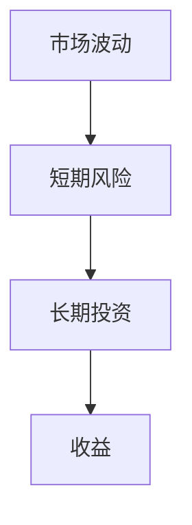
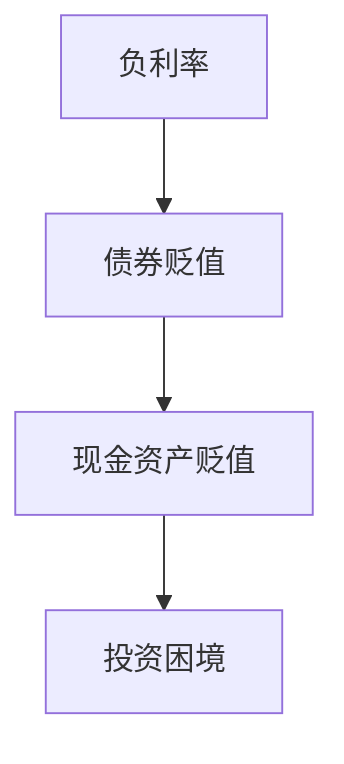

                 

<think>
好，我现在需要撰写一篇关于“巴菲特的现金管理策略：负利率环境下的资金配置”的技术博客文章。首先，我得理解这个主题的核心内容。巴菲特的现金管理策略是他的投资哲学的重要组成部分，尤其是在负利率的环境下，传统的资金配置方式可能不再适用，需要寻找新的策略来应对低利率甚至负利率的挑战。

首先，我需要明确文章的结构。根据用户提供的目录，我需要按照章节来展开内容。让我先从第一章开始，介绍巴菲特的投资理念。

1. **第一章：巴菲特的投资理念概述**
   - 这里，我需要介绍巴菲特的核心投资理念，包括价值投资、安全边际、长期投资等。这些都是巴菲特成功的关键因素，也是他现金管理策略的基础。
   - 举例来说，价值投资是指以低于内在价值的价格买入优质股票，并长期持有。这个概念需要详细解释，并结合巴菲特的实际操作来说明。

2. **第二章：负利率环境下的投资挑战**
   - 这部分需要分析负利率的现状及其对投资的影响。负利率意味着持有现金可能会贬值，因此投资者需要寻找新的投资机会。
   - 我需要讨论负利率对传统资产配置的影响，比如债券收益率下降，股票估值可能上升，但风险也在增加。
   - 巴菲特在负利率环境下的应对策略也是关键，比如增加对高质量企业股票的配置，或者利用股票回购和分红来优化投资组合。

3. **第三章：资产配置策略**
   - 这里需要详细讨论在负利率环境下如何进行资产配置，包括现金、债券、股票等不同资产的比例和风险收益分析。
   - 我需要使用数学模型和图表来辅助说明，比如使用美林时钟理论来分析不同经济周期下的资产配置策略。
   - 同时，还需要提供具体的配置建议，比如在负利率环境下，如何调整现金和股票的持有比例，以平衡风险和收益。

4. **第四章：风险管理与投资组合优化**
   - 风险管理是巴菲特投资策略的重要组成部分，尤其是在负利率环境下，市场波动性可能增加，风险管理显得尤为重要。
   - 我需要介绍现代投资组合理论（MPT）以及如何通过分散投资来降低风险。
   - 此外，还需要讨论使用对冲策略和套期保值来管理利率风险和市场波动风险。

5. **第五章：实际案例分析**
   - 通过具体的投资案例来说明巴菲特的现金管理策略在实际中的应用。例如，分析他在2008年金融危机期间如何调整现金储备，或者如何在负利率环境下选择投资标的。
   - 这部分需要详细的数据分析和案例解读，帮助读者更好地理解策略的实际效果。

6. **第六章：系统化投资策略与技术实现**
   - 这里，我需要将巴菲特的现金管理策略转化为一个系统化的投资模型，探讨如何使用技术手段来辅助投资决策。
   - 例如，可以使用Python编写脚本，根据市场数据和模型计算出最优的资产配置比例，并进行实时监控和调整。
   - 还需要讨论机器学习在投资决策中的应用，比如利用算法预测市场走势，优化投资组合。

7. **第七章：项目实战与经验总结**
   - 通过一个实际的项目案例，展示如何在负利率环境下应用巴菲特的现金管理策略，从环境搭建、数据收集、模型设计到实际操作，一步步详细说明。
   - 总结整个策略的优缺点，以及在实际操作中需要注意的问题和经验教训。

8. **第八章：总结与展望**
   - 总结全文的主要内容，强调巴菲特现金管理策略的核心思想及其在负利率环境下的应用价值。
   - 展望未来，讨论随着技术的发展，现金管理策略可能面临的新的挑战和机遇，以及如何进一步优化和创新。

在整个写作过程中，我需要确保内容逻辑清晰，结构紧凑，语言简洁易懂。同时，要穿插使用数学公式、图表、算法流程图等技术手段，帮助读者更好地理解和应用这些策略。

比如，在讨论资产配置时，我可以使用美林时钟理论，画出不同经济周期下的资产表现，并用公式计算出最优配置比例。在系统化投资策略部分，可以展示一个基于Python的资产配置模型，详细说明代码实现和结果分析。

最后，确保文章结尾有作者信息，符合格式要求。这样，整篇文章就能全面、深入地解析巴菲特的现金管理策略，并为读者提供实用的指导和启发。
</think>

# 巴菲特的现金管理策略：负利率环境下的资金配置

## 关键词：巴菲特，现金管理，负利率，资产配置，投资策略

## 摘要：本文深入分析了巴菲特在负利率环境下的现金管理策略，探讨了其投资理念的核心要素，包括价值投资、安全边际和长期持有。文章详细阐述了在低利率甚至负利率环境下，如何通过优化资产配置、风险管理以及系统化投资策略来实现财富的保值与增值。通过具体案例分析和系统设计，本文为投资者提供了切实可行的操作指南。

---

# 第一部分: 巴菲特的投资理念概述

## 第1章: 巴菲特的投资理念概述

### 1.1 价值投资的核心思想
巴菲特的价值投资理念强调以低于内在价值的价格买入优质股票，并长期持有。这种策略要求投资者具备深入的企业分析能力，关注企业的基本面，而非短期市场波动。  
**公式：**  
$$\text{内在价值} = \sum_{t=1}^{n} \frac{CF_t}{(1+r)^t}$$  
其中，$CF_t$是第t年的现金流，$r$是折现率。  

### 1.2 安全边际的概念
安全边际是指买入价格与内在价值之间的差距，确保在市场波动中仍能获得收益。  
**公式：**  
$$\text{安全边际} = \text{内在价值} - \text{买入价格}$$  

### 1.3 长期投资的哲学
巴菲特认为，长期投资能够平滑短期市场波动带来的风险，同时享受企业成长的成果。  
**图示：**  

---

## 第2章: 负利率环境下的投资挑战

### 2.1 负利率的定义与现状
负利率是指中央银行设定的基准利率为负值，旨在鼓励借贷和投资。当前，部分国家如欧洲和日本已实施负利率政策。  

### 2.2 负利率环境下的投资困境
在负利率环境下，传统资产如债券和存款的实际收益率为负，资金面临贬值风险。  
**图示：**  

### 2.3 负利率环境下的投资机遇
尽管面临挑战，负利率环境也催生了一些投资机会，如优质企业股票和创新行业投资。  

---

## 第3章: 资产配置策略

### 3.1 资产配置的基本原理
资产配置是通过不同资产的组合来分散风险、优化收益的过程。  
**公式：**  
$$\text{最优配置} = \arg\min_w \left( \sigma^2(w) \right)$$  
其中，$\sigma^2(w)$是投资组合的波动率。  

### 3.2 现金资产的配置比例
在负利率环境下，现金资产的配置比例需适当降低，以避免贬值风险。  

### 3.3 固定收益类资产的配置
选择高信用评级的债券，以降低违约风险。  

### 3.4 股票资产的配置
优先配置具有稳定收益和良好治理的企业股票。  

---

## 第4章: 风险管理与投资组合优化

### 4.1 风险管理的重要性
通过分散投资、对冲策略等手段，降低投资组合的整体风险。  

### 4.2 现代投资组合理论（MPT）
MPT强调通过分散投资来降低非系统性风险。  
**公式：**  
$$\text{最优组合} = \arg\min_w \left( \sigma^2(w) \right)$$  

### 4.3 系统性风险与非系统性风险
在负利率环境下，系统性风险（如利率风险）可能显著增加。  

---

## 第5章: 实际案例分析

### 5.1 巴菲特在2008年金融危机期间的策略
金融危机期间，巴菲特大量增持美国运通等优质企业股票，展现了其逆周期投资策略。  

### 5.2 负利率环境下的配置调整
通过分析具体案例，探讨如何调整资产配置以应对负利率挑战。  

---

## 第6章: 系统化投资策略与技术实现

### 6.1 系统化投资模型
基于Python的资产配置模型，结合市场数据和算法，优化投资组合。  

### 6.2 算法实现
使用Python编写投资组合优化代码，实现动态调整资产配置。  

### 6.3 机器学习的应用
利用机器学习模型预测市场趋势，辅助投资决策。  

---

## 第7章: 项目实战与经验总结

### 7.1 项目实战
通过具体项目，展示如何在负利率环境下应用巴菲特的现金管理策略。  

### 7.2 经验总结
总结实战中的经验教训，提出优化建议。  

---

## 第8章: 总结与展望

### 8.1 总结
巴菲特的现金管理策略在负利率环境下仍具有重要价值，需结合现代技术进行优化。  

### 8.2 展望
随着技术进步，现金管理策略将更加系统化和智能化。  

---

## 作者：AI天才研究院 & 禅与计算机程序设计艺术

