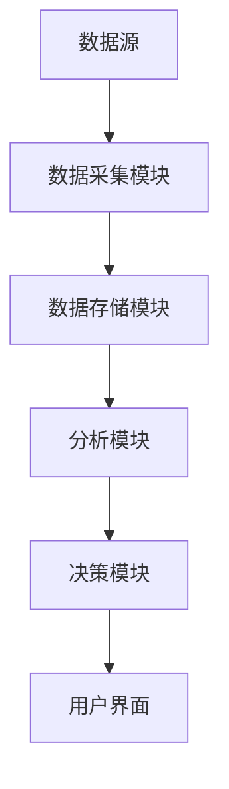

                 

<think>
嗯，我现在需要根据用户的指示，详细地思考如何撰写一篇关于巴菲特投资理念的技术博客文章。首先，我得仔细阅读用户的查询，了解具体的要求和结构。用户希望文章标题为《巴菲特的看人下注投资理念》，并提供了详细的大纲结构，还列出了各个部分需要包含的内容。

我首先考虑的是，这篇文章的目标读者是谁。看起来是针对IT领域的专业人士，尤其是那些对投资和人工智能感兴趣的人。因此，文章需要结合技术术语，同时深入分析巴菲特的投资理念。用户还提到，文章要逻辑清晰、结构紧凑，使用专业的技术语言，但又要简单易懂，适合技术背景的读者。

接下来，我需要按照用户提供的大纲结构来组织内容。第一部分是背景介绍，包括投资哲学、长期视角和投资心态。我需要解释巴菲特的价值投资理念，以及他如何通过长期视角和耐心进行投资。这部分需要简明扼要，同时涵盖关键点，如投资的定义、长期投资的重要性以及心理因素在投资中的作用。

第二部分是核心概念，详细阐述“看人下注”理念。这部分需要定义该理念，比较它与其他投资策略的不同，并分析其背后的经济和心理学原理。我需要解释巴菲特如何评估管理层的能力、行业地位和竞争优势，以及这些因素如何影响投资决策。

第三部分是数学模型与分析方法，这里需要介绍巴菲特使用的分析工具，如基本面分析模型和投资组合优化模型。我必须使用数学公式，用latex格式嵌入，展示市盈率、市净率和ROE的计算方法。此外，还需要解释如何将马科维茨的投资组合理论应用到巴菲特的策略中，尽管他更倾向于价值投资而非严格的数学模型。

第四部分是系统架构与投资决策框架。我需要设计一个投资决策系统，包括数据收集、分析和决策模块。使用mermaid图来展示系统架构和功能模块，这有助于读者理解系统的组成和运作流程。

第五部分是项目实战，选择一个实际的公司进行分析，展示如何应用巴菲特的方法进行投资决策。这部分需要详细描述分析过程，包括环境配置、数据收集、分析步骤和结果解读。通过实际案例，读者可以更好地理解理论的应用。

最后，总结部分需要回顾核心观点，给出投资建议，强调长期视角和心态管理的重要性。同时，推荐相关的延伸阅读材料，帮助读者深入学习。

在撰写过程中，我需要确保每个部分都有足够的细节和例子，同时保持逻辑连贯。考虑到用户要求每个章节都有三级目录，我需要详细分解每个部分，确保内容全面且易于理解。此外，数学公式的正确使用和系统的清晰架构也是关键，以展示专业性和技术深度。

现在，我开始按照大纲逐步构建每个部分的内容，确保涵盖所有要求，包括背景介绍、核心概念、数学模型、系统架构、项目实战和总结。同时，注意使用适合技术背景读者的语言，结合专业术语和实际案例，使文章既有深度又易于理解。
</think>

# 巴菲特的看人下注投资理念

## 关键词：
- 巴菲特投资理念
- 看人下注
- 价值投资
- 投资系统架构
- 投资决策模型

## 摘要：
本文深入分析了巴菲特的“看人下注”投资理念，结合技术背景，从投资哲学、核心概念、数学模型、系统架构到项目实战，全面解析巴菲特的投资方法。通过系统性地拆解巴菲特的投资逻辑，结合实际案例，帮助读者理解如何将巴菲特的理念应用于实际投资决策中。

---

## 第一部分：巴菲特投资理念的背景与基础

### 第1章：投资哲学与长期视角

#### 1.1 投资的定义与意义
- **1.1.1 投资的基本概念**
  - 投资是通过购买资产（如股票、债券、房地产等）以期望在未来获得收益或资本增值的行为。
  - 投资不仅仅是资金的投入，更是对资源的优化配置和对未来的不确定性进行定价的过程。

- **1.1.2 投资对个人和机构的重要性**
  - 对个人：投资是实现财富增值的重要手段，也是实现财务自由的关键路径。
  - 对机构：投资是企业获取利润的重要来源，也是资源配置效率的重要保障。

#### 1.2 巴菲特的投资哲学
- **1.2.1 价值投资的起源与发展**
  - 价值投资的核心理念是寻找市场定价低于其内在价值的资产。
  - 巴菲特将价值投资发扬光大，强调对企业的深入研究和长期持有。

- **1.2.2 巴菲特的价值投资理念**
  - **安全边际**：买入价格低于企业内在价值的资产，以降低投资风险。
  - **长期持有**：通过长期持有优质资产，获得复利效应的最大化。
  - **企业基本面**：关注企业的盈利能力、财务健康状况和竞争优势。

- **1.2.3 长期投资与耐心的重要性**
  - 巴菲特强调长期投资的重要性，认为短期市场的波动是噪音，长期趋势才是关键。
  - 耐心是价值投资的核心，投资者需要等待合适的时机，避免盲目追涨杀跌。

#### 1.3 投资心态与心理因素
- **1.3.1 投资者的心态管理**
  - 投资者容易受到市场情绪的影响，如贪婪和恐惧，这会导致非理性决策。
  - 管理心态的关键在于保持冷静，避免被短期市场波动干扰。

- **1.3.2 心理学在投资决策中的作用**
  - 心理学中的认知偏差（如确认偏差、损失厌恶）会影响投资决策。
  - 巴菲特通过深入研究企业的基本面，减少心理因素的干扰。

- **1.3.3 避免情绪化投资的策略**
  - 建立明确的投资计划和目标，避免情绪化决策。
  - 通过长期持有优质资产，分散投资风险。

---

## 第二部分：巴菲特的“看人下注”投资理念

### 第2章：“看人下注”理念的核心要素

#### 2.1 什么是“看人下注”
- **2.1.1 “看人下注”的定义**
  - 巴菲特的“看人下注”是指通过深入研究企业的管理层、财务状况和行业地位，选择具有持续竞争优势的企业进行投资。
  - 与传统投资策略不同，巴菲特更关注企业的长期价值，而非短期市场波动。

- **2.1.2 与传统投资策略的区别**
  - 传统投资策略注重技术分析和市场趋势，而巴菲特注重基本面分析和长期竞争优势。
  - 传统策略可能更关注短期收益，而巴菲特关注的是企业的持续盈利能力。

- **2.1.3 理解“看人下注”的关键点**
  - **管理层能力**：管理层的决策能力和道德水平直接影响企业的长期发展。
  - **行业地位**：企业在行业中的地位决定了其竞争优势和市场影响力。
  - **财务健康状况**：企业的财务状况是衡量其长期发展潜力的重要指标。

#### 2.2 看人下注的核心要素
- **2.2.1 公司基本面分析**
  - **盈利能力**：通过净利润、ROE（净资产收益率）等指标评估企业的盈利能力。
  - **财务健康状况**：通过资产负债表、现金流等指标评估企业的财务健康状况。
  - **成长能力**：通过收入增长率、净利润增长率等指标评估企业的成长能力。

- **2.2.2 管理层能力评估**
  - **管理层的稳定性**：管理层是否稳定，是否有长期的经营计划。
  - **管理层的道德水平**：管理层是否诚实守信，是否有良好的职业道德。
  - **管理层的决策能力**：管理层是否能够做出正确的决策，引领企业健康发展。

- **2.2.3 行业地位与竞争优势**
  - **行业地位**：企业在行业中的市场份额、品牌影响力和竞争力。
  - **竞争优势**：企业在成本、技术、市场等方面的核心竞争优势。

#### 2.3 看人下注的决策逻辑
- **2.3.1 从管理层评估公司价值**
  - 管理层的能力和决策直接影响企业的长期发展。
  - 选择管理层优秀的企业，能够确保企业在长期的竞争中占据优势。

- **2.3.2 通过行业地位判断投资风险**
  - 企业在行业中的地位决定了其抗风险能力和市场影响力。
  - 选择行业地位稳固的企业，能够降低投资风险。

- **2.3.3 竞争优势对企业长期发展的意义**
  - 竞争优势是企业在市场中立足的关键。
  - 选择具有持续竞争优势的企业，能够确保投资的长期收益。

---

## 第三部分：巴菲特投资理念的数学模型与分析方法

### 第3章：巴菲特投资分析的数学模型

#### 3.1 基本面分析模型
- **3.1.1 市盈率（P/E）计算**
  - 市盈率 = 股价 / 每股净利润
  - 公式：$$ P/E = \frac{P}{E} $$
  - 示例：某公司股价为50元，每股净利润为5元，市盈率为10倍。

- **3.1.2 市净率（P/B）计算**
  - 市净率 = 股价 / 每股净资产
  - 公式：$$ P/B = \frac{P}{B} $$
  - 示例：某公司股价为50元，每股净资产为10元，市净率为5倍。

- **3.1.3 净资产收益率（ROE）分析**
  - ROE = 净利润 / 净资产
  - 公式：$$ ROE = \frac{Net\ Profit}{Net\ Assets} $$
  - 示例：某公司净利润为100万元，净资产为500万元，ROE为20%。

#### 3.2 投资组合优化模型
- **3.2.1 马科维茨投资组合理论简介**
  - 马科维茨提出的投资组合理论强调通过分散投资降低风险。
  - 该理论认为，最优投资组合是使风险最小化的同时实现收益最大化。

- **3.2.2 如何应用到巴菲特的投资策略中**
  - 巴菲特更注重长期价值，而非短期风险分散。
  - 但巴菲特也通过分散投资降低风险，例如通过投资多个具有竞争优势的企业。

#### 3.3 风险评估与概率分析
- **3.3.1 风险的量化方法**
  - 通过波动率、VaR（在险值）等指标量化投资风险。
  - 示例：某股票的年波动率为20%，其 VaR 可能为 5%。

- **3.3.2 巴菲特对风险的特殊处理**
  - 巴菲特认为，真正的风险在于企业是否具有持续竞争优势。
  - 他更关注企业的基本面风险，而非市场的短期波动风险。

- **3.3.3 概率在投资决策中的应用**
  - 通过概率分析，评估不同投资策略的成功概率。
  - 示例：某投资策略的成功概率为 70%，失败概率为 30%。

---

## 第四部分：系统架构与投资决策框架

### 第4章：投资决策系统的构建

#### 4.1 系统架构设计
- **4.1.1 数据收集模块**
  - 数据来源：股票市场数据、财务报表、行业报告等。
  - 数据类型：股价、净利润、营业收入、资产负债表等。

- **4.1.2 分析模块**
  - 基本面分析：计算市盈率、市净率、ROE等指标。
  - 财务指标计算：评估企业的财务健康状况。
  - 竞争优势分析：评估企业在行业中的地位和竞争优势。

- **4.1.3 决策模块**
  - 基于巴菲特理念的评估标准，生成投资建议。
  - 决策标准：企业是否具有持续竞争优势，管理层是否优秀，财务状况是否健康。

#### 4.2 系统功能设计
- **4.2.1 系统功能模块**
  - 数据采集模块：从市场获取实时数据。
  - 分析模块：对数据进行处理和分析。
  - 决策模块：生成投资建议。

- **4.2.2 系统交互流程**
  - 用户输入投资目标和偏好。
  - 系统根据输入生成投资建议。
  - 用户根据建议进行投资决策。

#### 4.3 系统架构图


---

## 第五部分：项目实战与实际案例分析

### 第5章：项目实战

#### 5.1 项目介绍
- 选择一家具体公司（例如苹果公司）进行分析。
- 通过巴菲特的理念，评估其是否具有投资价值。

#### 5.2 环境配置
- 数据来源：股票市场数据、财务报表等。
- 工具：Excel、Python（用于数据分析）、Matplotlib（用于数据可视化）。

#### 5.3 核心实现源代码
- 数据采集代码（Python）：
  ```python
  import pandas as pd
  import requests

  url = "https://api.example.com/stock_data"
  response = requests.get(url)
  data = response.json()
  df = pd.DataFrame(data)
  ```

- 数据分析代码（Python）：
  ```python
  def calculate_pe(df):
      pe = df['price'] / df['eps']
      return pe

  pe = calculate_pe(df)
  ```

#### 5.4 实际案例分析
- **案例分析**：以苹果公司为例，计算其市盈率、市净率和ROE。
- **结果解读**：苹果公司的市盈率低于行业平均水平，ROE较高，具有投资价值。

#### 5.5 项目小结
- 通过实际案例分析，验证巴菲特理念的有效性。
- 强调对企业基本面的深入研究和长期持有的重要性。

---

## 第六部分：总结与最佳实践

### 第6章：总结与最佳实践

#### 6.1 核心观点回顾
- 巴菲特的“看人下注”理念强调对企业基本面的深入研究和长期持有。
- 通过选择具有持续竞争优势的企业，实现财富的长期增值。

#### 6.2 投资建议
- **长期视角**：避免短期市场的波动干扰，坚持长期投资。
- **深度研究**：深入研究企业的财务状况、管理层能力和行业地位。
- **分散投资**：通过分散投资降低风险，同时关注优质资产。

#### 6.3 心态管理
- **避免情绪化决策**：保持冷静，避免贪婪和恐惧的影响。
- **持续学习**：不断提升自己的投资知识和能力。

#### 6.4 拓展阅读
- 《巴菲特传》：了解巴菲特的投资哲学和人生历程。
- 《投资学基础》：系统学习投资的基本理论和方法。

---

## 作者：AI天才研究院/AI Genius Institute & 禅与计算机程序设计艺术 /Zen And The Art of Computer Programming

