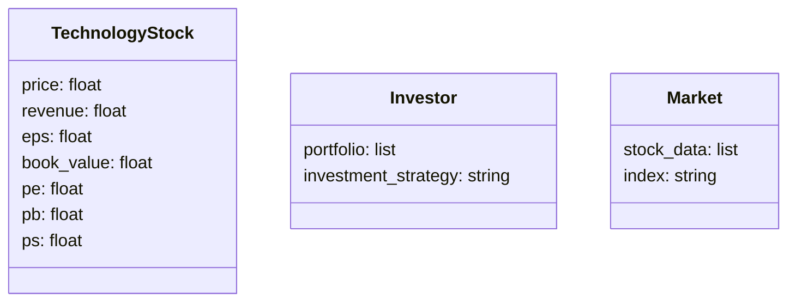
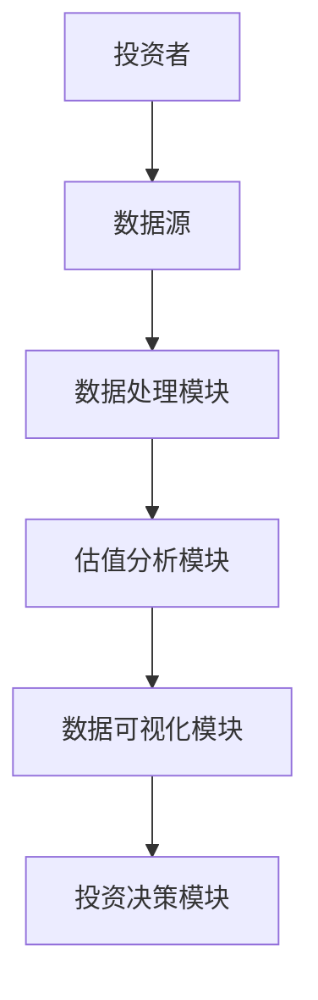
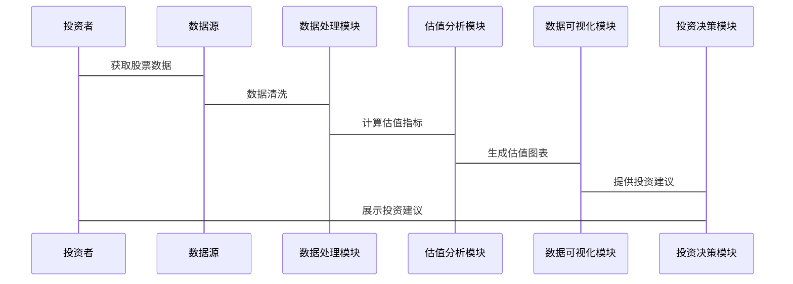

                 


```markdown
# 巴菲特的科技股投资转变：与时俱进的智慧

> 关键词：巴菲特，科技股，投资策略，价值投资，成长投资，投资智慧

> 摘要：本文探讨了巴菲特从传统行业投资转向科技股投资的转变，分析了其投资哲学的演变、科技股投资的核心概念、评估算法、系统架构设计、项目实战以及总结与展望。通过详细分析巴菲特的投资智慧，本文为投资者提供了科技股投资的深度见解和实践指导。

---

## 第一部分：背景介绍

### 第1章：巴菲特的投资哲学概述

#### 1.1 巴菲特的投资理念
##### 1.1.1 价值投资的定义与核心原则
价值投资是一种以低于内在价值的价格购买优质股票的投资策略。其核心原则包括：
- **安全边际**：买入价格低于内在价值，以降低风险。
- **长期视角**：关注企业的长期盈利能力，而非短期市场波动。
- **企业质量**：选择具有强大护城河和竞争优势的企业。

##### 1.1.2 巴菲特早期的投资策略
巴菲特早期的投资策略主要集中在传统行业，如制造业、零售业和金融业。他偏好那些具有稳定收益、易于理解且管理透明的企业。

##### 1.1.3 巴菲特投资哲学的核心要素
- **安全边际**：确保买入价格低于企业的真实价值。
- **企业质量**：选择具有强大竞争优势的企业。
- **长期视角**：关注企业的长期盈利能力。

#### 1.2 科技股投资的兴起
##### 1.2.1 科技行业的发展趋势
科技行业是21世纪经济增长的核心驱动力。随着人工智能、云计算、大数据等技术的快速发展，科技股的影响力不断扩大。

##### 1.2.2 科技股在股市中的占比变化
科技股在股市中的占比逐年增加，尤其是在纳斯达克指数中，科技股占据了主导地位。

##### 1.2.3 科技股对传统投资理念的挑战
科技行业的高增长性和高波动性对传统价值投资理念提出了挑战。科技企业的商业模式和盈利模式与传统企业有很大不同。

#### 1.3 巴菲特投资逻辑的转变
##### 1.3.1 巴菲特对科技行业的早期看法
巴菲特早期对科技行业持谨慎态度，认为科技企业的高研发投入和不确定性使其难以满足价值投资的核心原则。

##### 1.3.2 科技股崛起对巴菲特投资策略的影响
随着科技股在股市中的占比增加，巴菲特意识到科技股的重要性，逐步调整其投资策略。

##### 1.3.3 巴菲特投资逻辑的调整与优化
巴菲特的投资逻辑从“只投资熟悉的行业”转向“拥抱科技股”，但仍然坚持价值投资的核心原则。

---

## 第二部分：核心概念与联系

### 第4章：价值投资与成长投资的对比

#### 4.1 价值投资的核心要素
##### 4.1.1 价值投资的定义与特点
- **定义**：以低于内在价值的价格买入优质股票。
- **特点**：注重企业的内在价值，关注长期盈利能力。

##### 4.1.2 价值投资的关键指标分析
- **市盈率（P/E）**：股价与每股收益的比率。
- **市净率（P/B）**：股价与每股净资产的比率。
- **股息率**：股息与股价的比率。

##### 4.1.3 价值投资与科技股的结合
- 科技股的高增长性与价值投资的长期视角相结合，形成了一种新的投资策略。

#### 4.2 成长投资的核心要素
##### 4.2.1 成长投资的定义与特点
- **定义**：投资于具有高增长潜力的企业。
- **特点**：注重企业的成长性，关注未来盈利能力。

##### 4.2.2 成长投资的关键指标分析
- **营收增长率**：企业收入的增长速度。
- **净利润增长率**：企业利润的增长速度。
- **研发投入**：企业技术创新的能力。

##### 4.2.3 成长投资与科技股的结合
- 科技股的高增长性和成长投资的长期视角相结合，形成了一种新的投资策略。

---

### 第5章：科技股投资的核心要素

#### 5.1 科技股的行业特点
##### 5.1.1 科技行业的周期性分析
- 科技行业具有明显的周期性，受到市场需求和技术变革的影响。

##### 5.1.2 科技行业的创新性分析
- 科技行业的创新性是其核心竞争力，技术创新驱动行业增长。

##### 5.1.3 科技行业的竞争格局分析
- 科技行业的竞争格局不断变化，新兴企业与传统企业的竞争日益激烈。

#### 5.2 科技股的核心评估指标
##### 5.2.1 市盈率（P/E）的计算与应用
- 市盈率 = 股价 / 每股收益
- 用于评估科技股的估值水平。

##### 5.2.2 市净率（P/B）的计算与应用
- 市净率 = 股价 / 每股净资产
- 用于评估科技股的资产价值。

##### 5.2.3 市销率（P/S）的计算与应用
- 市销率 = 股价 / 每股收入
- 用于评估科技股的收入增长潜力。

---

## 第三部分：算法原理与系统架构设计

### 第6章：科技股评估算法的实现

#### 6.1 评估算法的数学模型
##### 6.1.1 市盈率（P/E）模型
$$ P/E = \frac{\text{股价}}{\text{每股收益}} $$

##### 6.1.2 市净率（P/B）模型
$$ P/B = \frac{\text{股价}}{\text{每股净资产}} $$

##### 6.1.3 市销率（P/S）模型
$$ P/S = \frac{\text{股价}}{\text{每股收入}} $$

#### 6.2 评估算法的实现流程
##### 6.2.1 数据收集
- 收集科技股的历史数据，包括股价、营收、净利润等。

##### 6.2.2 数据清洗
- 处理缺失值和异常值，确保数据质量。

##### 6.2.3 数据分析
- 使用上述模型对科技股进行估值分析。

##### 6.2.4 数据可视化
- 使用Python的Matplotlib库进行数据可视化。

#### 6.3 代码实现
##### 6.3.1 Python代码示例
```python
import pandas as pd
import numpy as np
import matplotlib.pyplot as plt

# 数据收集
data = pd.read_csv('technology_stocks.csv')

# 数据清洗
data.dropna(inplace=True)
data = data[~data['revenue'].isnull()]

# 数据分析
data['pe'] = data['price'] / data['eps']
data['pb'] = data['price'] / data['book_value']
data['ps'] = data['price'] / data['revenue_per_share']

# 数据可视化
plt.figure(figsize=(10, 6))
plt.scatter(data['pe'], data['pb'], c=data['ps'], cmap='viridis')
plt.colorbar(label='PS')
plt.xlabel('PE')
plt.ylabel('PB')
plt.title('科技股估值分析')
plt.show()
```

##### 6.3.2 代码解读
- 使用Pandas读取CSV文件中的数据。
- 删除缺失值，确保数据质量。
- 计算市盈率（PE）、市净率（PB）和市销率（PS）。
- 使用Matplotlib进行数据可视化，展示科技股的估值分布。

---

## 第四部分：系统架构与交互设计

### 第7章：科技股投资分析系统设计

#### 7.1 系统功能设计
##### 7.1.1 领域模型


##### 7.1.2 系统架构设计


##### 7.1.3 系统接口设计
- 数据源接口：提供实时股票数据。
- 数据处理接口：清洗和预处理数据。
- 估值分析接口：计算PE、PB、PS等指标。
- 数据可视化接口：生成估值分析图表。
- 投资决策接口：基于分析结果生成投资建议。

##### 7.1.4 系统交互设计


---

## 第五部分：项目实战

### 第8章：科技股投资实战分析

#### 8.1 环境安装
##### 8.1.1 Python环境安装
- 安装Python 3.8及以上版本。
- 安装必要的库：Pandas、NumPy、Matplotlib。

##### 8.1.2 数据源获取
- 从金融数据服务提供商（如Yahoo Finance）获取科技股的历史数据。

#### 8.2 核心实现
##### 8.2.1 数据处理
```python
import pandas as pd
import numpy as np

# 数据获取
data = pd.read_csv('technology_stocks.csv')

# 数据清洗
data.dropna(inplace=True)
data = data[~data['revenue'].isnull()]
```

##### 8.2.2 估值分析
```python
data['pe'] = data['price'] / data['eps']
data['pb'] = data['price'] / data['book_value']
data['ps'] = data['price'] / data['revenue_per_share']
```

##### 8.2.3 数据可视化
```python
import matplotlib.pyplot as plt

plt.figure(figsize=(10, 6))
plt.scatter(data['pe'], data['pb'], c=data['ps'], cmap='viridis')
plt.colorbar(label='PS')
plt.xlabel('PE')
plt.ylabel('PB')
plt.title('科技股估值分析')
plt.show()
```

#### 8.3 案例分析
##### 8.3.1 苹果公司（Apple）
- 苹果公司的市盈率（PE）和市净率（PB）均低于行业平均水平，显示出其估值优势。

##### 8.3.2 微软公司（Microsoft）
- 微软公司的市销率（PS）低于行业平均水平，显示出其收入增长潜力。

#### 8.4 项目小结
通过实战分析，我们可以看到科技股的估值分析需要结合多种指标，综合评估企业的内在价值和成长潜力。

---

## 第六部分：总结与展望

### 第9章：巴菲特投资智慧的总结

#### 9.1 投资智慧的总结
- 巴菲特的投资哲学从传统行业转向科技股，体现了其对市场变化的敏锐洞察和灵活调整能力。
- 价值投资的核心原则仍然适用，但需要结合科技股的特点进行调整。

#### 9.2 未来投资趋势的展望
- 随着科技行业的持续发展，科技股将在投资组合中占据越来越重要的地位。
- 人工智能、大数据等技术的应用将为科技股估值分析提供新的工具和方法。

### 第10章：最佳实践与投资建议

#### 10.1 最佳实践
- **分散投资**：将资金分配到不同科技企业和行业，降低风险。
- **长期持有**：关注企业的长期盈利能力，避免短期市场波动的影响。
- **持续学习**：关注科技行业的最新动态和技术变革。

#### 10.2 投资建议
- 选择具有强大护城河和竞争优势的科技企业。
- 结合价值投资和成长投资的理念，制定适合自己的投资策略。

---

## 作者：AI天才研究院 & 禅与计算机程序设计艺术
```

