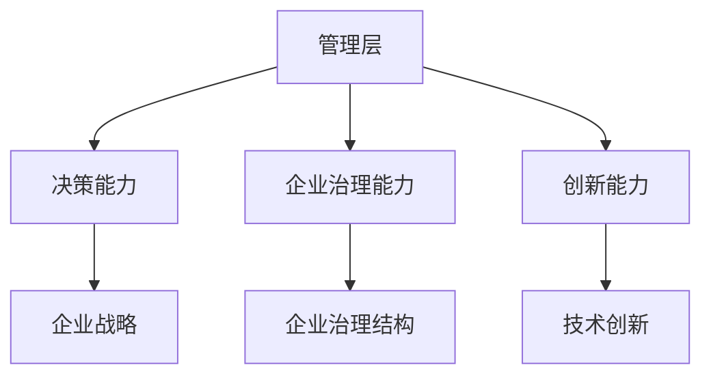
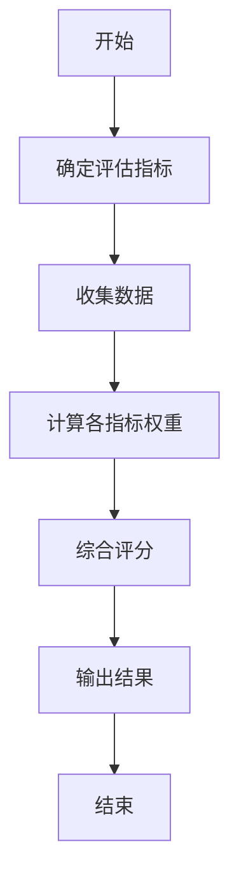
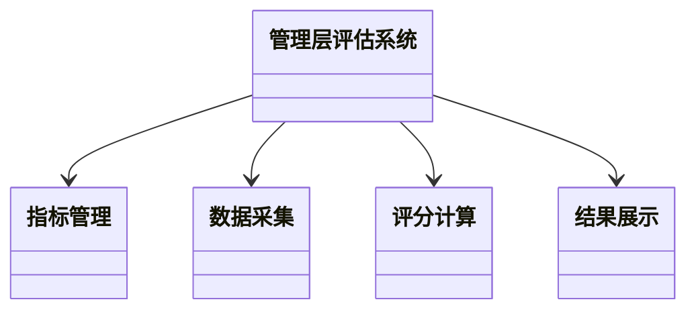
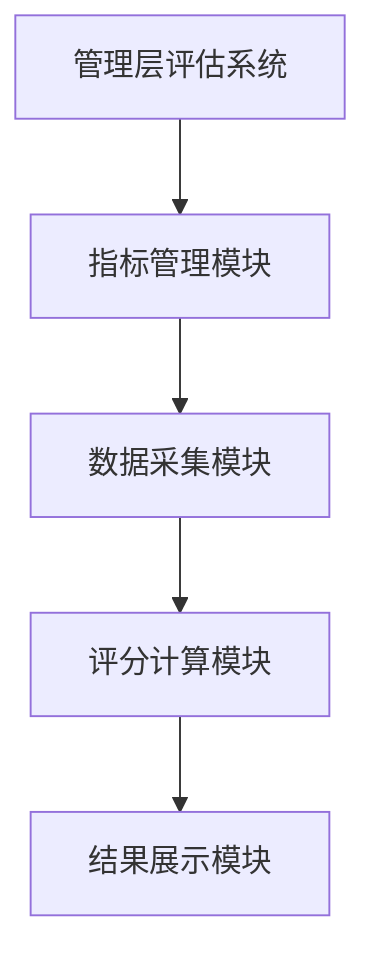

                 

<think>
嗯，用户想让我根据他们的详细要求，写一篇关于巴菲特管理层评估的技术博客。首先，我需要理解用户的需求。他们需要一个结构清晰、内容详实的技术博客，重点在管理层评估的方法和应用。看起来他们想要一个专业且深入的分析，适合技术人员和企业管理者阅读。

接下来，我需要考虑博客的结构。用户已经给出一个大纲，包括摘要、目录、关键词，以及各个章节的具体内容。我需要确保每一章都有足够的细节，比如背景介绍、核心概念、算法原理、系统分析等。特别是数学公式和图表的使用，这需要我仔细处理，确保格式正确。

用户提到要使用技术术语，但要简单易懂。我需要在解释概念时，避免过于复杂的句子，同时保持专业性。比如，在介绍算法时，使用mermaid图和数学公式，但要详细说明每个步骤的意义。

另外，用户希望包括实际案例分析，如巴菲特投资的公司。我需要找几个典型的案例，分析他们的管理层评估过程，展示理论在实际中的应用。这不仅能让读者理解方法，还能看到实际效果。

工具和技巧部分也很重要。我需要推荐一些实用的工具，帮助读者在实际中应用这些评估方法。同时，给出一些小贴士，帮助他们在日常工作中优化评估过程。

最后，结论部分要总结全书的主要观点，并强调巴菲特方法的现代价值。同时，可以提出未来的发展趋势，比如结合人工智能进行更精准的评估。

在写作过程中，我需要确保每一部分内容丰富，逻辑清晰。同时，语言要专业但不失亲切，让读者感觉像在与一位经验丰富的专家交流。现在，我应该开始按照大纲逐章撰写，确保每个部分都符合用户的要求，同时保持整体的连贯性和深度。
</think>

# 巴菲特的管理层评估：如何识别优秀的企业领导者

## 关键词：巴菲特，管理层评估，企业领导者，决策能力，企业治理，创新能力

## 摘要：
本文将详细介绍巴菲特的管理层评估方法，从其投资哲学到具体评估指标，帮助读者系统性地理解如何识别优秀的企业领导者。文章结合理论分析和实际案例，深入探讨管理层评估的核心要素、算法原理及系统架构，并通过具体实例分析巴菲特的成功投资案例，为读者提供实用的工具和技巧，帮助其在实际工作中更好地识别和培养优秀的企业领导者。

---

# 第1章：巴菲特的管理层评估概述

## 1.1 巴菲特的背景与投资哲学

### 1.1.1 巴菲特的生平简介
沃伦·巴菲特（Warren Buffett）是世界上最著名的职业投资人之一，被誉为“股神”。他于1934年出生在美国内布拉斯州，毕业于哥伦比亚大学，并在25岁时开始全职投资。巴菲特的投资哲学以“价值投资”为核心，强调长期投资、注重企业基本面分析，并在市场恐慌时买入优质资产。

### 1.1.2 巴菲特的投资理念与原则
巴菲特的投资理念可以总结为以下几个方面：
- **长期投资**：巴菲特认为市场短期波动不可预测，但长期趋势可以通过对企业基本面的深入分析来把握。
- **安全边际**：在投资时，巴菲特强调要有“安全边际”，即以低于内在价值的价格买入资产。
- **企业竞争优势**：巴菲特倾向于投资那些具有持续竞争优势的企业，即“护城河”。
- **管理层质量**：巴菲特认为，优秀的企业领导者是企业长期成功的关键，因此他对管理层的评估尤为重视。

### 1.1.3 巴菲特管理层评估的核心思想
巴菲特在评估企业时，不仅仅关注财务数据，更关注企业管理层的能力。他总结出一套评估管理层的核心思想：
- **决策能力**：管理层是否能够做出正确的战略决策。
- **企业治理能力**：管理层是否能够规范运作企业，避免短期行为。
- **创新能力**：管理层是否能够适应市场变化，不断创新。

## 1.2 管理层评估的重要性

### 1.2.1 管理层在企业中的角色
管理层是企业的决策者和执行者，他们的能力和决策直接影响企业的长期发展和价值创造。

### 1.2.2 管理层评估对企业价值的影响
- 优秀的管理层能够带领企业实现持续增长。
- 劣质的管理层可能导致企业价值下降或失败。

### 1.2.3 管理层评估的误区与挑战
- **误区**：只关注财务指标，忽视管理层的实际能力。
- **挑战**：如何全面、客观地评估管理层的能力。

## 1.3 巴菲特管理层评估的核心要素

### 1.3.1 管理层的决策能力
- **战略思维**：管理层是否能够制定出符合企业长期发展的战略。
- **决断力**：管理层在关键时刻是否能够果断决策。

### 1.3.2 管理层的企业治理能力
- **透明度**：管理层是否能够保持信息公开，避免信息不对称。
- **合规性**：管理层是否能够遵守企业治理规范，避免违法违规行为。

### 1.3.3 管理层的创新能力
- **技术创新**：管理层是否能够推动企业在技术上的创新。
- **商业模式创新**：管理层是否能够创新商业模式，适应市场变化。

## 1.4 本章小结
本章介绍了巴菲特的背景和投资哲学，重点阐述了管理层评估的重要性，并总结了巴菲特评估管理层的核心要素：决策能力、企业治理能力和创新能力。

---

# 第2章：管理层评估的核心概念与联系

## 2.1 核心概念原理

### 2.1.1 管理层评估的定义与范围
管理层评估是对企业管理层的能力和表现进行全面分析和评价的过程。其范围包括决策能力、企业治理能力、创新能力等多个方面。

### 2.1.2 管理层评估的关键维度
- **决策能力**：包括战略思维、决断力等。
- **企业治理能力**：包括透明度、合规性等。
- **创新能力**：包括技术创新、商业模式创新等。

### 2.1.3 管理层评估的逻辑框架
- **输入**：企业的财务数据、市场表现、管理层背景等。
- **过程**：通过一系列指标和方法对管理层能力进行评估。
- **输出**：得出管理层能力的综合评分。

## 2.2 核心概念属性特征对比表

| 属性 | 特征 |
|------|------|
| 决策能力 | 战略思维、决断力 |
| 企业治理能力 | 透明度、合规性 |
| 创新能力 | 技术创新、商业模式创新 |

## 2.3 实体关系图（ER图）



## 2.4 本章小结
本章通过对比表和实体关系图，详细阐述了管理层评估的核心概念及其相互关系，为后续的算法分析奠定了基础。

---

# 第3章：管理层评估的算法原理

## 3.1 算法原理概述

### 3.1.1 管理层评估指标体系
- **决策能力指标**：包括战略规划能力、决断力等。
- **企业治理能力指标**：包括透明度、合规性等。
- **创新能力指标**：包括技术创新能力、商业模式创新能力等。

### 3.1.2 管理层评估的权重分配
- 根据企业所处行业和具体需求，对各项指标赋予不同的权重。

### 3.1.3 管理层评估的综合评分方法
- 通过加权评分法，对各项指标进行综合评分，得出管理层能力的综合评分。

## 3.2 算法流程图



## 3.3 数学模型与公式

### 3.3.1 指标权重计算公式
$$权重_i = \frac{频次_i}{总频次}$$

### 3.3.2 综合评分公式
$$总评分 = \sum_{i=1}^{n} (权重_i \times 指标评分_i)$$

## 3.4 实例分析

### 3.4.1 案例背景
某公司管理层需要评估其决策能力、企业治理能力和创新能力。

### 3.4.2 数据收集与处理
- 决策能力评分：8分
- 企业治理能力评分：7分
- 创新能力评分：6分

### 3.4.3 权重计算与评分
- 决策能力权重：0.4
- 企业治理能力权重：0.3
- 创新能力权重：0.3

综合评分：
$$总评分 = 0.4 \times 8 + 0.3 \times 7 + 0.3 \times 6 = 3.2 + 2.1 + 1.8 = 7.1$$

### 3.4.4 结果分析
综合评分为7.1分，属于良好水平。

## 3.5 本章小结
本章通过数学模型和实例分析，详细阐述了管理层评估的算法原理和具体实现方法。

---

# 第4章：系统分析与架构设计

## 4.1 问题场景介绍

### 4.1.1 管理层评估的需求分析
- 企业需要对管理层的能力进行全面评估。
- 评估结果需要直观、量化。

### 4.1.2 系统目标与范围
- 开发一个基于巴菲特评估方法的管理层评估系统。
- 系统功能包括指标管理、数据采集、评分计算、结果展示等。

### 4.1.3 系统边界与接口
- 输入：企业数据、管理层数据。
- 输出：综合评分、评估报告。

## 4.2 系统功能设计

### 4.2.1 领域模型（类图）



## 4.3 系统架构设计



## 4.4 系统交互设计

```mermaid
sequenceDiagram
    管理层 --> 系统：输入评估指标
    系统 --> 数据库：存储指标
    管理层 --> 系统：输入数据
    系统 --> 数据采集模块：处理数据
    系统 --> 评分计算模块：计算评分
    系统 --> 结果展示模块：显示结果
```

## 4.5 本章小结
本章通过系统分析与架构设计，详细阐述了如何将巴菲特的管理层评估方法应用于实际系统中。

---

# 第5章：项目实战

## 5.1 环境安装
- 安装Python、数据库等开发工具。
- 配置相关开发环境。

## 5.2 系统核心实现源代码

### 5.2.1 指标管理模块
```python
class Indicator:
    def __init__(self, name, weight):
        self.name = name
        self.weight = weight
```

### 5.2.2 数据采集模块
```python
class DataCollector:
    def collect_data(self):
        # 数据采集逻辑
        pass
```

### 5.2.3 评分计算模块
```python
class ScoringSystem:
    def calculate_score(self, indicators, scores):
        total_score = 0
        for i in range(len(indicators)):
            total_score += indicators[i].weight * scores[i]
        return total_score
```

### 5.2.4 结果展示模块
```python
class ResultDisplay:
    def display_result(self, score):
        print(f"综合评分为：{score}")
```

## 5.3 代码应用解读与分析
- **指标管理模块**：用于管理各项评估指标及其权重。
- **数据采集模块**：负责采集企业的相关数据。
- **评分计算模块**：根据指标权重和评分，计算综合评分。
- **结果展示模块**：将评估结果以直观的方式展示出来。

## 5.4 实际案例分析

### 5.4.1 案例背景
某公司需要评估其管理层的决策能力、企业治理能力和创新能力。

### 5.4.2 数据采集与处理
- 决策能力评分：8分，权重：0.4
- 企业治理能力评分：7分，权重：0.3
- 创新能力评分：6分，权重：0.3

### 5.4.3 评分计算
$$总评分 = 0.4 \times 8 + 0.3 \times 7 + 0.3 \times 6 = 7.1$$

### 5.4.4 结果分析
综合评分为7.1分，属于良好水平。

## 5.5 本章小结
本章通过实际案例分析，详细展示了如何利用巴菲特的管理层评估方法进行实际操作。

---

# 第6章：最佳实践与注意事项

## 6.1 最佳实践 tips
- **多维度评估**：综合考虑决策能力、企业治理能力和创新能力。
- **动态评估**：定期对企业管理层进行评估，及时调整策略。
- **结合行业特点**：根据企业所处行业特点，调整评估指标和权重。

## 6.2 注意事项
- **数据质量**：确保数据的准确性和完整性。
- **评估周期**：定期评估，避免评估结果的滞后性。
- **团队协作**：评估需要跨部门协作，确保评估结果的客观性。

## 6.3 拓展阅读
- 推荐阅读巴菲特的《聪明的投资者》。
- 参考相关投资学和管理学的经典著作。

## 6.4 本章小结
本章总结了管理层评估的最佳实践和注意事项，为读者提供了宝贵的参考。

---

# 结论

本文通过系统性地分析巴菲特的管理层评估方法，从理论到实践，详细阐述了如何识别和评估优秀的企业领导者。通过对核心概念、算法原理和系统架构的深入探讨，结合实际案例分析，为读者提供了实用的工具和技巧。未来，随着人工智能和大数据技术的发展，管理层评估将更加精准和高效。

---

# 作者：AI天才研究院/AI Genius Institute & 禅与计算机程序设计艺术/Zen And The Art of Computer Programming

