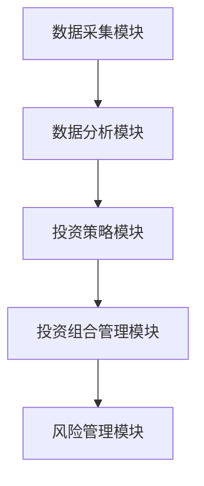
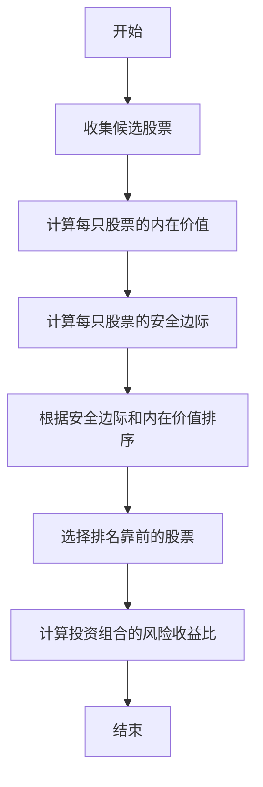
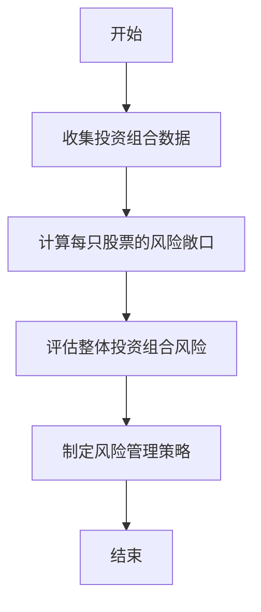

                 


# 巴菲特的经济周期投资策略

> 关键词：巴菲特，经济周期，投资策略，价值投资，风险管理，投资组合

> 摘要：本文深入分析了巴菲特的经济周期投资策略，探讨了其投资哲学、经济周期分析方法、投资组合管理策略以及风险管理原则。通过系统的理论分析和实际案例研究，揭示了巴菲特如何在不同经济周期阶段优化投资组合，实现长期稳健的投资收益。

---

## 第一部分: 巴菲特的经济周期投资策略概述

### 第1章: 巴菲特投资哲学与经济周期

#### 1.1 巴菲特投资哲学的核心理念

##### 1.1.1 价值投资的定义与核心要素

- **价值投资**：通过深入分析企业的基本面，寻找市场价格低于其内在价值的股票进行投资。
- **核心要素**：
  - 企业的财务状况（ROE、现金流、负债率等）。
  - 企业的竞争优势（护城河、市场地位）。
  - 企业的管理团队和治理结构。
  - 安全边际（市场价格与内在价值的差距）。

##### 1.1.2 巴菲特的价值投资原则

- **长期视角**：关注企业的长期价值，而非短期价格波动。
- **安全边际**：买入价格低于内在价值，以降低风险。
- **集中投资**：将资金集中在少数优质企业上，避免过度分散。
- **避免市场噪声**：忽略市场的短期波动，专注于企业的基本面。

##### 1.1.3 巴菲特投资哲学的演变

- 巴菲特早期的“烟蒂投资”阶段：寻找被市场低估的股票。
- 后期转向“护城河投资”阶段：寻找具有持续竞争优势的企业。

#### 1.2 经济周期的基本概念

##### 1.2.1 经济周期的定义与阶段划分

- 经济周期通常分为四个阶段：衰退、复苏、扩张、过热。
- 每个阶段的特点：
  - **衰退**：经济活动下降，企业盈利减少。
  - **复苏**：经济开始恢复，企业盈利逐步回升。
  - **扩张**：经济增长加速，企业盈利大幅增加。
  - **过热**：经济过热，可能出现通货膨胀和泡沫。

##### 1.2.2 经济周期对投资的影响

- **衰退阶段**：投资者应寻找防御性股票，如公用事业、医疗保健等。
- **复苏阶段**：周期性股票（如制造业、材料行业）可能表现较好。
- **扩张阶段**：成长股和价值股均可能表现良好。
- **过热阶段**：需警惕泡沫破裂的风险，考虑减仓。

##### 1.2.3 巴菲特对经济周期的独特见解

- 巴菲特认为，经济周期是投资的“老师”，可以帮助投资者识别优质企业。
- 在衰退阶段，优质企业的估值可能被低估，是买入的好机会。
- 在扩张阶段，需警惕市场泡沫，避免过度投资。

---

### 第2章: 巴菲特经济周期投资策略的核心概念

#### 2.1 经济周期与投资策略的关系

##### 2.1.1 经济周期对资产价格的影响

- **衰退阶段**：资产价格可能被压低，尤其是股票和房地产。
- **复苏阶段**：资产价格逐步回升。
- **扩张阶段**：资产价格可能被推高，出现泡沫。
- **过热阶段**：资产价格可能达到顶峰，随后可能出现调整。

##### 2.1.2 不同经济周期阶段的投资策略差异

- **衰退阶段**：注重防御性投资，寻找估值低、股息高的股票。
- **复苏阶段**：逐步增加对周期性股票的配置。
- **扩张阶段**：加大对成长股的配置，寻找具有竞争优势的企业。
- **过热阶段**：保持谨慎，减少风险敞口。

##### 2.1.3 巴菲特如何利用经济周期进行投资

- 巴菲特在衰退阶段寻找被低估的优质企业，长期持有。
- 在扩张阶段，集中投资于具有强大竞争优势的企业。

#### 2.2 巴菲特投资策略的数学模型

##### 2.2.1 经济周期波动的数学模型

- 使用**经济指标**（如GDP增长率、失业率、通胀率等）预测经济周期阶段。
- 通过**时间序列分析**（如ARIMA模型）预测未来经济走势。

##### 2.2.2 价值投资的量化评估公式

- **内在价值公式**：  
  $$ V = \frac{E}{k} $$  
  其中，\( V \) 是内在价值，\( E \) 是未来现金流的现值，\( k \) 是折现率。

- **安全边际计算公式**：  
  $$ \text{安全边际} = \text{内在价值} - \text{市场价格} $$

##### 2.2.3 投资组合风险收益比分析

- **夏普比率**：衡量投资组合的超额收益与风险的比值。  
  $$ \text{夏普比率} = \frac{R_p - R_f}{\sigma_p} $$  
  其中，\( R_p \) 是投资组合的收益，\( R_f \) 是无风险利率，\( \sigma_p \) 是投资组合的波动率。

---

### 第3章: 巴菲特经济周期投资策略的系统分析

#### 3.1 经济周期分析系统的架构设计

##### 3.1.1 系统功能模块划分

- 数据采集模块：收集经济指标、企业基本面数据。
- 数据分析模块：分析经济周期阶段，评估企业价值。
- 投资策略模块：根据经济周期阶段生成投资建议。
- 风险管理模块：评估投资组合的风险，调整投资策略。

##### 3.1.2 系统架构图（Mermaid）



##### 3.1.3 系统接口设计

- 数据接口：与金融数据源（如Yahoo Finance、Bloomberg）对接。
- 用户接口：提供投资建议和风险管理报告。

#### 3.2 投资组合管理的系统实现

##### 3.2.1 投资组合优化算法（Mermaid流程图）



##### 3.2.2 投资组合管理的Python代码实现

```python
import numpy as np
import pandas as pd
from scipy.optimize import minimize

# 假设我们有n只股票，权重为w，目标是最小化波动率
def objective_function(w, **kwargs):
    return np.dot(w.T, kwargs['cov_matrix'])

# 约束条件：权重之和为1，且每个权重非负
constraints = [
    ('sum', np.array([1, 0]), np.array(1)),
    ('ineq', np.array([1, 0, 0, ...]), np.array(0))
]

# 优化问题
result = minimize(objective_function, init_guess, args={'cov_matrix': cov_matrix}, constraints=constraints)
```

##### 3.2.3 投资组合风险评估的数学模型

- **波动率公式**：  
  $$ \sigma_p = \sqrt{w^T \Sigma w} $$  
  其中，\( w \) 是投资组合的权重向量，\( \Sigma \) 是股票的协方差矩阵。

---

## 第二部分: 巴菲特经济周期投资策略的实际应用

### 第4章: 巴菲特经济周期投资策略的实战应用

#### 4.1 实际投资案例分析

##### 4.1.1 巴菲特的经典投资案例解析

- **可口可乐案例**：在经济衰退期间买入，长期持有，享受企业成长带来的收益。
- **富国银行案例**：在经济复苏阶段买入，受益于银行股的周期性反弹。

##### 4.1.2 不同经济周期阶段的案例对比

- **衰退阶段**：买入估值低、股息高的股票。
- **复苏阶段**：增加周期性股票的配置。
- **扩张阶段**：集中投资于具有强大竞争优势的成长股。

##### 4.1.3 案例分析的总结与启示

- 巴菲特的成功在于长期持有优质企业，而非短期价格波动。
- 在不同经济周期阶段，投资策略需灵活调整。

#### 4.2 投资组合管理的实战操作

##### 4.2.1 投资组合的构建步骤

1. 确定当前经济周期阶段。
2. 根据阶段选择合适的股票类型。
3. 评估股票的内在价值和安全边际。
4. 构建投资组合，分散投资风险。

##### 4.2.2 投资组合的动态调整策略

- 定期（如每季度）重新评估投资组合。
- 根据经济周期变化调整权重。
- 保持对优质企业的长期持有。

##### 4.2.3 投资组合绩效评估的方法

- 使用**夏普比率**、**最大回撤**等指标评估投资组合的绩效。

---

### 第5章: 巴菲特投资策略的最佳实践与小结

#### 5.1 投资心态与纪律的重要性

##### 5.1.1 巴菲特的投资心态培养

- 保持耐心和纪律，避免情绪化投资。
- 长期视角，关注企业的长期价值。

##### 5.1.2 投资纪律的执行要点

- 遵循价值投资原则，避免盲目跟风。
- 定期审视投资组合，及时调整。

##### 5.1.3 避免常见投资错误的注意事项

- 避免过度交易，减少交易成本。
- 避免追涨杀跌，坚持价值投资。

#### 5.2 长期投资视角的重要性

##### 5.2.1 长期视角对投资决策的影响

- 长期视角有助于识别优质企业，享受企业成长的红利。
- 长期视角有助于规避短期市场波动的风险。

##### 5.2.2 如何在经济周期波动中保持长期视角

- 通过分散投资降低短期波动的影响。
- 通过长期持有优质企业，抵御经济周期的冲击。

##### 5.2.3 巴菲特对长期投资的建议

- 选择具有强大竞争优势的企业，长期持有。
- 保持耐心，避免因短期波动而卖出优质股票。

#### 5.3 经济周期投资策略的拓展阅读

##### 5.3.1 相关书籍推荐

- 《巴菲特致股东的信》
- 《投资之道》
- 《证券分析》

##### 5.3.2 研究论文与学术资源

- 格雷厄姆的《证券分析》
- 巴菲特的股东大会演讲记录

##### 5.3.3 实践中的进一步思考

- 结合当前经济环境，优化投资策略。
- 根据个人风险偏好，调整投资组合。

---

## 第三部分: 巴菲特经济周期投资策略的风险管理

### 第6章: 巴菲特经济周期投资策略的风险管理

#### 6.1 风险管理的核心原则

##### 6.1.1 风险与收益的平衡

- 风险与收益成正比，需在两者之间找到平衡点。
- 通过分散投资降低风险。

##### 6.1.2 巴菲特的风险管理策略

- 保持充足的安全边际。
- 避免过度杠杆，降低财务风险。
- 定期审视投资组合，及时调整。

##### 6.1.3 如何避免重大投资损失

- 避免追涨杀跌，坚持价值投资。
- 严格遵守投资纪律，避免情绪化决策。

#### 6.2 风险管理的系统实现

##### 6.2.1 风险评估模型（Mermaid流程图）



##### 6.2.2 风险管理的Python代码实现

```python
import numpy as np
from scipy.optimize import minimize

# 计算投资组合的VaR（Value at Risk）
def calculate_var(weights, returns, confidence_level=0.95):
    # 计算收益分布的分位数
    returns_sorted = sorted(returns)
    var_index = int(len(returns_sorted) * (1 - confidence_level))
    var = returns_sorted[var_index]
    return var

# 示例
weights = np.array([0.3, 0.3, 0.4])
returns = np.array([0.1, 0.2, 0.15])
var = calculate_var(weights, returns)
print(f"VaR at {confidence_level * 100}% confidence level: {var}")
```

##### 6.2.3 风险管理的注意事项

- 定期评估投资组合的风险敞口。
- 根据市场变化及时调整风险管理策略。
- 保持充足的风险准备金，应对突发事件。

---

## 作者：AI天才研究院/AI Genius Institute & 禅与计算机程序设计艺术 /Zen And The Art of Computer Programming

---

以上是《巴菲特的经济周期投资策略》的文章正文内容，涵盖了巴菲特投资哲学、经济周期分析、投资策略、风险管理等核心内容，并通过实际案例和系统分析，深入浅出地展示了巴菲特的经济周期投资策略。

