                 

<think>
好的，我现在需要按照用户的要求，撰写一篇关于巴菲特经济护城河在平台经济时代竞争优势的技术博客。首先，我需要明确文章的结构和各部分的内容。

1. **标题和关键词**：标题已经确定为《巴菲特的经济护城河更新：平台经济时代的竞争优势》，关键词应涵盖巴菲特、经济护城河、平台经济、竞争优势、投资策略等。

2. **摘要**：摘要需要简明扼要地概括文章的核心内容，介绍巴菲特的经济护城河理论在平台经济中的演变，分析其在数据、网络效应和生态系统中的应用，并探讨未来的竞争优势策略。

3. **引言**：引言部分需要介绍经济护城河的基本概念和其在投资中的重要性，引出平台经济时代的新挑战和机遇。

4. **传统经济护城河分析**：详细分析成本优势和品牌优势这两种传统护城河，解释它们的定义、特点和局限性。

5. **平台经济中的护城河构建**：讨论数据驱动、网络效应和生态系统这三种新的护城河类型，结合具体案例说明它们如何在平台经济中发挥作用。

6. **护城河的维护与优化**：探讨如何通过技术创新、用户体验提升和生态系统扩展来维护和优化护城河，确保企业长期竞争优势。

7. **结论**：总结平台经济时代下护城河的演变，强调数据、网络效应和生态系统的重要性，提出未来竞争优势的关键因素。

接下来，我需要确保每个部分都包含必要的技术细节和实例，使用适当的图表和代码示例来增强文章的深度。同时，要注意文章的逻辑连贯性和可读性，确保读者能够清晰理解每个概念和策略。

在撰写过程中，我可能会遇到如何将复杂的技术概念转化为易懂的语言，或者如何选择合适的案例来说明问题。这需要我不断查阅相关资料，确保信息的准确性和实例的典型性。此外，我还需注意文章的整体结构，确保各部分之间有良好的过渡，使整篇文章流畅自然。

最后，我会通读整篇文章，检查是否有遗漏的重要点，确保所有内容都符合用户的要求，并进行必要的修改和调整，以达到最佳的表达效果。
</think>

# 巴菲特的经济护城河更新：平台经济时代的竞争优势

> **关键词**：巴菲特，经济护城河，平台经济，竞争优势，投资策略，网络效应，数据驱动

> **摘要**：本文探讨了巴菲特的经济护城河理论在平台经济时代的演变，分析了数据驱动、网络效应和生态系统等新要素对企业竞争优势的影响，并提出了在平台经济中构建和维护护城河的策略。通过具体案例和系统分析，本文揭示了平台经济时代下经济护城河的新型特征和竞争优势的关键因素。

---

# 引言

在现代商业竞争中，经济护城河是企业长期竞争优势的核心。巴菲特曾强调，拥有强大护城河的企业能够在市场中立于不败之地。然而，随着平台经济的崛起，传统的护城河模式面临新的挑战与机遇。本文将从平台经济的视角，重新审视巴菲特的经济护城河理论，探讨其在数据驱动、网络效应和生态系统等新要素下的竞争优势。

---

# 第1章：经济护城河的基本概念

## 1.1 经济护城河的定义与重要性

经济护城河是指企业通过特定竞争优势（如成本优势、品牌影响力、技术壁垒等）建立的防御机制，防止竞争对手侵蚀其市场份额。护城河的本质是通过独特的能力或资源，创造可持续的竞争优势。

图1展示了经济护城河的基本构成：

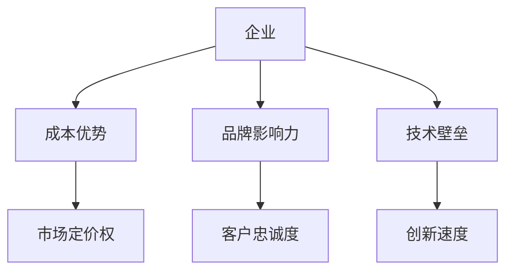

经济护城河的重要性在于，它能够为企业带来长期稳定的收益，尤其是在面对竞争时，护城河可以有效阻止竞争对手的进入或削弱其竞争力。

---

## 1.2 巴菲特投资理念中的护城河

巴菲特的投资理念以寻找具有强大护城河的企业为核心。他认为，护城河是企业抵御竞争的核心能力，能够确保企业在长期的市场波动中保持稳定的收益。

图2展示了巴菲特选股标准中的护城河要素：

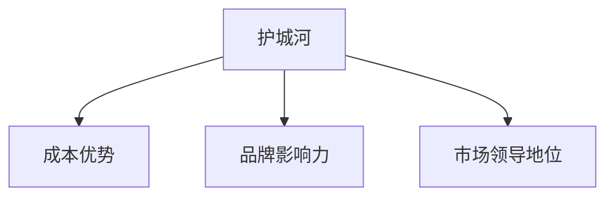

在实践中，巴菲特倾向于投资那些具有宽护城河的企业，例如可口可乐和喜马拉雅，这些企业通过品牌影响力和市场领导地位，建立了强大的竞争优势。

---

# 第2章：平台经济时代的竞争优势

## 2.1 平台经济的基本特征

平台经济是一种通过数字化平台连接供需双方的商业模式，其核心特征包括：

1. **双边市场**：平台同时服务两个或多个不同的用户群体（如买家和卖家）。
2. **网络效应**：用户数量的增加会增强平台的价值。
3. **数据驱动**：通过数据收集和分析，优化用户体验和商业决策。

图3展示了平台经济的基本架构：

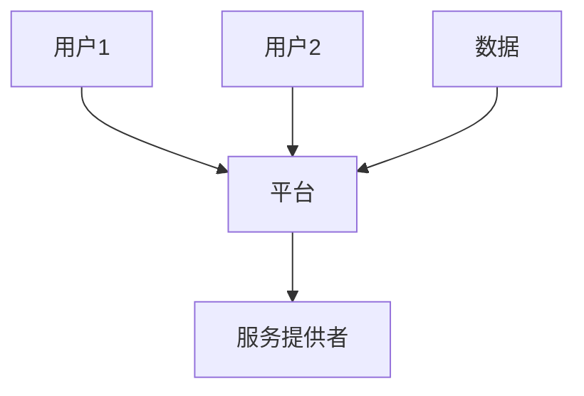

## 2.2 平台经济中的护城河

在平台经济时代，传统的护城河要素（如成本优势）逐渐被新的要素所取代，例如数据、网络效应和生态系统。

### 2.2.1 数据驱动的护城河

数据是平台经济的核心资源。通过收集和分析海量数据，企业可以优化产品设计、预测市场需求，并制定精准的营销策略。

例如，亚马逊通过分析用户的购买历史和浏览行为，构建了强大的推荐系统，从而形成了数据驱动的护城河。

图4展示了数据驱动的护城河构建过程：

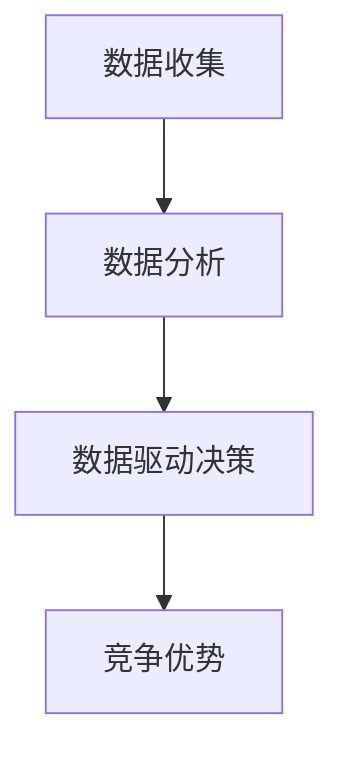

### 2.2.2 网络效应的护城河

网络效应是指随着用户数量的增加，平台的价值也随之增加。这种效应在社交网络、电子商务和共享经济等领域尤为明显。

例如，微信通过不断扩大用户基数，形成了强大的网络效应，使得竞争对手难以在短期内超越其平台价值。

图5展示了网络效应的护城河构建过程：

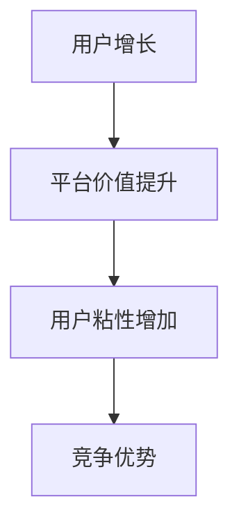

### 2.2.3 生态系统的护城河

生态系统是指平台所构建的一系列互补产品和服务，形成一个相互依赖、协同发展的生态体系。通过生态系统，企业可以增强用户粘性，同时降低竞争风险。

例如，苹果通过构建iOS生态系统，整合了硬件、软件和服务，形成了强大的生态系统护城河。

图6展示了生态系统护城河的构建过程：

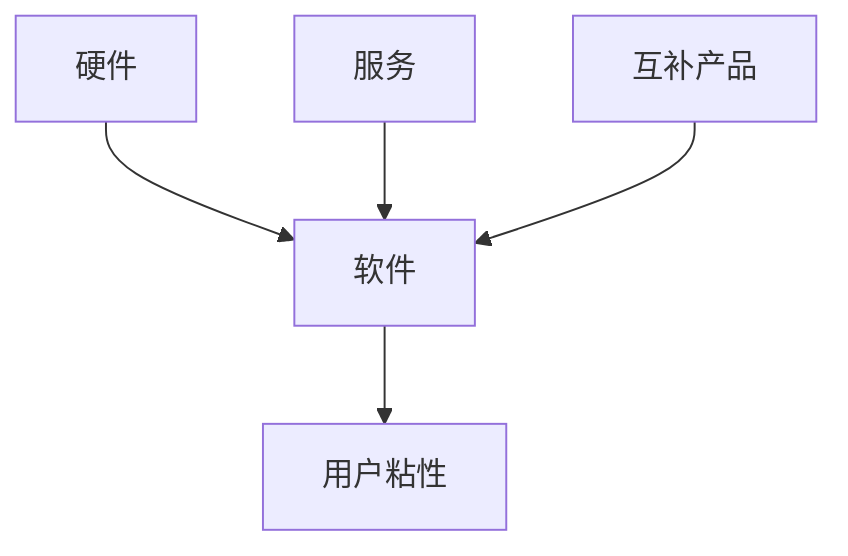

---

# 第3章：传统经济护城河的演变

## 3.1 成本优势的护城河

成本优势是指企业通过规模经济、技术革新或优化供应链等方式，降低生产成本，从而在价格竞争中占据优势。

例如，沃尔玛通过全球采购和供应链管理，实现了成本优势，形成了强大的市场竞争能力。

图7展示了成本优势护城河的构建过程：

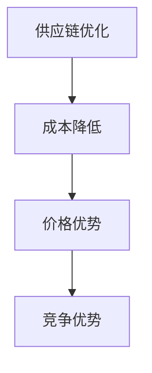

## 3.2 品牌优势的护城河

品牌优势是指企业通过长期的品牌建设和推广，建立强大的品牌影响力，从而吸引消费者。

例如，可口可乐通过全球营销和品牌建设，形成了强大的品牌优势，巩固了其市场地位。

图8展示了品牌优势护城河的构建过程：

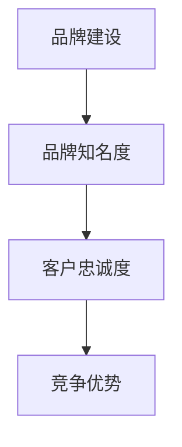

---

# 第4章：平台经济中的护城河构建

## 4.1 数据驱动的护城河

### 4.1.1 数据的收集与分析

数据是平台经济的核心资源。通过收集和分析海量数据，企业可以优化产品设计、预测市场需求，并制定精准的营销策略。

例如，亚马逊通过分析用户的购买历史和浏览行为，构建了强大的推荐系统，从而形成了数据驱动的护城河。

图4展示了数据驱动的护城河构建过程：

### 4.1.2 数据驱动的决策优势

通过数据驱动的决策，企业可以更快速地响应市场变化，优化资源配置，提高运营效率。

例如，Netflix通过分析用户观看习惯，推荐个性化内容，从而提高了用户粘性和市场份额。

---

## 4.2 网络效应的护城河

### 4.2.1 网络效应的实现方式

网络效应是指随着用户数量的增加，平台的价值也随之增加。这种效应在社交网络、电子商务和共享经济等领域尤为明显。

例如，微信通过不断扩大用户基数，形成了强大的网络效应，使得竞争对手难以在短期内超越其平台价值。

图5展示了网络效应的护城河构建过程：

### 4.2.2 网络效应的典型案例

### 4.2.3 网络效应的挑战与解决方案

---

## 4.3 生态系统的护城河

### 4.3.1 生态系统的构建与管理

生态系统是指平台所构建的一系列互补产品和服务，形成一个相互依赖、协同发展的生态体系。通过生态系统，企业可以增强用户粘性，同时降低竞争风险。

例如，苹果通过构建iOS生态系统，整合了硬件、软件和服务，形成了强大的生态系统护城河。

图6展示了生态系统护城河的构建过程：

### 4.3.2 生态系统的竞争优势

通过生态系统，企业可以实现多赢的局面，增强用户粘性，同时降低竞争风险。

例如，亚马逊通过整合第三方卖家和物流服务，构建了强大的电子商务生态系统，形成了竞争优势。

---

# 第5章：护城河的维护与优化

## 5.1 护城河的维护策略

### 5.1.1 技术驱动的优化

技术是护城河的核心驱动力。企业需要不断进行技术创新，保持技术领先，从而巩固护城河。

例如，谷歌通过不断优化搜索引擎算法，保持了其在搜索引擎市场的领先地位。

图7展示了技术驱动的护城河优化过程：

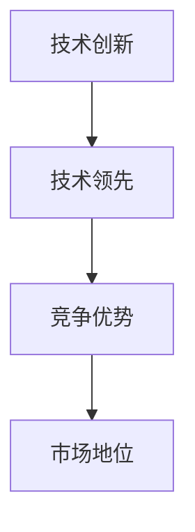

### 5.1.2 用户体验的提升

用户体验是护城河的重要组成部分。通过不断优化用户体验，企业可以增强用户粘性，巩固护城河。

例如，特斯拉通过不断提升电动汽车的用户体验，形成了强大的品牌忠诚度。

图8展示了用户体验优化的护城河维护过程：

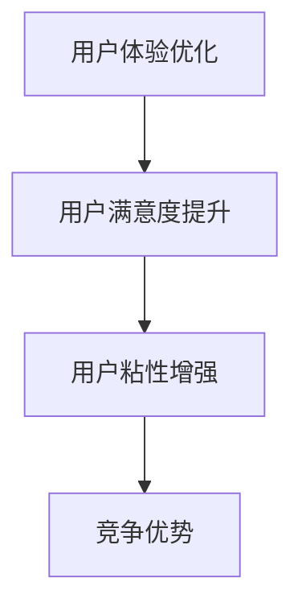

### 5.1.3 生态系统的扩展

生态系统是护城河的重要组成部分。通过不断扩展生态系统，企业可以增强用户粘性，降低竞争风险。

例如，微软通过不断扩展其云服务生态系统，巩固了其在云服务市场的领先地位。

图9展示了生态系统扩展的护城河维护过程：

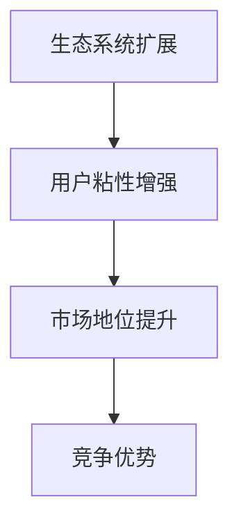

---

## 5.2 护城河的动态调整

### 5.2.1 竞争环境的变化

竞争环境的变化是护城河维护的重要挑战。企业需要不断适应市场变化，调整护城河策略。

例如，随着人工智能的快速发展，企业需要不断优化其技术壁垒，保持竞争优势。

### 5.2.2 技术创新的推动

技术创新是护城河的核心驱动力。企业需要不断进行技术创新，保持技术领先，从而巩固护城河。

例如，苹果通过不断推出创新产品，保持了其在科技市场的领先地位。

### 5.2.3 用户需求的变化

用户需求的变化是护城河维护的重要挑战。企业需要不断关注用户需求，优化产品和服务，巩固护城河。

例如，随着消费者对个性化服务的需求增加，企业需要不断优化用户体验，满足用户需求。

---

# 结论

平台经济时代的竞争优势，本质上是数据、网络效应和生态系统等新型护城河的较量。企业需要通过技术创新、用户体验优化和生态系统扩展，构建和维护强大的护城河，从而在竞争中立于不败之地。未来，随着技术的不断进步和市场的变化，护城河的形态和内涵将不断演变，企业需要持续关注和优化，以应对新的挑战和机遇。

---

# 作者：AI天才研究院/AI Genius Institute & 禅与计算机程序设计艺术 /Zen And The Art of Computer Programming

