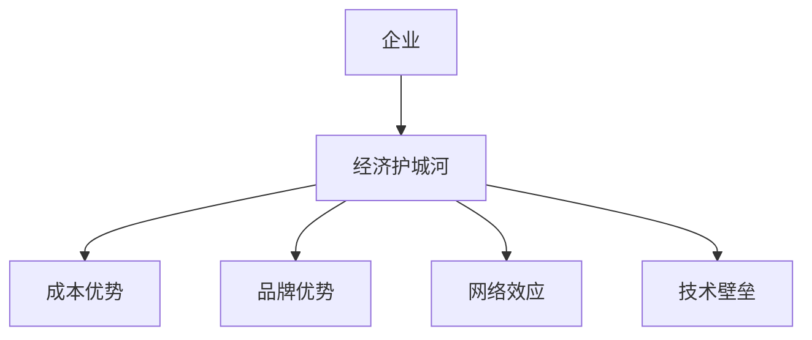
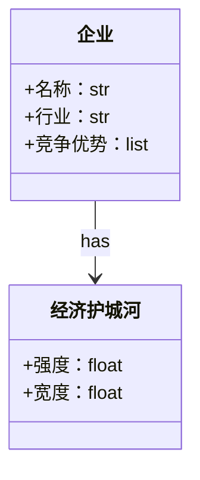
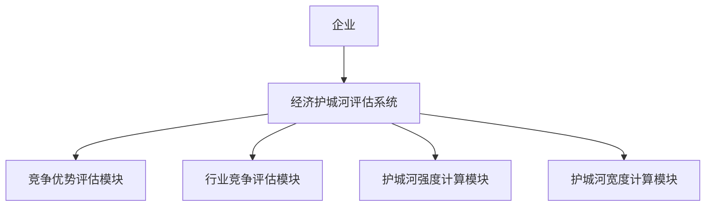
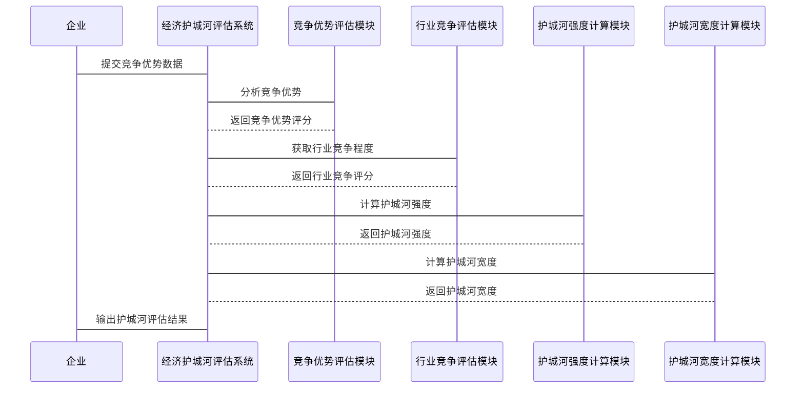

                 


# 巴菲特的经济护城河概念：寻找长期优势

**关键词**：巴菲特、经济护城河、投资策略、竞争优势、长期价值、企业战略

**摘要**：本文深入分析巴菲特的经济护城河概念，探讨其在投资和企业管理中的应用。通过详细阐述护城河的类型、构建原则及动态变化，结合实际案例，揭示如何通过建立和维护经济护城河实现长期竞争优势。

---

# 第一部分: 巴菲特的经济护城河概念基础

## 第1章: 巴菲特的经济护城河概述

### 1.1 巴菲特的生平与投资理念

#### 1.1.1 巴菲特的生平简介
沃伦·巴菲特（Warren Buffett），1934年出生于美国奥马哈，是世界著名投资者、慈善家。他以价值投资闻名，倡导长期投资和理性决策，强调寻找具有持续竞争优势的企业。

#### 1.1.2 巴菲特的投资哲学
巴菲特的投资哲学核心在于寻找具有“经济护城河”的企业。他认为，护城河是企业抵御竞争、保持长期盈利能力的关键。护城河包括成本优势、品牌影响力、网络效应和技术壁垒等。

#### 1.1.3 巴菲特对长期投资的理解
巴菲特认为，投资不仅仅是买入股票，而是买入企业。他关注企业的基本面，寻找那些能够在长期市场中占据优势地位的企业。

### 1.2 经济护城河的定义与核心要素

#### 1.2.1 经济护城河的定义
经济护城河是指企业通过独特的资源、竞争优势或市场定位，形成一种难以被竞争对手复制或超越的壁垒。这种壁垒能够为企业带来持续的超额利润。

#### 1.2.2 经济护城河的核心要素
- **成本优势**：企业能够以更低的成本生产产品或服务，从而在价格上具有竞争力。
- **品牌优势**：强大的品牌影响力能够吸引顾客，形成客户忠诚度。
- **网络效应**：产品或服务的使用能够吸引更多的用户，形成正反馈循环。
- **技术壁垒**：企业通过专利、专有技术和研发能力，形成技术上的优势。

#### 1.2.3 经济护城河的边界与外延
经济护城河的边界在于其可持续性和可扩展性。护城河的有效性取决于市场的变化和企业的创新能力。外延则包括企业如何利用护城河拓展市场和提升竞争力。

### 1.3 经济护城河的类型与特点

#### 1.3.1 成本优势
成本优势是指企业在生产或运营过程中能够以更低的成本实现更高的效率。例如，零售巨头Costco通过规模化采购和高效的供应链管理，形成了显著的成本优势。

#### 1.3.2 品牌优势
强大的品牌影响力能够吸引大量顾客，形成客户忠诚度。例如，可口可乐通过长期的品牌建设，成为全球知名的饮料品牌。

#### 1.3.3 网络效应
网络效应是指产品或服务的使用能够吸引更多的用户，形成正反馈循环。例如，社交媒体平台Facebook通过用户网络效应，吸引了大量用户。

#### 1.3.4 技术壁垒
技术壁垒是通过专利、专有技术和研发能力形成的技术优势。例如，苹果公司通过不断创新的产品设计和技术专利，形成了强大的技术壁垒。

### 1.4 经济护城河的构建原则

#### 1.4.1 护城河的可持续性
护城河的可持续性是指企业在未来能够持续保持竞争优势的能力。企业需要不断创新和调整，以应对市场的变化。

#### 1.4.2 护城河的可扩展性
护城河的可扩展性是指企业能够将竞争优势扩展到更广泛的市场或产品领域的能力。例如，亚马逊通过强大的物流网络和技术优势，成功扩展到多个业务领域。

#### 1.4.3 护城河的防御性
护城河的防御性是指企业能够抵御竞争对手的攻击，保护市场份额的能力。例如，迪士尼通过强大的内容创作能力和品牌影响力，抵御了流媒体平台的竞争。

### 1.5 本章小结
本章介绍了巴菲特的生平和投资哲学，详细阐述了经济护城河的定义、类型和构建原则。通过分析不同类型的护城河，揭示了企业如何通过建立护城河实现长期竞争优势。

---

## 第2章: 经济护城河的核心概念与联系

### 2.1 核心概念原理

#### 2.1.1 经济护城河的核心模型
经济护城河的核心模型包括成本优势、品牌优势、网络效应和技术壁垒四个主要因素。这些因素相互作用，形成了企业的竞争优势。

#### 2.1.2 护城河的动态变化
护城河并非一成不变，随着市场的变化和技术的进步，企业需要不断调整和加强护城河。例如，传统的成本优势可能被技术进步和技术壁垒取代。

#### 2.1.3 护城河与企业竞争优势的关系
护城河是企业竞争优势的核心来源。通过建立护城河，企业能够在全球化竞争中占据优势地位。

### 2.2 核心概念属性特征对比

#### 2.2.1 成本优势与品牌优势的对比
| 特性 | 成本优势 | 品牌优势 |
|------|----------|----------|
| 核心 | 低成本生产 | 强大品牌影响力 |
| 适用 | 制造业 | 消费品行业 |

#### 2.2.2 网络效应与技术壁垒的对比
| 特性 | 网络效应 | 技术壁垒 |
|------|----------|----------|
| 核心 | 用户网络效应 | 专利和技术优势 |
| 适用 | 社交媒体、平台型业务 | 高 tech 行业 |

### 2.3 ER实体关系图



### 2.4 本章小结
本章通过对比分析护城河的不同类型，揭示了其核心概念和联系。通过ER实体关系图，展示了护城河与企业竞争优势的关系，为后续分析提供了基础。

---

## 第3章: 经济护城河的算法原理

### 3.1 经济护城河的评估模型

#### 3.1.1 护城河强度评估公式
护城河强度评估公式为：
$$ \text{护城河强度} = \frac{\text{竞争优势}}{\text{行业竞争程度}} $$

其中，竞争优势包括成本优势、品牌优势、网络效应和技术壁垒；行业竞争程度反映了行业的竞争激烈程度。

#### 3.1.2 护城河宽度评估公式
护城河宽度评估公式为：
$$ \text{护城河宽度} = \text{市场占有率} \times \text{客户忠诚度} $$

市场占有率反映了企业的市场影响力，客户忠诚度反映了客户对品牌的依赖程度。

### 3.2 护城河强度评估算法

#### 3.2.1 算法步骤
1. 确定企业的竞争优势，包括成本优势、品牌优势、网络效应和技术壁垒。
2. 评估行业竞争程度，包括市场集中度、竞争对手数量和价格敏感性。
3. 计算护城河强度：
$$ \text{护城河强度} = \frac{\text{竞争优势}}{\text{行业竞争程度}} $$
4. 分析护城河强度，确定企业的竞争优势是否足够强大。

### 3.3 算法实现

```python
def calculate_economic_moat(competitive_advantages, industry_competition):
    return competitive_advantages / industry_competition

# 示例
competitive_advantages = 0.8  # 竞争优势评分（0-1）
industry_competition = 0.5    # 行业竞争程度评分（0-1）
moat_strength = calculate_economic_moat(competitive_advantages, industry_competition)
print(f"护城河强度：{moat_strength}")
```

### 3.4 本章小结
本章通过算法模型，详细阐述了护城河强度和宽度的评估方法。通过Python代码实现护城河强度的计算，为企业提供了一个量化评估工具。

---

## 第4章: 经济护城河的系统分析与架构设计方案

### 4.1 问题场景介绍
在全球化竞争的市场中，企业需要通过建立经济护城河来抵御竞争对手的攻击，保持长期竞争优势。

### 4.2 系统功能设计

#### 4.2.1 领域模型类图


### 4.3 系统架构设计

#### 4.3.1 系统架构图


### 4.4 系统接口设计
系统接口包括：
- 竞争优势输入接口
- 行业竞争评估接口
- 护城河强度和宽度输出接口

### 4.5 系统交互设计

#### 4.5.1 交互序列图


### 4.6 本章小结
本章通过系统架构设计，展示了如何通过信息化手段评估企业的经济护城河。通过模块化设计和交互序列图，详细说明了系统的实现过程。

---

## 第5章: 项目实战

### 5.1 环境安装

#### 5.1.1 安装Python和相关库
```bash
pip install numpy pandas matplotlib
```

### 5.2 系统核心实现源代码

#### 5.2.1 经济护城河评估系统实现
```python
import numpy as np
import pandas as pd

def calculate_moenet经济护城河(competitive_advantages, industry_competition):
    return competitive_advantages / industry_competition

# 示例数据
data = {
    '企业名称': ['企业A', '企业B', '企业C'],
    '成本优势': [0.7, 0.5, 0.6],
    '品牌优势': [0.8, 0.6, 0.7],
    '网络效应': [0.6, 0.4, 0.5],
    '技术壁垒': [0.5, 0.3, 0.4]
}

df = pd.DataFrame(data)
df['行业竞争程度'] = 0.5  # 假设行业竞争程度为0.5

# 计算护城河强度
df['护城河强度'] = df[['成本优势', '品牌优势', '网络效应', '技术壁垒']].mean(axis=1) / df['行业竞争程度']

print(df)
```

### 5.3 代码应用解读与分析
通过上述代码，我们可以计算不同企业在特定行业中的护城河强度。企业可以根据计算结果，识别自身的竞争优势，并制定相应的战略。

### 5.4 实际案例分析

#### 5.4.1 科技行业案例
以苹果公司为例，其强大的技术壁垒和品牌优势形成了显著的经济护城河。

#### 5.4.2 消费行业案例
以可口可乐公司为例，其品牌优势和全球市场网络形成了强大的护城河。

### 5.5 本章小结
本章通过项目实战，展示了如何利用Python代码实现护城河的评估。通过实际案例分析，帮助读者更好地理解护城河的应用。

---

## 第6章: 最佳实践与小结

### 6.1 最佳实践 tips
- 定期评估企业的竞争优势和行业竞争程度。
- 根据市场变化，动态调整护城河策略。
- 通过技术创新和品牌建设，增强护城河的可持续性。

### 6.2 注意事项
- 护城河的建立需要长期投入和持续创新。
- 企业需要根据自身特点选择合适的护城河类型。

### 6.3 拓展阅读
- 巴菲特的《投资之道》
- 市场结构与企业战略相关书籍

### 6.4 本章小结
本章总结了护城河的建立和维护策略，提供了最佳实践建议，并指出了未来的研究方向。

---

**作者：AI天才研究院/AI Genius Institute & 禅与计算机程序设计艺术/Zen And The Art of Computer Programming**

