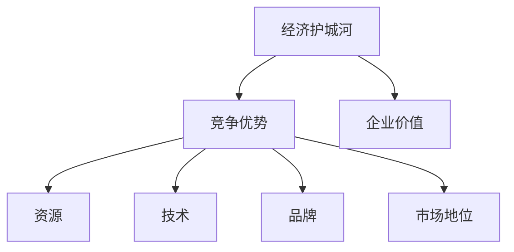
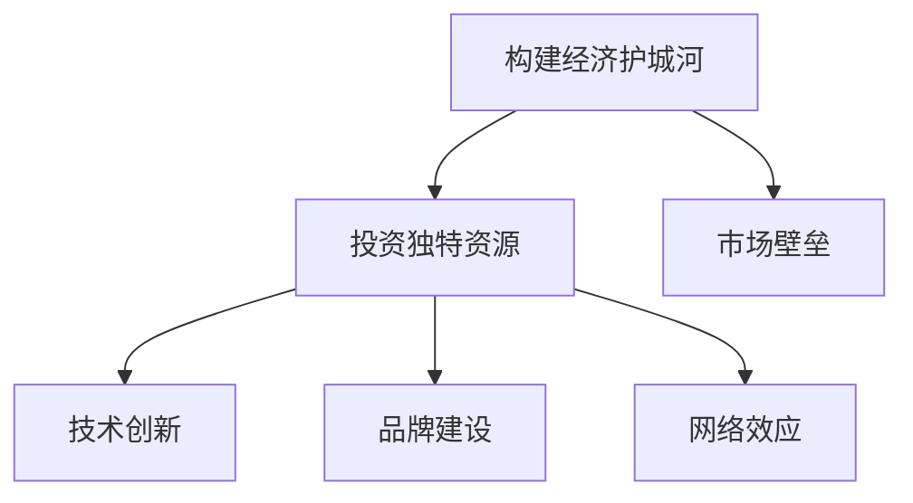
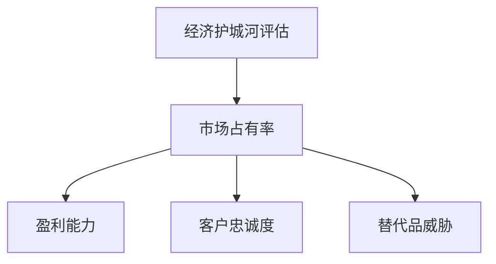

                 

# 巴菲特的经济护城河理论：如何识别持久竞争优势

**关键词**：经济护城河，竞争优势，巴菲特，投资策略，商业模式，企业战略

**摘要**：  
本文深入探讨巴菲特的经济护城河理论，分析如何通过识别企业的持久竞争优势来评估其长期价值。文章从经济护城河的基本概念入手，逐步分析其类型、构建策略、评估方法及实际案例，最后结合投资策略和动态变化进行总结。通过清晰的逻辑结构和实际案例，帮助读者全面理解经济护城河的核心思想，并掌握在实际投资和企业管理中的应用方法。

---

## 第1章: 经济护城河的基本概念

### 1.1 经济护城河的定义与背景  
经济护城河是巴菲特投资理论中的核心概念，指企业通过某种独特优势或壁垒，在市场上建立起的竞争优势，使得竞争对手难以复制或超越。这种优势可以是成本优势、品牌忠诚度、知识产权或网络效应等。  

**问题背景**：在竞争激烈的市场中，企业如何建立可持续的竞争优势，是投资者和企业管理者关注的核心问题。  

**问题解决**：经济护城河通过降低替代品威胁、提高客户忠诚度和增强市场进入壁垒，为企业提供长期竞争优势。  

**边界与外延**：经济护城河的外延包括企业资源、技术壁垒、市场地位和运营效率等，但其核心在于通过独特优势创造不可替代的价值。  

**核心要素组成**：经济护城河的核心要素包括资源、技术、品牌和市场等因素，这些要素共同构建了企业的竞争优势壁垒。

**Mermaid图示：经济护城河概念结构**

### 1.2 经济护城河的历史与发展  
经济护城河的概念源于巴菲特的投资理念，强调通过长期竞争优势创造股东价值。  

**历史演变**：从早期的低成本制造到现代的知识产权和网络效应，经济护城河的内涵不断丰富。  

**现代发展**：随着技术进步和市场变化，经济护城河的构建更加注重创新和客户关系的培养。

### 1.3 经济护城河的分类  
经济护城河主要分为五种类型：成本优势、差异化优势、网络效应、品牌忠诚度和知识产权。  

**成本优势型**：通过规模化生产降低成本，如沃尔玛的供应链优势。  

**差异化优势型**：通过独特的产品或服务吸引客户，如苹果的创新设计。  

**网络效应型**：通过用户之间的相互依赖形成壁垒，如微信的社交网络。  

**品牌忠诚度型**：通过强大的品牌形象建立客户忠诚度，如可口可乐的全球品牌影响力。  

**知识产权型**：通过专利和技术壁垒保护竞争优势，如微软的Windows操作系统。

---

## 第2章: 经济护城河的构建与强化

### 2.1 构建经济护城河的策略  
企业需要通过投资于独特资源、技术创新和品牌建设等策略来构建护城河。  

**投资于独特资源**：企业通过获取稀缺资源或技术优势，建立市场竞争壁垒。  

**技术创新**：通过研发投入和创新，企业可以推出差异化产品，形成技术壁垒。  

**品牌建设**：强大的品牌形象和客户忠诚度是企业的重要护城河，如耐克的运动品牌影响力。  

**网络效应**：通过扩大用户基数，企业可以形成用户之间的相互依赖，如支付宝的支付网络。  

**Mermaid图示：经济护城河的构建策略**

### 2.2 强化经济护城河的方法  
企业需要持续优化其竞争优势，以应对市场变化和竞争威胁。  

**持续创新与研发投入**：企业通过不断的技术创新，保持其产品和服务的领先地位。  

**深化客户关系**：通过优质的客户服务和客户关系管理，增强客户忠诚度。  

**优化运营流程**：通过高效的运营管理，降低生产成本，提高运营效率。  

**拓展市场边界**：通过市场扩展和全球化战略，扩大市场份额，增强市场影响力。  

**案例分析：微软的经济护城河**  
微软通过持续的技术创新和生态系统建设，建立了强大的技术壁垒和网络效应，巩固了其在软件行业的领先地位。  

### 2.3 经济护城河的动态维护  
经济护城河并非一成不变，企业需要定期评估和调整其竞争优势。  

**定期评估与调整**：企业应定期分析市场环境和竞争对手的变化，及时调整其战略。  

**应对竞争威胁的策略**：通过差异化竞争和市场定位，应对新兴竞争对手的挑战。  

**抓住行业变革的机遇**：企业应积极把握行业趋势，通过创新和转型抓住市场机遇。  

---

## 第3章: 经济护城河的评估与识别

### 3.1 评估经济护城河的关键指标  
识别经济护城河的关键指标包括市场占有率、盈利能力、客户忠诚度和替代品威胁等。  

**市场占有率**：市场占有率高的企业通常具有更强的议价能力和品牌影响力。  

**盈利能力稳定性**：盈利能力稳定的企业通常具有较强的护城河，能够抵御市场波动。  

**客户忠诚度**：高忠诚度的客户是企业的重要资产，能够为企业提供稳定的收入来源。  

**替代品威胁**：替代品的威胁较低的企业通常具有更强的定价权和市场竞争力。  

**Mermaid图示：经济护城河评估指标**

### 3.2 识别经济护城河的步骤  
识别经济护城河需要从核心竞争力、竞争对手分析和市场进入壁垒等方面入手。  

**分析企业的核心竞争力**：了解企业的独特优势和竞争优势来源。  

**评估竞争对手的可替代性**：分析竞争对手是否具备复制或超越企业优势的能力。  

**考察市场的进入壁垒**：评估市场是否存在高进入壁垒，限制新竞争者的进入。  

**评估企业的持续创新能力**：判断企业是否能够持续创新，保持竞争优势。  

### 3.3 经济护城河的深度分析  
通过案例分析和对比，深入理解不同类型经济护城河的特征和表现。  

**案例分析：可口可乐的全球品牌网络**  
可口可乐通过强大的品牌影响力和全球分销网络，建立了强大的护城河，成为全球饮料市场的领导者。  

---

## 第4章: 经济护城河与投资策略

### 4.1 经济护城河与投资策略的关系  
经济护城河是投资者评估企业长期价值的重要指标，具有强大护城河的企业通常具有较高的投资价值。  

**长期投资价值**：具有强大护城河的企业能够持续创造超额收益，为投资者带来稳定回报。  

**风险管理**：通过选择具有强大护城河的企业，投资者可以降低投资风险，提高投资收益的稳定性。  

**投资策略**：投资者应关注具有强大护城河的企业，长期持有，分享企业成长的成果。  

### 4.2 投资者如何识别护城河企业  
投资者需要从企业盈利能力、市场地位和竞争优势等方面进行综合分析，识别具有强大护城河的企业。  

**盈利能力分析**：关注企业的ROE（净资产收益率）和净利润增长率等指标，评估企业的盈利能力。  

**市场地位分析**：通过企业的市场占有率和品牌影响力，判断其市场地位和竞争优势。  

**竞争优势分析**：分析企业的核心竞争力，判断其是否具备持续的竞争优势。  

---

## 第5章: 经济护城河的动态变化与维护

### 5.1 经济护城河的动态变化  
市场环境的变化和技术进步可能导致经济护城河的弱化，企业需要不断调整和优化其竞争优势。  

**技术进步的影响**：技术进步可能削弱传统护城河，企业需要不断创新以保持竞争优势。  

**市场环境的变化**：政策变化、消费者偏好变化等因素可能影响经济护城河的有效性。  

**竞争对手的挑战**：新兴竞争对手的崛起可能威胁到企业的护城河，企业需要及时应对。  

### 5.2 维护经济护城河的策略  
企业需要通过持续创新、优化管理和拓展市场等方式，维护和强化其经济护城河。  

**持续创新**：通过研发投入和技术升级，保持产品的差异化和竞争力。  

**优化管理**：通过高效的运营管理，降低成本，提高效率。  

**拓展市场**：通过全球化战略和市场扩展，扩大市场份额，增强市场影响力。  

---

## 第6章: 总结与展望

### 6.1 本章总结  
本文系统地探讨了巴菲特的经济护城河理论，从基本概念、构建策略、评估方法到实际应用，全面分析了经济护城河的核心思想和应用价值。  

### 6.2 未来展望  
随着技术进步和市场环境的变化，经济护城河的内涵和外延将不断扩展。未来，企业需要更加注重创新和客户关系的维护，构建更加灵活和强大的经济护城河。  

---

**作者：AI天才研究院/AI Genius Institute & 禅与计算机程序设计艺术 /Zen And The Art of Computer Programming**

