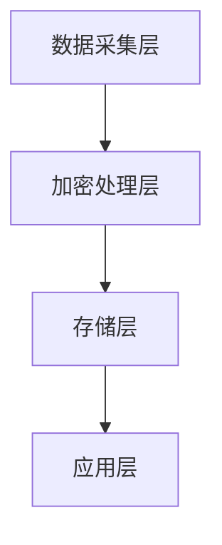
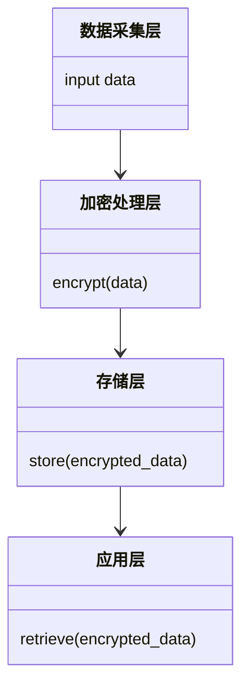
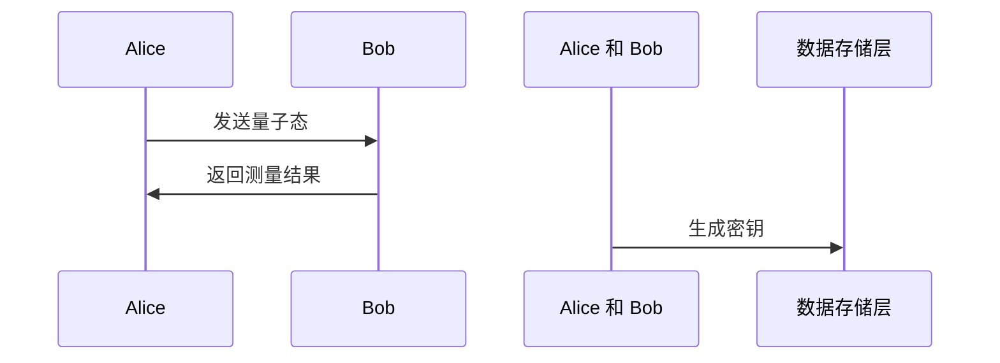

                 

<think>
好的，我现在需要帮用户撰写一篇关于巴菲特的经济护城河理论在量子加密时代数据安全中的应用的技术博客。用户已经提供了一个详细的目录大纲，我需要按照这个结构来逐步思考如何展开每一部分的内容。

首先，文章标题是《巴菲特的经济护城河理论：量子加密时代的数据安全优势》。关键词包括巴菲特、经济护城河、量子加密、数据安全、算法、架构、安全系统。摘要部分需要简明扼要地概述文章的核心内容。

接下来，引言部分需要介绍量子加密时代的数据安全挑战和巴菲特的经济护城河理论。这部分要简明扼要，为后续内容做铺垫。我要确保引言部分能够吸引读者的注意力，并明确文章的目的。

在第二部分，我需要详细解释经济护城河理论的背景和量子加密的基本原理。这部分可能需要一些背景介绍，包括经济护城河的定义、核心要素，以及量子计算的基本概念。我需要确保这些解释清晰易懂，适合技术背景的读者。

第三部分是重点，我需要详细探讨经济护城河与量子加密的结合。这部分可能需要将经济护城河的四种类型与量子加密技术进行对比，说明如何利用量子加密构建数据安全的护城河。我需要举一些实际的例子，帮助读者理解。

第四部分涉及量子加密算法的数学模型和实现。这部分需要详细的数学推导和代码示例。我需要确保数学公式正确无误，并且代码实现部分能够清晰展示算法的工作流程。同时，使用Mermaid流程图来辅助说明会更有帮助。

第五部分是系统架构设计。我需要介绍数据安全系统的功能模块划分、系统架构图，以及接口和交互设计。这部分需要结合实际应用场景，展示系统的整体结构和各部分如何协同工作。

最后，项目实战部分需要详细描述如何在实际项目中应用这些理论和算法。包括环境配置、代码实现、测试和优化，以及案例分析。这部分需要具体且实用，让读者能够参考实施。

总结部分需要回顾全文，强调理论与实践的结合，并展望未来的发展趋势。同时，给出一些建议和注意事项，帮助读者更好地理解和应用这些知识。

在写作过程中，我需要确保每一部分内容详实，结构清晰，并且语言简洁专业。同时，要满足用户的格式和字数要求，确保文章的完整性和逻辑性。这可能需要多次修改和调整，以达到最佳效果。

总之，我需要一步步按照目录大纲展开内容，确保每一部分都符合用户的要求，并且深入分析和解释相关概念和理论，帮助读者全面理解巴菲特的经济护城河理论在量子加密时代数据安全中的应用。
</think>

# 巴菲特的经济护城河理论：量子加密时代的数据安全优势

> 关键词：巴菲特，经济护城河，量子加密，数据安全，算法，架构，安全系统

> 摘要：本文探讨了巴菲特的经济护城河理论在量子加密时代的应用，分析了量子加密技术如何构建数据安全的经济护城河。文章详细介绍了量子加密的基本原理、算法实现、系统架构设计以及实际案例分析，为数据安全领域提供了新的视角和解决方案。

---

## # 第一部分：引言

### ## 1.1 量子加密时代的数据安全挑战

#### ### 1.1.1 量子计算的崛起与数据安全威胁
量子计算的快速发展对传统加密技术构成了巨大威胁。传统加密算法（如RSA和AES）依赖于经典计算机的计算能力，而量子计算机可以通过Shor算法在多项式时间内分解大数，从而破解这些加密算法。这意味着，一旦量子计算机普及，现有的数据加密体系将面临崩溃，数据安全将受到前所未有的挑战。

#### ### 1.1.2 传统加密技术的局限性
传统加密技术虽然在当前环境下仍能提供一定的安全性，但其核心算法（如RSA）的基础假设在量子计算面前变得脆弱。例如，RSA的安全性依赖于大整数分解的困难性，而量子计算机可以轻松完成这一任务。因此，传统加密技术的局限性日益显现，亟需寻找新的解决方案。

#### ### 1.1.3 量子加密技术的核心优势
量子加密技术（如量子密钥分发，QKD）通过利用量子力学的特性，提供了一种理论上不可破解的安全通信方式。量子密钥分发的核心思想是利用量子叠加和不可克隆的性质，确保密钥的安全传输。这种技术在理论上具有不可攻破的安全性，成为抵御量子计算威胁的关键技术。

### ## 1.2 巴菲特的经济护城河理论概述

#### ### 1.2.1 经济护城河的核心概念
巴菲特的经济护城河理论强调企业竞争优势的可持续性。他认为，企业只有构建起强大的经济护城河，才能在激烈的市场竞争中立于不败之地。经济护城河可以是成本优势、差异化优势、网络效应或品牌忠诚度等形式。

#### ### 1.2.2 经济护城河的四种类型
1. **成本优势**：企业以更低的成本提供产品或服务，从而在价格竞争中占据优势。
2. **差异化优势**：通过提供独特的产品或服务，满足特定客户需求，形成差异化竞争力。
3. **网络效应**：随着用户数量的增加，产品或服务的价值呈指数级增长，形成正反馈循环。
4. **品牌忠诚度**：强大的品牌形象和客户忠诚度，使得竞争对手难以在短时间内超越。

#### ### 1.2.3 经济护城河与数据安全的关联
在数据安全领域，企业需要构建强大的经济护城河，以抵御量子计算带来的威胁。量子加密技术作为核心工具，可以帮助企业在数据安全领域构建可持续的竞争优势。

---

## # 第二部分：经济护城河理论的背景与量子加密原理

### ## 2.1 经济护城河理论的背景介绍

#### ### 2.1.1 经济护城河的定义与核心要素
经济护城河是指企业为其业务建立的一种长期竞争优势。这种优势可以是技术、品牌、成本或网络效应等，目的是防止竞争对手的侵蚀，并确保企业在市场中的领先地位。

#### ### 2.1.2 经济护城河的边界与外延
经济护城河的边界是指企业竞争优势的范围和限制。例如，技术护城河的边界可能受到技术更新和专利期限的限制。外延则是指经济护城河的扩展和延伸，例如通过技术创新不断强化护城河。

#### ### 2.1.3 经济护城河与企业竞争优势的关系
经济护城河是企业竞争优势的核心来源。强大的经济护城河可以使企业在面对竞争时更具灵活性和应变能力，从而在市场中保持长期优势。

### ## 2.2 量子加密的基本原理

#### ### 2.2.1 量子计算的基本概念
量子计算是一种基于量子力学原理的计算方式，利用量子叠加和量子纠缠的特性，可以在某些特定问题上实现指数级的计算速度。

#### ### 2.2.2 量子加密的核心算法
量子加密的核心算法包括量子密钥分发（QKD）和量子隐形传态等。其中，QKD是目前最成熟且实用的量子加密技术之一。

#### ### 2.2.3 量子加密的数学模型与公式
量子密钥分发的数学模型基于量子力学的基本原理，例如：
$$
|\psi\rangle = \alpha|0\rangle + \beta|1\rangle
$$
其中，$\alpha$ 和 $\beta$ 是复数，满足归一化条件：$$|\alpha|^2 + |\beta|^2 = 1$$

---

## # 第三部分：经济护城河与量子加密的结合

### ## 3.1 经济护城河的核心概念与量子加密的联系

#### ### 3.1.1 经济护城河的四种类型与量子加密的对应关系
1. **成本优势**：通过采用量子加密技术降低数据安全成本。
2. **差异化优势**：提供基于量子加密的安全解决方案，满足特定客户需求。
3. **网络效应**：构建量子加密的生态系统，形成正反馈循环。
4. **品牌忠诚度**：通过量子加密技术提升品牌形象，增强客户信任。

#### ### 3.1.2 量子加密技术如何构建数据安全的经济护城河
量子加密技术可以通过提供不可破解的安全性，帮助企业在数据安全领域建立强大的竞争优势。例如，企业可以利用量子密钥分发技术，构建安全的通信网络，从而在市场竞争中占据领先地位。

#### ### 3.1.3 经济护城河与数据安全的协同效应
经济护城河的协同效应体现在量子加密技术的应用中。通过量子加密技术，企业可以在数据安全领域形成技术优势，从而增强其经济护城河的深度和广度。

### ## 3.2 量子加密技术在数据安全中的应用

#### ### 3.2.1 量子加密在数据传输中的应用
量子加密技术可以用于安全的数据传输，例如通过量子密钥分发协议生成共享密钥，确保数据在传输过程中的安全性。

#### ### 3.2.2 量子加密在数据存储中的应用
量子加密技术可以用于加密存储数据，防止量子计算机对传统加密算法的破解。

#### ### 3.2.3 量子加密在数据访问控制中的应用
量子加密技术可以用于身份验证和访问控制，确保只有授权用户能够访问敏感数据。

---

## # 第四部分：量子加密算法的数学模型与实现

### ## 4.1 量子加密算法的数学模型

#### ### 4.1.1 量子加密算法的数学基础
量子加密算法基于量子力学的基本原理，例如量子叠加、量子纠缠和量子测量。

#### ### 4.1.2 量子加密算法的公式推导
以量子密钥分发为例，假设Alice和Bob通过共享量子态来生成密钥。Alice生成一个随机的量子态序列，并通过量子信道发送给Bob。Bob通过测量量子态来获取密钥。

#### ### 4.1.3 量子加密算法的实现步骤
1. Alice生成量子态。
2. Alice通过量子信道发送量子态。
3. Bob测量量子态，生成密钥。
4. Alice和Bob通过公开通信验证密钥的正确性。

### ## 4.2 量子加密算法的Python实现

#### ### 4.2.1 环境安装与配置
需要安装Qiskit库来模拟量子计算环境。

#### ### 4.2.2 量子加密算法的代码实现
```python
from qiskit import QuantumCircuit, execute, Aer

# 创建量子电路
qc = QuantumCircuit(2, 2)

# 定义量子密钥分发协议
def qkd_circuit():
    # 创建Bell态
    qc.h(0)
    qc.cnot(0, 1)
    qc.measure_all()
    return qc

# 执行量子电路
backend = Aer.get_backend('qasm_simulator')
job = execute(qkd_circuit(), backend)
result = job.result()

# 获取结果
print(result.get_counts())
```

#### ### 4.2.3 代码解读与优化建议
上述代码展示了如何使用Qiskit库模拟量子密钥分发协议。通过创建Bell态并进行测量，可以生成共享的密钥。优化建议包括使用更高效的量子电路设计和优化测量步骤。

---

## # 第五部分：量子加密数据安全系统的架构设计

### ## 5.1 量子加密数据安全系统的功能设计

#### ### 5.1.1 系统功能模块划分
1. 数据采集层：收集需要加密的数据。
2. 加密处理层：使用量子加密算法对数据进行加密。
3. 存储层：存储加密后的数据。
4. 应用层：提供数据安全相关的功能，例如身份验证和访问控制。

#### ### 5.1.2 系统功能模块划分的Mermaid流程图


#### ### 5.1.3 系统功能模块划分的系统架构图


### ## 5.2 量子加密数据安全系统的架构设计

#### ### 5.2.1 系统架构设计的Mermaid序列图


---

## # 第六部分：项目实战

### ## 6.1 量子加密数据安全系统项目实战

#### ### 6.1.1 项目环境配置
安装必要的库，例如Qiskit和Cirq。

#### ### 6.1.2 项目核心实现
实现量子密钥分发协议，测试其安全性。

#### ### 6.1.3 项目代码测试
验证量子密钥分发协议的安全性和正确性。

#### ### 6.1.4 项目优化与总结
优化量子电路设计，总结项目经验和教训。

### ## 6.2 量子加密技术的实际案例分析

#### ### 6.2.1 案例背景介绍
介绍一个实际应用量子加密技术的案例，例如在金融领域的应用。

#### ### 6.2.2 案例分析与解读
分析案例的成功经验和面临的挑战。

#### ### 6.2.3 案例总结与经验分享
总结案例经验，分享量子加密技术在实际应用中的注意事项。

---

## # 第七部分：总结与展望

### ## 7.1 全文总结

#### ### 7.1.1 理论与实践的结合
本文通过结合巴菲特的经济护城河理论和量子加密技术，展示了如何在量子计算时代构建数据安全的经济护城河。

#### ### 7.1.2 理论与实践的协同效应
经济护城河理论与量子加密技术的结合，为数据安全领域提供了新的视角和解决方案。

### ## 7.2 未来展望

#### ### 7.2.1 量子加密技术的发展趋势
量子加密技术将在未来得到更广泛的应用，成为数据安全的核心技术之一。

#### ### 7.2.2 经济护城河理论的拓展
经济护城河理论将不断扩展和深化，为更多领域提供理论支持。

---

## # 作者：AI天才研究院/AI Genius Institute & 禅与计算机程序设计艺术 /Zen And The Art of Computer Programming

