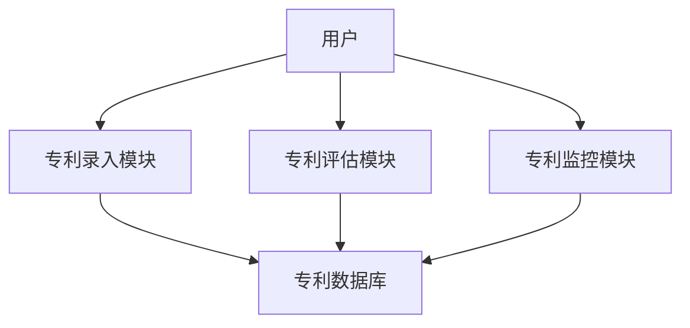

                 


# 巴菲特的经济护城河理论：量子技术专利池的竞争优势

---

## 关键词：
- 巴菲特
- 经济护城河
- 量子技术
- 专利池
- 竞争优势
- 企业战略

---

## 摘要：
本文探讨巴菲特的经济护城河理论在量子技术专利池中的应用，分析如何通过构建量子技术专利池来形成企业的竞争优势，从而在长期投资中获得超额收益。通过详细的技术分析和案例解读，揭示量子技术专利池在企业战略中的重要性。

---

## 目录大纲：

# 巴菲特的经济护城河理论：量子技术专利池的竞争优势

> 关键词：巴菲特, 经济护城河, 量子技术, 专利池, 竞争优势, 企业战略  
> 摘要：本文探讨巴菲特的经济护城河理论在量子技术专利池中的应用，分析如何通过构建量子技术专利池来形成企业的竞争优势，从而在长期投资中获得超额收益。

---

## 第一部分：经济护城河与量子技术专利池的背景

### 第1章：经济护城河的基本概念

#### 1.1 经济护城河的定义与作用
经济护城河是指企业通过某种独特的竞争优势，在行业中建立的难以被竞争对手复制的壁垒。这种壁垒可以是技术优势、品牌影响力、成本优势或网络效应等。巴菲特认为，拥有强大经济护城河的公司能够在长期竞争中获得超额利润。

#### 1.2 量子技术的崛起与专利池的重要性
量子技术作为一项革命性技术，正在迅速改变多个行业。量子计算、量子通信和量子传感等领域的发展，使得拥有量子技术专利的企业能够占据技术制高点。专利池是指一组相互关联的专利资产，能够为企业提供技术垄断和防御能力，从而在竞争中占据优势。

#### 1.3 量子技术专利池与经济护城河的结合
量子技术专利池通过技术积累和法律保护，形成企业的经济护城河。拥有丰富量子技术专利的企业，能够有效防止竞争对手的侵权，并利用专利组合拓展市场，提升企业竞争力。

---

### 第2章：量子技术专利池的核心要素

#### 2.1 量子技术专利池的属性特征
- **技术相关性**：专利必须与量子技术的核心领域相关，如量子计算、量子通信等。
- **专利数量与质量**：专利池的规模和质量直接影响其竞争力。
- **法律保护**：专利的有效性和法律保护是专利池价值的关键因素。

#### 2.2 量子技术专利池的竞争优势
- **技术垄断**：通过专利池形成技术壁垒，防止竞争对手进入市场。
- **市场控制**：专利池可以增强企业在市场中的定价权和话语权。
- **防御能力**：专利池可以用于反击竞争对手的专利诉讼，降低企业法律风险。

---

## 第二部分：量子技术专利池的算法与数学模型

### 第3章：量子技术专利池的评估算法

#### 3.1 专利池评估的指标体系
- **技术相关性评分**：评估专利与量子技术的相关性。
- **专利活性评分**：评估专利的法律状态和有效期。
- **市场价值评分**：评估专利的市场影响力和商业价值。

#### 3.2 专利池价值评估的数学模型
$$ V = \sum_{i=1}^{n} w_i \cdot s_i $$
其中，\( V \) 是专利池的总价值，\( w_i \) 是第 \( i \) 项的权重，\( s_i \) 是评分。

#### 3.3 算法实现的Python代码示例
```python
def calculate_patent_value(patents, weights):
    return sum(w * p for w, p in zip(weights, patents))
```

---

## 第三部分：量子技术专利池的系统架构与设计

### 第4章：量子技术专利池的系统架构

#### 4.1 系统功能设计
- **专利录入与管理**：录入量子技术专利信息，分类管理。
- **专利评估与分析**：对专利进行技术评估和市场分析。
- **专利监控与预警**：监控专利状态和市场竞争情况，提供预警。

#### 4.2 系统架构设计


#### 4.3 接口设计与交互流程
- **用户界面**：提供友好的操作界面，方便用户录入和查询专利信息。
- **API接口**：提供RESTful API，方便与其他系统集成。

---

## 第四部分：量子技术专利池的项目实战

### 第5章：量子技术专利池的项目实战

#### 5.1 项目环境安装
- **工具安装**：安装Python、Jupyter Notebook、专利数据分析工具等。
- **数据获取**：获取量子技术专利数据集，清洗数据。

#### 5.2 项目核心实现
```python
import pandas as pd

def analyze_patent_data(dataframe):
    # 数据清洗
    dataframe.dropna(inplace=True)
    # 专利数量统计
    count = dataframe['专利数量'].sum()
    return count

data = pd.read_csv('quantum_patents.csv')
result = analyze_patent_data(data)
print(f"总专利数量：{result}")
```

#### 5.3 项目分析与案例解读
- **案例分析**：分析某量子技术企业的专利池，评估其竞争优势。
- **结果解读**：通过数据分析，揭示专利池对企业发展的影响。

---

## 第五部分：量子技术专利池的最佳实践

### 第6章：量子技术专利池的最佳实践

#### 6.1 小结
量子技术专利池是构建企业经济护城河的重要手段，能够为企业提供技术垄断和市场竞争优势。

#### 6.2 注意事项
- **专利质量**：注重专利的技术相关性和创新性。
- **法律保护**：确保专利的合法性和有效性。
- **动态调整**：根据市场变化及时调整专利池策略。

#### 6.3 拓展阅读
建议进一步阅读《巴菲特的护城河》和《量子计算原理》等书籍，深入了解经济护城河理论和量子技术的最新发展。

---

## 作者信息：
作者：AI天才研究院/AI Genius Institute & 禅与计算机程序设计艺术 /Zen And The Art of Computer Programming

---

通过本文的详细分析，我们揭示了量子技术专利池在构建企业经济护城河中的重要作用，并提供了具体的实现方法和案例分析。希望本文能够为企业的量子技术战略布局提供有价值的参考。

