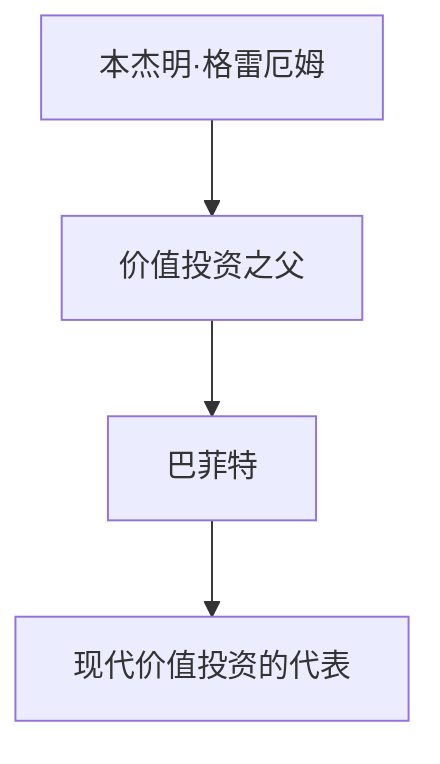
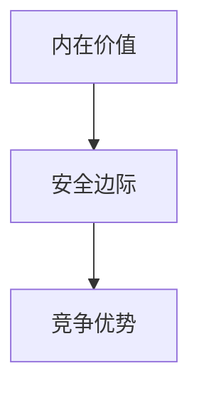
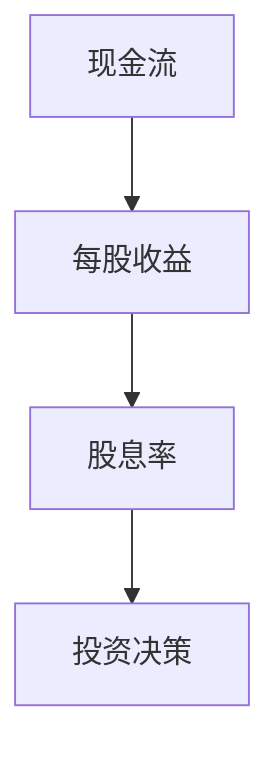
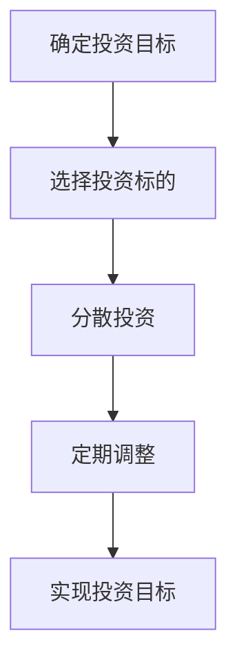

                 

# 巴菲特的股东信中的投资智慧

## 关键词：巴菲特，投资智慧，股东信，价值投资，风险管理，财务分析

## 摘要： 巴菲特的股东信是全球投资者学习价值投资的宝贵资源。本文通过分析股东信的核心内容，揭示巴菲特的投资理念、策略和方法，帮助读者掌握价值投资的精髓，提升投资决策能力。

---

# 第一部分：背景介绍

## 第1章：巴菲特投资理念的背景与核心概念

### 1.1 巴菲特投资理念的起源

巴菲特的投资理念源于价值投资，由本杰明·格雷厄姆和菲利普斯·卡佛共同提出。价值投资的核心是寻找被市场低估的股票，通过深入分析企业的财务状况、行业地位和竞争优势，找到具有安全边际的投资标的。

**图1-1：价值投资的起源与发展**

### 1.2 巴菲特股东信的核心概念

巴菲特的股东信是其投资理念的重要载体，主要包含以下核心概念：

- **价值投资**：寻找具有持续竞争优势、良好治理结构和合理估值的企业。
- **安全边际**：买入价格低于内在价值，以降低投资风险。
- **长期投资**：关注企业的长期价值，而非短期市场波动。

### 1.3 巴菲特投资理念的结构与要素

**表1-1：价值投资的核心要素对比**

| 核心要素 | 描述 | 示例 |
|----------|------|------|
| 内在价值 | 企业未来现金流的现值 | 某公司未来5年现金流折现计算 |
| 安全边际 | 买入价格与内在价值的差距 | 股票价格低于内在价值20% |
| 竞争优势 | 企业的独特优势 | 可口可乐的品牌影响力 |

---

## 第2章：巴菲特股东信中的投资策略

### 2.1 价值投资的核心策略

巴菲特的价值投资策略强调以下几点：

- **质优价廉**：选择具有强大竞争优势且估值合理的企业。
- **长期持有**：避免频繁交易，降低交易成本，享受复利效应。
- **安全边际**：买入价格低于内在价值，以应对市场的不确定性。

**图2-1：价值投资的三要素**

### 2.2 股东信中的风险管理策略

巴菲特在股东信中强调风险管理的重要性，主要通过以下方式实现：

- **风险识别**：分析企业的财务状况、行业前景和宏观经济环境。
- **风险控制**：通过分散投资和安全边际降低风险。
- **风险承受**：在市场恐慌时逆势投资，抓住优质资产的低估机会。

**表2-1：风险控制的三重防线**

| 防线 | 描述 | 示例 |
|------|------|------|
| 第一道防线 | 投资标的内在价值分析 | 股票价格低于内在价值 |
| 第二道防线 | 投资组合的分散化 | 持有多家具有竞争优势的企业 |
| 第三道防线 | 投资决策的独立性 | 避免随市场波动盲目交易 |

---

## 第3章：巴菲特股东信中的财务分析方法

### 3.1 财务报表分析的核心指标

巴菲特通过分析企业的财务报表，寻找具有强大盈利能力和良好财务状况的企业。常用的财务指标包括：

- **市盈率（P/E）**：股价与每股收益的比率，用于衡量股票的估值。
- **市净率（P/B）**：股价与每股净资产的比率，用于衡量股票相对于账面价值的高低。
- **股东权益收益率（ROE）**：净利润与股东权益的比率，用于衡量企业的盈利能力。

**公式3-1：市盈率计算**

$$ \text{市盈率} = \frac{\text{股价}}{\text{每股收益}} $$

**公式3-2：股东权益收益率计算**

$$ \text{ROE} = \frac{\text{净利润}}{\text{股东权益}} $$

### 3.2 股东信中的财务指标计算

巴菲特在股东信中常用以下财务指标进行分析：

- **每股收益（EPS）**：净利润除以普通股股数，用于衡量企业的盈利能力。
- **股息率**：股息与股价的比率，用于衡量股票的分红能力。
- **现金流**：经营活动产生的现金流，用于衡量企业的财务健康状况。

**图3-1：财务指标与投资决策的关系**

---

## 第4章：巴菲特股东信中的投资组合管理

### 4.1 投资组合管理的原则

巴菲特的投资组合管理原则包括：

- **分散与集中**：集中投资于少数具有竞争优势的企业，同时分散投资以降低风险。
- **长期持有**：避免频繁交易，降低交易成本，享受复利效应。
- **定期调整**：根据市场变化和企业状况，定期调整投资组合。

### 4.2 股东信中的投资组合优化

巴菲特通过以下方式优化投资组合：

- **资产配置**：根据市场环境和个人风险承受能力，合理配置股票和债券。
- **风险控制**：通过分散投资和安全边际降低投资组合的风险。
- **长期规划**：制定长期投资目标，避免短期市场波动的干扰。

**图4-1：投资组合优化的流程图**

---

## 第5章：巴菲特股东信中的长期投资与复利

### 5.1 长期投资的重要性

巴菲特强调长期投资的重要性，认为短期市场波动无法预测，而长期投资可以享受企业的成长和复利效应。

### 5.2 复利效应的数学模型

复利效应可以通过以下公式计算：

$$ \text{终值} = \text{本金} \times (1 + \text{收益率})^{\text{时间}} $$

---

## 小结

巴菲特的股东信是价值投资的经典教材，通过深入分析企业的财务状况、行业地位和竞争优势，结合长期投资和复利效应，巴菲特的投资理念为全球投资者提供了宝贵的经验和智慧。通过本文的分析，读者可以更好地理解巴菲特的投资理念，并将其应用于实际投资中。

---

## 作者

作者：AI天才研究院/AI Genius Institute & 禅与计算机程序设计艺术/Zen And The Art of Computer Programming

