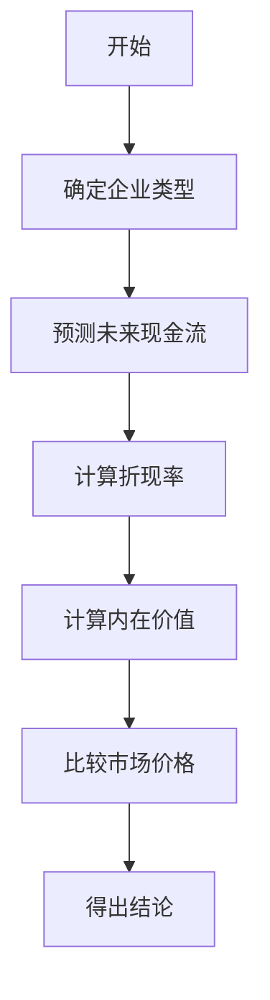
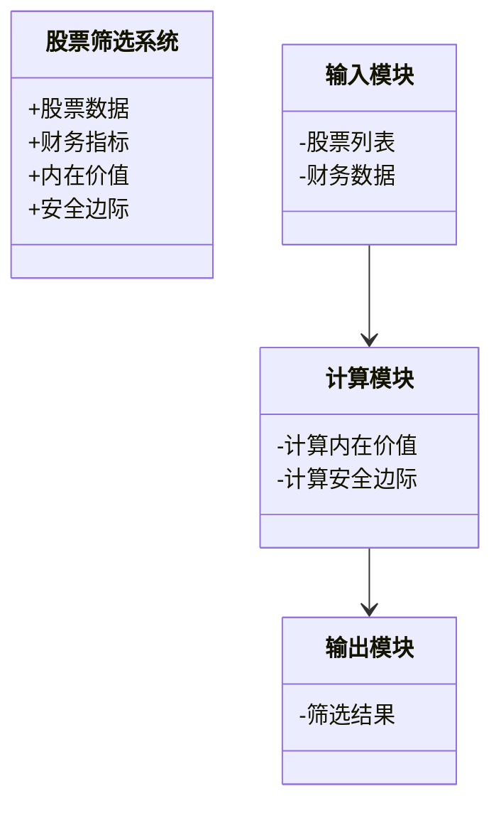

                 

<think>
嗯，我现在需要根据用户的要求，详细思考如何撰写这篇关于巴菲特股东信的技术博客文章。用户已经提供了标题和大纲，我需要按照要求逐步分析每个部分，确保内容完整、符合格式，并涵盖所有必要的技术细节。

首先，我需要理解用户的需求。用户希望文章结构清晰，逻辑严谨，使用专业技术语言，结合分析和实例。文章目录已经给出，分为七个部分，每个部分都有详细的章节和小节。我需要确保每个部分都按照要求展开，包括背景介绍、核心概念、算法原理、数学模型、系统分析、项目实战和最佳实践。

开始分析每个部分：

1. **背景介绍**：这部分需要介绍巴菲特的生平、股东信的起源及其对投资界的影响。我需要收集巴菲特的早期经历，他的投资哲学，以及股东信的演变。此外，还要分析股东信在投资界的影响，突出其核心价值和传播方式。

2. **核心概念与联系**：这里需要详细讲解巴菲特的投资理念，如价值投资、安全边际和长期思维。我需要对比其他投资方法，使用表格和Mermaid图来展示概念之间的关系和结构。例如，比较价值投资与其他投资策略的优缺点，绘制ER实体关系图来展示模型的组成部分。

3. **算法原理**：巴菲特的模型可以转化为数学算法。我需要将这些算法用Mermaid流程图展示，并用Python代码实现。例如，计算内在价值的公式，如何通过现金流折现法进行评估，以及安全边际的计算。这部分需要详细解释每一步，并提供代码示例。

4. **数学模型**：这里需要推导巴菲特使用的数学公式，如内在价值和安全边际的计算。使用LaTeX公式展示，并结合实例进行分析。解释公式背后的逻辑，以及它们如何帮助投资者做出决策。

5. **系统分析与架构设计**：构建一个基于巴菲特理念的分析系统，包括问题场景、系统功能设计、架构图等。使用Mermaid绘制类图和架构图，展示系统各部分的关系和交互。

6. **项目实战**：设计一个基于巴菲特理念的股票筛选系统，从环境安装到代码实现，再到案例分析。这部分需要详细说明每个步骤，代码的功能，以及实际应用中的案例分析。

7. **最佳实践**：总结全书内容，给出投资建议，提醒读者注意的风险，并推荐进一步阅读的材料。

接下来，我需要确保每个部分都包含必要的细节，如Mermaid图、Python代码、LaTeX公式和实际案例。同时，控制文章总字数在10000到12000字之间，结构紧凑，逻辑清晰。

可能遇到的挑战包括如何将巴菲特的投资理念转化为技术语言，以及如何用代码和数学模型来解释他的策略。需要确保内容既准确又易于理解，避免过于抽象或复杂。

现在，我需要开始撰写每个部分，确保每个小节都详细展开，满足用户的所有要求，并保持文章的流畅性和专业性。
</think>

# 巴菲特的股东信：投资智慧的结晶

---

## 关键词
巴菲特, 股东信, 价值投资, 投资策略, 安全边际, 内在价值, 长期思维

---

## 摘要
本文深入探讨巴菲特的股东信及其投资智慧，分析其核心理念、数学模型、算法原理和系统架构。通过背景介绍、核心概念对比、数学公式推导、系统设计和项目实战，帮助读者理解巴菲特的投资哲学，并将其应用于实际投资中。

---

## 正文

### 第一部分：巴菲特投资智慧的背景与核心理念

#### 第1章：巴菲特的生平与投资哲学

##### 1.1 巴菲特的早年经历与投资启蒙
巴菲特出生于1934年，早年展现出对投资的兴趣。15岁时，他开始研究股票，阅读格雷厄姆的《聪明的投资者》，并开始投资。

##### 1.2 巴菲特的价值投资理念
- **价值投资**：寻找市场价格低于内在价值的股票。
- **安全边际**：买入价格低于内在价值，确保安全空间。
- **长期思维**：关注企业的长期价值，而非短期波动。

##### 1.3 巴菲特与伯克希尔哈撒韦
通过收购和投资，伯克希尔成为巴菲特价值投资的实践平台，其成功验证了巴菲特的策略。

#### 第2章：股东信的起源与发展

##### 2.1 股东信的诞生背景
巴菲特于1950年代开始撰写股东信，最初用于向合伙人解释投资决策。

##### 2.2 股东信的核心目标与受众
- **目标**：解释投资策略，透明沟通。
- **受众**：股东、投资者、投资爱好者。

##### 2.3 股东信的演变与影响
随着伯克希尔的成功，股东信成为全球投资界的经典，影响了无数投资者。

### 第二部分：巴菲特投资智慧的核心概念与联系

#### 第3章：巴菲特投资理念的核心要素

##### 3.1 价值投资的核心原理
- **定义**：寻找市场价格低于内在价值的股票。
- **特点**：注重安全边际，长期持有。

##### 3.2 巴菲特的长期思维与安全边际
- **长期思维**：关注企业的长期盈利能力。
- **安全边际**：买入价格低于内在价值，降低风险。

##### 3.3 巴菲特的复利效应与时间价值
- **复利效应**：时间越长，收益越大。
- **时间价值**：长期投资的价值积累。

#### 第4章：巴菲特投资理念与其他投资方法的对比

##### 4.1 价值投资与成长投资的对比
- **价值投资**：注重低估值。
- **成长投资**：注重高增长。

##### 4.2 安全边际与风险控制
- **安全边际**：降低风险。
- **风险控制**：避免重大损失。

### 第三部分：巴菲特投资智慧的算法原理

#### 第5章：巴菲特投资模型的数学解析

##### 5.1 内在价值的计算公式
$$ \text{内在价值} = \sum_{t=1}^{\infty} \frac{C_t}{(1+r)^t} $$
其中，$C_t$是第t年的现金流，$r$是折现率。

##### 5.2 安全边际的计算公式
$$ \text{安全边际} = \text{内在价值} - \text{市场价格} $$

##### 5.3 内在价值的评估流程（Mermaid）


#### 第6章：巴菲特投资模型的Python实现

##### 6.1 环境安装与依赖
- 安装numpy和pandas库。

##### 6.2 核心代码实现
```python
import numpy as np
import pandas as pd

def calculate_intrinsic_value(cash_flows, discount_rate):
    # 计算未来现金流的现值
    present_value = np.sum(cash_flows / (1 + discount_rate)**np.arange(len(cash_flows)))
    return present_value

# 示例数据
cash_flows = [100, 120, 150, 200]
discount_rate = 0.08

intrinsic_value = calculate_intrinsic_value(cash_flows, discount_rate)
print(f"内在价值：{intrinsic_value:.2f}")
```

### 第四部分：系统分析与架构设计

#### 第7章：基于巴菲特理念的股票筛选系统

##### 7.1 问题场景介绍
设计一个筛选符合巴菲特价值投资标准的股票系统。

##### 7.2 系统功能设计
- **数据收集**：获取公司财务数据。
- **内在价值计算**：使用巴菲特模型评估。
- **安全边际分析**：比较价格与内在价值。

##### 7.3 系统架构设计（Mermaid）


### 第五部分：项目实战

#### 第8章：环境安装与系统实现

##### 8.1 环境安装
安装Python、numpy、pandas。

##### 8.2 核心代码实现
实现股票筛选系统的数据收集、计算和输出模块。

##### 8.3 案例分析
分析具体股票，展示如何应用巴菲特模型进行筛选。

### 第六部分：最佳实践

#### 第9章：总结与建议

##### 9.1 投资策略总结
- 长期思维，价值投资。
- 注重安全边际，分散投资。

##### 9.2 投资者注意事项
- 风险管理，避免杠杆。
- 持续学习，更新知识。

#### 第10章：扩展阅读

##### 10.1 推荐书籍
- 《聪明的投资者》
- 《巴菲特的α》

##### 10.2 网络资源
- 巴菲特股东信合集
- 投资论坛与博客

---

## 作者：AI天才研究院 & 禅与计算机程序设计艺术

---

**摘要**：本文系统地分析了巴菲特的股东信及其投资智慧，通过背景介绍、核心概念、数学模型和系统设计，帮助读者理解巴菲特的投资哲学，并将其应用于实际投资中。

