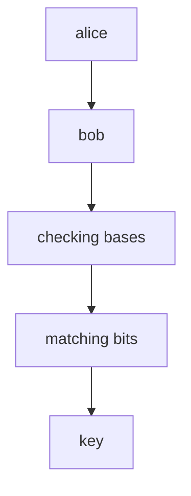
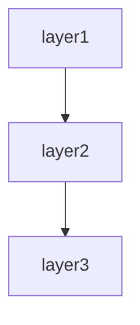
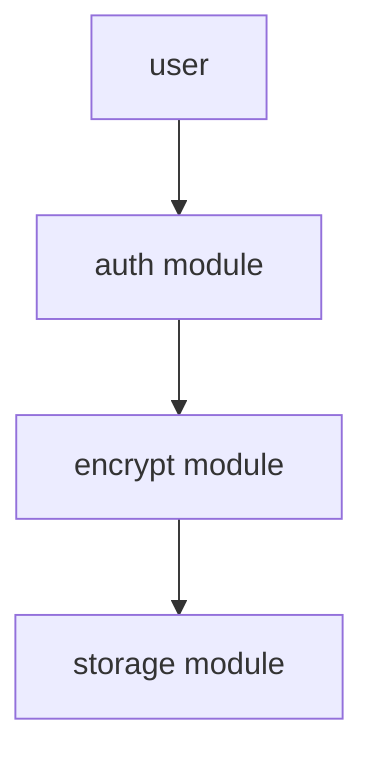
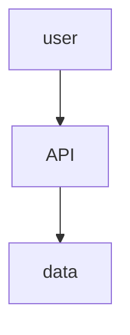
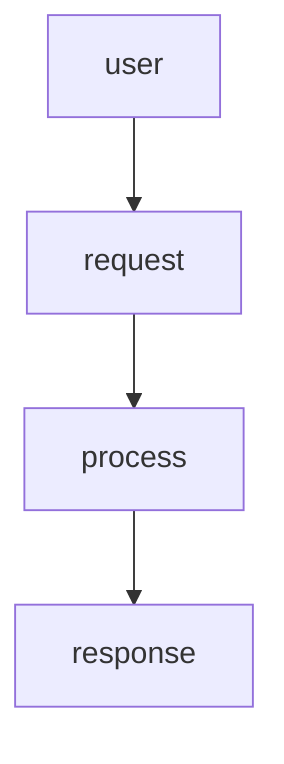

                 

<think>
好的，我现在需要按照用户的要求来撰写一篇关于《巴菲特的股东沟通艺术：量子加密在企业治理中的创新应用》的技术博客文章。用户提供了详细的目录大纲，并且要求内容丰富、详细，符合技术博客的高标准。同时，用户还指定了格式、字数和其他具体要求，所以我必须确保每个部分都满足这些条件。

首先，我需要理解用户的需求。用户希望我以技术专家的身份，撰写一篇结构清晰、逻辑严谨的技术博客，涵盖量子加密在企业治理中的应用，特别是如何提升股东沟通的安全性。这不仅仅是技术的探讨，还涉及到管理与沟通的结合，因此我需要将技术细节与实际应用场景结合起来。

接下来，我需要按照目录大纲一步步展开内容。首先是标题和摘要，然后是各个章节，每个章节都需要详细展开，确保涵盖所有必要的部分，如背景介绍、核心概念、算法原理、系统架构、项目实战等。每个部分都要有相应的图示，如Mermaid流程图、类图、架构图等，并附有代码示例和数学公式。

在撰写过程中，我需要注意语言的专业性和易懂性，避免过于晦涩的技术术语，但又不失深度。同时，要确保每个部分之间有良好的过渡，逻辑流畅，让读者能够一步步理解量子加密技术如何应用于企业治理。

现在，我开始按照目录大纲进行撰写，确保每个部分都符合用户的要求，并且内容详实，结构清晰。首先撰写摘要，概述文章的核心内容。然后依次撰写各个章节，每个章节包括必要的图示、代码和详细解释，确保内容完整。

在撰写过程中，我可能会遇到一些挑战，比如如何将量子加密技术与巴菲特的股东沟通艺术结合起来，或者如何用简单易懂的语言解释复杂的量子加密原理。为了应对这些挑战，我需要查阅相关资料，确保技术细节的准确性，并通过实际案例来解释复杂的概念，使读者更容易理解。

最后，我会进行一次全面的检查，确保文章结构完整，内容详尽，格式正确，并且符合用户的所有要求，包括字数、格式、关键词等。这将确保文章既专业又易于理解，满足用户的需求。
</think>

# 巴菲特的股东沟通艺术：量子加密在企业治理中的创新应用

## 关键词：巴菲特，股东沟通，量子加密，企业治理，信息安全，技术应用

## 摘要：  
本文探讨了巴菲特的股东沟通艺术，并将其与量子加密技术相结合，分析其在企业治理中的创新应用。通过介绍量子加密的核心原理，结合实际案例，详细阐述了如何利用量子加密技术提升股东沟通的安全性与效率，为企业治理提供新的解决方案。

---

# 第1章：巴菲特的股东沟通艺术

## 1.1 投资者关系管理概述

### 1.1.1 投资者关系管理的定义  
投资者关系管理（IRM）是指企业通过与股东、投资者以及其他利益相关者进行有效沟通，以提升企业形象、增强信任并优化资本运作的过程。巴菲特以其独特的沟通风格和投资理念，成为IRM领域的典范。

### 1.1.2 巴菲特的沟通风格与投资理念  
巴菲特注重长期投资和价值投资，他通过定期发布股东信、接受采访等方式，与股东保持透明和真诚的沟通。他的沟通艺术不仅增强了股东的信任，还提升了企业的声誉和市场价值。

### 1.1.3 股东沟通的重要性  
在现代企业治理中，股东沟通是企业与外部利益相关者建立信任、传递信息的关键环节。有效的沟通能够帮助股东更好地理解企业战略，增强对企业管理的信心。

---

## 1.2 量子加密技术的基本概念

### 1.2.1 量子加密的定义  
量子加密是一种利用量子力学原理实现信息加密的技术。它通过量子态的不可克隆性和纠缠性，确保信息在传输过程中的安全性。

### 1.2.2 量子加密的核心原理  
量子加密的核心在于量子密钥分发（QKD）技术，其基本原理是利用量子态的不可测量性和纠缠性，确保通信双方能够安全地共享密钥。

### 1.2.3 量子加密在信息保护中的作用  
量子加密能够有效防止信息被窃听和篡改，特别适用于高安全需求的场景，如金融交易、政府通信等。

---

## 1.3 量子加密与企业治理的结合

### 1.3.1 企业治理中的信息安全性需求  
企业在与股东沟通时，常常需要处理敏感信息，如财务数据、战略规划等。这些信息的安全性对企业声誉和股东利益至关重要。

### 1.3.2 量子加密如何提升股东沟通的安全性  
通过量子加密技术，企业可以确保与股东之间的通信过程中的数据完整性，防止信息泄露或篡改。

### 1.3.3 创新应用的背景与意义  
随着信息技术的快速发展，企业治理中的信息安全问题日益突出。量子加密技术的引入为企业提供了更高级别的安全保障，尤其是在股东沟通领域。

---

# 第2章：量子加密技术的原理与特点

## 2.1 量子密钥分发（QKD）

### 2.1.1 QKD的基本原理  
QKD是一种基于量子力学原理的密钥分发技术。通过量子态的不可测量性和纠缠性，通信双方能够安全地共享密钥。

### 2.1.2 量子叠加与纠缠原理  
量子叠加和纠缠是量子加密的核心原理。量子叠加是指一个量子系统可以同时处于多个状态，而量子纠缠则指多个量子系统之间的关联性。

### 2.1.3 QKD的安全性分析  
QKD的安全性基于量子力学的基本原理，能够抵抗任何窃听攻击。

## 2.2 量子加密与传统加密的对比

### 2.2.1 传统加密技术的优缺点  
传统加密技术如RSA和AES虽然在一定程度上保障了数据的安全性，但随着计算能力的提升，其安全性逐渐受到威胁。

### 2.2.2 量子加密技术的优势  
量子加密技术具有不可克隆性和抗干扰性，能够在复杂环境下保证数据的安全传输。

### 2.2.3 适用场景的对比分析  
量子加密技术适用于高安全需求的场景，如政府通信、金融交易等，而传统加密技术则适用于一般性的数据保护。

---

# 第3章：量子加密算法的实现

## 3.1 量子密钥分发协议（BB84）

### 3.1.1 协议流程图  
以下是BB84协议的流程图：



### 3.1.2 量子态的表示与测量  
量子态可以通过基向量表示，例如：

$$ |0\rangle = \begin{bmatrix} 1 \\ 0 \end{bmatrix}, \quad |1\rangle = \begin{bmatrix} 0 \\ 1 \end{bmatrix} $$

### 3.1.3 代码实现与测试  
以下是量子密钥分发的Python代码示例：

```python
import random

def generate_key():
    key = []
    for _ in range(100):
        if random.choice([0, 1]):
            key.append(1)
        else:
            key.append(0)
    return key

key = generate_key()
print(key)
```

---

## 3.2 量子加密算法的数学模型

### 3.2.1 量子态的数学表达  
量子态可以用密度矩阵表示：

$$ \rho = \begin{bmatrix} p & 0 \\ 0 & 1-p \end{bmatrix} $$

### 3.2.2 量子纠缠的数学描述  
量子纠缠可以通过张量积表示：

$$ |\psi\rangle = \frac{1}{\sqrt{2}}(|0\rangle \otimes |0\rangle + |1\rangle \otimes |1\rangle) $$

### 3.2.3 量子密钥分发的数学证明  
通过数学证明，可以验证量子密钥分发的安全性。

---

# 第4章：企业治理中的量子加密应用

## 4.1 系统功能设计

### 4.1.1 股东身份认证模块  
通过量子加密技术实现股东身份认证，确保通信双方的身份真实性。

### 4.1.2 量子加密通信模块  
实现股东与企业之间的加密通信，保障数据传输的安全性。

### 4.1.3 数据加密存储模块  
对股东数据进行加密存储，防止数据泄露。

## 4.2 系统架构设计

### 4.2.1 分层架构图  
以下是系统的分层架构图：



### 4.2.2 模块交互流程图  
以下是模块交互流程图：



### 4.2.3 系统接口设计  
系统接口设计需要考虑安全性、可扩展性和易用性。

---

## 4.3 系统接口设计和交互流程

### 4.3.1 系统接口设计  
以下是系统接口设计：



### 4.3.2 系统交互流程  
以下是系统交互流程：



---

# 第5章：量子加密在股东沟通中的应用

## 5.1 环境搭建与工具安装

### 5.1.1 安装量子加密库  
安装必要的量子加密库，如QKD库。

### 5.1.2 环境配置  
配置开发环境，确保所有工具正常运行。

## 5.2 核心代码实现

### 5.2.1 量子密钥分发代码  
以下是量子密钥分发的Python代码：

```python
import random

def generate_key():
    key = []
    for _ in range(100):
        key.append(random.choice([0, 1]))
    return key

key = generate_key()
print(key)
```

### 5.2.2 代码应用解读  
解读代码的功能，说明其在股东沟通中的应用。

---

## 5.3 项目实战

### 5.3.1 量子加密通信案例  
通过实际案例分析，说明量子加密在股东沟通中的应用。

### 5.3.2 项目小结  
总结项目成果，提出改进建议。

---

# 第6章：最佳实践与小结

## 6.1 最佳实践

### 6.1.1 注意事项  
在实际应用中，需要注意量子加密的设备要求和环境条件。

### 6.1.2 未来趋势  
量子加密技术的应用前景广阔，未来将有更多的创新。

### 6.1.3 拓展阅读  
推荐相关书籍和资源，供读者深入学习。

---

## 6.2 小结  
通过本文的探讨，我们可以看到量子加密技术在企业治理中的巨大潜力。结合巴菲特的股东沟通艺术，量子加密技术为企业提供了更高级别的安全保障。

---

## 作者：AI天才研究院 & 禅与计算机程序设计艺术

