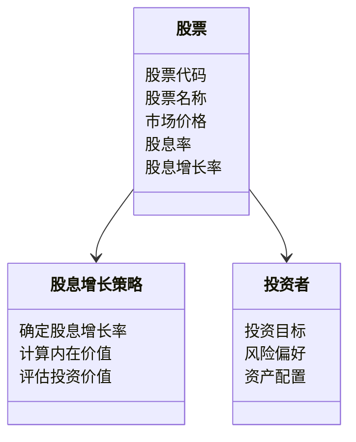
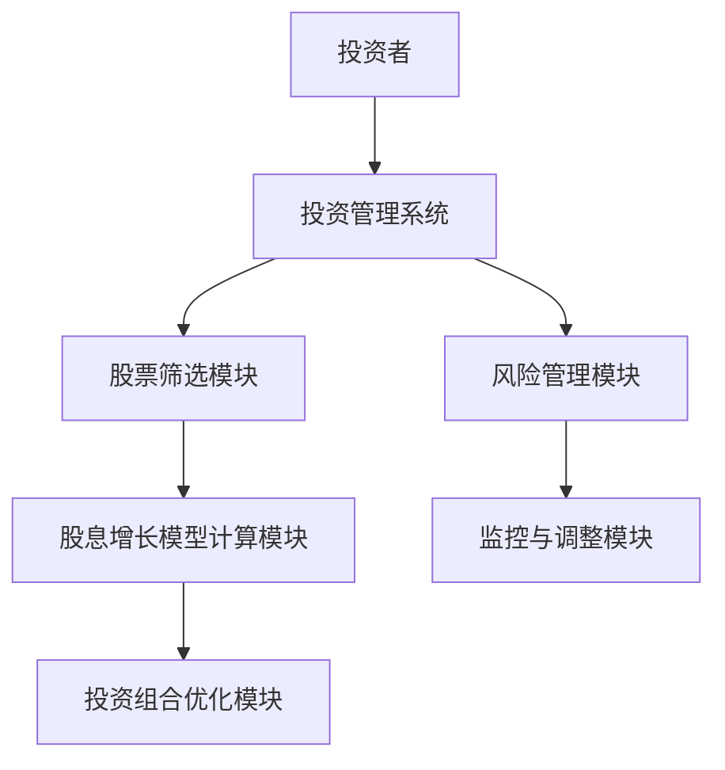

                 


# 巴菲特的股息增长策略：稳定现金流的长期价值

---

## 关键词：巴菲特、股息增长策略、现金流、长期投资、股息率、股息增长模型、投资组合

---

## 摘要

本文深入探讨了巴菲特的股息增长策略，分析其在稳定现金流和实现长期价值方面的核心逻辑。通过数学模型、系统架构设计和实际案例的分析，详细阐述了股息增长策略的原理、应用及其在投资组合中的重要性。文章还结合了技术语言和专业方法，帮助读者理解如何利用股息增长策略在投资中实现稳健收益。

---

# 第一部分: 股息增长策略的背景与核心概念

---

## 第1章: 股息增长策略概述

### 1.1 股息增长策略的定义与特点

#### 1.1.1 股息的定义与作用

股息是公司分配给股东的利润部分，通常以现金或股票形式发放。股息的发放体现了公司的盈利能力和股东回报的承诺。股息的作用包括：  
1. 提供现金流：股息为投资者提供稳定的现金流，特别是在市场波动较大的情况下。  
2. 估值基准：股息率是衡量股票价值的重要指标，帮助投资者判断股票是否被低估或高估。  
3. 信号传递：持续增长的股息往往被视为公司财务健康和管理能力的信号。

#### 1.1.2 股息增长策略的核心特点

股息增长策略的核心在于寻找那些能够持续提高股息支付能力的公司。其特点包括：  
1. **稳定性**：股息增长公司通常具有稳定的收益和现金流，能够在经济下行周期中保持股息增长。  
2. **可持续性**：股息增长基于公司的盈利能力和资本结构，确保股息支付的长期可持续性。  
3. **价值创造**：通过复利效应，持续增长的股息为投资者创造长期价值。

#### 1.1.3 股息增长策略与巴菲特投资理念的结合

巴菲特的投资理念强调长期价值和企业基本面的分析。他倾向于投资那些具有强大竞争优势、良好治理结构和持续盈利能力的公司。股息增长策略与巴菲特的理念高度契合，因为股息增长公司往往具备这些特质。

---

### 1.2 股息增长策略的背景与意义

#### 1.2.1 现金流在投资中的重要性

现金流是企业财务健康的重要指标，也是股息增长策略的核心关注点。稳定的现金流能够支持企业的持续经营和股息支付，同时为投资者提供安全的回报。

#### 1.2.2 股息增长策略的历史发展

股息增长策略起源于 dividend growth theory，最早由约翰·林奇提出，并在实践中得到不断完善。巴菲特通过长期实践和改进，将其应用于自己的投资体系中。

#### 1.2.3 股息增长策略在现代投资中的应用

随着金融市场的不断发展，股息增长策略在机构和个人投资者中越来越受欢迎。尤其是在低利率环境下，股息增长股票能够提供较高的收益，成为投资者的重要选择。

---

### 1.3 股息增长策略的核心要素

#### 1.3.1 股息率的计算与分析

股息率的计算公式为：  
$$ \text{股息率} = \frac{\text{每股股息（DPS）}}{\text{股价}} $$  
股息率反映了股票的分红能力，是衡量投资收益的重要指标。

#### 1.3.2 股息增长的驱动因素

股息增长的驱动因素包括：  
1. 盈利能力：公司净利润的持续增长是股息增长的基础。  
2. 资本结构：合理的资本结构和债务水平能够支持股息的持续增长。  
3. 管理层决策：管理层的股息政策和分红意愿直接影响股息增长。  
4. 行业特性：某些行业如公用事业和消费品行业，通常具有较高的股息增长潜力。

#### 1.3.3 股息增长策略的风险与收益平衡

股息增长策略的风险包括：  
1. 利率上升：利率上升会导致股息增长股票的相对吸引力下降。  
2. 市场波动：市场波动可能影响股息增长公司的股价表现。  
3. 公司特定风险：个别公司可能因经营不善而导致股息减少或取消。

---

## 第2章: 股息增长策略的数学模型与公式

### 2.1 股息增长模型的建立

#### 2.1.1 股息增长模型的定义

股息增长模型是基于股息持续增长的假设，用于估算股票内在价值的数学模型。

#### 2.1.2 股息增长模型的数学表达式

股息增长模型的公式为：  
$$ V = \frac{D_1}{r - g} $$  
其中，  
- $V$ 是股票的内在价值，  
- $D_1$ 是第一年的股息，  
- $r$ 是折现率，  
- $g$ 是股息增长率。

#### 2.1.3 股息增长模型的假设与限制

股息增长模型的假设包括：  
1. 股息将按恒定增长率 $g$ 持续增长。  
2. 折现率 $r$ 保持不变。  
3. 股票的生命周期无限延长。  

---

### 2.2 股息增长模型的验证与应用

#### 2.2.1 模型的验证方法

通过历史数据验证股息增长模型的有效性，例如计算实际股息增长率与模型预测值的差异。

#### 2.2.2 模型在实际投资中的应用

以具体股票为例，计算其内在价值，并与市场价格进行比较，判断是否低估或高估。

#### 2.2.3 模型的局限性与改进方向

股息增长模型的局限性包括：  
1. 假设股息增长率恒定，实际中可能存在变化。  
2. 忽略了股票的其他价值驱动因素，如经济增长和通货膨胀。

---

## 第3章: 股息增长策略的系统架构设计

### 3.1 系统功能设计

#### 3.1.1 领域模型

领域模型的Mermaid类图如下：  


---

### 3.2 系统架构设计

#### 3.2.1 系统架构图

系统架构的Mermaid图如下：  


---

## 第4章: 股息增长策略的项目实战

### 4.1 环境安装与配置

#### 4.1.1 Python环境安装

安装Python和必要的库，如NumPy和Pandas。

---

### 4.2 核心实现源代码

#### 4.2.1 股息增长模型的Python实现

```python
import numpy as np

def calculate_intrinsic_value(DPS, required_return, dividend_growth_rate):
    """
    计算股票的内在价值
    Args:
        DPS (float): 每股股息
        required_return (float): 必要回报率
        dividend_growth_rate (float): 股息增长率
    Returns:
        float: 股票的内在价值
    """
    D1 = DPS * (1 + dividend_growth_rate)
    intrinsic_value = D1 / (required_return - dividend_growth_rate)
    return intrinsic_value

# 示例计算
DPS = 2.0
required_return = 0.10
dividend_growth_rate = 0.05

intrinsic_value = calculate_intrinsic_value(DPS, required_return, dividend_growth_rate)
print(f"股票的内在价值为：{intrinsic_value:.2f}")
```

---

### 4.3 案例分析与解读

#### 4.3.1 案例分析

以苹果公司为例，计算其股息增长策略的可行性。

#### 4.3.2 案例解读

分析苹果公司的股息支付历史、股息增长率及其未来的增长潜力。

---

## 第5章: 总结与展望

### 5.1 总结

股息增长策略是一种有效的投资方法，通过选择具有持续股息增长潜力的公司，投资者可以实现稳定的现金流和长期价值。

---

### 5.2 展望

随着市场环境的变化，股息增长策略需要不断优化和调整。未来，投资者可以结合人工智能和大数据技术，进一步提升股息增长策略的效果。

---

## 作者信息

作者：AI天才研究院/AI Genius Institute & 禅与计算机程序设计艺术 /Zen And The Art of Computer Programming

---

感谢您的阅读！如果本文对您有所帮助，请点赞、收藏、分享，让更多人了解巴菲特的股息增长策略！

