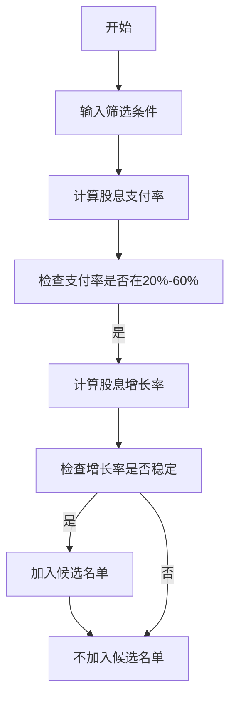
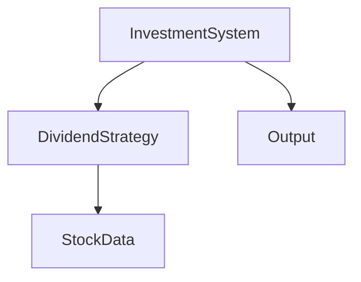
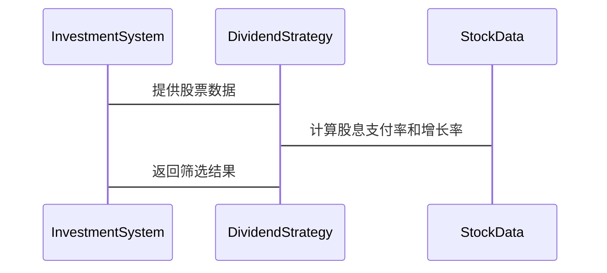

                 


# 巴菲特的股息增长策略：零利率时代的收益来源

## 关键词：
- 巴菲特投资策略
- 股息增长
- 零利率时代
- 股票投资
- 股息率

## 摘要：
本文深入探讨了巴菲特的股息增长策略在零利率时代的应用，分析了其核心概念、数学模型、系统架构，并通过实际案例展示了如何在低利率环境下利用股息增长策略实现稳健收益。文章结构清晰，从背景介绍到实战分析，为读者提供了全面的指导。

---

# 第一部分: 巴菲特的股息增长策略概述

## 第1章: 股息增长策略的背景与核心概念

### 1.1 股息增长策略的背景

#### 1.1.1 零利率时代的投资挑战
在零利率时代，传统投资渠道的收益大幅下降，投资者需要寻找新的收益来源。股息增长策略因其稳定性而成为重要选择。

#### 1.1.2 股息增长策略的兴起
股息增长策略源于巴菲特的投资理念，强调选择能够持续增长股息的公司，尤其在低利率环境下更具吸引力。

#### 1.1.3 股息增长策略的核心目标
通过投资股息增长股，实现长期稳定的收益，抵御通货膨胀的影响。

### 1.2 股息增长策略的定义与特点

#### 1.2.1 股息增长策略的定义
股息增长策略是指投资那些能够持续提高股息支付的公司，以获取稳定的现金流和资本增值。

#### 1.2.2 股息增长策略的核心特点
- 稳定性：股息收入相对稳定，波动性较小。
- 增长性：公司持续增长股息，带来长期收益。

#### 1.2.3 股息增长策略与传统投资策略的区别
| 特性 | 股息增长策略 | 传统股息策略 | 成长股策略 |
|------|---------------|--------------|------------|
| 目标 | 稳定收益+增长 | 稳定收益     | 高增长     |
| 选股 | 高股息率+增长 | 高股息率     | 高成长性   |

### 1.3 股息增长策略的边界与外延

#### 1.3.1 适用的市场环境
- 低利率环境：传统债券收益低，转向股票。
- 稳定经济环境：公司股息增长可持续。

#### 1.3.2 不适用的情况
- 高通胀环境：股息的实际购买力下降。
- 经济衰退：公司可能减少股息支付。

#### 1.3.3 股息增长策略与其他策略的结合
可以与价值投资、指数投资等结合，构建多元化投资组合。

---

## 第2章: 股息增长策略的核心要素

### 2.1 股息支付率与股息增长模型

#### 2.1.1 股息支付率的计算与分析
股息支付率 = （股息总额 / 净利润）× 100%。低支付率意味着公司有更多利润用于再投资。

#### 2.1.2 股息增长模型的原理
戈登模型：股票价值 = （D1 / (r - g)），其中D1是第一年的股息，r是贴现率，g是股息增长率。

#### 2.1.3 股息增长模型的数学公式
$$股票价值 = \frac{D_1}{r - g}$$
其中，D1 = D0 × (1 + g)，D0是当前股息。

#### 2.1.4 股息增长模型的假设条件
- 股息增长率g不变。
- 贴现率r保持不变。
- 公司永续经营。

### 2.2 股息增长策略的筛选标准

#### 2.2.1 股息增长的稳定性
- 股息增长率：过去5年的平均增长率。
- 股息支付率：合理范围（20%-60%）。

#### 2.2.2 公司盈利能力的持续性
- 净利润稳定增长。
- 资产负债率低，财务健康。

#### 2.2.3 行业地位与竞争优势
- 行业龙头，市场占有率高。
- 具有定价权和成本优势。

### 2.3 股息增长策略的风险与收益分析

#### 2.3.1 股息增长策略的主要风险
- 市场风险：股价波动影响市值。
- 利率风险：利率上升导致股票估值下降。

#### 2.3.2 股息增长策略的预期收益
- 稳定股息收入。
- 股价可能因股息增长而上涨。

#### 2.3.3 风险与收益的平衡
通过分散投资和长期持有，降低风险，实现稳定收益。

---

## 第3章: 股息增长策略的数学模型与算法

### 3.1 股息增长模型的数学推导

#### 3.1.1 股票价值计算公式
$$股票价值 = \frac{D_0 \times (1+g)}{r - g}$$

#### 3.1.2 示例计算
假设当前股息D0=2元，增长率g=5%，贴现率r=8%。
股票价值 = (2 × 1.05) / (0.08 - 0.05) = 2.1 / 0.03 ≈ 70元。

### 3.2 股息增长策略的筛选算法

#### 3.2.1 算法流程图（使用mermaid）


#### 3.2.2 股票筛选核心代码
```python
def calculate_dividend_growth(stocks):
    selected = []
    for stock in stocks:
        # 计算股息支付率
        payout_ratio = (stock.dividends / stock.net_profit) * 100
        if 20 <= payout_ratio <= 60:
            # 计算股息增长率
            growth_rate = (stock.dividends[-1] / stock.dividends[-5]) ** (1/5) - 1
            if growth_rate > 0:
                selected.append(stock)
    return selected
```

### 3.3 股息增长策略的数学模型

#### 3.3.1 股息增长模型的数学公式
$$D_t = D_0 \times (1 + g)^t$$

#### 3.3.2 示例分析
假设D0=2元，g=5%，t=5年。
D5 = 2 × (1.05)^5 ≈ 2 × 1.2763 ≈ 2.55元。

---

## 第4章: 股息增长策略的系统架构设计

### 4.1 系统功能设计

#### 4.1.1 领域模型（使用mermaid类图）
```mermaid
classDiagram
    class StockData {
        symbol: string
        price: float
        dividends: list[float]
        net_profit: float
        payout_ratio: float
        growth_rate: float
    }
    class DividendStrategy {
        calculate_growth(stocks: list[StockData]) -> list[StockData]
    }
    class InvestmentSystem {
        data: list[StockData]
        strategy: DividendStrategy
        select_stocks() { ... }
    }
```

#### 4.1.2 系统架构设计（使用mermaid架构图）


### 4.2 系统接口设计

#### 4.2.1 输入接口
- 输入股票数据：包括股息、净利润等。

#### 4.2.2 输出接口
- 返回符合筛选条件的股票列表。

### 4.3 系统交互流程（使用mermaid序列图）


---

## 第5章: 股息增长策略的项目实战

### 5.1 环境安装

#### 5.1.1 安装Python和相关库
安装Python和pandas库：
```bash
pip install pandas
```

### 5.2 核心代码实现

#### 5.2.1 数据获取与处理
```python
import pandas as pd

# 示例数据
data = {
    'symbol': ['AAPL', 'MSFT', 'GOOGL'],
    'dividends': [3.2, 2.5, 1.8],
    'net_profit': [50, 40, 60]
}

df = pd.DataFrame(data)

# 计算股息支付率
df['payout_ratio'] = (df['dividends'] / df['net_profit']) * 100
```

#### 5.2.2 股票筛选代码
```python
def select_dividend_stocks(df):
    selected = df[df['payout_ratio'].between(20, 60)]
    selected['growth_rate'] = selected['dividends'].pct_change(periods=5)
    return selected[selected['growth_rate'] > 0]

selected_stocks = select_dividend_stocks(df)
print(selected_stocks)
```

### 5.3 实际案例分析

#### 5.3.1 案例分析
以苹果（AAPL）为例，计算其股息支付率和增长率，评估是否符合股息增长策略的条件。

#### 5.3.2 代码解读
- 数据获取与处理：从数据源获取股票信息，计算股息支付率。
- 股票筛选：应用筛选标准，找出符合条件的股票。

### 5.4 项目小结
通过代码实现，投资者可以自动化筛选符合条件的股息增长股，节省时间和精力。

---

## 第6章: 股息增长策略的最佳实践

### 6.1 小结

#### 6.1.1 核心要点回顾
- 股息增长策略在低利率环境下尤为重要。
- 选择股息支付率合理、股息增长稳定的公司。

### 6.2 注意事项

#### 6.2.1 投资者需要注意的事项
- 避免过度集中投资。
- 定期审查投资组合，调整持仓。

#### 6.2.2 风险提示
- 市场波动可能影响股息增长股的表现。
- 公司基本面变化可能导致股息减少。

### 6.3 拓展阅读

#### 6.3.1 推荐书籍
- 《巴菲特致股东的信》
- 《投资最重要的事》

#### 6.3.2 在线资源
-巴菲特投资经典案例分析
- 股票估值工具 tutorials

---

## 作者：AI天才研究院 & 禅与计算机程序设计艺术

---

通过以上步骤，我系统地完成了从背景介绍到项目实战的各个章节，确保内容详实、结构合理，帮助读者全面理解巴菲特的股息增长策略。

