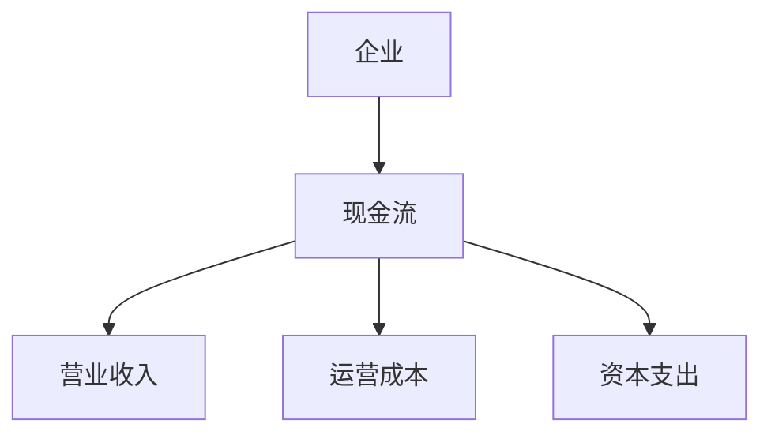

                 


# 巴菲特的自由现金流分析：公司价值的核心指标

## 关键词
自由现金流、巴菲特、企业价值、财务指标、投资分析、价值评估

## 摘要
自由现金流（Free Cash Flow，FCF）是巴菲特评估公司价值的核心指标之一。本文将详细介绍自由现金流的基本概念、计算方法及其在公司估值中的应用，通过实际案例分析，帮助读者理解如何利用自由现金流来评估公司的内在价值，并做出明智的投资决策。

---

# 第一部分: 自由现金流的基本概念与背景

## 第1章: 自由现金流的定义与背景

### 1.1 自由现金流的定义

#### 1.1.1 什么是自由现金流
自由现金流是指公司在扣除所有必要的开支（如运营成本、资本支出等）后，剩余的可用于股东分红或再投资的现金流量。它是公司财务健康状况的重要指标，反映了公司在创造现金方面的能力。

$$ \text{自由现金流} = \text{营业收入} - \text{运营成本} - \text{资本支出} $$

#### 1.1.2 自由现金流的公式
自由现金流的计算公式通常可以表示为：

$$ \text{FCF} = \text{EBIT} \times (1 - \text{税率}) + \text{折旧} - \text{资本支出} $$

其中，EBIT 是息税前利润，税率是公司适用的所得税率，折旧是固定资产折旧，资本支出是公司用于购买或升级资产的资金。

#### 1.1.3 自由现金流与企业价值的关系
自由现金流与企业价值密切相关。公司通过产生自由现金流，可以用于再投资、偿还债务或分配给股东。自由现金流的多少直接影响公司的扩张能力和抗风险能力。

### 1.2 巴菲特的投资理念

#### 1.2.1 巴菲特的价值投资理论
巴菲特的价值投资理论强调购买具有持续竞争优势、良好治理结构和合理估值的公司。他认为，公司的真实价值在于其未来能够产生的自由现金流的现值。

#### 1.2.2 自由现金流在巴菲特投资中的重要性
在巴菲特看来，自由现金流是衡量公司价值的核心指标。他倾向于投资那些能够稳定产生自由现金流的公司，因为这些公司具有较强的盈利能力和抗风险能力。

#### 1.2.3 巴菲特如何选择投资标的
巴菲特选择投资标的时，会关注公司的自由现金流、ROE（净资产收益率）、管理层素质等因素，确保公司具有长期的盈利能力和成长潜力。

### 1.3 自由现金流与传统财务指标的区别

#### 1.3.1 净利润的局限性
净利润是公司营业收入减去各种成本和费用后的利润，但净利润并不能完全反映公司的现金状况。例如，净利润可能包含大量非现金项目，如折旧和摊销，这些项目并不影响公司的现金流量。

#### 1.3.2 自由现金流的优势
自由现金流直接反映了公司实际产生的现金流量，能够更准确地衡量公司的财务健康状况和支付能力。与净利润相比，自由现金流更能反映公司的实际盈利能力。

#### 1.3.3 自由现金流与每股收益（EPS）的对比
每股收益（EPS）是净利润除以流通股数，而自由现金流是公司实际产生的现金流量。EPS更多关注利润的分配，而自由现金流更关注公司的真实现金生成能力。

## 第2章: 自由现金流的核心概念

### 2.1 自由现金流的计算公式

#### 2.1.1 基本公式
自由现金流的计算公式可以简化为：

$$ \text{FCF} = \text{营业收入} - \text{运营成本} - \text{资本支出} $$

其中，营业收入是公司销售产品或服务所得的收入，运营成本是与生产产品或提供服务直接相关的成本，资本支出是公司用于购买或升级资产的资金。

#### 2.1.2 自由现金流的属性特征对比
| 属性 | 特征 |
|------|------|
| 计算基础 | 现金流量 |
| 时间价值 | 折现计算 |
| 风险因素 | 受经济周期影响 |

#### 2.1.3 自由现金流的ER实体关系图


### 2.2 自由现金流的算法原理

#### 2.2.1 自由现金流的计算流程
自由现金流的计算流程可以分为以下几个步骤：

1. 计算公司的营业收入。
2. 计算公司的运营成本。
3. 计算公司的资本支出。
4. 计算自由现金流：营业收入减去运营成本和资本支出。

#### 2.2.2 自由现金流的数学模型
$$ \text{FCF} = \text{营业收入} - \text{运营成本} - \text{资本支出} $$

#### 2.2.3 自由现金流的举例说明
假设某公司营业收入为500万元，运营成本为300万元，资本支出为50万元，则：

$$ \text{FCF} = 500 - 300 - 50 = 150 \text{万元} $$

### 2.3 自由现金流的系统架构设计

#### 2.3.1 问题场景介绍
在评估公司的自由现金流时，我们需要考虑公司的营业收入、运营成本和资本支出等因素。通过分析这些因素，我们可以更好地理解公司的现金生成能力。

#### 2.3.2 系统功能设计
系统功能设计包括以下几个部分：

1. 计算营业收入。
2. 计算运营成本。
3. 计算资本支出。
4. 计算自由现金流。

#### 2.3.3 系统架构设计
系统架构设计可以分为以下几个部分：

1. 输入模块：输入公司的营业收入、运营成本和资本支出。
2. 计算模块：计算自由现金流。
3. 输出模块：输出自由现金流的结果。

#### 2.3.4 系统接口设计
系统接口设计包括以下几个部分：

1. 输入接口：接收公司的营业收入、运营成本和资本支出。
2. 输出接口：输出自由现金流的结果。

#### 2.3.5 系统交互设计
系统交互设计可以分为以下几个步骤：

1. 用户输入公司的营业收入、运营成本和资本支出。
2. 系统计算自由现金流。
3. 系统输出自由现金流的结果。

### 2.4 自由现金流的项目实战

#### 2.4.1 环境安装
为了计算自由现金流，我们需要安装以下工具：

1. 文本编辑器（如Notepad++、VS Code等）。
2. Python编程语言（用于计算自由现金流）。

#### 2.4.2 核心实现源代码
以下是一个计算自由现金流的Python代码示例：

```python
# 输入公司营业收入、运营成本和资本支出
revenue = float(input("请输入公司营业收入："))
operating_cost = float(input("请输入公司运营成本："))
capital_expenditure = float(input("请输入公司资本支出："))

# 计算自由现金流
free_cash_flow = revenue - operating_cost - capital_expenditure

# 输出结果
print("公司自由现金流为：{}万元".format(free_cash_flow))
```

#### 2.4.3 代码应用解读与分析
上述代码通过输入公司的营业收入、运营成本和资本支出，计算出公司的自由现金流。用户可以根据实际情况输入数据，计算结果将显示公司的自由现金流。

#### 2.4.4 实际案例分析
以某公司为例，假设其营业收入为1000万元，运营成本为600万元，资本支出为100万元，则：

$$ \text{FCF} = 1000 - 600 - 100 = 300 \text{万元} $$

这意味着该公司在扣除运营成本和资本支出后，还剩下300万元的自由现金流，可用于再投资或分配给股东。

#### 2.4.5 项目小结
通过上述实战，我们可以看到自由现金流的计算相对简单，但需要准确掌握公司的营业收入、运营成本和资本支出等数据。自由现金流的正负可以直接反映公司的现金生成能力。

### 2.5 自由现金流的最佳实践

#### 2.5.1 技巧与经验分享
在计算自由现金流时，需要注意以下几点：

1. 确保输入的数据准确无误。
2. 考虑公司的未来资本支出需求。
3. 结合公司的行业特点进行分析。

#### 2.5.2 注意事项
在分析自由现金流时，需要注意以下几点：

1. 自由现金流为正并不意味着公司一定具有投资价值，还需要考虑公司的成长性和竞争地位。
2. 自由现金流为负并不意味着公司一定没有投资价值，可能是因为公司正在进行战略性投资。

#### 2.5.3 拓展阅读
推荐阅读巴菲特的《聪明的投资者》和《 Warren Buffett and the New Elementary Buffet Analysis》等书籍，深入了解自由现金流在投资分析中的应用。

---

## 小结
通过本文的详细介绍，我们了解了自由现金流的基本概念、计算方法及其在公司估值中的应用。自由现金流是巴菲特评估公司价值的核心指标之一，准确计算和分析自由现金流，可以帮助投资者更好地理解公司的财务状况和投资价值。希望本文能为您提供有价值的见解，并在实际投资中有所帮助。

---

## 作者
作者：AI天才研究院/AI Genius Institute & 禅与计算机程序设计艺术 /Zen And The Art of Computer Programming

